# Epsilook data routes

Every path data takes from an upstream source to a pixel in the app. This is the
map of *where things come from*; `build/build_data.py` is the implementation and
`CLAUDE.md` holds the decisions and gotchas behind it.

Read it in five stages:

1. [Sources](#1-sources) — what gets downloaded, from where
2. [The visual graph](#2-the-visual-graph-spine) — the spine every visual route hangs off
3. [Payload routes](#3-payload-routes) — the ~20 routes from a kit/spell to something showable
4. [The pack](#4-the-pack) — how it lands in the UI
5. [Version differences](#5-version-differences) — what each of the six builds does and doesn't have
6. [Runtime routes](#6-runtime-routes-browser-on-demand) — what the browser fetches live

---

## 0. The pipeline at a glance

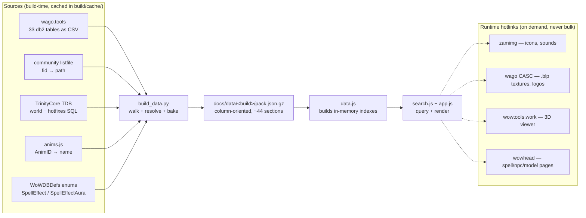

Nothing is fetched from a local DB dump, and nothing is fetched per-result at
runtime. Everything the search touches is baked into the pack.

---

## 1. Sources

| Source | URL shape | Role |
|---|---|---|
| **wago.tools** | `wago.tools/db2/{table}/csv?build={version}` | The 33 client db2 tables. Version-pinned, so a pack always matches its build. |
| **community listfile** | `github.com/wowdev/wow-listfile` (latest release) | `FileDataID → path`. The only way a fid becomes `cfx_mage_fireball_missile.m2`. ~150 MB, streamed and filtered, never loaded whole. |
| **TrinityCore TDB** | GitHub release `.7z` per era | Two distinct roles — see below. |
| **anims.js** | `wow.tools.local` raw | `AnimID → name` (Stand, SpellCastDirected, …). |
| **WoWDBDefs `meta/enums/`** | raw master | `SpellEffect.dbde` + `SpellEffectAura.dbde` — the authority on what a mechanic enum value means. |

### TDB does two unrelated jobs

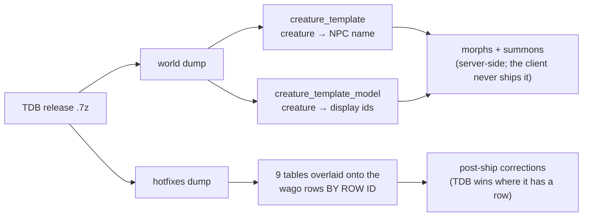

**World tables are the only source of creature names and displays** — that data
lives on the server, so without a `TDB_RELEASES` entry morph pills render as
`creature #<id>`. **Hotfix tables** are the rows Blizzard patched over the wire
after the build shipped; they are applied on top of wago by row ID for
`spell_name`, `spell_x_spell_visual`, `spell_visual`, `spell_visual_missile`,
`spell_visual_effect_name`, `spell_effect`, `spell_misc`,
`creature_display_info`, `creature_model_data`.

A version with no TDB entry still builds — morphs stay unresolved, hotfixes
don't apply, and the build logs both.

---

## 2. The visual graph spine

Almost every visual route starts here. Both hops are many-to-many.

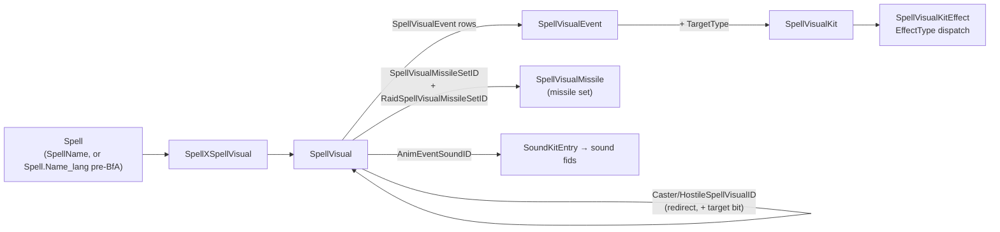

Three things to hold onto:

**The kit edge carries a target mask.** `SpellVisualEvent.TargetType` says *who
the kit plays on*, and it rides along with everything that kit contributes.
A visual can reach the same kit through several event rows, so masks union per
edge. Impact kits genuinely carry duplicate rows differing only in TargetType —
that is why a row can be caster *and* target.

| TargetType | bit | search word | icon meaning |
|---|---|---|---|
| 1 | 1 | `caster` | on the caster |
| 2 | 2 | `target` | on the target |
| 3 | 4 | `area` | on the ground at the target |
| 4 | 8 | `target` | on the target only, never the caster |
| 5 | 16 | `area` | on the ground where the missile lands |
| 0 | — | — | effectively unused (1 row in 207,241 on 9.2.7); contributes nothing |

**The missile path bypasses events entirely**, so missile content carries *no*
mask — that is exactly the ~4% of unmasked rows in every pack, and the row count
matching the missile row count is a good build oracle.

**A `SpellVisual` can redirect to another `SpellVisual`.** Four columns on the
row name a substitute visual the client swaps in (`VISUAL_REDIRECTS` in
`build_data.py`); the build follows them so the spell also reaches everything
the substitute carries. This matters because the redirected-to visual is
usually reachable no other way — on 9.2.7 only 37 of 228 caster targets and 30
of 257 hostile targets also appear in `SpellXSpellVisual` — so following the
redirect is what makes that content visible at all, not a re-labelling of rows
already shown (263 spells gain a caster/target model bit this way).

| Column | extra bit | meaning |
|---|---|---|
| `CasterSpellVisualID` | `caster` (1) | what the caster themself sees |
| `HostileSpellVisualID` | `target` (2) | what a hostile target sees |
| `LowViolenceSpellVisualID` | — | client-setting variant, no target semantic |
| `ReducedUnexpectedCameraMovementSpellVisualID` | — | client-setting variant, no target semantic |

The bit rides along with everything reached through that redirect, exactly like
a `TargetType` mask, and unions with it. Two traps the build handles and any
future edit must keep: **the redirect graph has cycles** (a self-reference and a
two-cycle on 9.2.7, chains up to 3 hops), so expansion is a mask-fixpoint
worklist, not recursion; and **a hotfix row replaces the wago `SpellVisual` row
wholesale**, so the redirect columns (and `AnimEventSoundID`) join the TDB
hotfix overlay or a hotfixed visual silently loses them.

---

## 3. Payload routes

### 3a. Kit dispatch — `SpellVisualKitEffect.EffectType`

The single busiest fan-out in the build. `EffectType` says which table `Effect`
points at.

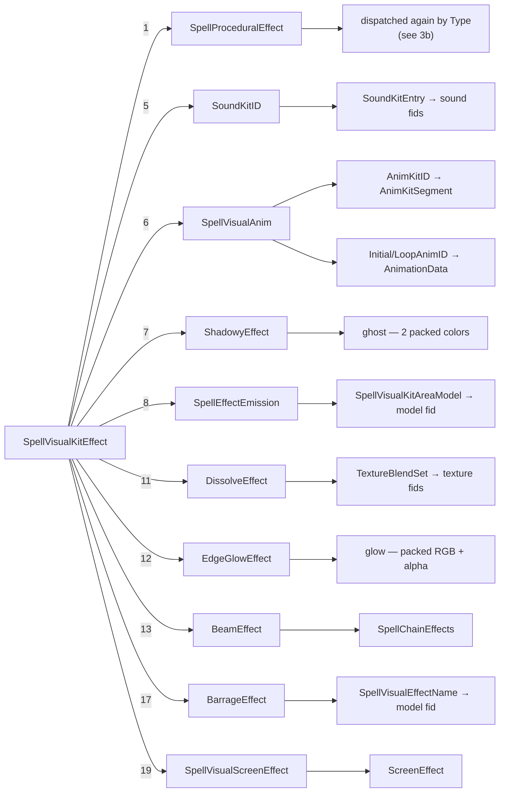

The remaining EffectType values were audited and deliberately dropped: **2**
(ModelAttach-by-id) is 100% redundant with the parent-kit walk; **10**
(UnitSoundType) plays the target's own sound and names no file; **15/20** are
absent from the data; the rest carry no model or sound columns.

### 3b. Proc dispatch — `SpellProceduralEffect.Type`

`Type` is the client's character-procedure index, so it selects both the handler
*and* which `Value_n` column holds the payload. This is the second fan-out.

| Type | Payload column | Becomes |
|---|---|---|
| 0, 12, 26 | `Value_0` → SpellChainEffects | **chain** (beams) |
| 1 | `Value_0` packed RGB | **tint** |
| 7 | `Value_0..3` → AnimationData | **stance** anims |
| 9 | `Value_0` → SpellVisualKitAreaModel | **model** (`ground`) |
| 11 | — | **freeze** (valueless) |
| 14 | `Value_0` alpha 0..1 | **transparency %** |
| 18 | — | **camo** (valueless) |
| 21 | `Value_2` strength 0..1 | **desaturate %** |
| 22 | `Value_3` packed RGB | **ghost** (material recolor) |
| 23 | `Value_3` packed RGB | **tint** (material recolor) |
| 27 | `Value_0` → WeaponTrail | **model** (`trail`) |

Colors are `0xRRGGBB`; `INT_MIN` is the "unset" sentinel. The types not
surfaced (2–6, 8, 10, 13, 15–17, 19–20, 24–25, 28–34) are renderer or gameplay
state, or too rare to be worth a pill. The full decode with evidence is in
CLAUDE.md → *Proc type decode*.

### 3c. The five model routes

Every `(spell, model)` row is tagged with **how** the model is used. Same fid can
appear once per category.

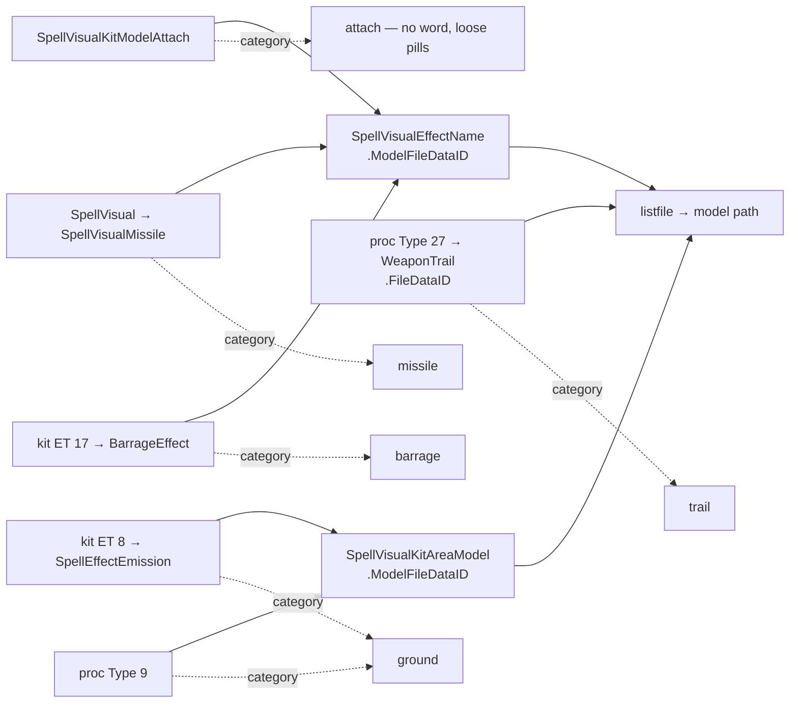

`SpellVisualKitAreaModel` carries its fid **directly** — no
`SpellVisualEffectName` hop. Note `ground`, not `area`: the target words include
`area` and the two mean different things (only 42% of this category's rows carry
an area target bit).

### 3d. The four-and-a-half sound routes

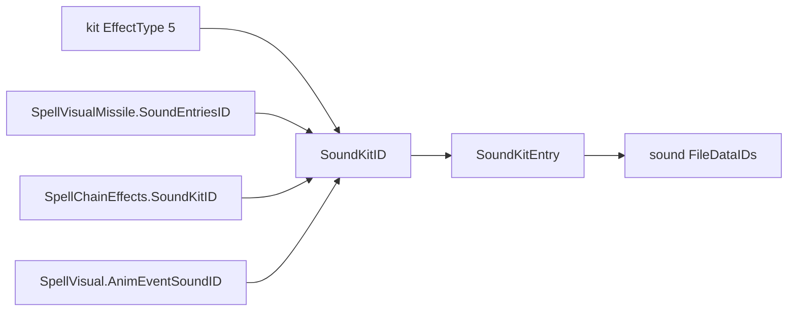

The chain route is the "half": a beam's own sound folds into the spell's Sounds
column and inherits the chain's target mask.

`AnimEventSoundID` hangs off the `SpellVisual` row itself (not a kit or a
missile), and its value is a `SoundKit::ID` — the same type the missile route
already eats — so it drops straight into the existing sound plumbing. It is the
**widest-reaching of these** — 1,999 spells on 9.2.7 (vs a few hundred each for
the caster/hostile redirects), populated on every pack including Vanilla — and
it inherits the redirect target bit of whatever edge reached the visual.

### 3e. The three animation routes

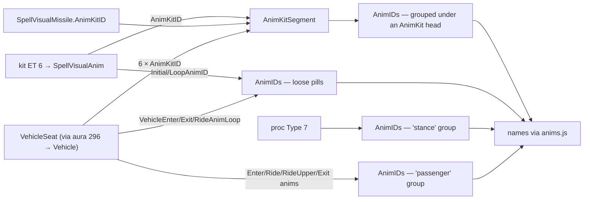

`SpellVisualAnim`'s initial/loop anims are **the dominant source** — 119k rows
vs 32k animkit rows on 9.2.7. `-1` and `0` both mean unset (0 would be Stand).
Impact kits animate the *target*, so these are not caster-only.

The vehicle-seat route splits by **whose** animation it is: the nine
passenger columns (`EnterAnimStart/Loop`, `RideAnimStart/Loop`,
`RideUpperAnimStart/Loop`, `ExitAnimStart/Loop/End`) head a `passenger`
group, while the vehicle's own three (`VehicleEnterAnim`, `VehicleExitAnim`,
`VehicleRideAnimLoop`) join the loose pills — the rider's behaviour and the
vehicle's are different things. The six `*AnimKitID` columns are ordinary
`AnimKit::ID`s and rejoin the animkit groups, so the build counts them as
"used" and ships their segments. Population on 9.2.7: 99.8% of seats set at
least one passenger anim, the vehicle's own are 3–7%, any animkit 12.7%.

### 3f. Routes that start at `SpellEffect`, not at a visual

Six fx categories skip the visual graph entirely: a particular `Effect` or
`EffectAura` enum makes `EffectMiscValue_n` an id into another table.

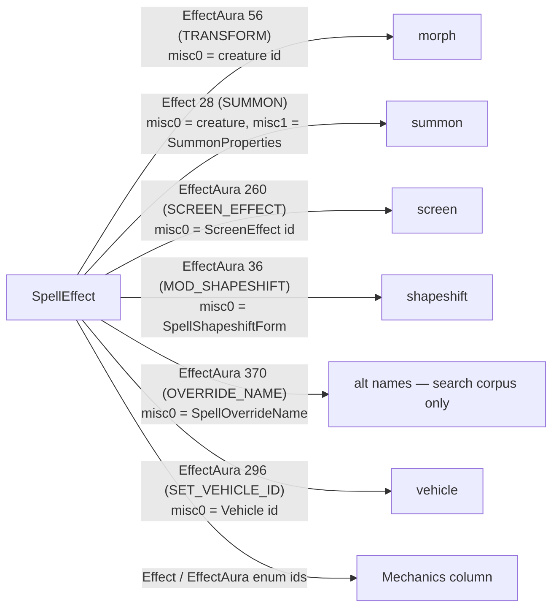

**The vehicle route covers "the caster BECOMES a vehicle", not "boards one".**
`CONTROL_VEHICLE` (aura 236) is the far larger population — 1,581 rows vs 247
on 9.2.7 — but its `EffectMiscValue_0` is a seat/flag value, not a
`Vehicle.db2` id, so it needs its own route and is deliberately not wired up.

**These effect-driven fx carry a target mask of their own** (pack format 25),
and it does *not* come from the visual graph — it is the producing
`SpellEffect` row's `ImplicitTarget_0`/`_1` (the `Target` enum, mapped to the
same caster/target/area bits as §2's `TargetType`, by `implicit_target_bit`).
It answers *who the effect lands on*: a polymorph's morph is on the **target**,
a self-transform on the **caster**, a summon on the **area** where it lands.
These rows never pass through `SpellVisualEvent`, so `TargetType` says nothing
about them — the implicit target is the only source. Alt-names (aura 370) are
search-corpus-only and carry no mask.

**misc0 on a transform aura is a creature id, not a display id** — a
long-standing trap. Both morphs and shapeshift forms then walk the same
creature→model chain:

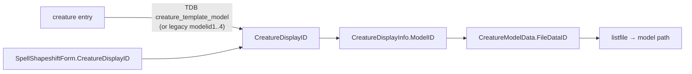

Screen effects are the one payload arriving from **both** directions — the aura
route (~2.3k spells) and the kit route via `SpellVisualScreenEffect` (18 rows on
9.2.7) — so the walk extends an already-populated set.

### 3g. Screen effect payload

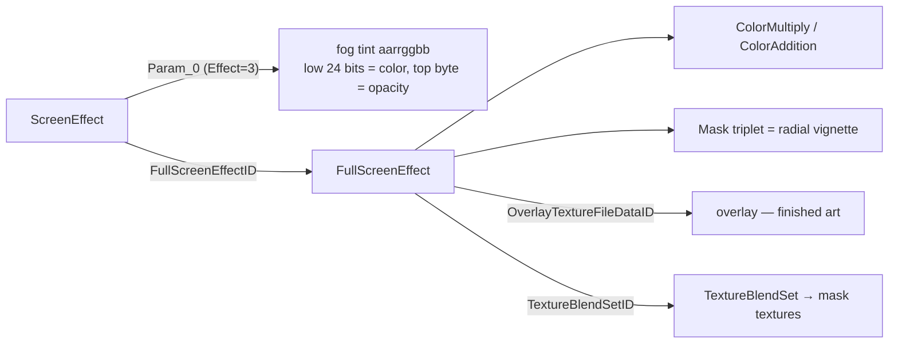

The two texture columns are **not interchangeable**: overlays are finished art
drawn in their own colors, masks are flat blend-set art the grade colors paint.
The pack tags each texture with its role. The wiki's `rrggbbxx` claim for
`Param_0` is WotLK-era and wrong for modern rows — ours reads `aarrggbb`,
settled by name semantics.

### 3h. Attachment points — where on the model something plays

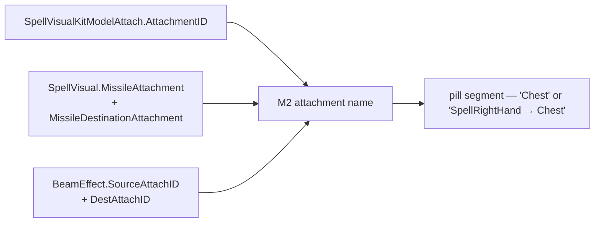

Three routes carry an attachment, and **all three are RAW M2 attachment ids**
(the `M2_ATTACHMENT_NAMES` table) — only `VehicleSeat` is indexed, see §3i.
The id is part of the row key, so the same model at two points stays two rows
and renders as two pills: on 9.2.7, 44,906 (spell, fid, category) groups split
this way, and the split is what makes a caster/target difference visible
instead of silently merged.

**Single-point vs travelling is a real distinction, not a formatting choice.**
Attached, ground, trail and barrage models sit at ONE point and render the
bare name; missiles and beams travel and render `Source → Dest`. The two are
indistinguishable in the data (both look like "src set, dst unset"), so the
renderer is told explicitly — `TRAVELLING_MODEL_CATS` in app.js. A travelling
row that knows only one end reads `from X` / `to Y`; it must never render a
dangling arrow.

Two traps:

- **`SpellVisualKitModelAttach.LowDefModelAttachID` is a FileDataID**, not an
  attachment — max 430259 on 9.2.7, despite the name.
- **Missile attachments are taken from `SpellVisual`, not
  `SpellVisualMissile`.** The missile route is per-visual (a whole set is
  unioned into one bucket) and that is also where the data lives: 105.6k rows
  carry a destination there versus 14.9k on the missile table. `spell_visual`
  in `TDB_TABLES` must overlay both columns — a hotfix row replaces the wago
  row wholesale, so omitting them would silently blank the attachments.

`SpellChainEffects` itself has **no** attachment column (its `Joint*` fields
are geometry); beams attach through `BeamEffect`, which is why chains only
carry attach points on builds that have that table. Dissolve (`AttachID`, 307
rows), shadowy (`AttachPos`, 161) and barrage (`AttachmentPoint`, 7) also
carry one and are deliberately not wired up yet.

### 3i. Vehicle seat payload

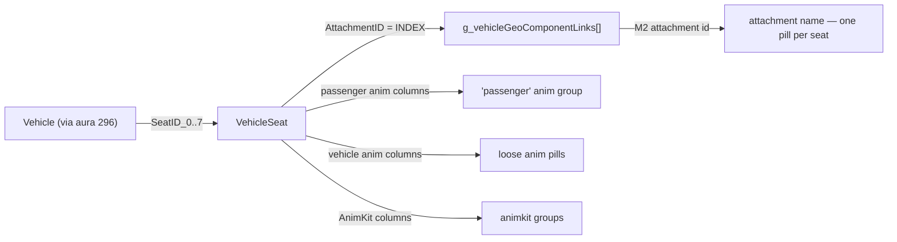

A vehicle fills up to eight `SeatID_n` slots; the filled count IS the seat
count, and 0-seat vehicles are dropped at build.

**`VehicleSeat.AttachmentID` is an INDEX, not an M2 attachment id** — it
indexes a table hardcoded in the client binary (`g_vehicleGeoComponentLinks`),
which exists in no db2 and so is transcribed into `build_data.py`. wowdev.wiki
quotes the array but hedges it with a `?`, so it was verified rather than
trusted: 138 vehicle M2s were fetched and each seat checked against its own
vehicle's model. The decoded attachment is present **91.2%** of the time vs
**42.4%** for the raw value, and where the hypotheses diverge it is decisive —
index 14 decodes to `VehicleSeat2`, present on 100% of the models using it,
while raw 14 (`ShoulderFlapLeft`) is present on 0%. Indices 13..20 come out as
`VehicleSeat1..8` in order, which the array's own shape corroborates.

Two consequences worth knowing:

- The array is 6.0.1-era; modern data has indices past its end (26, 27). Those
  stay unmapped and render as a raw `idx N` rather than a guess.
- The decoded names are the game's own and often read oddly as seat positions
  (`Breath` and `ChestBloodBack` are the 2nd and 4th most common on 9.2.7)
  because artists reuse generic attachment slots as seat anchors. **That is the
  data, not a decode error** — the pill tooltip says so explicitly.

**Do not reuse this decode for the other attachment columns** (§3h): they are
*raw* M2 attachment ids. `SpellVisualKitModelAttach.AttachmentID` spans -1..57
across 55 distinct values on 9.2.7 — the direct-id signature — versus
`VehicleSeat.AttachmentID`'s dense 0..27.

---

## 4. The pack

The build bakes everything into one gzipped, **column-oriented** JSON per game
version: a section like `{spellIds, fids}` is parallel arrays where row *i*
links `spellIds[i]` to `fids[i]`. That gzips far better than a list of objects.

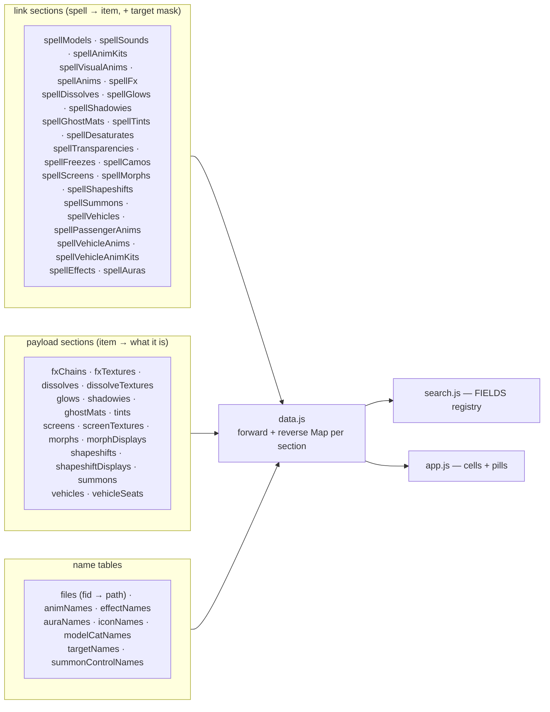

Sections carrying a parallel `targets` array (the target-icon feature):
`spellModels`, `spellSounds`, `spellAnimKits`, `spellVisualAnims`, `spellFx`,
`spellDissolves`, `spellGlows`, `spellShadowies`, `spellGhostMats` (these from
`SpellVisualEvent.TargetType`, §2), plus — from `SpellEffect.ImplicitTarget`
(§3f, pack format 25) — `spellMorphs`, `spellSummons`, `spellVehicles`,
`spellShapeshifts`, `spellScreens`. Both feed the same `maskIndex` in `data.js`
and the same icon renderer, so the two mask sources are indistinguishable
downstream.

`data.js` builds a **forward and a reverse index** for each — spell→items for
rendering, item→spells for searching. Every section read is guarded
(`if (pack.X)`) so an older-format pack degrades rather than crashes.

---

## 5. Version differences

Ten builds ship, spanning 2004-era content to current retail. Going *backwards*
is a different problem from going forwards: forwards is additive, backwards is
mostly "the table does not exist yet." The five Classic re-release clients
(Vanilla / TBC / WotLK / Cataclysm / MoP) complicate that — see below.

### The ten packs

| Build | Label | Spells | Pack | TDB release | Absent tables |
|---|---|---:|---:|---|---:|
| 1.15.8.67156 | Vanilla Classic | 31,248 | 0.7 MB | — | 6 |
| 2.5.6.68775 | TBC Classic | 28,650 | 0.7 MB | — | 11 |
| 3.4.3.58936 | WotLK Classic | 49,394 | 1.3 MB | TDB335.25101 | 10 |
| 4.4.2.60895 | Cataclysm Classic | 71,227 | 1.9 MB | — | 10 |
| 5.5.4.68716 | Mists of Pandaria Classic | 98,129 | 2.6 MB | — | 6 |
| 7.3.5.26972 | Legion | 179,382 | 4.9 MB | TDB735.00 | 4 |
| 8.3.7.35662 | Battle for Azeroth | 227,237 | 6.4 MB | TDB837.20101 | 1 |
| 9.2.7.45745 | Shadowlands *(default)* | 276,332 | 7.8 MB | TDB927.22111 | 0 |
| 10.2.7.55664 | Dragonflight | 327,092 | 9.4 MB | TDB1027.24051 | 0 |
| 11.2.7.65299 | The War Within | 375,895 | 11.0 MB | TDB1127.26011 | 0 |

**All ten are at pack format 25** (effect-driven fx carry a target mask from
`SpellEffect.ImplicitTarget` — §3f). Format 25 is version-agnostic: morphs,
summons and screens exist as far back as Vanilla, so Vanilla 1.15.8 and TBC
2.5.6 were rebuilt for it too (they had sat at format 22) — which also brought
them the format-23/24 vehicle and attachment features their data supports
(vehicles degrade to nothing on both; attachment points populate). The earlier
format costs still hold: format 22 target masks ~+11% size, format 23 vehicles
essentially free, format 24 attachment points ~+18% model rows (the attachment
is part of the row key). Format 25 adds one small `targets` array to each of
the five effect-fx link sections. No new absent-table drift.

### Attachment coverage by version

Read from each pack after the format-24 rebuild:

| Pack | model rows | with an attach point | missiles w/ both ends | beams w/ both ends |
|---|--:|--:|--:|--:|
| Vanilla 1.15.8 (fmt 22) | 31,651 | — | — | — |
| TBC 2.5.6 (fmt 22) | 35,006 | — | — | — |
| WotLK 3.4.3 | 74,693 | 68,565 | 718 | 0 |
| Cataclysm 4.4.2 | 94,285 | 84,859 | 1,412 | 0 |
| MoP 5.5.4 | 126,079 | 110,706 | 2,289 | 1 |
| Legion 7.3.5 | 214,432 | 200,466 | 3,563 | 537 |
| BfA 8.3.7 | 264,466 | 198,655 | 3,592 | 2,448 |
| Shadowlands 9.2.7 | 314,064 | 226,810 | 3,753 | 5,273 |
| Dragonflight 10.2.7 | 368,230 | 252,382 | 3,977 | 7,237 |
| TWW 11.2.7 | 418,432 | 278,576 | 4,085 | 9,013 |

Beam attach points need `BeamEffect`, which WotLK and Cataclysm lack — hence
the zeroes, and MoP's single row. Attached-model coverage is high everywhere
(~85-92% of rows outside BfA).

### The five Classic re-release clients don't sit on the timeline

Vanilla Classic (1.15.8), TBC Classic (2.5.6), WotLK Classic (3.4.3),
Cataclysm Classic (4.4.2) and MoP Classic (5.5.4) are *not* points on the
retail line — they are current-generation Classic clients backporting old
content, so a client's db2 set reflects its fork point, not the game era. The
absent-table counts therefore do **not** nest by era:

- **TBC Classic is the most stripped client of the ten** (11 absent =
  WotLK's 10 + `TextureBlendSet`).
- **Cataclysm Classic is as stripped as WotLK Classic** (10 absent) — the
  4.4.x client still lacks `BeamEffect`, `DissolveEffect`, `EdgeGlowEffect`,
  `SpellEffectEmission`, `WeaponTrail` and `FullScreenEffect`.
- **Vanilla Classic and MoP Classic are the richest of the five** (6 absent
  each) — but *differently*: Vanilla keeps `BeamEffect`, `DissolveEffect`,
  `EdgeGlowEffect` and `FullScreenEffect`; MoP keeps those three effect tables
  plus `SpellEffectEmission` (ground models), and is the only Classic client
  with the emission route populated, but drops `FullScreenEffect`.
- **Only WotLK Classic has a TDB** (the 3.3.5 world-only dump). Vanilla, TBC,
  Cataclysm and MoP all build TDB-less: creature morph and summon
  *names/displays* don't resolve (the pills fall back to raw ids), and no
  hotfix overlay applies. Summon *control* words (guardian/pet/…) still work —
  those come from `SummonProperties`, a client table.

| Feature | Vanilla 1.15.8 | TBC 2.5.6 | Cata 4.4.2 | MoP 5.5.4 | Via |
|---|:--:|:--:|:--:|:--:|---|
| chain / beam | ✓ | proc-only | proc-only | ✓ | `BeamEffect` present on Vanilla & MoP; TBC/Cata chains all arrive via proc Type 0 |
| dissolve | ✓ (4) | — | — | ✓ (1) | `DissolveEffect` |
| glow | ✓ (1) | — | — | ✓ (1) | `EdgeGlowEffect` |
| ground models (emission) | — | — | — | ✓ | `SpellEffectEmission` — populated only on MoP |
| screen fx | partial | — | partial | partial | Vanilla keeps `FullScreenEffect`; Cata/MoP have only `ScreenEffect`+aura route; none has the `SpellVisualScreenEffect` kit route; TBC neither populated |
| ghost (shadowy) | — | — | — | — | `ShadowyEffect` absent on all four |
| barrage / trail | — | — | — | — | `BarrageEffect` / `WeaponTrail` absent on all four |
| alt-name search | — | — | — | — | `SpellOverrideName` absent on all four |
| morph / summon names | — | — | — | — | no TDB world DB for these builds |

Everything else — models, sounds, animations, mechanics, tints, transparency,
freeze, shapeshifts — works on all four. Unlike the original-3.3.5 data, these
modern Classic clients carry the full proc enum (each has a Type-21 desaturate
row), so the "proc types stop at 17" cutoff below is a WotLK *Classic* client
trait, not a general Classic one.

### When each table arrived

This is the *retail* client progression; the Classic re-release clients above
fork off it and are covered in the previous section.

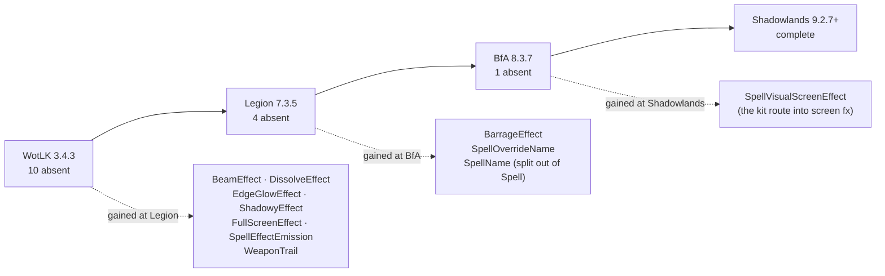

**`SpellName` is the one non-monotonic case** and worth understanding: it was
split out of `Spell.db2` in BfA, so Legion carries the name on `Spell.Name_lang`
— but WotLK *Classic* is a modern client and has `SpellName` normally. The
absence tracks the client generation, not the game era. `SPELL_NAME_SOURCES`
picks whichever exists.

### What that costs each version

| Feature | WotLK | Legion | BfA | 9.2.7+ | Why |
|---|:--:|:--:|:--:|:--:|---|
| chain / beam | partial | ✓ | ✓ | ✓ | WotLK has no `BeamEffect` — its 755 chains all come via proc Type 0 |
| dissolve | — | ✓ | ✓ | ✓ | `DissolveEffect` |
| glow | — | ✓ | ✓ | ✓ | `EdgeGlowEffect` |
| ghost (shadowy) | — | ✓ | ✓ | ✓ | `ShadowyEffect` |
| ghost (material) | — | ✓ | ✓ | ✓ | proc Type 22 — *see below* |
| desaturate | — | ✓ | ✓ | ✓ | proc Type 21 — *see below* |
| camo | — | ✓ | ✓ | ✓ | proc Type 18 — *see below* |
| screen fx grading | — | partial | partial | ✓ | `FullScreenEffect` absent in WotLK; kit route needs `SpellVisualScreenEffect` |
| ground models (emission) | — | ✓ | ✓ | ✓ | `SpellEffectEmission` |
| trail models | — | ✓ | ✓ | ✓ | `WeaponTrail` |
| barrage models | — | — | ✓ | ✓ | `BarrageEffect` |
| alt-name search | — | — | ✓ | ✓ | `SpellOverrideName` |
| vehicles / passenger anims | thin | ✓ | ✓ | ✓ | `Vehicle` + `VehicleSeat` present everywhere; WotLK's thinness is *content*, not schema — see below |

Everything else — models, sounds, animations, mechanics, morphs, summons,
shapeshifts, tints, transparency, freeze — works on all ten.

### Vehicles by version

Counts read from each pack's `meta.counts` after the format-23 rebuild:

| Pack | format | spell→vehicle | seats | passenger anims | seat animkits |
|---|:--:|--:|--:|--:|--:|
| Vanilla 1.15.8 | 22 | — | — | — | — |
| TBC 2.5.6 | 22 | — | — | — | — |
| WotLK 3.4.3 | 23 | 4 | 6 | 24 | 0 |
| Cataclysm 4.4.2 | 23 | 59 | 92 | 259 | 2 |
| MoP 5.5.4 | 23 | 121 | 221 | 596 | 10 |
| Legion 7.3.5 | 23 | 162 | 292 | 795 | 21 |
| BfA 8.3.7 | 23 | 185 | 328 | 909 | 22 |
| Shadowlands 9.2.7 | 23 | 233 | 384 | 1,138 | 44 |
| Dragonflight 10.2.7 | 23 | 293 | 419 | 1,397 | 49 |
| TWW 11.2.7 | 23 | 323 | 464 | 1,529 | 57 |

**Vanilla and TBC were deliberately not rebuilt** — vehicles are a WotLK-era
feature, so those two stay at format 22 and simply carry no vehicle sections.
The runtime guards every section read, so mixed pack formats are fine.

**WotLK's 4 is real, not a bug.** Aura 296 *is* `SET_VEHICLE_ID` on that build
(verified via `read_enum_names`, so it is not enum drift) — WotLK Classic just
has 7 `SET_VEHICLE_ID` rows in the whole of `SpellEffect`. The expansion that
introduced vehicles overwhelmingly uses `CONTROL_VEHICLE` (aura 236, 213 rows
there) instead, which is a different route we do not surface.

### Two things that look like bugs and are not

**Empty sections are often the enum, not the table.** WotLK's ghost-material,
desaturate and camo sections are empty even though no *table* is missing: those
come from `SpellProceduralEffect` types 22, 21 and 18, and **WotLK's proc types
stop at 17**. The enum is append-only, so the cutoff is exactly what the counts
show — freeze (Type 11) and transparency (Type 14) are populated on WotLK, and
everything above 17 is zero.

**Category searches can return rows for a feature this build lacks.** That is
the documented filename-substring behavior, not a fallback. On WotLK
`fx:desaturate` still matches `healbeam_desaturated`, `model:trail` matches
`ribbontrail`, and `fx:glow` matches `beam_webglowwhite`.

### Era differences visible in the data

Some gaps are content, not schema — the same route exists, the game just used it
differently:

| Section | WotLK | 9.2.7 | Reading |
|---|---:|---:|---|
| `spellAnimKits` | 41 | 31,834 | AnimKits barely existed in the WotLK era |
| `spellVisualAnims` | 39,247 | 119,051 | …but `SpellVisualAnim` was already the dominant animation source |
| `spellSounds` | 71,474 | 674,779 | modern spells carry far denser sound graphs |
| `spellShapeshifts` | 69 | 120 | forms grew slowly; displays actually *shrank* (20 → 18) |

### Drift is declared, not branched

Five declarations near the top of `build_data.py` absorb all of the above, so
the readers stay version-agnostic — adding a version is a config edit, not a
code edit:

| Declaration | Handles |
|---|---|
| `OPTIONAL_TABLES` | Table postdates the build → 404 tolerated, section empty, feature switches off. |
| `OPTIONAL_COLUMNS` | Table exists, one column doesn't → default stands in (3 so far: two missile-set variants, plus `ReducedUnexpectedCameraMovementSpellVisualID` absent on Legion 7.3.5 and BfA 8.3.7). |
| `SPELL_NAME_SOURCES` | Data moved tables — first candidate that exists wins. |
| `TDB_OPTIONAL_TABLES` / `TDB_OPTIONAL_COLUMNS` / `CREATURE_DISPLAY_SOURCES` | The same three kinds of drift on the TrinityCore side, in its own namespace. |
| `array_columns()` | A column that changed shape — `CreatureDisplayID_0..3` became a scalar in 10.2.0. |

**Anything not declared is still a hard error.** An unexpected schema change must
fail the build loudly rather than silently lose data. To add a version, run the
build and let it tell you what is missing, then decide per item whether it
belongs in a declaration or is a genuine bug.

### TDB-side caveats

- **WotLK's world data is not an exact build match.** TDB335 targets original
  3.3.5a, not the 3.4.x Classic client. It is the only creature name/display
  source for the era and resolution looks fine, but treat WotLK morph and summon
  names as best-effort.
- **Legion-era and 3.3.5 dumps have no `creature_template_model`** — displays
  live in `modelid1..4` columns on `creature_template` instead.
- **TDB335 is world-only** (no hotfixes dump), and TDB735 nests its SQLs in a
  subfolder without the `full_` infix. Both shapes are declared in
  `TDB_RELEASES`.
- **Vanilla Classic (1.15.8) and TBC Classic (2.5.6) have no TDB at all** —
  TrinityCore ships no 1.15/2.5 world database, so they are absent from
  `TDB_RELEASES` and `fetch_tdb` returns `None`. Morph/summon names and displays
  don't resolve for those two builds (raw ids only); every wago-sourced section
  is unaffected.

---

## 6. Runtime routes (browser, on demand)

Nothing here is fetched during search or bulk-downloaded. All of it is
user-triggered and configured in `docs/js/config.js`.

| Route | URL | Trigger |
|---|---|---|
| Spell icons | `wow.zamimg.com/images/wow/icons/medium/{icon}.jpg` | Lazy per visible row. Icon *names* are baked into the pack. |
| Sound playback | `wow.zamimg.com/sound-ids/live/enus/{bucket}/{fid}/{base}.ogg` | Explicit click. Serves current retail; 404s fail soft. |
| Texture preview | `wago.tools/api/casc/{fid}?version={version}` | Hover, after a 150 ms intent delay. Raw `.blp`, decoded in-browser by the vendored `bufo.js` + `js-blp.js`. Version-pinned to the active pack. |
| Expansion logo | same CASC API | One image per version switch. |
| 3D model viewer | `wowtools.work/mv/?filedataid={fid}&type=m2` | Link-out only, nothing fetched. |
| Wowhead | `wowhead.com/spell=` · `/npc=` · `/sound=` · `#modelviewer:` | Link-out only. |

House rule, unchanged: **fetch only on explicit user action, never preload,
never bulk-download.** The icon and sound hotlinks sit on tolerated-hotlinking
footing, not an affirmative license.

---

## Quick reference — where does column *X* come from?

| Column | Routes feeding it |
|---|---|
| **Models** | attach (kit→ModelAttach→EffectName), missile (SpellVisual→MissileSet), ground (kit ET 8 + proc 9→AreaModel), trail (proc 27→WeaponTrail), barrage (kit ET 17→BarrageEffect); every row also carries its M2 attachment point (§3h) |
| **Sounds** | kit ET 5, missile `SoundEntriesID`, chain `SoundKitID`, `SpellVisual.AnimEventSoundID` — all → SoundKitEntry |
| **Animations** | SpellVisualAnim initial/loop (loose), AnimKit via ET 6 + missile (grouped), proc Type 7 (stance), VehicleSeat passenger anims (passenger) + its vehicle anims (loose) + its AnimKits (grouped) |
| **Effects (fx)** | chain, dissolve, glow, ghost, tint, desaturate, transparency, freeze, camo, screen, shapeshift, morph, summon, seat — see §3a–3i |
| **Mechanics** | `SpellEffect.Effect` + `.EffectAura` enums, names from WoWDBDefs |
| **Name search** | SpellName/Spell + `NameSubtext_lang` + SpellOverrideName alt names |
| **Target bits** | `SpellVisualEvent.TargetType` on the kit edge (§2), plus `Caster`/`HostileSpellVisualID` redirects that mark whatever they reach caster/target |
