# Epsilook data routes

Every path data takes from an upstream source to a pixel in the app. This is the map of *where things come from*;
`build/build_data.py` is the implementation and
`CLAUDE.md` holds the decisions and gotchas behind it.

Where a route ends — the pill it becomes, the category word it answers to, how a query token matches it — is
**[PILLS.md](PILLS.md)**. The two meet at
`src/pilltypes.ts`, which declares one record per kind of content: the route's corpus, the spells it reaches, and its
keyword.

Read it in five stages:

1. [Sources](#1-sources) — what gets downloaded, from where
2. [The visual graph](#2-the-visual-graph-spine) — the spine every visual route hangs off
3. [Payload routes](#3-payload-routes) — the ~20 routes from a kit/spell to something showable
4. [The pack](#4-the-pack) — how it lands in the UI
5. [Version differences](#5-version-differences) — what each of the six builds does and doesn't have
6. [Runtime routes](#6-runtime-routes-browser-on-demand) — what the browser fetches live

---

## 0. The pipeline at a glance

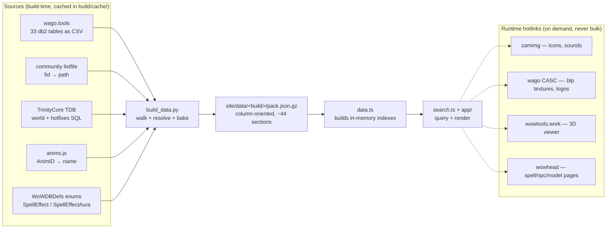

Nothing is fetched from a local DB dump, and nothing is fetched per-result at runtime. Everything the search touches is
baked into the pack.

---

## 1. Sources

| Source                      | URL shape                                         | Role                                                                                                                                |
|-----------------------------|---------------------------------------------------|-------------------------------------------------------------------------------------------------------------------------------------|
| **wago.tools**              | `wago.tools/db2/{table}/csv?build={version}`      | The 34 client db2 tables. Version-pinned, so a pack always matches its build.                                                       |
| **community listfile**      | `github.com/wowdev/wow-listfile` (latest release) | `FileDataID → path`. The only way a fid becomes `cfx_mage_fireball_missile.m2`. ~150 MB, streamed and filtered, never loaded whole. |
| **TrinityCore TDB**         | GitHub release `.7z` per era                      | Two distinct roles — see below.                                                                                                     |
| **anims.js**                | `wow.tools.local` raw                             | `AnimID → name` (Stand, SpellCastDirected, …).                                                                                      |
| **WoWDBDefs `meta/enums/`** | raw master                                        | `SpellEffect.dbde` + `SpellEffectAura.dbde` — the authority on what a mechanic enum value means.                                    |

### TDB does two unrelated jobs

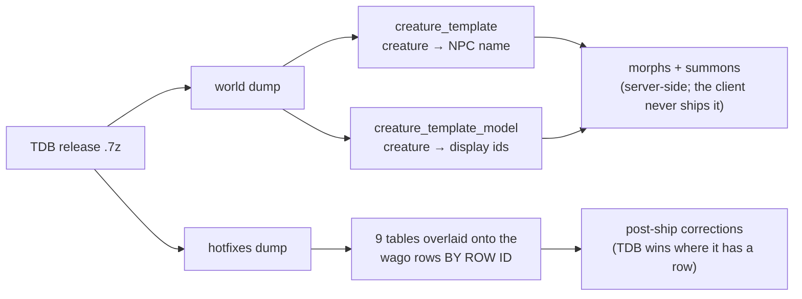

**World tables are the only source of creature names and displays** — that data lives on the server, so without a
`TDB_RELEASES` entry morph pills render as
`creature #<id>`. **Hotfix tables** are the rows Blizzard patched over the wire after the build shipped; they are
applied on top of wago by row ID for
`spell_name`, `spell_x_spell_visual`, `spell_visual`, `spell_visual_missile`,
`spell_visual_effect_name`, `spell_effect`, `spell_misc`,
`creature_display_info`, `creature_model_data`.

A version with no TDB entry still builds — morphs stay unresolved, hotfixes don't apply, and the build logs both.

---

## 2. The visual graph spine

Almost every visual route starts here. Both hops are many-to-many.

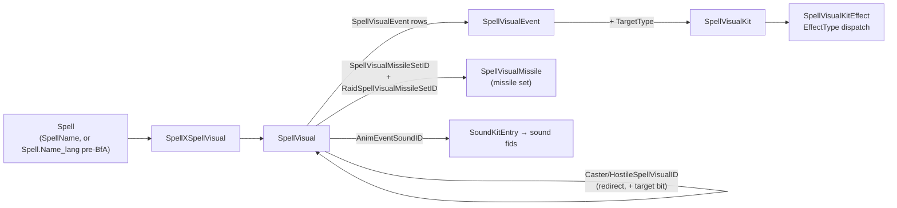

Three things to hold onto:

**The kit edge carries a target mask.** `SpellVisualEvent.TargetType` says *who the kit plays on*, and it rides along
with everything that kit contributes. A visual can reach the same kit through several event rows, so masks union per
edge. Impact kits genuinely carry duplicate rows differing only in TargetType — that is why a row can be caster *and*
target.

| TargetType | bit | search words       | icon meaning                                                        |
|------------|-----|--------------------|---------------------------------------------------------------------|
| 1          | 1   | `caster`           | on the caster                                                       |
| 2          | 2   | `target`           | on the target                                                       |
| 3          | 4   | `area`             | on the ground at the target                                         |
| 4          | 8   | `target`, `others` | on the target only, never the caster                                |
| 5          | 16  | `area`             | on the ground where the missile lands                               |
| 0          | —   | —                  | effectively unused (1 row in 207,241 on 9.2.7); contributes nothing |

**The words NEST, they do not partition.** `target` covers bit 8 as well as bit 2, because a never-caster row is still a
target row and is what you want back from `model:target`; `others` is the narrower question — content the caster never
sees — and it exists because the pill draws that bit in its own colour, so the red crosshair had a glyph and no name
(11,227 spells on 9.2.7 in Models, 8,213 in Sounds). `area` nests the same way over bit 16, which keeps **no** word of
its own: a missile's destination is a place on the ground like any other, and the icon's own tooltip says which. `both`
is derived (bits 1 **and** 2) rather than being a bit.

**All five payload columns test the mask, since 2026-08-04 — `fx:` did not, and it was drawing the icons anyway.**
Models, sounds and anims had split target words out of the tokens since the words existed; the fx search never did, so
`fx:caster` fell through to ordinary corpus text and selected the 32 spells with "caster" in an asset path while 27 of
their cells lit their icons off the mask. It is now `fx:caster` = 14,641. The mask reaches the fx search through the
pill-type registry's `targets` axis (docs/PILLS.md §3) — **a type that declares none answers NOTHING to a target word**,
which is right for a tint or a desaturation and is the thing to check when adding a type that draws the icons.
`mech:` is the exception and deliberately so: its corpus **is** the `TARGET_*` enum names the column prints, so
`mech:caster` matches `UNIT_CASTER` / `DEST_CASTER` / `SRC_CASTER` by name — the same "category words match file names
too" rule the whole app runs on, one level up.

**…but `TargetType` is relative to the CAST, not to the visual.** It distinguishes
"the caster" from "the unit being cast at" — and on a **self-cast spell those are the same unit**, where the client
still writes `Target`. Taken literally that draws a *target* icon on Divine Shield's own bubble, Ice Barrier,
Invisibility and every other self-buff's aura visual: 32,136 spells and 48,025 model rows on 9.2.7.
`SpellEffect.ImplicitTarget` is what tells a self-cast from a real one, so the two tables must be read together
(`resolve_target_mask` in `build_data.py`).

*Which* effect row to believe depends on **when** the visual plays —
`SpellVisualEvent.StartEvent` (`meta/enums/SpellVisualEventEvent.dbde`: 1/2 precast, 3 cast, 4/5 travel, 6 impact, **7/8
aura**, 9/10 area trigger, 11/12 channel, 13 one-shot). So each kit edge keeps its mask split in two halves:

| phase                     | who to believe                            | why                                                                                                                                                                             |
|---------------------------|-------------------------------------------|---------------------------------------------------------------------------------------------------------------------------------------------------------------------------------|
| **aura** (StartEvent 7/8) | the `APPLY_AURA` effects' implicit target | the visual belongs to the aura, so it plays on whoever *carries* it — which can disagree with the rest of the spell (Vanish, Blink: a self-aura beside effects aimed at others) |
| every other phase         | *all* effects' implicit targets           | they share the cast's frame, so "Target" is the caster only when the whole spell is self-cast (Healing Potion, Eye of Kilrogg)                                                  |

A `Target` bit becomes `Caster` when its half's test says the spell targets only the caster. **Only that bit is
rewritten** — `TargetType 4` ("Target, not caster")
says outright that it is not the caster, so it never flips. The rule is monotone: it replaces bit 2 with bit 1 and can
never clear a caster bit, which makes the transition histogram a build oracle (9.2.7: `2→1` 37,485, `3→1` 10,276,
`7→5` 153, `10→9` 21, `18→17` 18; plus 22 rows `2→3` where the aura phase flips but another phase keeps a genuine
target).

The contrast that shows it working: **17 Power Word: Shield** (`TARGET_UNIT_TARGET_ALLY`)
keeps `holydivineshield_state_base` on *target*, while **642 Divine Shield**
(`TARGET_UNIT_CASTER`) moves `cfx_paladin_divineshield_statebase` to *caster* — the same kind of shield-state visual,
correctly told apart. Banish and Polymorph are untouched.

Note this reads `StartEvent` **only** far enough to get the icons right; the full phase axis (surfacing cast/aura/impact
per pill) is deliberately not built. When it is: 97.7% of kits appear in just one phase, so phase is nearly a property
of the kit, and `StartEvent`/`EndEvent` are populated on all ten packs (no drift).

**The missile path bypasses events entirely**, so missile content carries *no*
mask — that is exactly the ~4% of unmasked rows in every pack, and the row count matching the missile row count is a
good build oracle.

**A `SpellVisual` can redirect to another `SpellVisual`.** Four columns on the row name a substitute visual the client
swaps in (`VISUAL_REDIRECTS` in
`build_data.py`); the build follows them so the spell also reaches everything the substitute carries. This matters
because the redirected-to visual is usually reachable no other way — on 9.2.7 only 37 of 228 caster targets and 30 of
257 hostile targets also appear in `SpellXSpellVisual` — so following the redirect is what makes that content visible at
all, not a re-labelling of rows already shown (263 spells gain a caster/target model bit this way).

| Column                                         | extra bit    | meaning                                    |
|------------------------------------------------|--------------|--------------------------------------------|
| `CasterSpellVisualID`                          | `caster` (1) | what the caster themself sees              |
| `HostileSpellVisualID`                         | `target` (2) | what a hostile target sees                 |
| `LowViolenceSpellVisualID`                     | —            | client-setting variant, no target semantic |
| `ReducedUnexpectedCameraMovementSpellVisualID` | —            | client-setting variant, no target semantic |

The bit rides along with everything reached through that redirect, exactly like a `TargetType` mask, and unions with it.
Two traps the build handles and any future edit must keep: **the redirect graph has cycles** (a self-reference and a
two-cycle on 9.2.7, chains up to 3 hops), so expansion is a mask-fixpoint worklist, not recursion; and **a hotfix row
replaces the wago `SpellVisual` row wholesale**, so the redirect columns (and `AnimEventSoundID`) join the TDB hotfix
overlay or a hotfixed visual silently loses them.

---

## 3. Payload routes

### 3a. Kit dispatch — `SpellVisualKitEffect.EffectType`

The single busiest fan-out in the build. `EffectType` says which table `Effect`
points at.

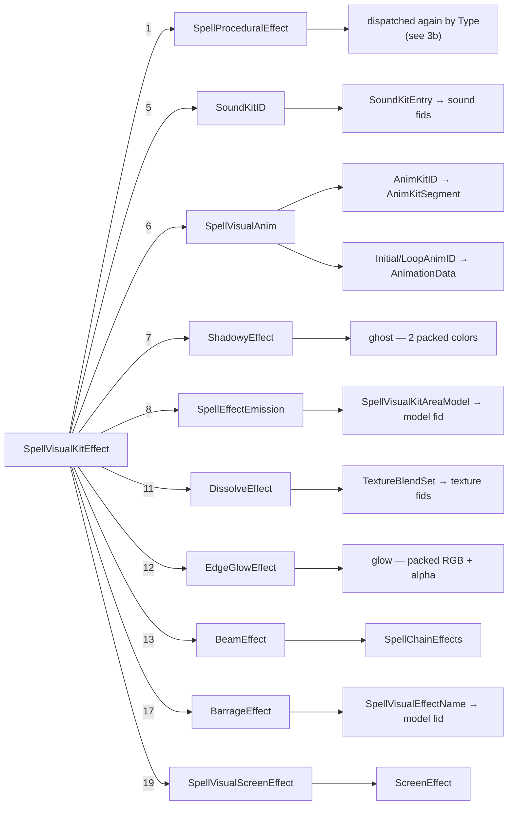

The remaining EffectType values were audited and deliberately dropped: **2**
(ModelAttach-by-id) is 100% redundant with the parent-kit walk; **10**
(UnitSoundType) plays the target's own sound and names no file; **15/20** are absent from the data; the rest carry no
model or sound columns.

### 3b. Proc dispatch — `SpellProceduralEffect.Type`

`Type` is the client's character-procedure index, so it selects both the handler *and* which `Value_n` column holds the
payload. This is the second fan-out.

| Type      | Payload column                      | Becomes                                 |
|-----------|-------------------------------------|-----------------------------------------|
| 0, 12, 26 | `Value_0` → SpellChainEffects       | **chain** (beams)                       |
| 1         | `Value_0` packed RGB                | **tint**                                |
| 7         | `Value_0/1/2` → AnimationData       | **replace** (Stand/Walk/Run swaps, §3o) |
| 9         | `Value_0` → SpellVisualKitAreaModel | **model** (`ground`)                    |
| 11        | —                                   | **freeze** (valueless)                  |
| 14        | `Value_0` alpha 0..1                | **transparency %**                      |
| 18        | —                                   | **camo** (valueless)                    |
| 21        | `Value_2` strength 0..1             | **desaturate %**                        |
| 22        | `Value_3` packed RGB                | **ghost** (material recolor)            |
| 23        | `Value_3` packed RGB                | **tint** (material recolor)             |
| 27        | `Value_0` → WeaponTrail             | **model** (`trail`)                     |

Colors are `0xRRGGBB`; `INT_MIN` is the "unset" sentinel. The types not surfaced (2–6, 8, 10, 13, 15–17, 19–20, 24–25,
28–34) are renderer or gameplay state, or too rare to be worth a pill. The full decode with evidence is in CLAUDE.md →
*Proc type decode*.

### 3c. The six model routes

Every `(spell, model)` row is tagged with **how** the model is used. Same fid can appear once per category.

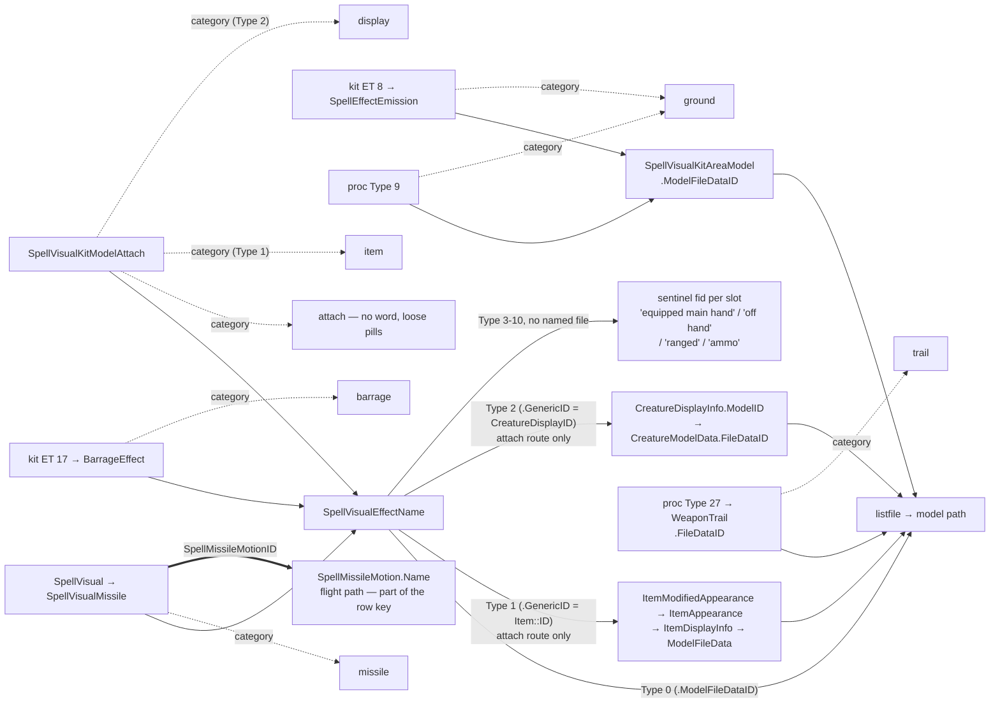

`SpellVisualKitAreaModel` carries its fid **directly** — no
`SpellVisualEffectName` hop. Note `ground`, not `area`: the target words include
`area` and the two mean different things (only 42% of this category's rows carry an area target bit).

**`SpellVisualEffectName.Type`** picks how the effect-name resolves to a model:
**0 = FileDataID** (`ModelFileDataID`, every route above), **1 = Item**
(`GenericID` = Item::ID), **2 = CreatureDisplayInfo** (`GenericID` = a CreatureDisplayID). On the **attach route only**,
a Type-2 row resolves that display through `CreatureDisplayInfo → CreatureModelData` (pure client data — no TDB) into
the `display` model category. Its pill sits in the Models column but wears the morph pill's buttons (Wowhead model
viewer by displayId, ⧉ copy displayId, `.morph`, `.lookup display creature`) and keeps its attachment point like any
other attached model. The label is the model's base filename. The category word is **`display`**, not `creature`: a
creature model's path lives under `creature/…`, so `creature` would collide with ~21% of the model-file corpus by the
filename-substring rule. Missiles/barrage keep reading
`ModelFileDataID` for every Type (they carry no CreatureDisplay/Item content).

**Type 1 = an Item::ID → the `item` model category** (attach route only). The item carries its own model through the
appearance chain
`ItemModifiedAppearance → ItemAppearance → ItemDisplayInfo → ModelResourcesID
→ ModelFileData.FileDataID` (pure client data, so it works on the TDB-less Classic packs; 99.8% of reached items resolve
on 9.2.7), plus the display name and quality from `ItemSearchName` and the inventory icon from
`ItemAppearance.DefaultIconFileDataID`. `ItemSparse` is deliberately **not**
downloaded: measured to add zero names over `ItemSearchName` for this population, at 6× the size. The pill has two
shapes, split on whether the item has a name (about two-thirds do; the rest are internal props — unnamed potions,
dynamite, gizmos — that exist only to be held in a visual):

- **named** → `[Wowhead item page] · {target}{icon}{name} · attach · ⧉ copy
  item id · .additem · .lookup item {name}`. The name is coloured by the item's quality (the classic poor→artifact ramp;
  colour only, **not** searchable). Both the leading `[wh]` button *and the icon* are Wowhead item links opening the
  model view (`item={id}/#modelviewer`) — that `<a href>` anchor is the app's proven tooltip trigger, so hovering the
  icon raises the item tooltip. The label stays a click-to-search button (with a `data-wowhead` mirror for its own
  tooltip) rather than a link, so clicking the name searches instead of navigating.
- **nameless** → `[3D viewer] · {target}{icon}{model base name} · attach ·
  .lookup item {model base name}`. No Wowhead, no `.additem`, no id copy — none resolve without a name — and
  `.lookup item` falls back to the model's base filename (no extension; `.lookup item` accepts either a name or a model
  name). The icon still reads (you can see it is a potion or a bomb).

The category word is **`item`**; it collides with ~4.3% of the model-file corpus (the `item/objectcomponents/…` paths)
by the filename-substring rule — well under the ~21% that ruled out `creature`, and coherent because those files *are*
item models. `model:"item <name>"` matches on the item name via a dedicated corpus (`itemSearchL`); the model file and
category word match through the ordinary model index. This is the **attach route only** — the 62 missile-route Type-1
effect-names on 9.2.7 render nothing, matching the "item attachments" scope.

**Types 3–10 = a weapon the caster already has.** They carry *no* model of their own (`ModelFileDataID` **and**
`GenericID` both 0) while attaching to weapon/hand M2 points and being frequently reused as a missile — i.e. the model
is the real item the caster is holding, resolved client-side at cast. The `Type` picks the **slot**, and dual-wield
emits a mainhand+offhand pair. `SpellVisualEffectNameType.dbde`
defines only 0–2, but [wowdev.wiki/EnumeratedString](https://wowdev.wiki/EnumeratedString#SpellVisualEffectName::Type)
carries the client's own enum, and it matches what the data showed:

| Type | official name                 | pill                 | evidence (spell names)                                       |
|------|-------------------------------|----------------------|--------------------------------------------------------------|
| 3    | Unit - Item - Main hand       | `equipped main hand` | Throw Spear, Heroic Throw, Javelin Toss, Impale, Fishing     |
| 4    | Unit - Item - Off hand        | `equipped off hand`  | Pandaren Spirit (`T3@LargeWeaponRight + T4@LargeWeaponLeft`) |
| 5    | Unit - Item - Ranged          | `equipped ranged`    | Arcane Shot, Pistol Barrage, Hold Rifle, Wailing Arrow       |
| 6    | Unit - Ammo - Basic           | `equipped ammo`      | Sha Corruption (2 rows)                                      |
| 7    | Unit - Ammo - Preferred       | `equipped ammo`      | missile-only (1 row)                                         |
| 8    | Main hand *(ignore disarmed)* | `equipped main hand` | Hold/Sharpen/Throw Sword, Whirling Blade                     |
| 9    | Off hand *(ignore disarmed)*  | `equipped off hand`  | Thal'kiel skull, Crystalline Swords                          |
| 10   | Ranged *(ignore disarmed)*    | `equipped ranged`    | Hold Rifles, Barrage, Death Blossom                          |

Eight types, **four pills**: "(ignore disarmed)" is a visibility rule for a disarmed caster rather than a different
weapon, and basic-vs-preferred ammo says which arrow the client picks, so both collapse. Because there is no file to
name, these rows carry a **sentinel fid per slot** (`SYNTHETIC_MODEL_FILES`, −1…−4) and render as a flat marker pill —
no 3D, texture, Wowhead or `.lo` button — while keeping their category (`attach` vs thrown-as-`missile`), attachment
point and target icon. Each sentinel gets a synthetic `files` entry whose *path is its label*, so it renders and
searches through the ordinary filename route with no special case: a pill click searches `model:"equipped off hand"`
exactly as a real model pill searches its own filename. Every label opens with **`equipped`** — a word no real model
path carries — so `model:equipped` still finds the whole family (where `model:weapon` would also catch every `weapon/…`
file). That one word is also the only thing autocomplete offers: the slots are *values*, and only meta words belong
there (the `attach <point>` rule, §3c). The rows'
`StartAnimID`/`AnimID`/`EndAnimID`/`AnimKitID` already reach the Animations column (§3e), so what the spell *plays* was
searchable before the model was.

**Trap — "fileless" is not always spelled 0.** The Classic re-release clients backfill these rows with an **unnamed
placeholder fid** instead: Cata 4.4.2 points all seven of its weapon rows at fid **1255628**, WotLK 3.4.3 one — the very
same effect-name IDs (8905–8909, 9007, 50201) that are fid 0 on every other build. One fid shared across six weapon
slots is not a per-weapon model, and taken literally it renders a junk `file #1255628` pill. So a weapon row's fid is
trusted **only when the listfile can name it**, which keeps genuinely hardcoded weapons (Sylvanas's bow, fid 3597252 on
9.2.7+) rendering as the real models they are. The check runs once in `read_model_sources`, after the hotfix overlay,
and rewrites the placeholder to 0 so every downstream route takes its existing "no file → sentinel" branch. Only weapon
rows are touched — a Type-0 row naming the same fid keeps its normal model pill (which is why Cata still reports one
unnamed file).

#### Missile flight paths — the arc a projectile travels

`SpellVisualMissile.SpellMissileMotionID → SpellMissileMotion.Name` names the path a missile flies. It rides the same
row as the model, so the flight path pairs with the **projectile it belongs to** rather than with the whole missile set,
and it is part of the model row key exactly as the attachment pair is — a model flown two ways is two rows and renders
as two pills. On 9.2.7 that costs 163 extra rows out of 317,613: **99.4%** of `(set, effect-name)` pairs name exactly
one motion.

Only ID and Name are read. The table's other real column is `ScriptBody`, a Lua-ish motion script that is the bulk of
its bytes and that nothing renders. The pack ships only the motions in use (**1,199** of ~1,650 on 9.2.7) as a
`missileMotions: {ids, names}` block, with `spellModels.motions` indexing into it by id (0 = none, and 0 on every
non-missile category).

Coverage on 9.2.7: **14,514** of 24,145 missile model rows (60.1%) carry a motion, reaching **13,301** spells. It
renders as a `motion` pill segment between the model name and the attachment pair, and is searchable as
`model:"motion parabola"` / `model:(motion "forward spin")` — 7,796 spells and 924 respectively.

#### Missile attachments come from the ROW first, then the visual, then a verified default

Both `SpellVisual` and `SpellVisualMissile` carry a launch/impact attachment pair, and they are **complementary, not
redundant**. Over the 18,553 missile rows reachable from a visual on 9.2.7:

| source attachment             | rows              |
|-------------------------------|-------------------|
| `SpellVisual` only            | 3,039 (16.4%)     |
| `SpellVisualMissile` row only | 9,409 (50.7%)     |
| **either**                    | **9,774 (52.7%)** |
| neither                       | 8,779 (47.3%)     |

So the row is read first and the visual is the fallback — **more than tripling** source coverage against reading the
visual alone. Where both are set they agree (322 conflicts of ~3,000). An earlier comment justified preferring
`SpellVisual` with "105.6k rows carry a destination versus 14.9k" — that counted all 105k visuals, ~87k of which have no
missile at all, so it measured the wrong population.

**The destination precedence was settled in game**, because there the two disagree on **4,457 rows (24%)**: casting
`Glacial Blast` (369018), where the visual says Chest and the row says Base, lands at the **base**. The row wins.

**A row with no attachment in either column launches from `VirtualSpellDirected` (M2 attachment 56)** — the client's own
name for a computed point, verified in game on two independent models (a blank Fireball 9053 is indistinguishable from
Fireball 133, which declares it explicitly; Shadow Bolt agreed). It is materialised in the build, so **every missile row
now has a launch point** — 0% blank, down from ~84%. `DEFAULT_MISSILE_SOURCE` is the one place it is spelled.

**The names come in two families**, and both are useful:

| family               | shape                                                                 | share |
|----------------------|-----------------------------------------------------------------------|-------|
| **geometry**         | `Parabola (High)`, `Boomerang`, `Spiral`, `Fountain`, `Snake`         | ~60%  |
| **per-spell script** | `Mage - Fire - Fireball`, `Warlock - Destro - Chaos Bolt (Secondary)` | ~40%  |

The script family is effectively a second, Blizzard-authored name for the spell, which is why the names are worth
shipping rather than reducing to a geometry enum. A few carry developer intent recorded nowhere else —
`Always Miss - Left or Right, Miss by 1-2 yd` (Wrath, 83457) is a deliberate miss behaviour, and one motion's name is a
shipped code comment.

**The TDB hotfix overlay must carry the column too.** `spell_visual_missile` is overlaid by row ID *wholesale*, so a
hotfixed missile row that omitted `SpellMissileMotionID` would silently blank the flight path — the same reason
`spell_visual` overlays its missile attachments. Adding it to `TDB_TABLES` requires deleting the stale distilled
`spell_visual_missile.csv` per TDB release, because the distilled-CSV cache is keyed on file existence, not columns.

Present on **every build** (45 motions on Vanilla 1.15.8 → 1,997 on TWW 11.2.7), so no drift declaration is needed.

### 3d. The four-and-a-half sound routes

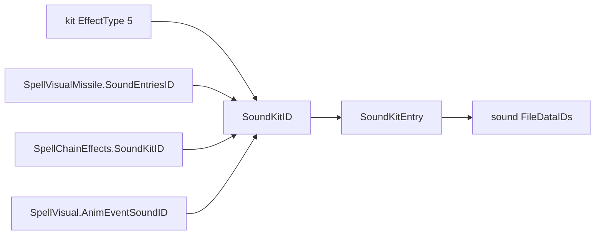

The chain route is the "half": a beam's own sound folds into the spell's Sounds column and inherits the chain's target
mask.

`AnimEventSoundID` hangs off the `SpellVisual` row itself (not a kit or a missile), and its value is a `SoundKit::ID` —
the same type the missile route already eats — so it drops straight into the existing sound plumbing. It is the
**widest-reaching of these** — 1,999 spells on 9.2.7 (vs a few hundred each for the caster/hostile redirects), populated
on every pack including Vanilla — and it inherits the redirect target bit of whatever edge reached the visual.

### 3e. The animation routes

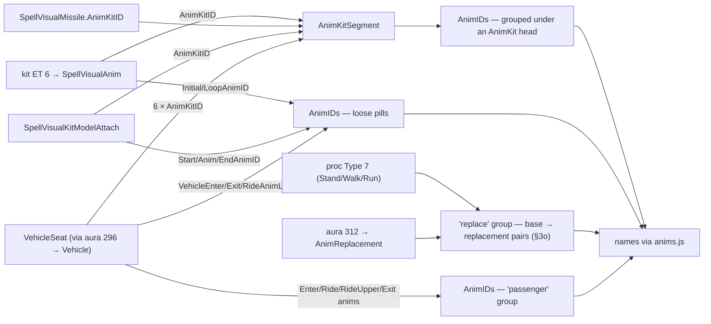

`SpellVisualAnim`'s initial/loop anims are **the dominant source** — 119k rows vs 32k animkit rows on 9.2.7. `-1` and
`0` both mean unset (0 would be Stand). Impact kits animate the *target*, so these are not caster-only.

**That split is searchable as `anim:kit` / `anim:loose`** (2026-08-04): where an animation came from is the one thing
the column draws plainly — numbered AnimKit boxes above, loose pills below — and the search could not ask about it.
31,259 spells have an AnimKit, 82,009 have a loose anim and 11,168 have both, so it partitions the column rather than
naming a corner of it. They are **head words like `replace` and `passenger`**, matched the same way (the word OR the
anim's own name), which is what makes `anim:"kit dance"` a dance that arrived in a bundle and leaves `anim:loose` still
finding `Attack2HLoosePierce` by name — the documented overlap, same as `fx:glow` finding `beam_webglowwhite`. Four
sources, four words, one rule (`inSource` in search.ts).

`SpellVisualKitModelAttach` carries animations on the SAME rows that attach a model (§3c, attachment point in §3h): its
`StartAnimID`/`AnimID`/`EndAnimID` are AnimationData ids for the attached model's start/loop/end and join the loose
pills; its `AnimKitID` rejoins the animkit groups. Keyed by kit, they union into the existing buckets (no pack section
of their own), and are indexed even when the row's `ModelFileDataID` is 0 (a Type 1/2 effect-name, whose model comes
from
`GenericID`, or a Type 3–10 equipped-weapon row that has no model at all), since they are anims the spell's kit plays.
Same `>0` gate as `SpellVisualAnim`. Adds
~10.5k animkit and ~6.7k loose-anim (spell,anim) pairs on 9.2.7.

The vehicle-seat route splits by **whose** animation it is: the nine passenger columns (`EnterAnimStart/Loop`,
`RideAnimStart/Loop`,
`RideUpperAnimStart/Loop`, `ExitAnimStart/Loop/End`) head a `passenger`
group, while the vehicle's own three (`VehicleEnterAnim`, `VehicleExitAnim`,
`VehicleRideAnimLoop`) join the loose pills — the rider's behaviour and the vehicle's are different things. The six
`*AnimKitID` columns are ordinary
`AnimKit::ID`s and rejoin the animkit groups, so the build counts them as
"used" and ships their segments. Population on 9.2.7: 99.8% of seats set at least one passenger anim, the vehicle's own
are 3–7%, any animkit 12.7%.

**Bonesets — the body region a segment animates.** Each `AnimKitSegment` (one anim in a kit) names an
`AnimKitConfigID`; the config resolves through `AnimKitConfigBoneSet` (`ParentAnimKitConfigID → AnimKitBoneSetID`) to
one or more `AnimKitBoneSet.Name`s — "Upper Body", "Head", "Right Hand", "Jaw", … (28 named regions on 9.2.7, all
build-present so no drift). The bone-index blob (`BoneDataID`) is not surfaced; the region **name** is the useful part.

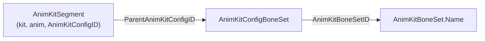

A boneset is a property of the **segment**, so it is keyed by `(kit, anim)` and shown only on that **anim pill** — never
on the kit head. Each region becomes its OWN pill, so an anim that animates two regions (a config naming Left + Right
Shoulder, or two segments) renders as two pills, not one merged label. **"Full Body" is the default** (nearly every
segment animates the whole body — 19,310 of 21,462 kits on 9.2.7) and is never shipped or shown; only a specific region
says anything. Searchable through the `boneset` keyword inside `anim:` (`anim:"boneset upper body"`), which consumes
every token after it as region words and matches them against the spell's boneset haystack (a name may be several words,
unlike an `attach` point). 9.2.7 ships 4,354 `(kit, anim) → region` rows across 9 region names for the used AnimKits. A
single `AnimKitConfig` can name several bonesets (68 name two, e.g. Left+Right Shoulder), and a single
`(kit, anim)` can reach several through multiple segments — both unioned, then Full Body dropped.

### 3f. Routes that start at `SpellEffect`, not at a visual

Nine fx categories skip the visual graph entirely: a particular `Effect` or
`EffectAura` enum makes `EffectMiscValue_n` an id into another table — or, for movement speed and object scale, makes
`EffectBasePoints` the payload itself.

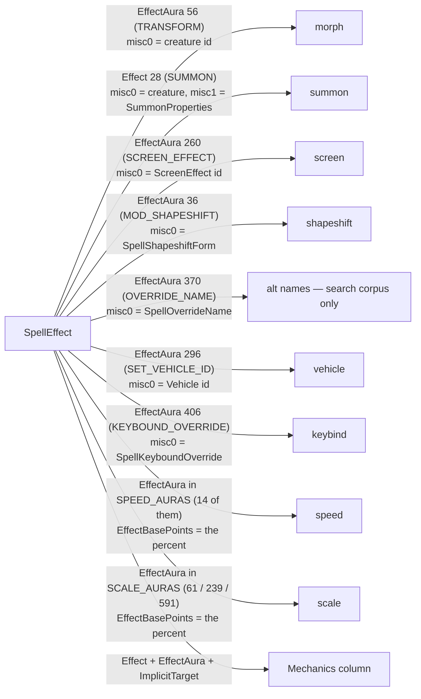

**The vehicle route covers "the caster BECOMES a vehicle", not "boards one".**
`CONTROL_VEHICLE` (aura 236) is the far larger population — 1,581 rows vs 247 on 9.2.7 — but its `EffectMiscValue_0` is
a seat/flag value, not a
`Vehicle.db2` id, so it needs its own route and is deliberately not wired up.

**These effect-driven fx carry a target mask of their own** (pack format 25), and it does *not* come from the visual
graph — it is the producing
`SpellEffect` row's `ImplicitTarget_0`/`_1` (the `Target` enum, mapped to the same caster/target/area bits as §2's
`TargetType`, by `implicit_target_bit`). It answers *who the effect lands on*: a polymorph's morph is on the **target**,
a self-transform on the **caster**, a summon on the **area** where it lands. These rows never pass through
`SpellVisualEvent`, so `TargetType` says nothing about them — the implicit target is the only source. Alt-names
(`aura 370`) are search-corpus-only and carry no mask.

**misc0 on a transform aura is a creature id, not a display id** — a long-standing trap. Both morphs and shapeshift
forms then walk the same creature→model chain:

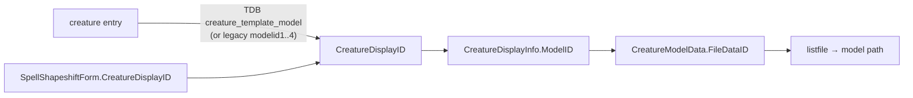

Screen effects are the one payload arriving from **both** directions — the aura route (~2.3k spells) and the kit route
via `SpellVisualScreenEffect` (18 rows on 9.2.7) — so the walk extends an already-populated set.

### 3g. Screen effect payload

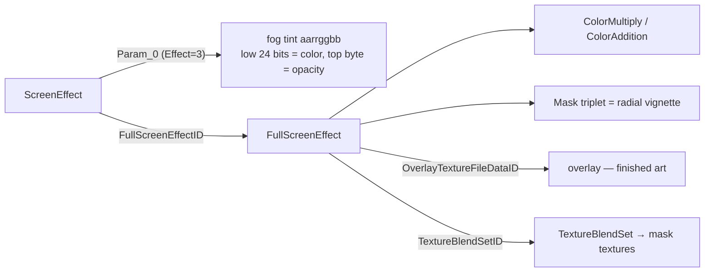

The two texture columns are **not interchangeable**: overlays are finished art drawn in their own colors, masks are flat
blend-set art the grade colors paint. The pack tags each texture with its role. The wiki's `rrggbbxx` claim for
`Param_0` is WotLK-era and wrong for modern rows — ours reads `aarrggbb`, settled by name semantics.

### 3h. Attachment points — where on the model something plays

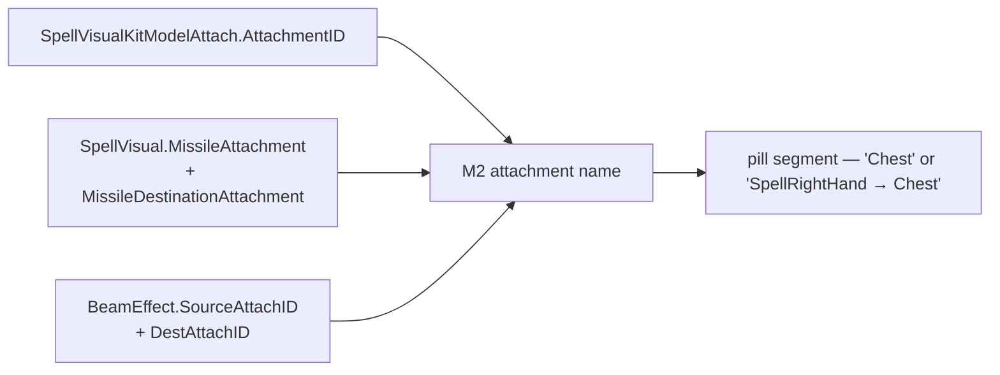

Three routes carry an attachment, and **all three are RAW M2 attachment ids**
(the `M2_ATTACHMENT_NAMES` table) — only `VehicleSeat` is indexed, see §3i. The id is part of the row key, so the same
model at two points stays two rows and renders as two pills: on 9.2.7, 44,906 (spell, fid, category) groups split this
way, and the split is what makes a caster/target difference visible instead of silently merged.

**Single-point vs travelling is a real distinction, not a formatting choice.**
Attached, ground, trail and barrage models sit at ONE point and render the bare name; missiles and beams travel and
render `Source → Dest`. The two are indistinguishable in the data (both look like "src set, dst unset"), so the renderer
is told explicitly — `TRAVELLING_MODEL_CATS` in `src/app/tags.ts`. A travelling row that knows only one end reads
`from X` /
`to Y`; it must never render a dangling arrow.

Two traps:

- **`SpellVisualKitModelAttach.LowDefModelAttachID` is a SELF-REFERENCE to another row of the same table** — the
  low-detail variant of that attachment — **not an attachment id and not a FileDataID.** It is unused by the build; what
  matters is only that it is not mistaken for an attach point. **Corrected 2026-07-29** (this entry previously said "a
  FileDataID", inferred from `max 430259` being far outside the 0..57 attachment range — which rules out an attachment
  but says nothing about which of the two remaining readings is right). Measured on 9.2.7 with the exploration database:
  of the 36 distinct nonzero values, **36 (100%) resolve as `SpellVisualKitModelAttach.ID`**
  and only **8 (22%) as a listfile FileDataID**; the referenced rows all carry `ParentSpellVisualKitID = 0`, i.e.
  orphans reachable only from the high-detail row that names them. `WoWDBDefs` agrees
  (`int<SpellVisualKitModelAttach::ID> LowDefModelAttachID`).
- **Missile attachments are taken from `SpellVisual`, not
  `SpellVisualMissile`.** The missile route is per-visual (a whole set is unioned into one bucket) and that is also
  where the data lives: 105.6k rows carry a destination there versus 14.9k on the missile table. `spell_visual`
  in `TDB_TABLES` must overlay both columns — a hotfix row replaces the wago row wholesale, so omitting them would
  silently blank the attachments.

`SpellChainEffects` itself has **no** attachment column (its `Joint*` fields are geometry); beams attach through
`BeamEffect` (`SourceAttachID → DestAttachID`, rendered as the source→dest pair on the chain pill), which is why chains
only carry attach points on builds that have that table.

**Three more effect tables carry an M2 attachment id, now surfaced (§3, format 33): `DissolveEffect.AttachID`,
`ShadowyEffect.AttachPos` and `BarrageEffect.AttachmentPoint`.** Unlike a model-attach `-1` (which means "no segment"),
on these effects **`-1` means the WHOLE body** — the frontend labels it "full body" — because an effect with no anchor
covers the whole model (70–77% of dissolve/shadowy rows on 9.2.7). Dissolve and shadowy are fx pills: the region word
(the M2 name, or "full body") rides the effect's own fx search corpus, so `fx:"dissolve chest"` / `fx:"ghost full body"`
narrow by anchor with no new keyword; shadowy is grouped by colour, so a colour drawn at several points shows the union.
Barrage is a model pill, so its point rides the model row's `src` and reuses the whole model-attach machinery
(`model:"attach handarrow barrage"`). These columns are **absent on several Classic re-release clients** (irregularly —
Vanilla's `DissolveEffect` has `AttachID`, TBC's does not), so all three are `OPTIONAL_COLUMNS` defaulting to `-1`
(full body). A scan of every effect table found these three plus `BeamEffect` are the ONLY ones with an attachment
column — EdgeGlow, WeaponTrail, ColorEffect, Emission, AreaModel and Screen have none.

### 3i. Vehicle seat payload

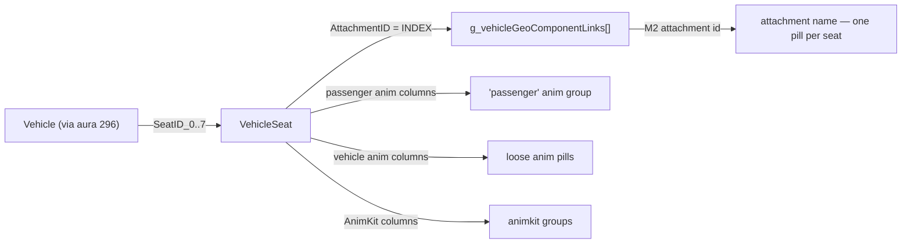

A vehicle fills up to eight `SeatID_n` slots; the filled count IS the seat count, and 0-seat vehicles are dropped at
build.

**`VehicleSeat.AttachmentID` is an INDEX, not an M2 attachment id** — it indexes a table hardcoded in the client binary
(`g_vehicleGeoComponentLinks`), which exists in no db2 and so is transcribed into `build_data.py`. wowdev.wiki quotes
the array but hedges it with a `?`, so it was verified rather than trusted: 138 vehicle M2s were fetched and each seat
checked against its own vehicle's model. The decoded attachment is present **91.2%** of the time vs **42.4%** for the
raw value, and where the hypotheses diverge it is decisive — index 14 decodes to `VehicleSeat2`, present on 100% of the
models using it, while raw 14 (`ShoulderFlapLeft`) is present on 0%. Indices 13..20 come out as
`VehicleSeat1..8` in order, which the array's own shape corroborates.

Two consequences worth knowing:

- The array is 6.0.1-era; modern data has indices past its end (26, 27). Those stay unmapped and render as a raw `idx N`
  rather than a guess.
- The decoded names are the game's own and often read oddly as seat positions (`Breath` and `ChestBloodBack` are the 2nd
  and 4th most common on 9.2.7)
  because artists reuse generic attachment slots as seat anchors. **That is the data, not a decode error** — the pill
  tooltip says so explicitly.

**Do not reuse this decode for the other attachment columns** (§3h): they are *raw* M2 attachment ids.
`SpellVisualKitModelAttach.AttachmentID` spans -1..57 across 55 distinct values on 9.2.7 — the direct-id signature —
versus
`VehicleSeat.AttachmentID`'s dense 0..27.

### 3j. Keybound overrides — which key stops working

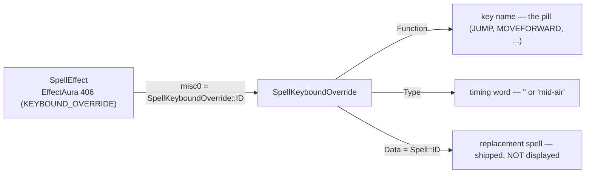

While the aura holds, a movement/UI key stops doing what it normally does. The join is exact: **105/105 aura rows
resolve on 9.2.7**. On the newest builds the table trails the aura slightly — 11 rows on both DF and TWW point at an
override the build does not ship — and those are dropped rather than shown as a bare id.

**`Data` is a `Spell::ID`.** 46 of 53 distinct values on 9.2.7 are live spells; the other 7 (43574, 52477, 79579,
206768, 284741, 284991, 292038) are stale references to spells since deleted from the client DB2.

**The replacement spell is shipped but deliberately not displayed** (user's call, 2026-07-23). Retail casts it in the
key's place, but on **Epsilon the override only disables the key** — it never casts the replacement — so naming it would
promise behaviour Epsilon users cannot get. It stays in the pack (`keybinds.spells`) so a future pass can surface it
without a rebuild; restoring it means adding the id and name back to `keybindSearchL` in `data.ts`
and to `keybindTag` in `src/app/tags.ts`, nothing more.

#### `Type` is decoded, not documented

Nothing documents this enum: the `.dbd` has no comment on `Type`, wowdev.wiki/DB/SpellKeyboundOverride is a 6.0.1
two-field stub, and EnumeratedString has no section for it. It was decoded from the data (2026-07-23) and the evidence
is strong enough to name:

- **100% of Type-1 rows are `JUMP`, on every build that has the table** — 0 of 13 rows on MoP, 2 Legion, 3 BfA, 7 SL, 23
  DF, 25 TWW. 60 rows, no exceptions. Type 0 spans all ten functions.
- Every Type-1 spell is a **mid-air** ability: Glide, `[DNT] Pirate Double
  Jump`, Jump Dash, Lift Off, Empowered Flight, Highland Drake, Gnomish Gravity Launcher, Defying Gravity, Faerie Wings,
  Zephyr's Catch, Wild Winds, Here's a Boost!, Prevent Jump. Every Type-0 spell replaces an ordinary ground press:
  Paddle Raft, Dodge Left/Right/Back, Locust Leap, Saurok Leap, Abandon Vehicle, Switch Seats, Flop, Stormforged Leap.
- **Decisive:** spell 319125 "Fizzle" appears as **both** Type 0 (override 173)
  and Type 1 (override 177) on the same function. Same payload, two rows — so
  `Type` is a trigger *condition*, not a kind of payload.

So **Type 0 = the ordinary press, Type 1 = the press while already airborne.**
Type 0 renders bare and only the mid-air case is labelled; an unknown future type falls back to `type N` rather than
being guessed at.

**`Flags` is deliberately not read**: absent from the table entirely on Legion and BfA, all-zero on 9.2.7, and only ten
nonzero rows (values 1 and 3) on TWW with no recoverable meaning. Reading it would buy a drift declaration and nothing
else.

### 3k. Movement speed — which movement, and by how much

The one `SpellEffect` route whose payload is not an id into another table: the **aura** says which movement is scaled
and
`EffectBasePoints` says by what percent. Fourteen auras, five movement words.

| word      | auras                        | when it applies                   |
|-----------|------------------------------|-----------------------------------|
| `run`     | 31, 129, 171                 | `MOVE_RUN` on foot                |
| `mounted` | 32, 130, 172                 | `MOVE_RUN` while mounted          |
| `swim`    | 58                           | `MOVE_SWIM`                       |
| `flight`  | 206, 207, 208, 209, 210, 211 | `MOVE_FLIGHT`                     |
| `all`     | 33                           | every movement type, applied last |

**The mapping is `Unit::UpdateSpeed`** (TrinityCore `Entities/Unit/Unit.cpp`) — one function, one switch, and the whole
truth about which aura scales which movement. `MOVE_WALK` returns from it immediately, so walking takes no modifiers at
all and never appears here.

**The six flight auras deliberately share one word.** They all scale the same
`MOVE_FLIGHT` number and which of them applies is a question about the unit's *state* — mounted, in a vehicle, neither —
not about a different kind of movement. The branches overlap besides: 206 feeds the vehicle case *and* the unmounted
one, which is why druid Flight Form uses it. Splitting them would invent a distinction the engine does not make.

**The sign is the whole story, and the aura name is not.** 187 rows of
`MOD_DECREASE_SPEED` on 9.2.7 carry a *positive* amount and plenty of
`MOD_INCREASE_*` rows a negative one, so the pill prints the signed number and never translates it into a verb.

**Zero-percent rows are DROPPED** (user's call, 2026-07-23 — this reverses the earlier "keep them" decision). A speed
pill is made of nothing but its number, so a `+0%` one promises a change and delivers none, and it inflates the
`fx:speed` count with spells whose real amount lives somewhere the pack cannot reach — a talent (Stealth's 129), the
morph the spell also applies, a script. What survives is the **Mechanics** column, which still carries
`MOD_INCREASE_SPEED` for the same spell: "has a speed aura at all" is a question that already has a home. On 9.2.7 that
drops 164 of 5,780 rows, 121 spells losing their pill outright.

**A pill is the `(movement, percent)` pair**, and that pair is what the pack ships and the search matches on. Several
auras map to one movement, so a spell setting two of them to the same percent collapses to a single row rather than
rendering twins — The Quick and the Dead's four auras become three pills. `all` is never something the renderer
*derives*: no spell's separate auras add up to full coverage (the widest reaches four of the five, and never swim), so
it only ever comes from aura 33.

#### Verified against the game's own tooltips

A `Description_lang` writes an effect's value as `$s<N>%`, where N is the **1-based `EffectIndex`** — so the text names
which effect it is quoting. On 9.2.7, **4,590 such placeholders point at an effect carrying one of these auras and
4,574 (99.7%) resolve to a nonzero value**; the 16 zeros are the dropped genuinely-zero rows above. That is a per-row
check of both the aura set and the column choice, and it is the cheapest oracle available for this route — rerun it
whenever the set changes.

#### `EffectBasePoints` has two spellings and every build has exactly one

The int column is the real one through Legion; the float `EffectBasePointsF` replaced it in BfA. Both are declared in
`OPTIONAL_COLUMNS` and read **int first**, because the overlap builds are a trap: **Vanilla, TBC and MoP export both and
leave the float at zero** (46 of 40,249 rows nonzero on Vanilla; zero on 771 of 783 speed rows). Preferring the float
would silently blank those three packs. `EffectBasePoints` also joins the TDB hotfix overlay for the usual
wholesale-replace reason — all four dumps that carry hotfixes at all spell it the int way, even TDB1127.

Values are rounded to one decimal, which drops the float32 conversion noise the modern builds carry (`14.27999973297` →
`14.3`) while keeping the ones that really are fractional (`47.5`). Eight rows on 9.2.7 are fractional, sixteen on TWW.

#### What is deliberately not here

So a later pass does not "fix" an omission — the table in `build_data.py` is the extension point, one line each:

- **252 `MOD_SPEED_SLOW_ALL` — the name lies, and it is the one trap in this family.** TrinityCore handles it with
  `HandleModCombatSpeedPct`, i.e. `ApplyCastTimePercentMod` + `ApplyAttackTimePercentMod`, exactly like 193
  `MELEE_SLOW`; it never touches movement. The data agrees — Icy Touch's −15% is Frost Fever's attack-speed slow.
- **191 `USE_NORMAL_MOVEMENT_SPEED`, 437 `MOD_MINIMUM_SPEED_RATE`** — real movement auras, but the amount is an absolute
  speed in yards/sec (`UpdateSpeed`
  divides it by `baseMoveSpeed`), not a percent. 205 + 65 spells on 9.2.7.
- **305 `MOD_MINIMUM_SPEED`, 373 `MOD_SPEED_NO_CONTROL`, 388 `MOD_TAXI_FLIGHT_SPEED`** — percents, but of a floor, an
  uncontrolled dash and a taxi flight rather than a change to a speed. They need a word of their own before they can
  render. 113 + 36 + 1 spells.
- **513–524, the skyriding physics auras** (air friction, lift coefficient, banking rate) — a different mechanic in
  different units, TWW only.

### 3k-bis. Object scale — how much bigger or smaller

Movement speed's shorter twin, and it shares nearly all of §3k's machinery. The **aura** marks the effect as a size
change and `EffectBasePoints` is the signed **percent**, read exactly the same way (int-first, `OPTIONAL_COLUMNS`,
one-decimal rounding, TDB hotfix overlay). The difference from speed is that there is only **one** thing an aura can
scale, so there is no movement word — a pill is the percent alone, and the `scale` group head carries the identity.

**Three aura ids, one mechanic.** TrinityCore's `Unit::RecalculateObjectScale` sums 61 `MOD_SCALE` and 239
`MOD_SCALE_2` through one handler (`HandleAuraModScale`) as `scale = nativeScale + CalculatePct(1.0, Σ)`, so `+30` is
1.3× and `-50` is half. The catch is that **`MOD_SCALE_2`'s id drifts**: it is **239** on WotLK and every retail build,
**591** on the 2024+ Classic clients (Vanilla, TBC, Cata, MoP). No build carries both, and the same spells appear under
each (Noggenfogger Elixir −51% is 239 on WotLK 3.4.3, 591 on TBC 2.5.6). `SCALE_AURAS = {61, 239, 591}` covers the drift
with a set, no per-version branch — the drift is in the client's enum, not in what the aura does. (Aura 427
`SCALE_PLAYER_LEVEL` is out: its amount is a level, not a percent.)

**Same rules as speed:** the pill shows the signed **change**, not the resulting size (below −100% the server floors the
result at 0.1 / 0.01, which is what the fourteen rows down to −999% on 9.2.7 mean); **zero-percent rows are dropped**
(64 of 3,286 on 9.2.7, 59 spells — the twelve Polymorph ranks among them, whose size comes from the morph they apply);
one row per `(spell, percent)`, so the three auras collapse into it. The tooltip oracle confirms the set the same way —
150 `$s<N>%` placeholders point at a scale aura on 9.2.7 and 149 (99.3%) resolve nonzero, in text like "Increases the
size of the target by $s1%".

### 3l. The Mechanics column — effects paired with their targets

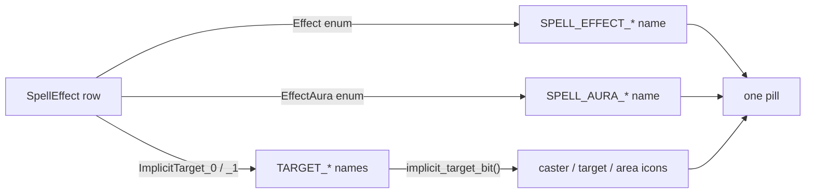

Until pack format 29 this column shipped **two flat per-spell sets** — "this spell has `APPLY_AURA` and
`TRIGGER_MISSILE` somewhere" and "it has
`PERIODIC_DAMAGE` somewhere" — with the effect index and the effect↔aura pairing discarded at build. Format 29 ships
**one row per distinct
`SpellEffect`** instead, so what an effect does and what it is aimed at stay attached to each other.

Why it matters: Lava Burst (51505) is `TRIGGER_MISSILE → UNIT_TARGET_ENEMY`
plus `ENERGIZE → UNIT_CASTER`. Flat, that is four unordered pills and nothing says the missile is the enemy-aimed half.
**28,705 of 276,168 spells (10.4%)
have both more than one kind of effect and more than one distinct target** — exactly the population a flat set cannot
describe.

Rows are deduped on `(spell, effect, aura, targetA, targetB)`, which collapses the per-`DifficultyID` copies
`SpellEffect` ships: 416,865 rows become 372,111 on 9.2.7. That dedupe is why the pairing is **nearly free**: the
section costs 1.21 MB gzipped against the 1.17 MB the two flat sets it replaces cost, so the whole 9.2.7 pack grew **+34
KB (+0.4%)** — 7,873,061 → 7,907,511 bytes. TWW grew +0.3%; Vanilla, whose spells rarely carry two targets, got 1.7%
*smaller*.

**What renders, and what only searches.** The pill shows the specific thing first and the carrier second —
`PERIODIC_DAMAGE | APPLY_AURA`, not the reverse — so the aura name leads and the near-universal `APPLY_AURA` reads as
the boilerplate it is. **Who it lands on is shown only as the existing caster/target/area icons** (user's call,
2026-07-23): the `TARGET_*` names are long, would dominate the pill and repeat down the column. They stay in the tooltip
and stay searchable, because the icons cannot tell
`UNIT_TARGET_ENEMY` from `UNIT_TARGET_ALLY`.

Two consequences of hiding the names:

- Pills that would render identically are merged, keeping every underlying row for the tooltip and the hit test.
  Soulstone (20707) has two `DUMMY` effects, one aimed at `CORPSE_TARGET_ALLY` and one at `UNIT_TARGET_ALLY` — both "on
  the target", so they are one pill whose tooltip names both.
- The **CSV/JSON export spells the targets out** (`PERIODIC_DAMAGE /
  APPLY_AURA -> TARGET_UNIT_CASTER`), one line per raw row: an export is read without tooltips or icons.

**`mech:` matches whole rows, not names.** `mech:"school_damage
unit_target_enemy"` means *one effect that is both* (7,826 spells on 9.2.7) — the whole reason for pairing. Matching
that literally would mean building a corpus string per row, so it is done on ids: each token resolves to the id sets
whose name contains it (~980 names to scan), then the flat row arrays are swept testing membership. That is ~10x faster
than walking the per-spell row objects (170 ms → 15–25 ms per query on 372k rows). A row's `0` means "no effect" / "no
aura" / "target unset" and never matches — without that guard `mech:none` would return every aura-less row, since
`SPELL_AURA_NONE` really is named `NONE`.

**The icon mask is not stored per row.** `implicitTargetBits` ships the
~130-entry map instead, and a row's mask is `bits[targetA] | bits[targetB]`. A fourth 372k-long parallel array measured
110 KB gzipped for data derivable from a 1 KB map.

### 3m. GameObject spawners — what the spell PLACES

`SpellEffect.Effect` ∈ `{50 TRANS_DOOR, 76 SUMMON_OBJECT_WILD, 104 SUMMON_OBJECT_SLOT1, 171
SUMMON_PERSONAL_GAMEOBJECT}` → `EffectMiscValue_0` is a **`gameobject_template` entry**. Renders in the **Effects
column** as an `object` pill — summon's sibling: one conjures a creature, this places an object.

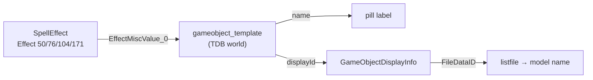

**The client `GameObjects.db2` is NOT this table.** It holds world-PLACED doodads keyed by their own id — measured 2026-
07-24 on 9.2.7: **0 of 1,429 spell-referenced entries appear in it**. The name and the displayId live only in the TDB
world dump, which is why this route resolves on the six TDB packs and degrades to id-only on the four TDB-less Classic
clients, exactly like morph/summon creature names.

The pill: `( [wh]|[3d] | {target}{name or model base} | ⧉ id | .lo | .gob )`. `.gob` (`.gobject spawn {entry}`) ALWAYS
works — the entry is the effect's own misc value, needing no resolution. **`.lo` always passes the MODEL file name**,
never the display name (user's call 2026-07-24). The label prefers the object's name and falls back to the model base.

**Entries no world dump carries are DROPPED** (user's call 2026-07-24, confirmed in game: they spawn nothing). They are
debug/TEST/cut content — 242 of 1,428 on 9.2.7, and the newest TDB (TWW, 77,908 entries) recognises only 10 of them, so
this is not a stale-snapshot problem. Same rule as keybound overrides. Cost: the route is empty on the four TDB-less
Classic packs, which could resolve nothing at all. 9.2.7 after the drop: 1,366 rows / 1,186 entries, all named, 1,180
model-resolved.

#### Which objects have a Wowhead page — it is the TYPE

`gameobject_template.type` (GAMEOBJECT_TYPE) decides it, NOT whether we resolved a name. Wowhead indexes only
**player-facing** objects; mechanical and invisible ones have no page, so linking every named object 404s about half the
time. `wowheadObjectTypes` in `config.ts` is the allowlist — **objects outside it fall back to the ordinary 3D model
viewer**, the same either/or the item route uses for a nameless item, so every pill still opens something.

Verified 2026-07-24 against wowhead.com/objects — whose own type labels (Container / Shared Container / Treasure /
Herb / Mining Node / Fishing Pool / Interactive / Quest / Tool) map onto exactly these — plus nine spot-checks, 9/9
agreeing:

|                | types                                               | evidence                                                                                      |
|----------------|-----------------------------------------------------|-----------------------------------------------------------------------------------------------|
| **has a page** | 3 CHEST, 10 GOOBER, 2 QUESTGIVER, 22 SPELLCASTER    | Rusty Chest, Cache of the Fire Lord, Pet Stone, Scrying Bowl, Portal to Stormwind             |
| **no page**    | 0 DOOR, 5 GENERIC, 6 TRAP, 8 SPELL_FOCUS, 18 RITUAL | Explosives Cart, Forgotten Mirror, Battle Standard, Witherbark Totem Bundle, Summoning Portal |

25 FISHINGHOLE and 51 GATHERINGNODE are Wowhead's Fishing Pool / Herb / Mining Node labels; no spell reaches one, but
they belong to the rule and are in the allowlist. On 9.2.7 that gates **564 of 1,186** objects to Wowhead and sends the
other 622 to the model viewer.

**Three dead hypotheses, do not retry.** (1) *A newer TDB knows the live ones* — no: all five first-tested entries,
including both misses, are in EVERY TDB; TrinityCore keeps deleted entries forever. (2) *Era* — no: Rusty Chest is
Vanilla and has a page, Summoning Portal is Vanilla and does not. (3) *Is it spawned in the world* — no, 3/5: Rusty
Chest and Cache of the Fire Lord have pages but no static `gameobject` spawn rows (TrinityCore spawns those by
script/pool), and gating on it would have killed the link for 1,129 of 1,186.

### 3n. Mounts — what the spell puts you ON

`Mount.db2` keyed by **`SourceSpellID`** (the mount-granting spell) → `MountXDisplay.CreatureDisplayInfoID` → the same
creature chain morphs use (`CreatureDisplayInfo.ModelID → CreatureModelData.FileDataID`). Renders in the **Models
column** as a display-id pill.

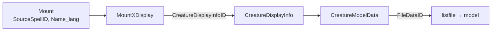

Pure client data — unlike morphs it needs **no TDB**, so name and model both resolve on every pack that ships
`Mount.db2`. 9.2.7: 1,043 links / 1,015 displays, **100% named and 100% model-resolved**. The pill is morph-shaped but
the display is what you RIDE, so the command is **`.mod` = `.modify mount {displayId}`** rather than `.morph`, alongside
the Wowhead model-viewer link, ⧉ display id and `.lo`. No target icons: a mount is always the caster's own.

**Sourced from `Mount.db2`, not the `MOUNTED` aura (78).** The aura route reaches 728 rows but carries no names; the
Mount.db2 route names all 1,015 and still covers the aura's spells (458 Brown Horse, 470 Black Stallion are
`SourceSpellID`s).

**Dead end, do not re-chase:** there is no per-mount rider seat/anim data. `MountSpecialRiderAnimKitID` is populated on
**3 of 1,012** mounts, and the MOUNTED aura maps into `Mount.db2` for only 11 of 509 displays. Real per-seat positions
exist only for vehicle-mounts, which §3i already covers.

### 3o. Animation replacement — which animation becomes which (`replace`)

One `replace` group in the Animations column, fed by **two sources that describe the same thing** — the character
swapping a base animation for another — unioned per spell and deduped:

- **proc Type 7** (`SpellProceduralEffect`, §3b): `Value_0/1/2` are what the character plays instead of **Stand / Walk /
  Run**. Reached through the visual graph. Paired with its base slot (AnimIDs 0 / 4 / 5) at read time, so it emits the
  same `(src, dst)` shape as the general form. `Value_3` is dropped (no base slot, near-always junk).
- **aura 312** `ANIM_REPLACEMENT_SET`: `EffectMiscValue_0` → an `AnimReplacementSet` id → **`AnimReplacement`**
  (`ParentAnimReplacementSetID`) → `(SrcAnimID, DstAnimID)` pairs — the general form, any animation.

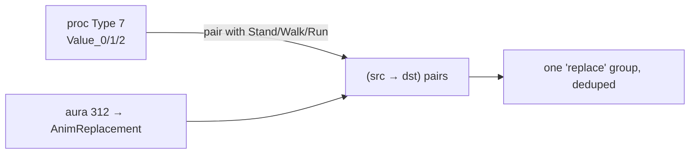

Both anim ids index into `animNames`, so a swap renders as two equally-weighted labels with an arrow — `Stand →
StealthStand` — and **both sides are searchable** (`anim:"replace stand"` finds swaps out of Stand, `anim:"replace
stealthstand"` finds swaps into it). `AnimReplacementSet.db2` itself is **not fetched** (only `ID` + `ExecOrder`).

**They were separate until 2026-07-24** (proc-7 as a `stance` group, aura 312 as `replace`); the user merged them
because they are the same mechanic — Stealth carried `Stand→StealthStand` from *both*, showing it twice. `stance` is
**not** kept as an alias (no-legacy-alias norm). 9.2.7: 3,158 (spell, src, dst) rows / 1,100 spells.

**Why it can look like it does nothing in game:** a replacement only shows while the character is performing the SOURCE
animation. Sea Legs swaps only swimming anims, Blowdart only bow-holding, Floating Death only flying/swimming — so
testing one while standing still shows nothing.

### 3p. PLAY_SOUND / PLAY_MUSIC — sounds with no visual behind them

`SpellEffect.Effect` 131 (`PLAY_SOUND`) and 132 (`PLAY_MUSIC`) → `EffectMiscValue_0` is a **SoundKit**, the same
`SoundKitEntry.SoundKitID` the missile and kit routes resolve (measured 9.2.7: 133/134 and 163/164 resolve). They fold
into the existing **Sounds column** with no new pill or section — the only sound route that starts at `SpellEffect`
rather than in the visual graph.

### 3q. Spell school — gathered, not yet surfaced

`SpellMisc.SchoolMask`, a bitmask (1 Physical / 2 Holy / 4 Fire / 8 Nature / 16 Frost / 32 Shadow / 64 Arcane; a spell
may span several). Base difficulty wins, read straight off wago with no hotfix overlay — school is static client data.
Shipped as `spells.schools` and **deliberately not displayed yet** (user's call): a future search axis. Present on every
build back to Vanilla. 9.2.7: 272,847 of 276,332 spells carry a nonzero school.

### 3r. Spell links — the one route whose payload is another spell

`SpellEffect.EffectTriggerSpell` names another `Spell::ID`. **Every other route in this document ends at a payload — a
model, a sound, a kit, a number. This one ends at another ROW of the results table**, which is what shapes the pill (a
spell icon and name, clicking to `id:<n>`) and what makes the reverse direction worth building.

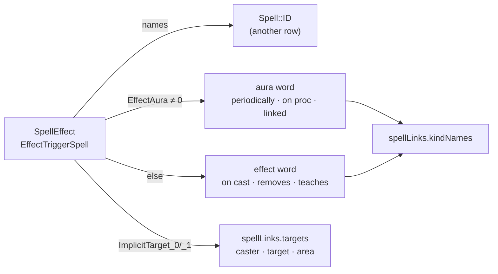

**The payoff number: 8,791 spells on 9.2.7 have no `SpellXSpellVisual` row of their own but trigger one that does.**
Those rows look empty in every other column and are not — the visual is one hop away, and before this route there was
nothing on screen saying so.

**HOW the two are joined is the effect, or on `APPLY_AURA` the aura, that owns the column** — an `APPLY_AURA` effect
says only "applies an aura", which all of them do, so the aura is what carries meaning. Two dispatch dicts, because the
two enums collide numerically: effect 3 is `DUMMY` while aura 3 is `PERIODIC_DAMAGE`, effect 42 is `JUMP_DEST` while
aura 42 is `PROC_TRIGGER_SPELL`.

**NOT EVERY EDGE IS A TRIGGER, and the word is the only thing that says so.** `REMOVE_AURA`/`REMOVE_AURA_2` name the
aura being *removed* — 8,250 edges, 14% of the graph — so calling the whole graph "triggers" would read backwards on one
edge in seven. Top words on 9.2.7:

| word             | edges  | | word              | edges |
|------------------|--------|-|-------------------|-------|
| periodically     | 11,741 | | linked summon     | 1,669 |
| on cast          | 10,472 | | on landing        | 1,181 |
| removes          | 8,250  | | teaches           | 1,161 |
| as a missile     | 7,486  | | linked            | 694   |
| forced on target | 7,036  | | on confirm        | 457   |
| on proc          | 4,531  | | periodic dummy    | 308   |
| by script        | 1,968  | | *(160 fallbacks)* | 1,317 |

An unlisted effect/aura falls back to **its own enum name, lowercased** — the same fallback an unknown id already gets
in the Mechanics column (§3l). That tail is 2.3% of edges over 160 auras that merely happen to carry the column, so its
word is honestly "the aura this came from" rather than a relationship. It **ships rather than being dropped** because
114 spells reach their one visual-bearing link *only* on such an edge.

**AN EXPLICIT WORD EARNS ITS PLACE ONE OF TWO WAYS, AND "it sounds right" IS NOT ONE OF THEM.** Either **(a)** the enum
names a trigger and the word says *when* it fires (`PROC_TRIGGER_SPELL` → "on proc", `TRIGGER_SPELL_ON_EXPIRE` → "when
it expires"), or **(b)** the enum names one relationship under several spellings and the word collapses them
(`REMOVE_AURA` + `REMOVE_AURA_2` → "removes", the seven jump/charge effects → "on landing"). Everything else takes the
fallback, which claims only where the edge came from.

**THE RULE WAS AUDITED TWICE AND THE SECOND PASS IS THE ONE THAT MATTERED** (2026-07-30). The first pass applied it only
to the entries it happened to look at, and left the biggest word in the feature untouched — `PERIODIC_TRIGGER_SPELL`
still read "every tick", **12,554 edges, 21% of the graph and the most-displayed word here**. "Tick" is community jargon
(TrinityCore's own `PeriodicTick`), but it is not what the enum says and it **names no interval**: periodic means *at an
interval*, and the interval is `EffectAuraPeriod` — set on **99.75%** of these rows, median **1 s**, ranging 0.05 s to 2
h. The word is now `periodically`, which claims exactly what the enum does.

The second pass also stopped **rewording single enums**, the subtler half of the same mistake: a lone enum has no
spellings to collapse, so a reword is just a second name for one thing and it always claims slightly more than the
original. What changed, with 9.2.7 edge counts:

| enum                                | was                  | now                      | why                                                                             |
|-------------------------------------|----------------------|--------------------------|---------------------------------------------------------------------------------|
| aura 23/227/48 `PERIODIC_TRIGGER_*` | every tick           | `periodically`           | the enum says *periodic*; "tick" names an interval it never gives (12,685)      |
| aura 226 `PERIODIC_DUMMY`           | by script            | *periodic dummy*         | being periodic is the fact that distinguishes it from `DUMMY` (342)             |
| aura 109 `ADD_TARGET_TRIGGER`       | on proc              | *add target trigger*     | asserted a proc the enum never mentions (15)                                    |
| aura 395 `AREA_TRIGGER`             | in its area          | *area trigger*           | asserted a firing condition (units inside) it never states (26)                 |
| auras 293/332/333/258 `OVERRIDE_*`  | overrides            | *(four fallbacks)*       | four different things — spells, two action-bar flavours, a summoned OBJECT (34) |
| aura 403 `OVERRIDE_SPELL_VISUAL`    | overrides its visual | *override spell visual*  | lone enum, nothing to collapse (1)                                              |
| effect 226 `TRIGGER_ACTION_SET`     | on cast              | *trigger action set*     | an action set is not a cast (6)                                                 |
| effect 133 `UNLEARN_SPECIALIZATION` | unlearns             | *unlearn specialization* | "unlearns" dropped the specialization (65)                                      |
| effect 179 `CREATE_AREATRIGGER`     | in its area          | *create areatrigger*     | same overclaim as aura 395; 182 already fell back (46)                          |
| aura 428 `LINKED_SUMMON`            | linked summon        | *linked summon*          | **identical** — the entry restated the fallback, so it was deleted (1,669)      |

Earlier under the same rule: aura 3 `PERIODIC_DAMAGE` (was "every tick"), effect 2 `SCHOOL_DAMAGE` (was "on damage"),
effect 182 `DESPAWN_AREATRIGGER` (shared 179's word while being its opposite), and
`TRIGGER_SPELL_ON_POWER_AMOUNT`/`_PCT` "on power" → `on power level`, which had read as "powered on".

**No edge was gained or lost — 58,486 both times**, and no SPELL changed bucket either: `mech:"triggers every tick"`
was 11,739 and `mech:"triggers periodically"` is **11,739**, because all three `PERIODIC_TRIGGER_*` auras already shared
the old word and simply share the new one. The retired spelling now returns **0**, per the standing no-legacy-alias
norm. Distinct words went **168 → 178** as the over-collapsed entries split apart, which is where the movement is: "by
script" 2,276 → 1,968 (`PERIODIC_DUMMY` left) and "on cast" 10,478 → 10,472 (`TRIGGER_ACTION_SET` left). **Counting
note, since it is easy to get wrong here: 11,741 is the EDGE count for `periodically` and 11,739 is the SPELL count — a
spell with two periodic links is one spell and two edges.**

**THE EXACT VERSION IS AVAILABLE AND IS NOT YET A DECISION.** `EffectAuraPeriod` would let the pill read "every 1s" /
"every 3s" instead of "periodically". It is not built because it costs a pack format bump and all ten packs re-shipped,
fragments one word into ~40, and puts **numbers in the mech corpus** — the substring-noise trap the spell id was
deliberately kept out of (§3r, above). Raise it before building it.

**Two rows are dropped at build time**, both because the chip is an icon and a name: a target this pack cannot name
(3,160 of 63,883 rows on 9.2.7 — the chip would be a bare id nobody can act on) and a self-link (51 rows — a chip
pointing at its own row).

**The pack ships ONE direction.** `spellLinks` is `{srcIds, dstIds, kinds, targets, kindNames}`, sorted by source so the
source column delta-encodes under gzip; the reverse is the same edges read backwards, so `data.ts` inverts the index at
load rather than the pack paying for it twice. A (source, target) pair joined two different ways stays two rows — two
distinct facts — which the renderer merges into one chip listing both words (252 of 58,214 pairs).

**`targets` (pack format 36) is the edge's own `ImplicitTarget_0/_1` mask** — set on 55,595 of 58,486 edges (95.1%) on
9.2.7 — so a link chip wears the same target icons, from the same bits, as every other effect-driven route in §3. **A
link DOES have an implicit target**: the edge *is* a `SpellEffect` row, so its implicit targets say who the effect
carrying the trigger is aimed at. It rides both directions unchanged, because who the triggering effect aims at is
equally who the triggered spell lands on.

Two search axes, one per direction: **`mech:triggers`** and **`mech:origin`**, each keyed by the LINKED spell's id with
a corpus of that spell's name and every word the two are joined by — so `mech:"triggers fireball"` and
`mech:"triggers periodically"` are one code path.

**The ID is searchable too, and NOT through that corpus**: `mech:"triggers 265714"` is 101 spells, matched by equality
against the id the chip stands for via the pill type's `bare` axis — the same mechanism invis/detect use for a channel
number. The distinction is the whole reason it can exist. A corpus is matched by SUBSTRING, so putting a 6-digit id in
one was measured out (`mech:"speed 70"` 76 → 85, `mech:"invis 13"` 11 → 47); equality costs the field nothing. Note a
spell that is neither end of an edge answers 0 — `mech:"triggers 133"` is empty because Fireball triggers nothing and is
triggered by nothing, which is correct rather than broken. Neither collides with the effect/aura names the Mechanics
column already matches, which are singular (`TRIGGER_SPELL`), so `mech:trigger` still finds the enum rows. `origin`
replaced `triggeredby` on 2026-07-30 (user: "not aesthetic") — every other category word in the app is one plain word.
**`mech:origin` is 47,031 against 47,024 link targets**, the 7 extra arriving through the *other*
direction's corpus on names like "Reorigination" — the documented "a category word matches names in addition to the
category" behaviour, and the exact mirror of `mech:triggers` being 49,216 against 49,209 sources.

**Mechanics, not fx** — fx is what a spell *looks* like, mech is what it *does*, and a link renders nothing in game. The
visible thing is on the other row, which is exactly why the chip has to get you there.

**Present on all ten builds** (Vanilla 7,256 edges / 17 words → TWW 83,566 / 196), so it is not in `OPTIONAL_COLUMNS`.
`EffectTriggerSpell` joins the TDB hotfix overlay for the wholesale-replace reason §1 gives: a hotfixed `spell_effect`
row omitting it would blank the edge. It is spelled the same on both sides, unlike the misc/target columns.

---

### 3s. Spell attribute flags — the route with no payload at all

`SpellMisc.Attributes_0..N`, 32 bits per column. **Every other route in this document resolves an id to a payload; this
one resolves to nothing but its own truth value** — the flag IS the content, which is why the pills are valueless (the
category word is the whole pill, like `fx:freeze`) and why the pack section is a bare list of spell ids per flag.

**Bit B lives in `Attributes_(B//32)` at `1<<(B%32)`.** The 449 names come from wowdev.wiki `EnumeratedString`
§`SpellMisc::Attributes` and are checked in as `build/enums/spell_attributes.json` — the single source of truth for both
`build_data.py` (which flags to ship) and `tools/builddb.py` (`ref.spell_attribute`).

**WHICH flags ship is a data edit, not a code change.** A `handler` tag on a bit in that JSON is what puts it in the
pack; adding one costs a tag plus one `attrFlag(...)` line in `src/pilltypes.ts`. Nothing in the reader, in `data.ts`,
in either render site or in the export branches on which flag it is.

**`requires` is an intersection, declared as data.** Bit 160 `AllowActionsDuringChannel` is AND-ed with bit 34
`IsChannelled` in the build, because the flag alone samples spells that are not channels at all — the reason it is done
in the build rather than in the UI is that a word which lies is worse than a word which is missing.

| flag                        | bit | word               | 9.2.7 spells | column                                  |
|-----------------------------|-----|--------------------|--------------|-----------------------------------------|
| `PreventsAnim`              | 50  | `anim:pose`        | 784          | Animations                              |
| `TrackTargetInChannel`      | 46  | `fx:tracking`      | 2,712        | **Effects** — it is the caster's FACING |
| `UnbreakableChannel`        | 358 | `mech:unbreakable` | 580          | Mechanics                               |
| `AllowActionsDuringChannel` | 160 | `mech:unhindered`  | 868 (∩ 34)   | Mechanics                               |
| `AuraIsDebuff`              | 26  | `mech:debuff`      | 17,193       | Mechanics                               |

**`TrackTargetInChannel` is the CASTER'S FACING, not the beam** (user's correction, tested): the caster stays turned
toward the target, locked in its direction, for the whole channel — the beam merely follows from that. It renders in
Effects rather than Mechanics because a character being turned is what the spell LOOKS like; 59% of them also carry a
chain, and the move cut the word's corpus noise from 175 to 8. Its unshipped sibling is bit 22
`TrackTargetInCastPlayerOnly`, the cast-time equivalent.

### 3s-bis. Delivery — the cast time and the channel, with VALUES (`spellDelivery`, format 39)

**A route of its own, and NOT A PARTITION.** It ships per-spell values rather than membership lists, and the three
searchable sets are derived from those values in `data.ts` — one source of truth, so a spell cannot sit in the
`casttime` set while its `castMs` says otherwise.

| set       | word             | rule                                               | 9.2.7   |
|-----------|------------------|----------------------------------------------------|---------|
| casttime  | `mech:casttime`  | `SpellCastTimes.Base > 0`                          | 48,873  |
| channeled | `mech:channeled` | `IsChannelled` (34) **or** `IsSelfChannelled` (38) | 14,228  |
| instant   | `mech:instant`   | **the complement** — in neither of the above       | 216,379 |
|           |                  | *of which, in BOTH casttime and channeled*         | *3,148* |

**THE TWO TIMED WORDS TAKE A NUMBER, IN SECONDS** — `mech:"casttime 2"`, `mech:"casttime >3"`, `mech:"channeled <=3"`.
They are not attribute-flag memberships like the rest of §3s: their pill types are keyed BY the time, so the registry's
ordinary numeric axis reads it (`of` → `deliverySecs`, the same rounding `render.ts` prints with). The overlap is
queryable on both numbers at once — `mech:"casttime >8" mech:"channeled >8"` is 4 spells on 9.2.7, which the format-38
partition could not have asked at all. Full grammar and populations below, under *The two timed words take a value*.

**⚠ `casttime` AND `channeled` OVERLAP ON 3,148 SPELLS AND THAT IS THE POINT.** They cast and *then* channel. The
format-38 version of this route made delivery a strict three-way partition with "channel wins", which threw the cast
number away for every one of those spells. **Verified in game 2026-08-05** (docs/DECISIONS.md, *"Cast-then-channel is
REAL"*): `Gripping Shadows` 249466 — 12 s cast, 6 s channel — shows a cast bar and then a second draining bar, while the
same spell NAME with the cast time removed (186350) shows no fill-up phase. **Do not restore the partition, and do not
expect the three counts to sum to the pack.**

**Coverage is now total: 276,332 of 276,332.** Because `instant` is the complement rather than a third list, the 1,846
spells with **no `SpellMisc` row at all** finally get an answer instead of falling out of every delivery query.

#### The pack section

`spellDelivery` — parallel arrays over **only** the spells that have a cast time or a channel (59,953 on 9.2.7):

| field      | meaning                                                                              |
|------------|--------------------------------------------------------------------------------------|
| `spellIds` | the spell                                                                            |
| `castMs`   | cast-bar length; **0 = no cast bar**                                                 |
| `durMs`    | channel length; **-1 = no limit**, **0 = no duration row**. Only read with bit 0 set |
| `flags`    | bit 0 `DELIVERY_CHANNELLED`, bit 1 `DELIVERY_BREAKS_ON_MOVE`                         |

**`durMs` 0 and -1 are DIFFERENT and are not folded.** 674 spells on 9.2.7 are flagged as channels but ship no duration
row; one was tested in game and did nothing at all, which is not what an unlimited channel looks like — but that result
was inconclusive (the sheet could not tell "nothing to display" from "did not cast"). See DECISIONS.md before merging
them.

#### Sources

- **`SpellCastTimes`** (`SpellMisc.CastingTimeIndex` → `Base` ms), on every build back to Vanilla. Three edge cases, all
  swept 2026-08-05:
    - **`Base = 0`** — one shared row (ID 1) behind 225,465 spells. Instant.
    - **An unresolved index** — the table starts at ID 1, so `CastingTimeIndex = 0` resolves to nothing. 97 spells.
      Instant, same as above.
    - **`Base = -1000000`** — the **ranged weapon speed sentinel**, not a duration. One row (ID 18) behind 51 spells,
      every one a hunter ranged shot. **Wowhead prints no cast-time line at all for these** (checked on 1516 and 22914:
      only `Requires Ranged Weapon`), **but Epsilon fires them with no cast bar, so here they are `Instant`** — the
      wording is Epsilon's, not retail's. Because all 51 share ONE table row, one in-game test settles all of them.
    - **`SpellCastTimes.Minimum` is deliberately IGNORED**: it is the haste floor (164 of 212 rows equal `Base`, 44 are
      0), and `Base` is the nominal number to show.
- **`SpellDuration`** (`SpellMisc.DurationIndex` → `Duration` ms), 314 rows. `Duration < 0` or `> 1e8` = no limit.
- **`SpellInterrupts.ChannelInterruptFlags`** → breaks-on-move, **6,689** spells. **MIND THE ENUM:** that column uses
  `SpellInterruptFlags` where movement is **bit 3**, while the sibling `InterruptFlags` (cast) uses a *different* enum
  where movement is bit 0 — see `build/enums/README.md`. And mind the intersection: **7,375 spells carry the channel
  movement bit but 686 of them are not channels at all**, so the build ANDs it with the channelled flag, the same
  correction `AllowActionsDuringChannel` already needed.

#### The words are Wowhead's

On the user's call (*"Match the wowhead convention"*):

- **`casttime`, not `cast`.** Wowhead's own spell-page row label is literally `Cast time`, so the axis already matched.
  A bare `cast` measures **216,457** — `on cast` is a spell-link word carried by the whole mech corpus, so the word is
  unusable. (This was recorded as 200,496 before format 38; the word `casttime`, which `cast` substring-matches, is the
  difference.)
- **`channeled` with ONE `l`.** Wowhead, the client and Blizzard all spell it that way. The British `channelled`
  shipped for one day at format 38 and made **`mech:channeled` return 4 spells against 14,228** — i.e. it failed exactly
  the roleplayer who read the word on Wowhead and typed it here. No legacy alias: `mech:channelled` is now 0.
- **The line's own wording follows Wowhead's tooltip** (`Instant`, `1.8 sec cast`) **but never its slot order.** Wowhead
  writes `Channeled (5 sec cast)`, label first; ours is always `<value> <label>`, so it is `5 sec channel`. See PILLS.md
  for why the delivery line is not a pill at all.

#### The two timed words take a value (2026-08-05)

**`casttime` and `channeled` are numeric words, in SECONDS** — the unit Wowhead, the client and the person typing all
use. The argument grammar is the one every other numeric word already has, so there is nothing new to learn:

| query                                      | means                               | 9.2.7  |
|--------------------------------------------|-------------------------------------|--------|
| `mech:"casttime 2"` = `mech:"casttime =2"` | exactly a two-second cast bar       | 15,187 |
| `mech:"casttime >3"`                       | casts longer than three seconds     | 5,216  |
| `mech:"casttime 1.75"`                     | fractions work; 125 distinct values | 65     |
| `mech:"channeled 5"`                       | a five-second channel               | 1,232  |
| `mech:"channeled <=3"`                     | short channels                      | 1,750  |
| `mech:"channeled >=0"`                     | **every channel that HAS a length** | 8,324  |

**THE NUMBER SEARCHED IS THE NUMBER PRINTED.** `data.ts` exports `deliverySecs(ms)` and both the delivery line and the
numeric axis go through it, so a row showing `1.75 sec cast` is reachable by `mech:"casttime 1.75"` and there is no
second rounding rule to drift.

**A CHANNEL WITH NO NUMBER ANSWERS NO NUMERIC QUESTION.** `durMs` -1 (unlimited, 5,230) and 0 (no duration row, 674) are
real keys in the map — `mech:channeled` still returns all 14,228 — but the axis reads **`NaN`** for them, and every
comparison rejects NaN. That is why `mech:"channeled <99999"` is 8,324 and not 14,228: the line prints `unlimited
channel` with no seconds in it, so no question *about* seconds should sweep it in. **Selecting those two groups wants a
WORD, not a bound** — and one of them now has it.

**✅ `unlimited` IS THAT WORD, shipped 2026-08-05.** The channel type gained a **corpus** (`channelSearchL`, keyed by
`durMs` exactly as the spell map is), holding `channeled unlimited` on the -1 bucket and a bare `channeled` everywhere
else. So the phrase falls out of the axis the app already has, with no new pill type and no new pack section:

| query                        | means                                      | 9.2.7     |
|------------------------------|--------------------------------------------|-----------|
| `mech:"channeled unlimited"` | the bound phrase — **exactly the members** | **5,230** |
| `mech:unlimited`             | the shorthand, +1 corpus collision         | 5,231     |

**Measured against the alternatives before registering**, per PILLS.md *Choosing the keyword*: 1 collision for
`unlimited`, against 96 for `endless` and 13 for `permanent`. It is also the word the line already prints, so the thing
on screen is the thing you type.

**THE 674 WITH NO DURATION ROW DELIBERATELY GET NO WORD.** They keep a bare `channeled`. What they do in game is still
open (one test showed no bar at all, which is not what unlimited looks like, and the question was inconclusive — see
DECISIONS.md), and naming a group implies knowing what it is. **NUMBERS STAY OUT of the corpus**: a substring `5` would
match 15, 25 and 50, which is measurably what happened to `speed` (76 → 85). The corpus carries only what has no number.

**`operatorOnly`, like `speed` and `scale`.** The `mech:` field is shared with ~980 effect/aura/target names, so a
number standing loose in a chip keeps the literal meaning it always had: `mech:1.5` is 6 spells (a substring), not the
10,241 with a 1.5 s cast. Only a comparison — or a number written against the word — asks about time.

**COUNT SPELLS, NOT `SpellMisc` ROWS.** A spell with several difficulty rows is one spell, and the two readings differ
by up to 15% — the same five flags are 799 / 2,748 / 591 / 3,400 / 19,812 counted as rows. Base difficulty wins, the
same rule `read_spell_icons` and `read_spell_schools` use.

**Present on all ten builds, and the bit numbering is stable across them** — counting each flag per build gives a clean
monotonic rise (`PreventsAnim`: Vanilla 127 → TWW 967), which is what consistent numbering looks like. Builds ship
between **14 and 17** `Attributes_N` columns, so the columns come from `array_columns` and a bit beyond a build's array
simply reads as unset: the flag switches off for that version rather than erroring. No `OPTIONAL_COLUMNS` entry needed.

**THE WORDING IS EPSILON'S, NOT RETAIL'S.** Roughly half the flags tested did not survive contact with Epsilon, so only
flags the user confirmed in game ship at all, and the phrasing describes what they saw — `UnbreakableChannel` must not
say "locks you in place", because the caster can move and act while it holds. See docs/DECISIONS.md *"EPSILON
BEHAVIOUR"*.

---

## 4. The pack

The build bakes everything into one gzipped, **column-oriented** JSON per game version: a section like
`{spellIds, fids}` is parallel arrays where row *i*
links `spellIds[i]` to `fids[i]`. That gzips far better than a list of objects.

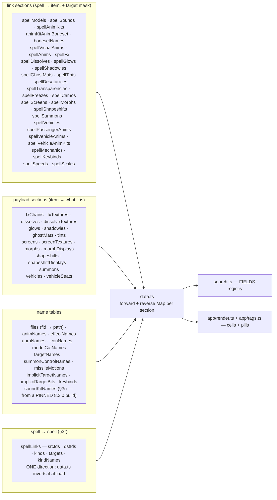

Sections carrying a parallel `targets` array (the target-icon feature):
`spellModels`, `spellSounds`, `spellAnimKits`, `spellVisualAnims`, `spellFx`,
`spellDissolves`, `spellGlows`, `spellShadowies`, `spellGhostMats` (these from
`SpellVisualEvent.TargetType`, §2), plus — from `SpellEffect.ImplicitTarget`
(§3f, pack format 25) — `spellMorphs`, `spellSummons`, `spellVehicles`,
`spellShapeshifts`, `spellScreens`, `spellSpeeds`, `spellScales`. Both feed the same `maskIndex` in `data.ts`
and the same icon renderer, so the two mask sources are indistinguishable downstream.

`data.ts` builds a **forward and a reverse index** for each — spell→items for rendering, item→spells for searching.
Every section read is guarded (`if (pack.X)`) so an older-format pack degrades rather than crashes.

### 3t. The area gate — WHERE a spell may be cast (`spellAreas` + `areas`, format 40)

**SHIPPED AND LIVE (2026-08-05).** All ten packs carry both sections, `data.ts` reads them, and the Mechanics column
draws the group described below. Searchable as `mech:location` / `mech:"location <name>"`.

**The first route that is a RESTRICTION rather than content.** Every other route in this file answers *what does this
spell do*; this one answers *where will it refuse to cast*. That difference is why it is drawn as a group whose head
reads **`only in`** — see docs/PILLS.md.

**Why this gate and not the other thirteen: it is one of only two Epsilon actually enforces on `.cast`.** Seven gate
families were tested in game on 2026-08-05 and the rule that explains all seven is *a gate binds on `.cast` exactly when
its check has no bypass guard*. Area (`CheckCast:6050` → `CheckLocation`) and spell focus (`CheckCast:6068`) are
unguarded; reagents, equipped items, caster auras, shapeshift and `OnlyOutdoors` each sit behind a `TRIGGERED_IGNORE_*`
flag or a config guard and do not bind. Full evidence in docs/DECISIONS.md.

**The route is two flat hops and needs no decoder:**

```
SpellCastingRequirements.RequiredAreasID
  -> AreaGroupMember.AreaID          (a group is 1..N areas)
    -> AreaTable.AreaName_lang       (the name)
       AreaTable.ParentAreaID        (walked to the root, for the two LINKS only)
       UiMapAssignment -> UiMap      (Type 3 + name match -> a map id, or none)
```

Measured on 9.2.7: **12,375 spells**, **39,807 (spell, area) rows**, **3,147 distinct areas**, **0 unnamed**. **65.2%
are gated to exactly one area**, which is why most pills collapse to a single word. 6 spells name an area group with no
live area and are dropped.

#### THE PARENT ZONE IS NOT THE ANSWER — do not "improve" this into a rollup

`AreaTable.ParentAreaID` makes it trivial to collapse a multi-area group to one pretty name: *Masquerade*'s 32 areas
become the single word **Suramar**, and 86% of all gated spells reduce to one name. **It is wrong.** Of the 3,864 groups
that roll up to a single parent, **only 55 contain every child of that parent — 3,809 (98.6%) cover only PART of the
zone.** "Only in Suramar" would be false on almost every pill it was printed on. The area's OWN name ships; the root is
used for the two links and nothing else, where naming the containing zone is correct.

#### The pack sections

`spellAreas` — one row per (spell, area) pair, so a spell gated to four areas ships four rows and the group renders four
items. There is deliberately no "primary" area.

| field      | meaning                 |
|------------|-------------------------|
| `spellIds` | the spell               |
| `areaIds`  | one area it is gated to |

`areas` — the deduped area table the rows point at:

| field    | meaning                                                                                  |
|----------|------------------------------------------------------------------------------------------|
| `ids`    | `AreaTable.ID`                                                                           |
| `names`  | the area's own name — **never its parent's**                                             |
| `roots`  | top-level ancestor, for `wowhead.com/zone=<root>`                                        |
| `mapIds` | `UiMapID` for `/run OpenWorldMap(<id>)`, **0 = no usable map** (2,468 of 3,147 have one) |

**Wowhead only has pages for ROOT areas**, which is why `roots` exists: `zone=7964` (the subzone The Drift) is a 404,
while its root `zone=7637` (Suramar) resolves. Verified by hand on three ids.

**The map lookup is deliberately strict and the pill drops the segment rather than guessing.** Only `UiMap.Type = 3`
(Zone) maps whose name equals the area's are accepted — an area also resolves to Type 2 continent maps and to a
*neighbouring* zone's map (Zereth Mortis reaches one called "Resonant Peaks"), and opening the wrong map is worse than
offering no button.

#### Sources

- **`SpellCastingRequirements`**, **`AreaGroupMember`**, **`AreaTable`** — in `TABLES`, present on all ten builds.
- **`UiMap`**, **`UiMapAssignment`** — in **both** `TABLES` and `OPTIONAL_TABLES`, and it must be both: `TABLES` is what
  gets DOWNLOADED and `OPTIONAL_TABLES` only permits a 404. They were declared optional alone at first, so nothing ever
  fetched them and the map button worked on 9.2.7 only — because an exploration run had left those CSVs in its cache.
  Now asserted at module level in `build_data.py`. **Measured on all ten (2026-08-05): present everywhere except Legion
  7.3.5, which 404s both** — `UiMap` replaced `WorldMapArea` in BfA 8.0, so Legion predates it and correctly ships
  `mapIds` 0 with no map button. The five Classic re-releases DO have it, being modern clients serving old content.

| pack   | 1.15.8 | 2.5.6 | 3.4.3 | 4.4.2 | 5.5.4 | 7.3.5 | 8.3.7 | 9.2.7  | 10.2.7 | 11.2.7 |
|--------|--------|-------|-------|-------|-------|-------|-------|--------|--------|--------|
| gated  | 220    | 203   | 566   | 1,914 | 3,244 | 5,813 | 7,914 | 12,375 | 14,074 | 15,561 |
| areas  | 163    | 181   | 364   | 803   | 1,158 | 2,091 | 2,769 | 3,147  | 3,576  | 4,519  |
| w/ map | 114    | 152   | 292   | 689   | 960   | **0** | 2,163 | 2,468  | 2,819  | 3,666  |

- **Deliberately unused columns of `SpellCastingRequirements`:** `RequiresSpellFocus` also binds on `.cast` but needs
  `SpellFocusObject` to be legible; `RequiredAuraVision`, `MinFactionID` and `MinReputation` have **zero references** in
  TrinityCore's spell code, so they gate nothing; `FacingCasterFlags` is evaluated in `Spell::CheckRange`, a positional
  check, not a property of the spell.

---

### 3u. Sound-kit names — the one CROSS-VERSION source (`soundKitNames`, format 41)

**SHIPPED (2026-08-06).** All ten packs carry the section, `data.ts` reads it, and the Sounds column draws the name as
the SoundKit pill's **label**, moving the id into its own compact copy button (PILLS.md). An unnamed kit keeps the id as
its label. Searchable through the existing `sound:` prefix.

**THIS IS THE ONLY ROUTE THAT READS A TABLE FROM A BUILD OTHER THAN THE ONE BEING PACKED, and it has to be.**
`SoundKitName` shipped 7.3.0 → **8.3.0** and in the Classic re-releases, and **no 9.x, 10.x, 11.x or 12.x build has it
at any level** — so a modern pack cannot name its own kits. `build_data.SOUNDKITNAME_BUILD` pins **8.3.0.32218**, the
last build that contains the file.

```
SoundKitName.ID   == SoundKit.ID     (from the pinned 8.3.0 build)
SoundKitName.Name -> the pill's note segment + the sound: corpus
```

**Why joining an old table is sound, and the measurement that proves it:** kit ids are stable across builds. Of the
84,317 kits present in both 7.3.5 and 9.2.7, **84,026 (99.65%) play a byte-identical `SoundKitEntry` file set** and only
185 (0.22%) share no file at all — and those are re-recorded assets, not recycled ids.

**Coverage is partial BY CONSTRUCTION and that is not a defect.** Kits added after 8.3.0 have no name in any build, so
they are absent rather than invented — the pill then renders exactly as it did before format 41.

| on 9.2.7                               | value                                                  |
|----------------------------------------|--------------------------------------------------------|
| distinct sound kits the app reaches    | 42,860                                                 |
| **named by the pinned 8.3.0 table**    | **27,600 (64.4%)**                                     |
| of all 686,330 sound rows              | 75.8%                                                  |
| **spells with at least one named kit** | **104,511 — 87.9% of the 118,939 that have any sound** |

**8.3.0 STRICTLY CONTAINS every other candidate**, so there is nothing to union it with: Legion 7.3.5 names 15,542 of
the same kits, Wrath 3.4.3 is a subset of Legion, and `Epsilon_Merchant/SoundList.lua` stops at id 140,607 and is 99.69%
string-identical to 8.3.0. `SoundKitChild` parent inheritance buys **one** kit. Full record, including the three wrong
turns and why Wowhead cannot be used, is in docs/DECISIONS.md → *"Sound kit names — BfA 8.3.0 is the source"*.

**RE-VERIFIED EXHAUSTIVELY 2026-08-06 — the search for a better source is CLOSED, do not re-run it.** Probed at the CASC
level (`api/casc/1665033?version=…`, the check that actually settles it, since a wago CSV 404 can mean "no dbd layout"
rather than "no file"):

- **`8.3.0.32218` is the last build in existence with the file**, and the cutoff is exact — `8.3.0.32272`, the very next
  PTR build, is already 0 bytes. Every later retail build through **12.0.7** is 0.
- **No Shadowlands alpha or beta ever had it.** All fourteen earliest `9.0.1.x` beta builds are 0 — so the table died
  mid-8.3, not at the expansion boundary.
- **The Classic re-release lines do ship it** — newest per line: Wrath **3.4.3.58936** (401 KB), Cata **4.4.0.57244**
  (668 KB), Era **1.15.2.55140**. Their ids reach **275,167**, far past 8.3.0's ceiling of 145,145, which looks like new
  coverage and **is not**: measured against the kits 9.2.7 actually reaches, all four Classic sources together add
  **ZERO** names 8.3.0 does not already have. The union is exactly 27,600.
- **There is no second name table.** `soundkitname.db2` (fid 1665033) is the only matching path in the listfile, and
  `soundkit_internal.db2` — the one promising-looking sibling — is a listfile-known path that CASC never serves.

**The section is purely additive** — verified at format 41 by diffing the rebuilt 9.2.7 pack against its predecessor:
**75 of 75 pre-existing sections byte-identical**, one section added, none removed, +3.5% gzipped.

---

### 3v. Which expansion added a spell — the route with NO client column (`spells.eras` + `expansions`, format 42)

**No table in any build records this.** `ItemSearchName.ExpansionID` exists but is items; `PlayerCondition`'s
`Min/MaxExpansionLevel` are a gate, not provenance. So the answer is **derived by diffing client spell tables** —
walk the expansions oldest-first, and the first one whose `Spell` table holds an ID is the one that introduced it.

**The ladder is declared in `tools/expansions.py`, not here and not in the build.** One `Expansion(...)` row per rung
carries everything that can differ: its ID sources, the words `xpac:` accepts, the Wowhead site for that era and any
caveat. `build_data.py` only *reads* the committed result — **adding an expansion touches no frontend file and no
build code.**

| source kind  | what it is                                        | used for                       |
|--------------|---------------------------------------------------|--------------------------------|
| `Archive(…)` | a build in the wow.tools DBC mirror               | Vanilla…MoP (original clients) |
| `Pack(…)`    | a version Epsilook already ships                  | Legion…TWW                     |
| `Vendored(…)`| a client table committed under `build/sources/`   | **Warlords only**              |

**⛔ THE CLASSIC RE-RELEASES CANNOT DATE A SPELL, AND USING THEM WAS THE FIRST DESIGN.** They are modern rebuilds:
Classic Era 1.15.8 holds **16,124 spells the real 1.12.1 client never had** (Jaccard **0.466**) — Season of Discovery
content, `[DNT]` test spells, anniversary rewards — which alone mis-credited **3,438** spells of the 9.2.7 pack to
Vanilla. WotLK Classic is far more faithful (**750** additions, Jaccard **0.962**) but still adds store mounts and
MoP-era items. So each pre-Legion rung takes the **original era client** as its `origin`, and the matching re-release
rides along as a `parallel` source — measured by `--report`, never able to move a spell.

**⚠ WARLORDS IS THE ONE RUNG NO PUBLIC ARCHIVE COVERS.** Every 6.x build on the mirror is Beta or PTR (it carries no
`Retail` label before 8.x at all), and the bulk dumps holding the 6.x build configs are switched off, so the CASC route
is closed too. The retail 6.2.4 table is therefore **committed** — `build/sources/wod-6.2.4-spell.7z`, 2.1 MB, the one
table the ladder reads out of a 517-file pack. It was validated against the mirror's 6.2.4 PTR build and is that build
**minus exactly one record**: `205651 Test Banner`, a test spell cut before launch that returns in Legion — the
signature of a real retail client, and the measurement that bounds the whole PTR-vs-retail question at **one row**.

**⛔ AND THE SPELL ID IS NOT A SUBSTITUTE — measured, not assumed.** Best-fit ID cut points disagree with the ladder on
**19,154 of 276,332 spells (6.93%)**; Cata alone is 18.1% wrong. The bands genuinely overlap (Wrath p99 = 75,209 vs
Cata p01 = 63,940). For the WoD/Legion split specifically, the best cut ANY threshold can achieve is **95.49%** —
~4,500 spells permanently misfiled — which is why the vendored client replaced it outright.

**Wowhead is not a source either.** Every `"patch":` field on a spell page belongs to a *guide article*; the occasional
"Added in patch 4.0.3" is prose in a comment. They derive it by diffing every build — the same method, more builds.

**Shipped shape.** `spells.eras` is one index per spell, parallel to `spells.ids`, into the `expansions` section
(`keys`/`labels`/`shorts`/`majors`/`aliases`/`wowhead`/`caveats`). **-1 = no rung claims it.** `majors` is the game
major version, and it is there so the app can index `CFG.expansionLogos` — the row draws the expansion's own glue-art
logo, decoded by the same in-browser BLP decoder the version panel uses, rather than a second list of file ids. `meta.counts` carries one
`expansion.<key>` per rung plus `expansion.unknown`, and unlike the delivery counts **these DO partition the pack**.

**9.2.7 (the product), read from the pack:** Vanilla 5,823 · TBC 14,581 · WotLK 16,599 · Cata 23,745 · MoP 15,304 ·
**WoD 42,600** · Legion 57,224 · BfA 51,157 · Shadowlands 49,299 · unknown **0**. The retail packs (7.3.5+) date every
spell. **The Classic packs are the only ones with `unknown`** — 11,563 on Classic Era, 2,057 MoP Classic, 997 Cata
Classic, 714 WotLK Classic, 309 TBC Classic — and that is correct: those spells reached no retail client, so no
expansion introduced them. They render no tag rather than a wrong one.

**⚠ IT DATES THE ID, NOT TODAY'S SPELL.** A removed-then-readded ID reports its FIRST appearance: `1645 Worgen Form` is
in 1.12.1, gone by 2.4.3 and back later, so it reads Vanilla while Wowhead's prose calls it 4.0.3 for the current spell
reusing that id. Say "first appeared", never "was designed in".

---

## 5. Version differences

Ten builds ship, spanning 2004-era content to current retail. Going *backwards*
is a different problem from going forwards: forwards is additive, backwards is mostly "the table does not exist yet."
The five Classic re-release clients (Vanilla / TBC / WotLK / Cataclysm / MoP) complicate that — see below.

### The ten packs

| Build        | Label                     |  Spells |    Pack | TDB release   | Absent tables |
|--------------|---------------------------|--------:|--------:|---------------|--------------:|
| 1.15.8.67156 | Vanilla Classic           |  31,248 |  0.7 MB | —             |             7 |
| 2.5.6.68775  | TBC Classic               |  28,650 |  0.7 MB | —             |            14 |
| 3.4.3.58936  | WotLK Classic             |  49,394 |  1.3 MB | TDB335.25101  |            11 |
| 4.4.2.60895  | Cataclysm Classic         |  71,227 |  1.9 MB | —             |            11 |
| 5.5.4.68716  | Mists of Pandaria Classic |  98,129 |  2.6 MB | —             |             6 |
| 7.3.5.26972  | Legion                    | 179,382 |  5.0 MB | TDB735.00     |             4 |
| 8.3.7.35662  | Battle for Azeroth        | 227,237 |  6.5 MB | TDB837.20101  |             1 |
| 9.2.7.45745  | Shadowlands *(default)*   | 276,332 |  7.9 MB | TDB927.22111  |             0 |
| 10.2.7.55664 | Dragonflight              | 327,092 |  9.5 MB | TDB1027.24051 |             0 |
| 11.2.7.65299 | The War Within            | 375,895 | 11.1 MB | TDB1127.26011 |             0 |

**All ten are at pack format 40** (the area gate, §3t — on top of format 39's delivery route with values, §3s-bis,
format 38's attribute flags and first delivery partition, §3s, format 36's target masks on spell links, §3r, format 35's
spell-link route, and format 34's missile flight paths).

**Format 40 added no spells** — it only says where existing ones may be cast — so every count in this section carries
over from format 39 unchanged.

**Format 39's per-version drift, read from the packs rather than estimated** (`meta.counts["delivery.*"]`):

| pack                | `mech:instant` | `mech:casttime` | `mech:channeled` | both cast+channel | breaks on move |
|---------------------|---------------:|----------------:|-----------------:|------------------:|---------------:|
| Vanilla 1.15.8      |         23,523 |           7,273 |              518 |                66 |            382 |
| TBC 2.5.6           |         21,059 |           6,723 |              972 |               104 |            654 |
| WotLK 3.4.3         |         36,575 |          11,097 |            1,921 |               199 |          1,178 |
| Cataclysm 4.4.2     |         54,256 |          14,206 |            3,107 |               342 |          1,668 |
| MoP 5.5.4           |         75,518 |          18,735 |            4,563 |               687 |          2,400 |
| Legion 7.3.5        |        139,413 |          32,788 |            9,045 |             1,864 |          4,416 |
| BfA 8.3.7           |        176,732 |          41,328 |           11,688 |             2,511 |          5,626 |
| Shadowlands 9.2.7   |        216,379 |          48,873 |           14,228 |             3,148 |          6,689 |
| Dragonflight 10.2.7 |        256,848 |          57,426 |           16,589 |             3,771 |          7,811 |
| TWW 11.2.7          |        295,024 |          66,672 |           18,646 |             4,447 |          8,753 |

**`instant` + `casttime` + `channeled` DOES NOT SUM TO THE PACK, and must not be made to.** The middle two overlap by
the "both" column; `instant` is the complement of their union. Per pack: `instant + (casttime + channeled - both)` = the
full spell count, exactly.

**No build lost the route** — `SpellCastTimes`, `SpellDuration` and `SpellInterrupts` are present on all ten, so there
is no `OPTIONAL_TABLES` degradation to document here. **The cast+channel overlap exists as far back as Vanilla** (66
spells), so it is not a modern-retail artifact and never was a safe simplification.

**Format 37's per-version drift** (`meta.counts["spellAttrs.<handler>"]`):

**Format 37's per-version drift, read from the packs rather than estimated** (`meta.counts["spellAttrs.<handler>"]`):

| pack                | `anim:pose` | `fx:tracking` | `mech:unbreakable` | `mech:unhindered` | `mech:debuff` |
|---------------------|------------:|--------------:|-------------------:|------------------:|--------------:|
| Vanilla 1.15.8      |         127 |           193 |             **15** |                13 |           901 |
| TBC 2.5.6           |         153 |           294 |              **0** |                50 |           700 |
| WotLK 3.4.3         |         233 |           611 |              **0** |               133 |         1,330 |
| Cataclysm 4.4.2     |         254 |           884 |              **0** |               299 |         1,870 |
| MoP 5.5.4           |         361 |         1,185 |                 66 |               429 |         3,109 |
| Legion 7.3.5        |         559 |         1,874 |                318 |               611 |         8,814 |
| BfA 8.3.7           |         680 |         2,264 |                411 |               728 |        12,481 |
| Shadowlands 9.2.7   |         784 |         2,712 |                580 |               868 |        17,193 |
| Dragonflight 10.2.7 |         891 |         3,228 |                650 |               940 |        20,632 |
| TWW 11.2.7          |         967 |         3,711 |                861 |             1,074 |        24,710 |

**The three zeroes are real data, not drift** — `Attributes_11` exists on those builds, no spell sets bit 358. The word
is simply not offered there, through the pill type's `when` gate, which is the same mechanism an absent table uses. The
monotonic rise everywhere else is the evidence that **bit numbering is stable across builds**; that is how it was
checked, rather than by hunting per-build enum definitions.

The formats below are the older history, kept for what a stale pack still reads as:

**Format 33** (animkit bonesets — the body region each anim animates, §3e — plus effect attachment points for
Shadowy/Dissolve/Barrage, §3h — on top of format 32's five data-mined routes, format 31's object-scale modifiers,
§3k-bis, format 30's movement-speed modifiers, §3k, and format 29's mechanics paired with their implicit targets, §3l,
and the keybound-override route, §3j). The four pre-MoP packs each gained one absent table,
`SpellKeyboundOverride`; nothing else drifted (the boneset tables are build-present everywhere, and the three effect
attach columns are `OPTIONAL_COLUMNS`, so their absence on some Classic clients degrades to "full body" rather than
drifting). Recent bumps are additive and version-agnostic: format 26 added the invis/detect channel pills
(`MOD_INVISIBILITY[_DETECT]`
auras), format 27 the `display` model category, format 28 the `item` category, format 29 replaced the flat
`spellEffects`/`spellAuras` sets with `spellMechanics` and added
`implicitTargetNames`/`implicitTargetBits` + `spellKeybinds`/`keybinds`. A format-28 pack is still read: its two flat
sets load as target-less mechanic rows, so the column renders without target segments or icons rather than breaking.
Format 26–28 all carry back to Vanilla (SpellVisualEffectName.Type is present on every shipped build — no absent-table
or optional-column drift; the five item tables also ship on every build, so the route degrades by *content*, not by a
missing table). Earlier format costs still hold: format 22 target masks ~+11% size, format 23 vehicles essentially free,
format 24 attachment points ~+18% model rows, format 25 one
`targets` array per effect-fx link section. Format 28 renamed `spellModels`'s
`displayIds` array to `refIds` (it now carries an Item::ID on item rows too) and added the `items`/`itemIconNames`/
`itemQualityNames` sections; a format-27 pack is still read (its `displayIds` array is accepted as `refIds`). Splitting
the equipped-weapon marker per slot (§3c) needed **no** bump — it only changes which sentinel fids appear in the
existing `files`/`spellModels` sections, and the frontend reads any negative fid as fileless rather than naming one.
**Format 29 is close to free**: pairing replaced two flat sections with one (9.2.7 +0.4%, TWW +0.3%, Vanilla −1.7%), and
the keybind sections are ~1 KB. **Format 30 is nearly free too** — one link section of 5.7k rows on 9.2.7, under 0.1 MB
gzipped, and no pack changed size band. **Format 31 (scale)** is smaller still — 3.2k rows on 9.2.7, one section — and
dropping the zero-percent speed/scale rows in the same build shaves a little back; no pack changed size band.

**Format 35 (spell links, §3r) is the most expensive additive bump so far: +3.43% over all ten packs** (48.69 → 50.37 MB
gzipped; per pack +2.18% on TBC to +5.05% on Vanilla, and +3.56% on 9.2.7). That is the price of a section whose rows
are two 6-digit spell ids rather than an index into a small payload table — 58,485 rows on 9.2.7, 83,566 on TWW. It buys
the only route that reaches another spell's row, and **shipping one direction rather than two is what keeps it to 3%**:
`data.ts` inverts the edge list at load. No pack changed size band.

### Movement speed by version

Rows are `(spell, movement, percent)` pills; a spell can hold several. Both columns of the route — the fourteen auras
and `EffectBasePoints` — exist on **every** shipped build, so there is no drift declaration: the route degrades by
*content*, and the only era difference it shows is the real one. (Counts are post-drop of the zero-percent rows.)

| Pack         |  rows | spells |   run | mounted | swim | flight |   all |
|--------------|------:|-------:|------:|--------:|-----:|-------:|------:|
| 1.15.8.67156 |   772 |    759 |   206 |     181 |   20 |  **0** |   365 |
| 2.5.6.68775  | 1,053 |    961 |   196 |     250 |   25 |     71 |   511 |
| 3.4.3.58936  | 1,361 |  1,296 |   326 |      67 |   35 |     81 |   852 |
| 4.4.2.60895  | 1,632 |  1,560 |   443 |      45 |   57 |    102 |   985 |
| 5.5.4.68716  | 2,188 |  2,094 |   675 |      59 |   76 |    109 | 1,269 |
| 7.3.5.26972  | 3,691 |  3,502 | 1,142 |      92 |  111 |    147 | 2,199 |
| 8.3.7.35662  | 4,603 |  4,351 | 1,349 |     128 |  157 |    169 | 2,800 |
| 9.2.7.45745  | 5,533 |  5,240 | 1,638 |     146 |  171 |    195 | 3,383 |
| 10.2.7.55664 | 6,586 |  6,247 | 1,981 |     184 |  180 |    240 | 4,001 |
| 11.2.7.65299 | 7,575 |  7,176 | 2,253 |     200 |  186 |    269 | 4,667 |

**Vanilla has zero flight rows** — flying arrived in TBC, so the six flight auras have nothing to attach to on 1.15.8.
That is the data telling the truth, not a missing table: the `flight` word simply never renders there.

`all` is the largest group everywhere, which is expected — it is aura 33, i.e. every snare in the game.

### Object scale by version

Rows are `(spell, percent)` pills (zero-percent rows dropped). The route exists on **every** build; only the
`MOD_SCALE_2` aura id drifts (239 retail/WotLK, 591 on the 2024+ Classic clients — see §3k-bis), which a set absorbs, so
again no drift declaration. `grow` / `shrink` split the sign.

| Pack         |  rows | spells |  grow | shrink |    min |  max |
|--------------|------:|-------:|------:|-------:|-------:|-----:|
| 1.15.8.67156 |   193 |    190 |   166 |     27 |   −100 |  700 |
| 2.5.6.68775  |   267 |    263 |   220 |     47 | −1,000 |  599 |
| 3.4.3.58936  |   511 |    502 |   422 |     89 | −1,000 |  599 |
| 4.4.2.60895  |   768 |    759 |   641 |    127 |   −999 | 1000 |
| 5.5.4.68716  | 1,137 |  1,121 |   966 |    171 |   −999 | 1000 |
| 7.3.5.26972  | 1,996 |  1,978 | 1,694 |    302 |   −999 | 1500 |
| 8.3.7.35662  | 2,533 |  2,508 | 2,177 |    356 |   −999 | 1500 |
| 9.2.7.45745  | 3,194 |  3,169 | 2,773 |    421 |   −999 | 1500 |
| 10.2.7.55664 | 3,767 |  3,737 | 3,282 |    485 |   −999 | 1500 |
| 11.2.7.65299 | 4,426 |  4,392 | 3,867 |    559 | −1,000 | 1500 |

The negative floor (−999 / −1000) is a real value the server clamps, not a sentinel; growth reaches +1500% (16× normal
size). Grow outnumbers shrink ~6–8:1 every era.

### Keybound overrides by version

Rows are `(spell, override)` links; overrides are the distinct
`SpellKeyboundOverride` rows they reach. The table arrives in **MoP (5.0.1)** — the four earlier packs 404 it and the
`keybind` category simply never appears.

| Build                 | Table rows | Aura 406 rows | Shipped links | Overrides | Dropped |
|-----------------------|-----------:|--------------:|--------------:|----------:|--------:|
| Vanilla 1.15.8        |   *absent* |             — |             0 |         0 |       — |
| TBC 2.5.6             |   *absent* |             — |             0 |         0 |       — |
| WotLK 3.4.3           |   *absent* |             — |             0 |         0 |       — |
| Cataclysm 4.4.2       |   *absent* |             — |             0 |         0 |       — |
| MoP 5.5.4             |         13 |            14 |            13 |        10 |       1 |
| Legion 7.3.5          |         49 |            53 |            53 |        41 |       0 |
| BfA 8.3.7             |         56 |            72 |            72 |        47 |       0 |
| Shadowlands 9.2.7     |         77 |           105 |           105 |        64 |       0 |
| Dragonflight 10.2.7   |        126 |           174 |           163 |       106 |      11 |
| The War Within 11.2.7 |        147 |           208 |           197 |       121 |      11 |

"Dropped" is aura rows whose `misc0` names an override the build does not ship — the table trailing the aura on the
newest two builds, and one stale row on MoP. Distinct implicit-target names shipped per build (`implicitTargets`) grows
the same way: 85 on Vanilla, 98 WotLK, 123 MoP, 133 from Shadowlands on.

### Attachment coverage by version

Read from each pack after the format-24 rebuild:

| Pack                    | model rows | with an attach point | missiles w/ both ends | beams w/ both ends |
|-------------------------|-----------:|---------------------:|----------------------:|-------------------:|
| Vanilla 1.15.8 (fmt 22) |     31,651 |                    — |                     — |                  — |
| TBC 2.5.6 (fmt 22)      |     35,006 |                    — |                     — |                  — |
| WotLK 3.4.3             |     74,693 |               68,565 |                   718 |                  0 |
| Cataclysm 4.4.2         |     94,285 |               84,859 |                 1,412 |                  0 |
| MoP 5.5.4               |    126,079 |              110,706 |                 2,289 |                  1 |
| Legion 7.3.5            |    214,432 |              200,466 |                 3,563 |                537 |
| BfA 8.3.7               |    264,466 |              198,655 |                 3,592 |              2,448 |
| Shadowlands 9.2.7       |    314,064 |              226,810 |                 3,753 |              5,273 |
| Dragonflight 10.2.7     |    368,230 |              252,382 |                 3,977 |              7,237 |
| TWW 11.2.7              |    418,432 |              278,576 |                 4,085 |              9,013 |

Beam attach points need `BeamEffect`, which WotLK and Cataclysm lack — hence the zeroes, and MoP's single row.
Attached-model coverage is high everywhere (~85-92% of rows outside BfA).

### Creature-display models by version

`display`-category rows (`SpellVisualEffectName` Type 2, §3c), read from each pack's `meta.counts.spellDisplayModels`.
`SpellVisualEffectName.Type` is present on every shipped build, so the route degrades by *content*, not by a missing
column — the Classic re-releases simply carry few Type-2 attach rows.

| Pack            | display rows | | Pack                | display rows |
|-----------------|-------------:|-|---------------------|-------------:|
| Vanilla 1.15.8  |           23 | | BfA 8.3.7           |          721 |
| TBC 2.5.6       |            1 | | Shadowlands 9.2.7   |        1,087 |
| WotLK 3.4.3     |            0 | | Dragonflight 10.2.7 |        1,432 |
| Cataclysm 4.4.2 |            4 | | TWW 11.2.7          |        1,827 |
| MoP 5.5.4       |           48 | |                     |              |
| Legion 7.3.5    |          445 | |                     |              |

WotLK 3.4.3's zero is data-truthful (that Classic client has no Type-2 attach row resolving to a display), not a build
failure. All rows resolve to a real model fid — unresolvable displays are dropped at build time.

### Item models by version

`item`-category rows (`SpellVisualEffectName` Type 1, §3c), from each pack's
`meta.counts` — `spellItemModels` (rows), `items` (distinct), `namedItems`
(with an `ItemSearchName` name). Attach route only.

| Pack            | item rows | items | named | | Pack                | item rows | items | named |
|-----------------|----------:|------:|------:|-|---------------------|----------:|------:|------:|
| Vanilla 1.15.8  |        36 |    18 |    10 | | BfA 8.3.7           |       935 |   562 |   562 |
| TBC 2.5.6       |         0 |     0 |     0 | | Shadowlands 9.2.7   |     1,211 |   651 |   433 |
| WotLK 3.4.3     |         0 |     0 |     0 | | Dragonflight 10.2.7 |     1,431 |   709 |   467 |
| Cataclysm 4.4.2 |         0 |     0 |     0 | | TWW 11.2.7          |     1,579 |   764 |   497 |
| MoP 5.5.4       |         0 |     0 |     0 | |                     |           |       |       |
| Legion 7.3.5    |       719 |   481 |   481 | |                     |           |       |       |

TBC through MoP are data-truthful zeroes: those Classic clients carry no Type-1 attach row (the route first appears in
the retail-line Legion data and, oddly, in a handful of Vanilla Classic rows). Legion/BfA showing 100% named is also the
data — the nameless internal-prop items (potions, dynamite) are reached mainly on the later builds. The named share is
what decides the pill shape per row.

### Equipped-weapon markers by version

Sentinel rows (`SpellVisualEffectName` Type 3–10, §3c), read from each pack's
`meta.counts.spellWeaponModels` and split by slot from its `spellModels` fids. Like the display route, `Type` ships on
every build, so this degrades by content only.

| Pack                | rows | main hand | off hand | ranged | ammo |
|---------------------|-----:|----------:|---------:|-------:|-----:|
| Vanilla 1.15.8      |    0 |         0 |        0 |      0 |    0 |
| TBC 2.5.6           |   46 |        22 |        5 |      5 |   14 |
| WotLK 3.4.3         |  140 |        85 |       10 |      8 |   37 |
| Cataclysm 4.4.2     |  248 |       115 |       18 |     37 |   78 |
| MoP 5.5.4           |  357 |       195 |       26 |     48 |   88 |
| Legion 7.3.5        |  626 |       401 |       46 |     80 |   99 |
| BfA 8.3.7           |  678 |       427 |       47 |     90 |  114 |
| Shadowlands 9.2.7   |  698 |       477 |       49 |     93 |   79 |
| Dragonflight 10.2.7 |  732 |       510 |       48 |     97 |   77 |
| TWW 11.2.7          |  754 |       526 |       46 |    103 |   79 |

Vanilla's 0 is data-truthful: its single Type-3 effect-name (8905) is not reached by any kit or missile set, so no spell
shows the marker. Its pack predates the count and omits the key — it was deliberately **not** rebuilt for a zero-valued
diagnostic field (see "the build is deterministic" in CLAUDE.md). WotLK and Cata are the two packs whose numbers depend
on the placeholder-fid rule in §3c: before it they read 132 and **0**. The per-slot split added 2–3 rows per pack over
the single-sentinel build: where one spell threw *both* weapons at the same attachment point the merged row is now two
pills (9.2.7's three are the Demon Hunter glaive spells — Fury of the Illidari ×2, Glaive Tempest).

### The five Classic re-release clients don't sit on the timeline

Vanilla Classic (1.15.8), TBC Classic (2.5.6), WotLK Classic (3.4.3), Cataclysm Classic (4.4.2) and MoP Classic (5.5.4)
are *not* points on the retail line — they are current-generation Classic clients backporting old content, so a client's
db2 set reflects its fork point, not the game era. The absent-table counts therefore do **not** nest by era:

- **TBC Classic is the most stripped client of the ten** (13 absent = WotLK's 10 + `TextureBlendSet` + `Vehicle` +
  `VehicleSeat`).
- **Cataclysm Classic is as stripped as WotLK Classic** (10 absent) — the 4.4.x client still lacks `BeamEffect`,
  `DissolveEffect`, `EdgeGlowEffect`,
  `SpellEffectEmission`, `WeaponTrail` and `FullScreenEffect`.
- **Vanilla Classic and MoP Classic are the richest of the five** (6 absent each) — but *differently*: Vanilla keeps
  `BeamEffect`, `DissolveEffect`,
  `EdgeGlowEffect` and `FullScreenEffect`; MoP keeps those three effect tables plus `SpellEffectEmission` (ground
  models), and is the only Classic client with the emission route populated, but drops `FullScreenEffect`.
- **Only WotLK Classic has a TDB** (the 3.3.5 world-only dump). Vanilla, TBC, Cataclysm and MoP all build TDB-less:
  creature morph and summon *names/displays* don't resolve (the pills fall back to raw ids), and no hotfix overlay
  applies. Summon *control* words (guardian/pet/…) still work — those come from `SummonProperties`, a client table.

| Feature                  | Vanilla 1.15.8 | TBC 2.5.6 | Cata 4.4.2 | MoP 5.5.4 | Via                                                                                                                                                     |
|--------------------------|:--------------:|:---------:|:----------:|:---------:|---------------------------------------------------------------------------------------------------------------------------------------------------------|
| chain / beam             |       ✓       | proc-only | proc-only  |    ✓     | `BeamEffect` present on Vanilla & MoP; TBC/Cata chains all arrive via proc Type 0                                                                       |
| dissolve                 |     ✓ (4)     |     —     |     —      |  ✓ (1)   | `DissolveEffect`                                                                                                                                        |
| glow                     |     ✓ (1)     |     —     |     —      |  ✓ (1)   | `EdgeGlowEffect`                                                                                                                                        |
| ground models (emission) |       —        |     —     |     —      |    ✓     | `SpellEffectEmission` — populated only on MoP                                                                                                           |
| screen fx                |    partial     |     —     |  partial   |  partial  | Vanilla keeps `FullScreenEffect`; Cata/MoP have only `ScreenEffect`+aura route; none has the `SpellVisualScreenEffect` kit route; TBC neither populated |
| ghost (shadowy)          |       —        |     —     |     —      |     —     | `ShadowyEffect` absent on all four                                                                                                                      |
| barrage / trail          |       —        |     —     |     —      |     —     | `BarrageEffect` / `WeaponTrail` absent on all four                                                                                                      |
| alt-name search          |       —        |     —     |     —      |     —     | `SpellOverrideName` absent on all four                                                                                                                  |
| morph / summon names     |       —        |     —     |     —      |     —     | no TDB world DB for these builds                                                                                                                        |

Everything else — models, sounds, animations, mechanics, tints, transparency, freeze, shapeshifts — works on all four.
Unlike the original-3.3.5 data, these modern Classic clients carry the full proc enum (each has a Type-21 desaturate
row), so the "proc types stop at 17" cutoff below is a WotLK *Classic* client trait, not a general Classic one.

### When each table arrived

This is the *retail* client progression; the Classic re-release clients above fork off it and are covered in the
previous section.

```mermaid
flowchart LR
    W["WotLK 3.4.3<br/>11 absent"] --> L["Legion 7.3.5<br/>4 absent"] --> B["BfA 8.3.7<br/>1 absent"] --> S["Shadowlands 9.2.7+<br/>complete"]
    W -.->|" gained at Legion "| G1["BeamEffect · DissolveEffect<br/>EdgeGlowEffect · ShadowyEffect<br/>FullScreenEffect · SpellEffectEmission<br/>WeaponTrail · SpellKeyboundOverride<br/>(the last arrives at MoP)"]
    L -.->|" gained at BfA "| G2["BarrageEffect<br/>SpellOverrideName<br/>SpellName (split out of Spell)"]
    B -.->|" gained at Shadowlands "| G3["SpellVisualScreenEffect<br/>(the kit route into screen fx)"]
```

**`SpellName` is the one non-monotonic case** and worth understanding: it was split out of `Spell.db2` in BfA, so Legion
carries the name on `Spell.Name_lang`
— but WotLK *Classic* is a modern client and has `SpellName` normally. The absence tracks the client generation, not the
game era. `SPELL_NAME_SOURCES`
picks whichever exists.

### What that costs each version

| Feature                    |  WotLK  | Legion  |   BfA   | 9.2.7+ | Why                                                                                                 |
|----------------------------|:-------:|:-------:|:-------:|:------:|-----------------------------------------------------------------------------------------------------|
| chain / beam               | partial |   ✓    |   ✓    |   ✓   | WotLK has no `BeamEffect` — its 755 chains all come via proc Type 0                                 |
| dissolve                   |    —    |   ✓    |   ✓    |   ✓   | `DissolveEffect`                                                                                    |
| glow                       |    —    |   ✓    |   ✓    |   ✓   | `EdgeGlowEffect`                                                                                    |
| ghost (shadowy)            |    —    |   ✓    |   ✓    |   ✓   | `ShadowyEffect`                                                                                     |
| ghost (material)           |    —    |   ✓    |   ✓    |   ✓   | proc Type 22 — *see below*                                                                          |
| desaturate                 |    —    |   ✓    |   ✓    |   ✓   | proc Type 21 — *see below*                                                                          |
| camo                       |    —    |   ✓    |   ✓    |   ✓   | proc Type 18 — *see below*                                                                          |
| screen fx grading          |    —    | partial | partial |   ✓   | `FullScreenEffect` absent in WotLK; kit route needs `SpellVisualScreenEffect`                       |
| ground models (emission)   |    —    |   ✓    |   ✓    |   ✓   | `SpellEffectEmission`                                                                               |
| trail models               |    —    |   ✓    |   ✓    |   ✓   | `WeaponTrail`                                                                                       |
| barrage models             |    —    |    —    |   ✓    |   ✓   | `BarrageEffect`                                                                                     |
| alt-name search            |    —    |    —    |   ✓    |   ✓   | `SpellOverrideName`                                                                                 |
| vehicles / passenger anims |  thin   |   ✓    |   ✓    |   ✓   | `Vehicle` + `VehicleSeat` present everywhere; WotLK's thinness is *content*, not schema — see below |
| keybind overrides          |    —    |   ✓    |   ✓    |   ✓   | `SpellKeyboundOverride` arrives at MoP (5.0.1)                                                      |

Everything else — models, sounds, animations, mechanics (including their implicit targets), morphs, summons,
shapeshifts, tints, transparency, freeze — works on all ten. `SpellEffect.ImplicitTarget_0/_1` in particular is present
on every shipped build, so the §3l pairing needs no drift declaration; only the number of distinct target names varies
(85 on Vanilla → 133 from Shadowlands).

### Vehicles by version

Counts read from each pack's `meta.counts` after the format-23 rebuild:

| Pack                | format | spell→vehicle | seats | passenger anims | seat animkits |
|---------------------|:------:|--------------:|------:|----------------:|--------------:|
| Vanilla 1.15.8      |   22   |             — |     — |               — |             — |
| TBC 2.5.6           |   22   |             — |     — |               — |             — |
| WotLK 3.4.3         |   23   |             4 |     6 |              24 |             0 |
| Cataclysm 4.4.2     |   23   |            59 |    92 |             259 |             2 |
| MoP 5.5.4           |   23   |           121 |   221 |             596 |            10 |
| Legion 7.3.5        |   23   |           162 |   292 |             795 |            21 |
| BfA 8.3.7           |   23   |           185 |   328 |             909 |            22 |
| Shadowlands 9.2.7   |   23   |           233 |   384 |           1,138 |            44 |
| Dragonflight 10.2.7 |   23   |           293 |   419 |           1,397 |            49 |
| TWW 11.2.7          |   23   |           323 |   464 |           1,529 |            57 |

**Vanilla and TBC were deliberately not rebuilt** — vehicles are a WotLK-era feature, so those two stay at format 22 and
simply carry no vehicle sections. The runtime guards every section read, so mixed pack formats are fine.

**WotLK's 4 is real, not a bug.** Aura 296 *is* `SET_VEHICLE_ID` on that build (verified via `read_enum_names`, so it is
not enum drift) — WotLK Classic just has 7 `SET_VEHICLE_ID` rows in the whole of `SpellEffect`. The expansion that
introduced vehicles overwhelmingly uses `CONTROL_VEHICLE` (aura 236, 213 rows there) instead, which is a different route
we do not surface.

### Two things that look like bugs and are not

**Empty sections are often the enum, not the table.** WotLK's ghost-material, desaturate and camo sections are empty
even though no *table* is missing: those come from `SpellProceduralEffect` types 22, 21 and 18, and **WotLK's proc types
stop at 17**. The enum is append-only, so the cutoff is exactly what the counts show — freeze (Type 11) and transparency
(Type 14) are populated on WotLK, and everything above 17 is zero.

**Category searches can return rows for a feature this build lacks.** That is the documented filename-substring
behavior, not a fallback. On WotLK
`fx:desaturate` still matches `healbeam_desaturated`, `model:trail` matches
`ribbontrail`, and `fx:glow` matches `beam_webglowwhite`.

### Era differences visible in the data

Some gaps are content, not schema — the same route exists, the game just used it differently:

| Section            |  WotLK |   9.2.7 | Reading                                                                                       |
|--------------------|-------:|--------:|-----------------------------------------------------------------------------------------------|
| `spellAnimKits`    |    446 |  42,415 | AnimKits barely existed in the WotLK era (its 446 come mostly from the §3e ModelAttach route) |
| `spellVisualAnims` | 39,247 | 125,793 | …but `SpellVisualAnim` was already the dominant animation source                              |
| `spellSounds`      | 71,474 | 674,779 | modern spells carry far denser sound graphs                                                   |
| `spellShapeshifts` |     69 |     120 | forms grew slowly; displays actually *shrank* (20 → 18)                                       |

### Drift is declared, not branched

Five declarations near the top of `build_data.py` absorb all of the above, so the readers stay version-agnostic — adding
a version is a config edit, not a code edit:

| Declaration                                                                 | Handles                                                                                                                                                                              |
|-----------------------------------------------------------------------------|--------------------------------------------------------------------------------------------------------------------------------------------------------------------------------------|
| `OPTIONAL_TABLES`                                                           | Table postdates the build → 404 tolerated, section empty, feature switches off.                                                                                                      |
| `OPTIONAL_COLUMNS`                                                          | Table exists, one column doesn't → default stands in (3 so far: two missile-set variants, plus `ReducedUnexpectedCameraMovementSpellVisualID` absent on Legion 7.3.5 and BfA 8.3.7). |
| `SPELL_NAME_SOURCES`                                                        | Data moved tables — first candidate that exists wins.                                                                                                                                |
| `TDB_OPTIONAL_TABLES` / `TDB_OPTIONAL_COLUMNS` / `CREATURE_DISPLAY_SOURCES` | The same three kinds of drift on the TrinityCore side, in its own namespace.                                                                                                         |
| `array_columns()`                                                           | A column that changed shape — `CreatureDisplayID_0..3` became a scalar in 10.2.0.                                                                                                    |

**Anything not declared is still a hard error.** An unexpected schema change must fail the build loudly rather than
silently lose data. To add a version, run the build and let it tell you what is missing, then decide per item whether it
belongs in a declaration or is a genuine bug.

### TDB-side caveats

- **WotLK's world data is not an exact build match.** TDB335 targets original 3.3.5a, not the 3.4.x Classic client. It
  is the only creature name/display source for the era and resolution looks fine, but treat WotLK morph and summon names
  as best-effort.
- **Legion-era and 3.3.5 dumps have no `creature_template_model`** — displays live in `modelid1..4` columns on
  `creature_template` instead.
- **TDB335 is world-only** (no hotfixes dump), and TDB735 nests its SQLs in a subfolder without the `full_` infix. Both
  shapes are declared in
  `TDB_RELEASES`.
- **Vanilla Classic (1.15.8) and TBC Classic (2.5.6) have no TDB at all** — TrinityCore ships no 1.15/2.5 world
  database, so they are absent from
  `TDB_RELEASES` and `fetch_tdb` returns `None`. Morph/summon names and displays don't resolve for those two builds (raw
  ids only); every wago-sourced section is unaffected.

---

## 6. Runtime routes (browser, on demand)

Nothing here is fetched during search or bulk-downloaded. All of it is user-triggered and configured in
`src/config.ts`.

| Route           | URL                                                                                    | Trigger                                                                                                                                                                                                                                                                                                                                                                                                                                                                                                                                                                                                                               |
|-----------------|----------------------------------------------------------------------------------------|---------------------------------------------------------------------------------------------------------------------------------------------------------------------------------------------------------------------------------------------------------------------------------------------------------------------------------------------------------------------------------------------------------------------------------------------------------------------------------------------------------------------------------------------------------------------------------------------------------------------------------------|
| Spell icons     | `wow.zamimg.com/images/wow/icons/medium/{icon}.jpg`                                    | Lazy per visible row. Icon *names* are baked into the pack.                                                                                                                                                                                                                                                                                                                                                                                                                                                                                                                                                                           |
| Sound playback  | `wow.zamimg.com/sound-ids/live/enus/{bucket}/{fid}/{base}.ogg`                         | Explicit click. Serves current retail; 404s fail soft.                                                                                                                                                                                                                                                                                                                                                                                                                                                                                                                                                                                |
| Texture preview | `wago.tools/api/casc/{fid}?version={version}`                                          | Hover, after a 150 ms intent delay. Raw `.blp`, decoded in-browser by the vendored `bufo.js` + `js-blp.js`. Version-pinned to the active pack.                                                                                                                                                                                                                                                                                                                                                                                                                                                                                        |
| Expansion logo  | same CASC API                                                                          | One image per version switch.                                                                                                                                                                                                                                                                                                                                                                                                                                                                                                                                                                                                         |
| 3D model viewer | `wowtools.work/mv/?filedataid={fid}&type=m2`                                           | Link-out only, nothing fetched.                                                                                                                                                                                                                                                                                                                                                                                                                                                                                                                                                                                                       |
| Wowhead         | `wowhead.com/{wh}spell=` · `/{wh}npc=` · `/{wh}sound=` · `spell={spell}/#modelviewer:` | Link-out only. `{wh}` = per-version site prefix (`config.ts` `wowheadSitePrefix`): Vanilla → `classic/`, everything else → retail (empty). Only `/classic/` and retail are permanent Wowhead sections, so the mid-Classic clients point at retail rather than a seasonal section that will rot. The model viewer (morph/display/mount/shapeshift pills) has no `{wh}` — always retail (best skin compositing; display IDs render cross-era) — but opens the `#modelviewer` fragment over the spell's OWN page (`spell={spell}/#modelviewer:1:{displayId}:0`) rather than the Wowhead home page, since the fragment works on any page. |

House rule, unchanged: **fetch only on explicit user action, never preload, never bulk-download.** The icon and sound
hotlinks sit on tolerated-hotlinking footing, not an affirmative license.

---

## Quick reference — where does column *X* come from?

| Column           | Routes feeding it                                                                                                                                                                                                                                                                                                                                                                                                                                                |
|------------------|------------------------------------------------------------------------------------------------------------------------------------------------------------------------------------------------------------------------------------------------------------------------------------------------------------------------------------------------------------------------------------------------------------------------------------------------------------------|
| **Models**       | attach (kit→ModelAttach→EffectName Type 0), display (kit→ModelAttach→EffectName Type 2→CreatureDisplayID→model, morph-style pill), missile (SpellVisual→MissileSet), ground (kit ET 8 + proc 9→AreaModel), trail (proc 27→WeaponTrail), barrage (kit ET 17→BarrageEffect), **mount** (Mount.db2 SourceSpellID→MountXDisplay→display, §3n); every graph row also carries its M2 attachment point (§3h)                                                            |
| **Sounds**       | kit ET 5, missile `SoundEntriesID`, chain `SoundKitID`, `SpellVisual.AnimEventSoundID`, **SpellEffect 131/132 PLAY_SOUND/PLAY_MUSIC (§3p)** — all → SoundKitEntry                                                                                                                                                                                                                                                                                                |
| **Animations**   | SpellVisualAnim initial/loop (loose), AnimKit via ET 6 + missile (grouped), ModelAttach Start/Anim/End (loose) + its AnimKit (grouped), proc Type 7 + aura 312 merged (replace, §3o), VehicleSeat passenger anims (passenger) + its vehicle anims (loose) + its AnimKits (grouped), anim-replacement sets (replace, §3o); **each anim pill carries its boneset region (AnimKitConfigBoneSet→AnimKitBoneSet.Name, §3e) — one pill per region, `boneset` keyword** |
| **Effects (fx)** | chain, dissolve, glow, ghost, tint, desaturate, transparency, freeze, camo, screen, shapeshift, morph, summon, object (§3m), seat, invis, detect, keybind, speed, scale — see §3a–3q; **chain/dissolve/ghost/barrage pills carry their M2 attachment point (§3h), -1 = "full body"**                                                                                                                                                                             |
| **Not shown**    | `spells.schools` — SpellMisc.SchoolMask, gathered only (§3q)                                                                                                                                                                                                                                                                                                                                                                                                     |
| **Mechanics**    | one row per `SpellEffect`: `.Effect` + `.EffectAura` enums (names from WoWDBDefs) paired with that row's `.ImplicitTarget_0/_1` — §3l; plus **spell links** (`.EffectTriggerSpell` → another spell's row, both directions, §3r)                                                                                                                                                                                                                                  |
| **Expansion**    | §3v — NO client column. Derived by diffing original era clients (`tools/expansions.py` → `build/expansion_ids.json.gz`); ships as `spells.eras` + `expansions`                                                                                                                                                                                                                                                                          |
| **Name search**  | SpellName/Spell + `NameSubtext_lang` + SpellOverrideName alt names                                                                                                                                                                                                                                                                                                                                                                                               |
| **Target bits**  | `SpellVisualEvent.TargetType` on the kit edge (§2), resolved against `SpellEffect.ImplicitTarget` per phase (`StartEvent`) so a self-cast spell's "Target" reads as the caster, plus `Caster`/`HostileSpellVisualID` redirects that mark whatever they reach caster/target                                                                                                                                                                                       |
