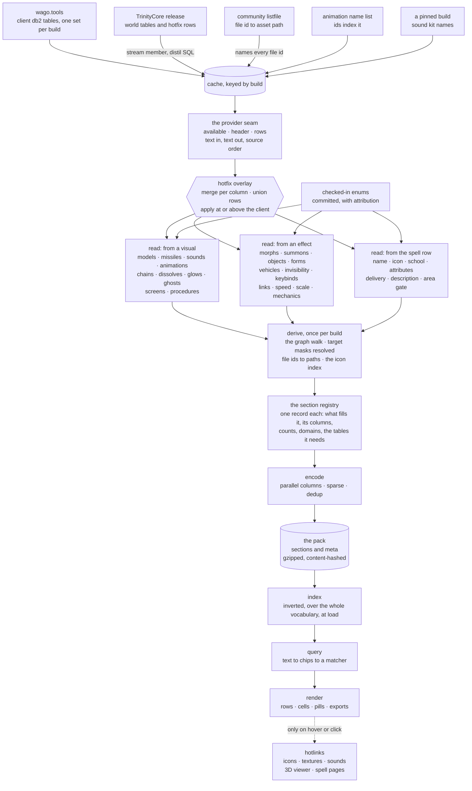
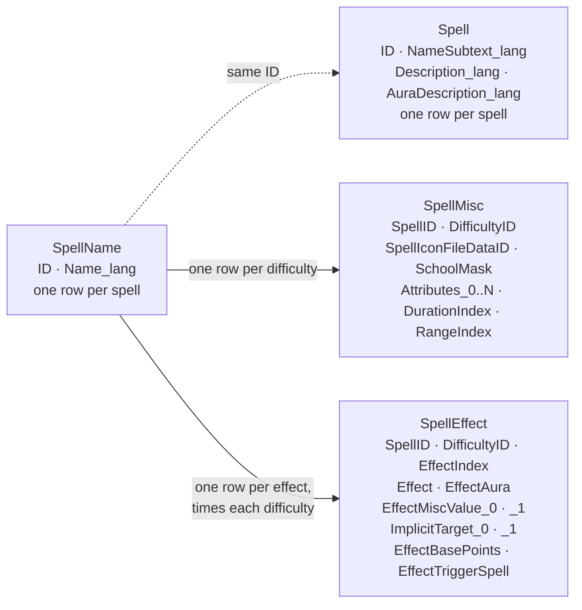
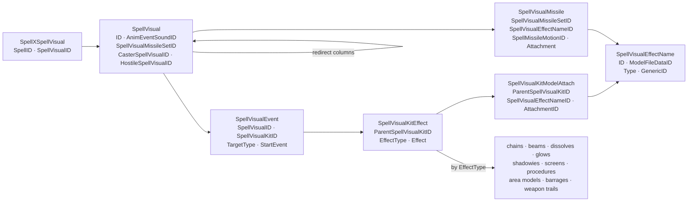
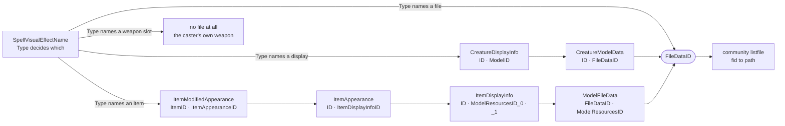
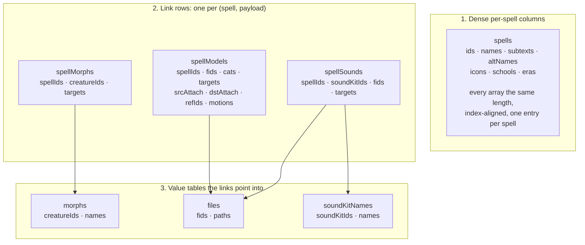
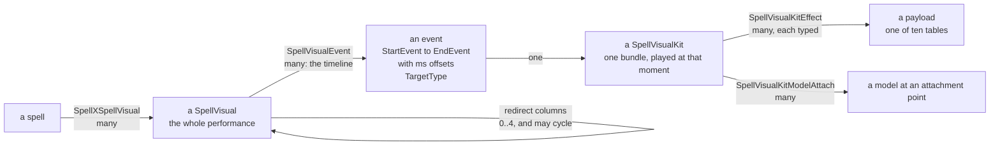
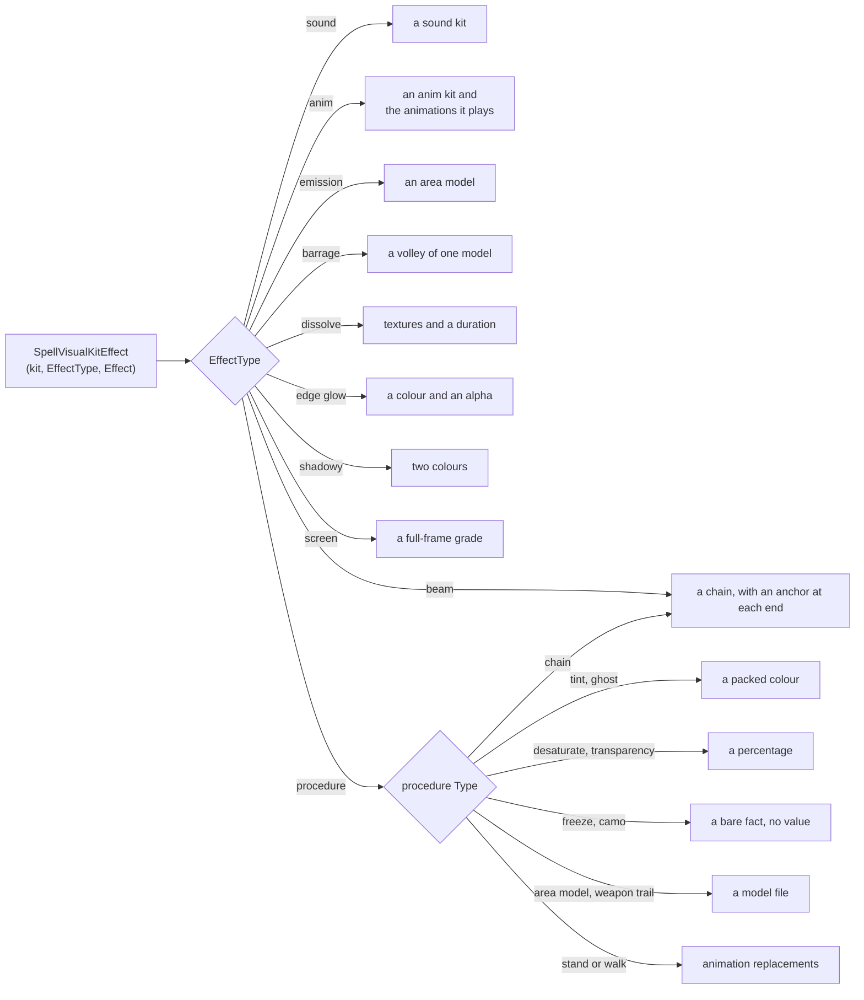
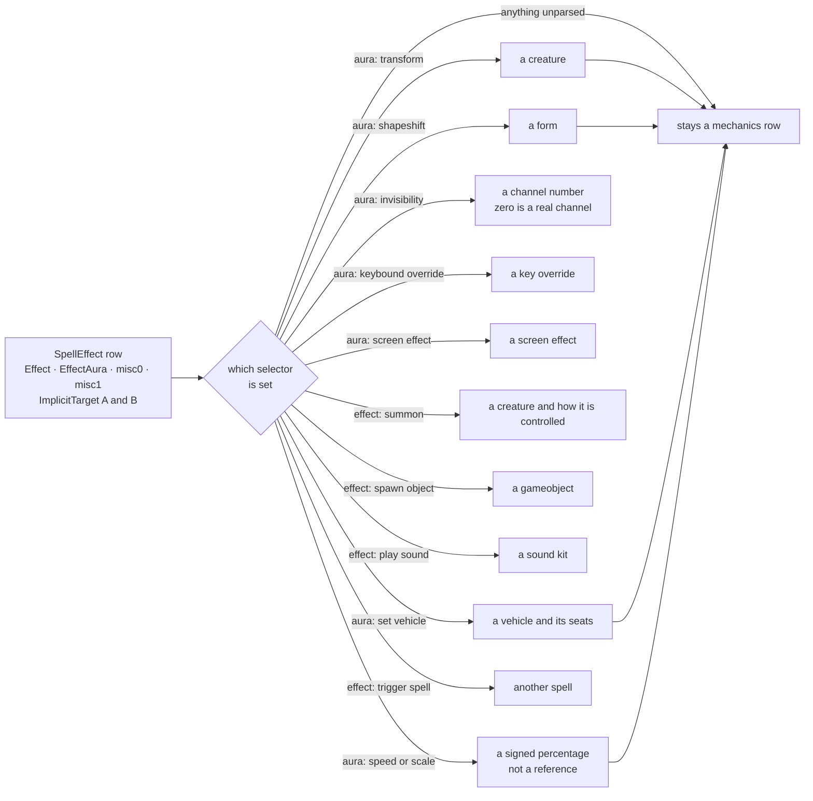

# Epsilook data routes

The life of one piece of game data, from a byte on somebody else's server to a pill under a search result.

Everything the app shows was decided at build time. Nothing is fetched per result, nothing is computed from a live
service, and the only things that leave the browser afterwards are the [runtime hotlinks](#runtime-hotlinks) a reader
asks for by hovering. So a question about where something comes from is always a question about this pipeline, and
this document walks it in order.

It describes what each stage *means* rather than how it is currently written, so that it stays true while the builder
is replaced. Where a route *ends* — the pill it becomes, the word it answers to, how a query token matches it — is
[PILLS.md](PILLS.md). The decisions behind a route, and the measurements that settled them, are
[DECISIONS.md](DECISIONS.md).

## The journey

Each stage owns one thing and is ignorant of the next, which is what lets any of them be replaced alone.

| stage       | owns                                                            | knows nothing about              |
|-------------|-----------------------------------------------------------------|----------------------------------|
| **acquire** | URLs, caching, archives, distillation                           | spells                           |
| **provide** | One interface over any source; absence; the hotfix overlay      | what a table means               |
| **read**    | Turning rows into typed meaning. The interpretive half          | where rows came from, what ships |
| **derive**  | The one graph walk and everything more than one reader needs    | encoding                         |
| **declare** | Which sections exist, what fills them, what they count          | bytes                            |
| **emit**    | Column layout, compression, the manifest                        | routes                           |
| **index**   | Inverted indexes over every value the pack carries              | how a query is written           |
| **render**  | Rows, cells, pills, exports                                     | how a value was found            |

Two properties hold everywhere and are worth stating once.

**Values travel as text until a reader types them.** A source hands back exactly what it spelled. The reader turns text
into a number, because the same column is exported as `2` by one build and `2.0` by another, and an empty cell means
zero rather than missing. Typing earlier would let two sources disagree in the low-order digits of a float and produce
different packs from the same data.

**An absence is declared, never branched on.** Older builds legitimately lack tables, columns and whole sources. Each
absence is a declaration naming the feature that switches off; anything undeclared is a hard error, because silently
dropping data is worse than failing loudly. See [Drift between builds](#drift-between-builds).

## Acquire

| source                  | gives                                                          | shape                                      |
|-------------------------|----------------------------------------------------------------|--------------------------------------------|
| **wago.tools**          | The client's own db2 tables, one set per game build            | CSV per table, downloaded and cached       |
| **community listfile**  | File id to asset path                                          | One flat list; the only thing that names a file id |
| **TrinityCore release** | Server world tables, and hotfix rows revising the client       | A solid archive of SQL, distilled to CSV   |
| **checked-in enums**    | Enum value to name, with attribution                           | Committed under `build/enums/`             |
| **animation name list** | Animation id to name                                           | A community list; ids index it             |
| **a pinned build**      | Sound kit names                                                | One fixed build, whatever build is packing |

Everything lands in a cache keyed by build, so a rebuild re-reads rather than re-downloads, and the cache rotates
against the shipped roster so an abandoned version stops costing disk.

**The server release is one download doing two unrelated jobs.** Its *world tables* name things the client has no name
for — a creature's name is server data, so a morph resolves to a model on any build but gets a *word* only where a
release exists. Its *hotfix rows* revise the client's own tables, and those are applied at the next stage rather than
here.

**The sound-kit names are the one cross-build read.** No build ships a name table for them, so the names come from a
build that did, whatever build is being packed. It is a pinned source rather than drift: the build being packed still
decides which kits are *used*.

## The shape of the data, at both ends

The game's tables and the pack's sections are shaped for opposite jobs, and the whole build is the translation between
them. Understanding both is what makes every route below obvious rather than arbitrary.

### At the source

The client's data is a normalised graph of small tables joined by id. Almost nothing is on the row you start from: a
spell's *name* is on one table, what it *does* on another, what it *looks like* three hops away. There is no column
anywhere that says "this spell shows a sheep".

**A spell's own tables.** Everything keyed directly by spell:

Two traps live here. **A spell has one row per difficulty** on several of these, and the row a player sees is the base
one — taking whichever arrived last prints raid numbers on ordinary spells. And **`EffectMiscValue_0` has no fixed
meaning**: `Effect` or `EffectAura` on the same row decides which table it indexes.

**The visual spine and its payload tables.** This is the half that took the exploration:

**The asset chains.** Several routes end at a file id, but few reach one directly:

The recurring joins, for reference:

| from                       | column                            | to                       |
|----------------------------|-----------------------------------|--------------------------|
| `SpellXSpellVisual`        | `SpellVisualID`                   | `SpellVisual`            |
| `SpellVisualEvent`         | `SpellVisualKitID`                | a kit                    |
| `SpellVisualKitEffect`     | `Effect`, meaning set by `EffectType` | one of ten payload tables |
| `SpellVisualKitModelAttach`| `SpellVisualEffectNameID`         | `SpellVisualEffectName`  |
| `SpellVisualMissile`       | `SpellVisualMissileSetID`         | `SpellVisual`'s set      |
| `SpellEffect`              | `EffectMiscValue_0`, meaning set by `Effect`/`EffectAura` | a creature, form, vehicle, object, sound kit, channel |
| `SpellEffect`              | `EffectTriggerSpell`              | another spell            |
| `CreatureDisplayInfo`      | `ModelID`                         | `CreatureModelData`      |
| `SoundKitEntry`            | `SoundKitID`                      | the audio files          |
| `AnimKitSegment`           | `ParentAnimKitID`, `AnimID`       | an anim kit's animations |
| `SpellCastingRequirements` | `RequiredAreasID`                 | `AreaGroupMember` to `AreaTable` |

### As shipped

The pack inverts all of that. The graph is already walked, so the app never joins: what ships is **column-oriented**,
and every section is one of exactly three shapes.

| shape          | why                                                                                            |
|----------------|-------------------------------------------------------------------------------------------------|
| **dense**      | One entry per spell, so the row index *is* the spell. No key to look up while rendering a table  |
| **link rows**  | The many-to-many the graph walk flattened, with the target mask on the row that earned it        |
| **value table**| A name or path stored once and referenced by id, instead of repeated on every link row           |

Columns are parallel arrays rather than a list of objects, because the app wants a whole column at a time and repeated
keys cost more than they explain. A column dominated by empty values is stored sparsely, and repeated text is
deduplicated into a value table plus an index.

**The inversion is the point.** At the source, "which spells show a sheep" is unanswerable without walking every
spell. As shipped, it is one lookup in `files`, one scan of `spellModels`, and the answer is a list of spell ids.

## Provide

Every reader reads through one interface — is this table available, what are its columns, give me these columns of
every row — so a reader never learns whether a row came from a file, a query or a feed. That is what makes the source
swappable, and it is enforced rather than promised: nothing in the reading layers may name a file path or a URL.

The contract has four points, each one a semantic some reader depends on:

- **Text in, text out.** Values are the source's own spelling, unparsed.
- **Rows arrive in source order.** Readers resolve collisions by last-write-wins and first-candidate-wins, so a
  provider that reordered rows would change which value survives.
- **An empty field is the empty string,** never null and never absent.
- **A declared-absent table yields nothing** and its section comes out empty; an undeclared absence is fatal.

**The hotfix overlay is a composition, not a feature of a reader.** It is one source read over another, so it is
written once and every reader inherits it — a reader cannot forget what it never has to ask for. Three rules govern
the merge, each earned rather than symmetric:

- **Per column, not per row.** A wholesale row replace blanks every column the overlay does not carry. Merging per
  column also lets a column whose overlay copy is *worse* than the client's simply go unmapped — a float that has been
  through a text format printing fewer digits than it holds is a degradation, not a correction.
- **Rows are unioned.** A few revision rows name ids the client's table never carried. They are genuine server-side
  additions, and dropping them loses data nothing else can reach.
- **A row applies only where it is at least as current as the client.** Every hotfix row is stamped with the client
  build it was verified against; one stamped below the build being packed describes an older client, whose changes
  that client already shipped.

**An array field's width is read, not declared.** The client exports an array column as `X_0, X_1, …` and sometimes
narrows it to a bare `X` between builds. The header states the answer, so a declaration would only be a second place
for it to be wrong.

## Read

This is the interpretive half: rows in, typed meaning out. It is where a number becomes a creature, a colour or a
sound depending entirely on the column beside it, and it is the half a relational engine is worst at.

### The spine: spell to visual to kit

Almost everything visible hangs off this, and the shape is a composition rather than a chain of single hops. Every
edge is one-to-many, so a spell fans out into a tree:

**A visual is a performance, and its events are its timeline.** An event does not merely say "this kit belongs to
this visual". It carries a start event and an end event with millisecond offsets on both, so it schedules a kit
*within a window*: precast, cast, impact, the life of a channel, the moment an aura is applied or falls off. A
fireball's visual is not one kit — it is the caster's precast glow, the cast animation, the missile, and the impact
burst, each its own event on the same visual.

It also carries `TargetType`, so the same visual can play different content to different people, which is where the
target mask comes from.

**The aura events are split out from the rest,** because they are the only ones whose "target" can disagree with the
spell's. Everything else shares the cast's frame. The full set of start events is not publicly documented and the app
does not need it; what it needs is which events mean the aura phase, and that is declared.

**The pack keeps none of the timing.** The walk uses the phase to separate aura events and then flattens the event
away, so a payload reaches the pack attached to its spell rather than to the moment it fires, and the four offset
columns are not read at all. That is a deliberate simplification rather than an oversight — the pack's shape is
spell to payload, and a moment would be a grouping level between them.

**A kit is a bundle, and it used to be a record with fixed slots.** In the original client a kit was one row with a
column per attachment — head, chest, base, left hand, right hand, breath, three special slots — plus a sound, a
camera shake and up to four character procedures. Modern builds normalised those fixed columns into rows:
`SpellVisualKitEffect` is a variable-length list of `(EffectType, Effect)` pairs, and `SpellVisualKitModelAttach`
holds the models with their attachment points.

**That normalisation is the whole reason the type dispatch exists.** When the slots were columns, the column name
told you what the value meant. Once they became rows, the meaning moved into `EffectType`, and reading `Effect`
without it reads a colour as a model. Everything in [Routes that start at a visual](#routes-that-start-at-a-visual) is
a consequence of that one change.

**A visual can redirect to another visual** that the client substitutes under some condition: what the caster sees,
what a hostile target sees, a low-violence variant, a reduced-camera-movement variant. Only the first two say anything
about who is watching; the others are client settings nobody casts at anyone.

Following redirects is what makes that content visible at all, because the redirected-to visual is usually reachable
no other way. **The redirect graph contains cycles** — a visual can name itself, and two can name each other — so the
expansion is a worklist over a mask that only ever gains bits, which terminates whatever shape the data takes.

**A kit is reached through an event, and the event's phase matters.** Every phase but one shares the cast's frame; the
*aura* phase belongs to the aura and plays on whoever carries it. The two are carried apart until the spell's own
effects are known, because folding them together loses the distinction that rescues a spell whose self-aura rides
alongside effects aimed at someone else.

**The kit is the fan-out point,** and it is the single most important thing to picture. One row says "this kit plays
effect E of type T", and the *type* decides which of about ten tables E is an id in. Reading the effect without first
reading its type reads a colour as a model.

**A procedure is dispatched twice.** Its effect type says only "this is a procedure"; which *kind* it is was decided
when the procedure table was read, because that table's four generic value columns mean something different for every
type. So the second dispatch is a membership test against buckets already filled, never a second reading of the row:
the route that knows what a type means is the one that decided, and the walk does not re-decide.

### Routes that start at a visual

| route          | ends at                                             | ships as                              |
|----------------|-----------------------------------------------------|---------------------------------------|
| **models**     | A model file plus the category naming its kind      | `spellModels`, `files`                |
| **missiles**   | A projectile, its flight path and its two anchors   | `spellModels`, `missileMotions`       |
| **sounds**     | A sound kit, and through it the audio files         | `spellSounds`, `soundKitNames`        |
| **animations** | An animation, an anim kit, or a body region         | `spellAnimKits`, `animKitAnims`, `animNames`, `bonesetNames` |
| **chains**     | A beam: colour, textures, a sound, nested chains    | `spellFx`, `fxChains`, `fxTextures`   |
| **dissolves**  | A duration, textures and an anchor                  | `spellDissolves`, `dissolves`         |
| **glows**      | A packed colour and an alpha                        | `spellGlows`, `glows`                 |
| **ghosts**     | Two packed colours and an anchor                    | `spellShadowies`, `shadowies`         |
| **screens**    | A full-frame colour grade, vignette and textures    | `spellScreens`, `screens`             |
| **procedures** | Whatever its type says: thirteen different meanings | `spellTints`, `spellFreezes`, and more|

**Seven routes end in a model file and share almost nothing upstream.** What they share is the ending, so they carry a
category, and the category is not decoration: it says *which id space the row's reference is in*, so a creature
display and an item can share one field instead of each adding their own.

| category | reached by                                            | its reference is |
|----------|-------------------------------------------------------|------------------|
| attach   | A kit attaching a model to a unit                     | nothing          |
| missile  | A visual's missile set                                | nothing          |
| ground   | A kit's emitter, or a procedure naming an area model  | nothing          |
| trail    | A procedure naming a weapon trail                     | nothing          |
| barrage  | A kit effect naming a volley                          | nothing          |
| display  | An effect name typed as a creature display            | a display id     |
| item     | An effect name typed as an item                       | an item id       |

A **weapon slot is a model with no file**: some effect-name types name the caster's own main hand, off hand, ranged or
ammo rather than an asset. Those carry a sentinel and a stand-in name, so nothing downstream needs a special case.

### Routes that start at an effect

A spell's effects carry its gameplay, and five visual categories start here rather than in the visual graph. The shape
is uniform — an effect or aura value selects the meaning, and a misc value on the same row is an id into whatever
table that meaning implies. The same column is a creature, a channel number or a sound kit depending only on what sits
beside it:

The last edge is the point: **a parsed value is marked consumed on its row rather than removed from it,** so every
effect and aura remains searchable and the mechanics column is always the whole table.

| selector               | misc value is      | ships as                          |
|------------------------|--------------------|-----------------------------------|
| transform aura         | a creature         | `spellMorphs`, `morphs`, `morphDisplays` |
| shapeshift aura        | a form             | `spellShapeshifts`, `shapeshifts` |
| set-vehicle aura       | a vehicle          | `spellVehicles`, `vehicles`, `vehicleSeats` |
| screen-effect aura     | a screen effect    | `spellScreens`                    |
| invisibility auras     | a channel number   | `spellInvis`, `spellDetects`      |
| keybound-override aura | a key override     | `spellKeybinds`, `keybinds`       |
| anim-replacement aura  | a replacement set  | `spellReplaceAnims`               |
| override-name aura     | an override name   | folded into the search corpus     |
| summon effect          | a creature         | `spellSummons`, `summons`         |
| gameobject effects     | a gameobject       | `spellObjects`, `objects`         |
| play-sound effects     | a sound kit        | folded into `spellSounds`         |

Three do not fit that shape:

**Speed and scale carry a number, not a reference.** The aura says which movement is scaled and the amount says by how
much. The amount is a signed percentage and the sign is stored rather than derived, because the aura's name does not
carry it: a decrease aura may hold a positive value. An amount of zero is dropped — the pill is made of nothing but
the number.

**Spell links are the one route whose payload is another spell.** A link to a spell the pack cannot name is dropped,
because the chip is an icon and a name; so is a self-link. Only one direction is stored, and the reverse index is
derived in the browser.

**Mechanics rows are what is left.** Every effect and aura a spell has, paired with the implicit targets of the row
that carried it. The granularity is per effect and that is a correctness property: a search scope binds its axes to
one row, so asking for an effect that is a jump *and* aims at a unit must mean a single effect that is both.

**A value that reached a parsed payload is marked consumed.** It stays on its row and stays searchable; the flag only
tells the renderer that a dedicated pill already shows it, so the raw one is not drawn a second time. That makes the
mechanics column an inventory of the features not built yet — most effect and aura values are unparsed rather than
missing, and promoting one takes it out of that column on its own.

### Routes that start at the spell row

| route          | ships as                    | notes                                                        |
|----------------|-----------------------------|--------------------------------------------------------------|
| **name**       | `spells`                    | Membership is the spell list; every route filters against it |
| **icon**       | `iconFids`, `iconNames`     | Zero means no icon, so it never displaces one already found  |
| **school**     | `spells`                    | A mask; zero is a real value meaning schoolless              |
| **attributes** | `spellAttrs`                | Which flags ship is a declaration, not code                  |
| **delivery**   | `spellDelivery`             | Cast and channel are not a partition; many spells do both    |
| **description**| `spellText`                 | A template, cooked to prose. See below                       |
| **area gate**  | `spellAreas`, `areas`       | Where a spell may be cast at all                             |
| **expansion**  | `spells.eras`, `expansions` | The only route with no column in any shipped build           |

**Which table carries the name is the oldest drift in the project.** The name table was split out of the spell table
partway through the game's history, so older builds keep the name on the spell row. Both spellings are an id plus a
localised name column, so only the source differs — declared as an ordered list, first candidate the build has.

**A description is a template, and what ships is the cooked prose.** The client resolves it at tooltip time against
the caster's own state; a template is not searchable and a rendered tooltip is not obtainable in bulk. The governing
rule is never to print a number this data cannot justify and never to leave a placeholder: a code whose value is in a
table already read is substituted, and one depending on the caster or the interface is elided, leaving the sentence
around it intact. These templates are written as English sentences with a number slotted in, so removing the number
leaves prose that reads.

**The area gate resolves to the area's own name, never its parent zone.** Rolling a multi-area group up to its
containing zone collapses most groups to one pretty word and is wrong: most cover part of a zone rather than all of
it, so the rolled-up name would be false on almost every pill it was printed on.

## Derive

Anything more than one section needs is computed once here rather than by each reader. That is what keeps the section
declarations flat, with no ordering between them and no section depending on another.

- **The graph walk.** One pass over every spell, following the spine to its kits and unioning each payload it reaches.
  Every payload bucket is the same shape — content item to target mask — so adding a kit's contribution is one
  operation rather than one per payload kind, and the walk stays a loop over kits rather than a switch over payloads.
- **Target masks resolved.** See below.
- **Path resolution.** Every file id the walk collected, looked up in the listfile once.
- **The icon index,** and the other cross-route indexes a pill needs.

### The target mask

A row of the graph carries the audience it plays for: the caster, the target, an area, or a combination. The same
vocabulary is used by an effect's implicit target and by a visual event, because it is the same question asked of
different tables, and sharing it is what lets the two be compared at all.

The comparison matters because **the client writes "target" whenever a spell is cast at a unit, including when that
unit is the caster.** A self-buff would otherwise show a target icon for content that plays on you. So a target bit
becomes a caster bit wherever the matching test says the spell aims only at its caster: for the aura phase, believe
the spell's apply-aura effects; for every other phase, believe all of them.

## Declare

Every section is one record: its name, what fills it, which columns it has, how each column is laid out, which counts
and measured domains it contributes, whether its values are locale text, which source tables it needs, and whether it
ships per build or once across builds.

From that one record come the assembly, the counts, the domains, the module the section lands in, the locale overlay
and the generated documentation — so a new axis is a declaration rather than an edit in six places.

**Naming a section's source tables is what makes drift computable.** A section whose tables are absent switches itself
off and says so, rather than a reader branching on the build.

### Drift between builds

Building an older version is mostly a story of things that do not exist yet. Every difference is declared, and the
kinds are distinct because they fail differently:

| the difference                 | declared as                       | what happens                              |
|--------------------------------|-----------------------------------|-------------------------------------------|
| The table postdates the build  | An optional table, naming its feature | The reader yields nothing; the feature switches off |
| A column postdates the build   | An optional column, naming a default  | The declared default stands in        |
| The data moved between tables  | An ordered list of candidates     | The first candidate this build has wins   |
| An enum value's name differs   | Per-build guards on the enum file | The name resolves per build               |
| A whole source is absent       | A release map                     | Routes needing it degrade, declared       |
| The array shape changed        | Nothing — the header is read      | Handled by reading                        |
| The values differ              | Nothing — measured per pack       | Bounds taken from one build are wrong on the others |
| **Anything undeclared**        | —                                 | **The build fails loudly**                |

Two shapes are not drift and must not be filed as it. A **pinned cross-build source** deliberately reads a different
build, which is a property of the route rather than of this build. And a version that cannot be expressed at all is a
roster decision: the game renormalised its spell-visual schema once, and a build predating that has no definition for
several required tables, which no declaration can paper over.

## Emit

The pack is column-oriented: a section is parallel arrays rather than a list of objects, because the app wants a
column at a time and repeated keys cost more than they explain. Columns dominated by empty values are stored sparsely,
and text that repeats is deduplicated into a value table plus an index — descriptions collapse to roughly two-thirds
of their distinct count that way.

Beside the sections, `meta` ships the facts nothing downstream should have to re-derive:

| key             | is                                                                 |
|-----------------|--------------------------------------------------------------------|
| `format`        | The pack format; a bump means every consumer is re-read            |
| `version`       | The game build packed, and `label` its human name                  |
| `built`         | When, so a rebuild is visible                                      |
| `listfileTag`   | Which listfile release named the files                             |
| `tdbTag`        | Which server release supplied names and hotfixes, if any           |
| `absentTables`  | What this build did not have, so absence is reportable             |
| `counts`        | Every population, so nothing counts a column at load               |
| `domains`       | The measured range of each numeric axis, so no control re-derives it |

`versions.json` names every shipped build and carries a content hash per pack, which is what busts a cache without a
version string to bump.

## Index, query, render

The browser fetches one pack and builds **inverted indexes over the whole vocabulary at load**. That is the reason
almost nothing is deferred: a column that has not arrived does not make a search slower, it makes it answer *wrong* —
fewer hits than exist — which is worse than a slower load.

A query is text, which becomes chips, which become a matcher. Rendering turns a matched row into cells and pills,
where a pill is a small record — a word, a tone, sometimes an icon and a target marker — rather than markup, so the
same record can also become an export line or a copied command.

## Runtime hotlinks

The only things fetched after load, and only when a reader asks:

| on                          | fetches                                        |
|-----------------------------|------------------------------------------------|
| A row appearing             | The spell's icon                               |
| Hovering a texture pill     | A `.blp` preview, decoded in the browser       |
| Clicking a sound            | The audio file                                 |
| Clicking a model            | An external 3D viewer, in a new tab            |
| Hovering a spell link       | The external spell page's own tooltip          |

The house rule is that these are fetched on an explicit hover or click, never preloaded and never in bulk. There is no
affirmative licence for any of them; the footing is tolerated hotlinking, and behaving like a bulk downloader is what
would end it.

## One datum, end to end

A polymorph turns its target into a sheep, and the app shows the sheep's model. Every stage above is involved.

| stage       | what happens to it                                                                                       |
|-------------|-----------------------------------------------------------------------------------------------------------|
| **acquire** | `SpellEffect`, `CreatureDisplayInfo` and `CreatureModelData` are downloaded; the server release is distilled; the listfile is cached |
| **provide** | Those tables are served as rows, with any hotfix rows merged in per column                                |
| **read**    | The effect row's aura says *transform*, so its misc value is read as a creature rather than as a number   |
| **read**    | The creature's *name* comes from the server world table; without a release it stays a raw id, declared     |
| **read**    | The creature's display resolves through display to model data to a file id — two hops, because several displays share one model |
| **derive**  | The walk records the pair against the spell, unioning the target mask from the effect's implicit targets   |
| **derive**  | The file id is resolved to an asset path through the listfile                                             |
| **declare** | It belongs to `spellMorphs`, whose companions `morphs` and `morphDisplays` carry the name and the display  |
| **emit**    | Those become parallel columns, gzipped, hashed into `versions.json`                                        |
| **index**   | The browser indexes the path and the creature name alongside every other model's                          |
| **query**   | `model:sheep` matches the *path*, because category searches match filenames as well as the category word   |
| **render**  | A model pill, carrying the target icon the mask decided                                                    |
| **hotlink** | Hovering it fetches the texture preview; clicking opens the external viewer                               |

## Adding a route

This document is meant to grow by rows, not by paragraphs. A new axis touches exactly four places here, and if it
needs a fifth the document has drifted and should be reshaped rather than appended to.

| when you add                          | edit                                                                   |
|---------------------------------------|-------------------------------------------------------------------------|
| A route from a visual, effect or spell row | One row in that family's table under [Read](#read)                 |
| A new source table it joins through   | One row in the joins table under [At the source](#at-the-source)        |
| A new pack section                    | One row in the shipped-shape table, naming which of the three shapes it is |
| Something a reader can see            | One row in [Quick reference](#quick-reference)                          |

Three rules keep that true:

- **A route appears once per table, never twice in prose.** If a route needs explaining beyond its row, the
  explanation goes under the family heading it belongs to, not into a new section of its own.
- **The diagrams are grouped, not exhaustive.** They show every *kind* of hop, not every table. A new route that is
  the tenth of an existing kind changes no diagram; one that introduces a genuinely new kind of hop changes exactly
  one.
- **Numbers stay out.** Populations and measurements belong in `DECISIONS.md` and the exploration database, because a
  count written here is stale at the next pack rebuild and nothing checks it. What belongs here is the *shape*, which
  changes only when the data model does.

The declaration side of this is enforced rather than remembered: a section that ships without being read, or a
selector that stops being covered, fails `tools/check.py` rather than silently disagreeing with this page.

## Quick reference

Where a shown thing comes from, by what the reader sees:

| the reader sees        | it came from                                                          |
|------------------------|-----------------------------------------------------------------------|
| The spell's name       | The client's spell-name table, hotfixes applied                       |
| The icon               | The spell's misc row, base difficulty winning                         |
| A model pill           | One of seven model routes; the category says which id space it is in  |
| A missile pill         | The visual's missile set, with the row's anchors beating the visual's |
| A sound pill           | A kit, reached four ways, resolved to its audio files                 |
| An animation pill      | An index into the community name list, not a table key                |
| A morph's name         | The server world tables; absent without a release, and declared so    |
| A colour               | A packed value from a chain, glow, ghost or procedure row             |
| A percentage           | An effect's amount, signed, with zero dropped                         |
| The description        | A template cooked to prose at build time                              |
| An area name           | The area's own name, never its parent zone                            |
| A target icon          | The mask on the row, with self-cast resolved                          |
