# Epsilook data routes

The life of one piece of game data, from a byte on somebody else's server to a pill under a search result.

Everything the app shows was decided at build time. Nothing is fetched per result, nothing is computed from a live
service, and the only things that leave the browser afterwards are the [runtime hotlinks](#runtime-hotlinks) a reader
asks for by hovering. So a question about where something comes from is always a question about this pipeline, and this
document walks it in order.

It describes what each stage *means* rather than how it is currently written, so that it stays true while the builder is
replaced. Where a route *ends* — the pill it becomes, the word it answers to, how a query token matches it — is
[PILLS.md](PILLS.md). The decisions behind a route, and the measurements that settled them, are
[DECISIONS.md](DECISIONS.md).

## The journey

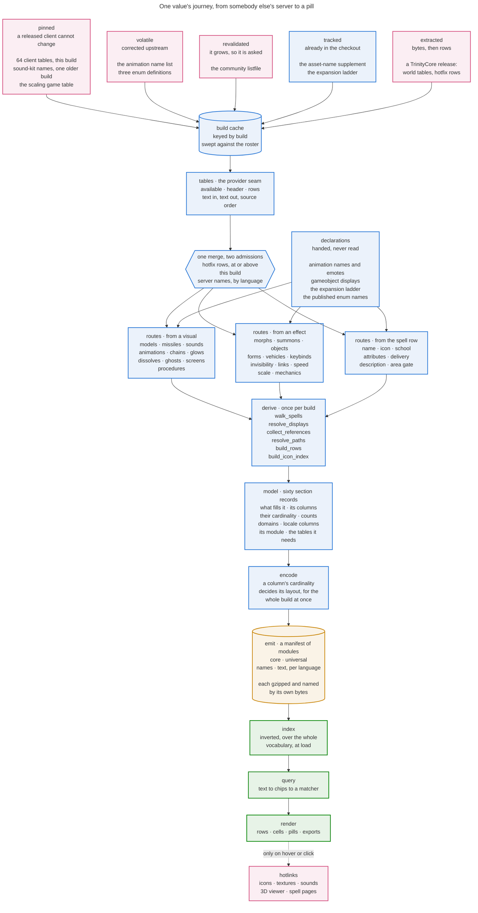

Each stage owns one thing and is ignorant of the next, which is what lets any of them be replaced alone.

| stage       | owns                                                         | knows nothing about              |
|-------------|--------------------------------------------------------------|----------------------------------|
| **acquire** | URLs, caching, archives, distillation                        | spells                           |
| **provide** | One interface over any source; absence; the hotfix overlay   | what a table means               |
| **read**    | Turning rows into typed meaning. The interpretive half       | where rows came from, what ships |
| **derive**  | The one graph walk and everything more than one reader needs | encoding                         |
| **declare** | Which sections exist, what fills them, what they count       | bytes                            |
| **emit**    | Grouping into modules, compression, the manifest             | routes                           |
| **index**   | Inverted indexes over every value the pack carries           | how a query is written           |
| **render**  | Rows, cells, pills, exports                                  | how a value was found            |

Two properties hold everywhere and are worth stating once.

**Values travel as text until a reader types them.** A source hands back exactly what it spelled. The reader turns text
into a number, because the same column is exported as `2` by one build and `2.0` by another, and an empty cell means
zero rather than missing. Typing earlier would let two sources disagree in the low-order digits of a float and produce
different packs from the same data.

**An absence is declared, never branched on.** Older builds legitimately lack tables, columns and whole sources. Each
absence is a declaration naming the feature that switches off; anything undeclared is a hard error, because silently
dropping data is worse than failing loudly. See [Drift between builds](#drift-between-builds).

## Acquire

| source                    | gives                                                    | shape                                              |
|---------------------------|----------------------------------------------------------|----------------------------------------------------|
| **wago.tools**            | The client's own db2 tables, one set per game build      | One CSV per table, downloaded and cached           |
| **community listfile**    | File id to asset path                                    | One flat list; the only thing that names a file id |
| **TrinityCore release**   | Server world tables, and hotfix rows revising the client | A solid archive of SQL, distilled to CSV           |
| **checked-in enums**      | Enum value to name, with attribution                     | Committed under `build/enums/`                     |
| **published enums**       | The same, for the three the game keeps changing          | Fetched per build, because upstream corrects them  |
| **animation name list**   | Animation id to name                                     | A community list; ids index it                     |
| **a pinned build**        | Sound kit names                                          | One fixed build, whatever build is packing         |
| **a game table**          | The per-level multipliers a scaled amount reads          | A tab-separated file inside the client, not a db2  |
| **asset-name supplement** | A private client's own names for the assets it adds      | Vendored under `build/sources/`, compressed        |
| **expansion ladder**      | Which expansion introduced a spell                       | Committed; derived once from historical clients    |

Everything lands in a cache keyed by build, so a rebuild re-reads rather than re-downloads, and the cache rotates
against the shipped roster so an abandoned version stops costing disk.

Two of these are read again per language: wago serves any of its exports in one, and the server release carries its own
`*_locale` tables in the same dump the world tables come from. Both land beside the build's own copies rather than
anywhere else, so everything one build downloaded rotates as one unit.

### What a source is

A source does three jobs, and the interface names them separately because each one varies on its own — and because a
layer that ran all three inside every module had nowhere to put a new format except beside whichever module it resembled
most.

- **Locating** is a value, not a step. An `Origin` is an address plus what is taken from it — which asset of a release,
  which file data id of a storage — so a build can report what it reads on a machine with no network, and every address
  the build knows is written down in one layer where a reader can find it.
- **Getting** is a policy, and the policies differ on one question: *can this source change under a build that already
  shipped?* An export of a released client cannot, so it is fetched once and kept (`Pinned`). A community name list
  keeps being corrected for builds that shipped years ago, so it is fetched every build (`Volatile`). The listfile keeps
  growing but is a hundred megabytes, so a cheap oracle decides and the body moves only when the release tag does
  (`Revalidated`). A vendored file is never fetched at all, and getting it is the check that it is there (`Tracked`).
  One policy differs on *where* rather than *when*: a content store addresses its bytes by their own encoding key, and
  which of them a network serves loose rather than inside an archive is a property of the network, so the loose address
  is tried first and a refusal is what sends the lookup to the archive index (`Stored`). A batch is the seam's own
  operation rather than a loop over it, because a policy with several files to get can share the work of finding them —
  and one with nothing to share is a line that gets them one at a time.
- **Extracting** turns bytes into rows. A CSV already is rows; a mysqldump and a db2 are not. An extraction answers two
  things — how to write the rows, and whether what is in the cache is *already exactly* what it would write. That second
  answer is on the interface rather than inside each extraction because getting it wrong is silent: a column added to
  the roster leaves every cached release looking finished and quietly missing it.

`acquire` is the whole of it: a path a provider can open, or `None` when this build declares the source absent — which
is how a build predating a table reports it, with no per-version branch anywhere above.

**Declaring the roster and acquiring it are two steps.** `source_roster(version)` says what a build reads and where each
of it comes from, with no request made; `fetch_sources` acquires that roster and returns the paths. The split is what
makes provenance answerable offline, and it is what lets the build's own log carry one heading per source naming where
it came from, whatever shape that source has.

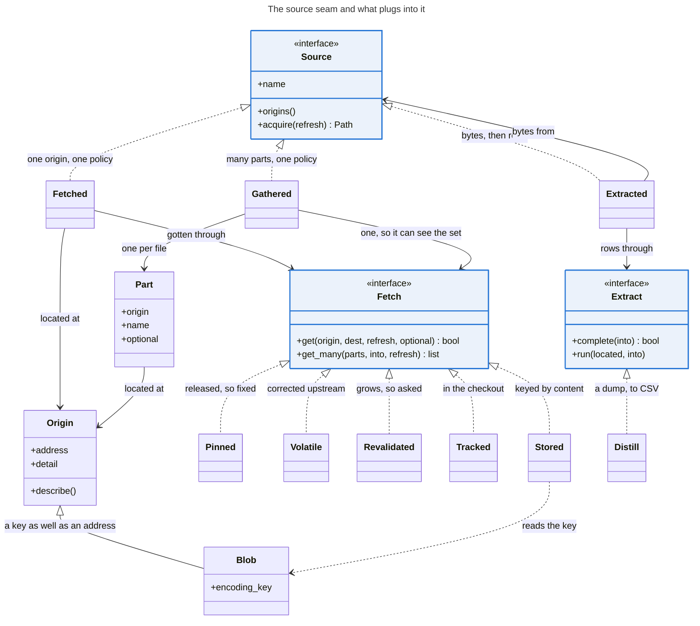

**The server release is one download doing two unrelated jobs.** Its *world tables* name things the client has no name
for — a creature's name is server data, so a morph resolves to a model on any build but gets a *word* only where a
release exists. Its *hotfix rows* revise the client's own tables, and those are applied at the next stage rather than
here.

**Two sources are read across builds rather than from the one being packed.** No build ships a name table for the sound
kits, so those names come from a build that did, whatever build is packing; and the emote that performs each animation
describes a private server rather than any retail build at all. Both are pinned sources rather than drift, and in both
the build being packed still decides what is *used* — which kits, which animations.

## The shape of the data, at both ends

The game's tables and the pack's sections are shaped for opposite jobs, and the whole build is the translation between
them. Understanding both is what makes every route below obvious rather than arbitrary.

### At the source

The client's data is a normalised graph of small tables joined by id. Almost nothing is on the row you start from: a
spell's *name* is on one table, what it *does* on another, what it *looks like* three hops away. There is no column
anywhere that says "this spell shows a sheep".

**A spell's own tables.** Everything keyed directly by spell:

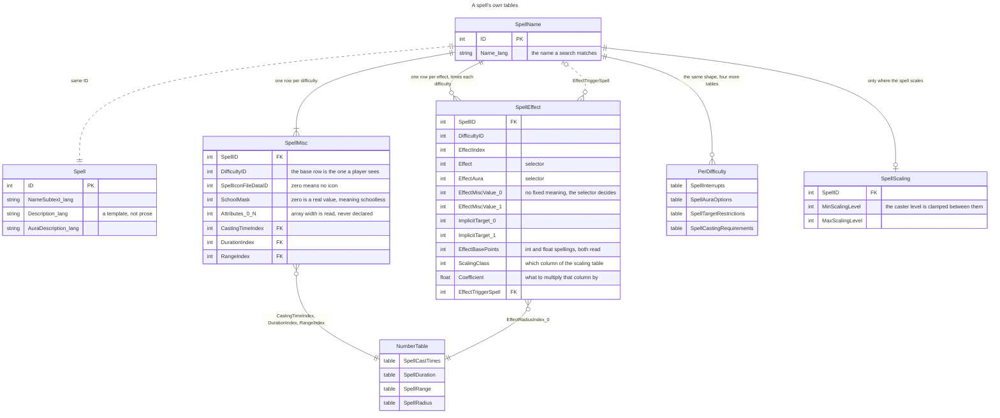

Three traps live here. **A spell has one row per difficulty** on all six of the many-row tables, and the row a player
sees is the base one — taking whichever arrived last prints raid numbers on ordinary spells. **`EffectMiscValue_0` has
no fixed meaning**: `Effect` or `EffectAura` on the same row decides which table it indexes. And **a column ending in
`Index` is a key, not a number** — a cast time, a duration, a range and a radius each live in a small table of distinct
values that many spells share, so reading the column as milliseconds reads a row number.

**The visual spine and its payload tables.** This is the half that took the exploration:

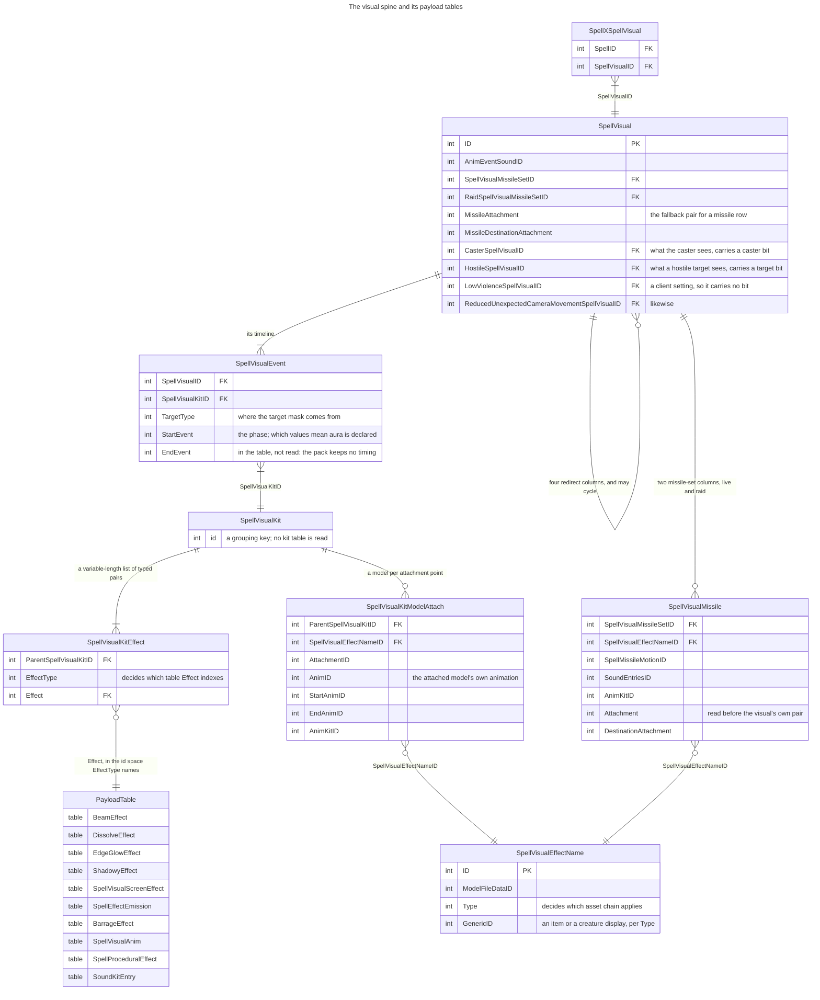

**The asset chains.** Several routes end at a file id, but few reach one directly:

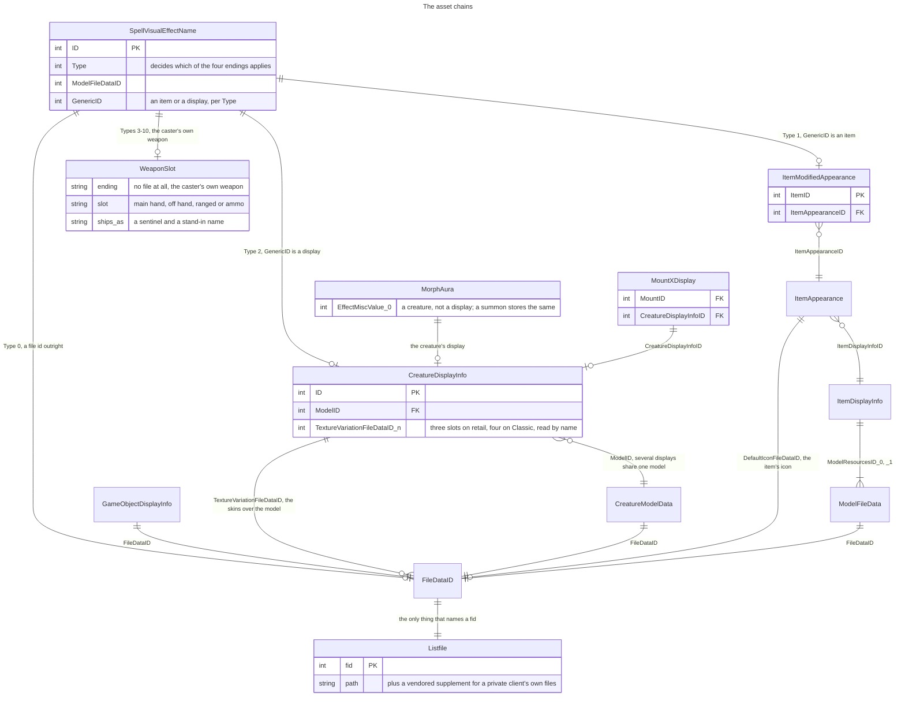

The recurring joins, for reference:

| from                        | column                                                    | to                                                    |
|-----------------------------|-----------------------------------------------------------|-------------------------------------------------------|
| `SpellXSpellVisual`         | `SpellVisualID`                                           | `SpellVisual`                                         |
| `SpellVisualEvent`          | `SpellVisualKitID`                                        | a kit                                                 |
| `SpellVisualKitEffect`      | `Effect`, meaning set by `EffectType`                     | one of ten payload tables                             |
| `SpellVisualKitModelAttach` | `SpellVisualEffectNameID`                                 | `SpellVisualEffectName`                               |
| `SpellVisualMissile`        | `SpellVisualMissileSetID`                                 | `SpellVisual`'s set                                   |
| `SpellEffect`               | `EffectMiscValue_0`, meaning set by `Effect`/`EffectAura` | a creature, form, vehicle, object, sound kit, channel |
| `SpellEffect`               | `EffectTriggerSpell`                                      | another spell                                         |
| `CreatureDisplayInfo`       | `ModelID`                                                 | `CreatureModelData`                                   |
| `SoundKitEntry`             | `SoundKitID`                                              | the audio files                                       |
| `AnimKitSegment`            | `ParentAnimKitID`, `AnimID`                               | an anim kit's animations                              |
| `SpellCastingRequirements`  | `RequiredAreasID`                                         | `AreaGroupMember` to `AreaTable`                      |

### As shipped

The pack inverts all of that. The graph is already walked, so the app never joins: what ships is **column-oriented**,
and every section takes one of four shapes.

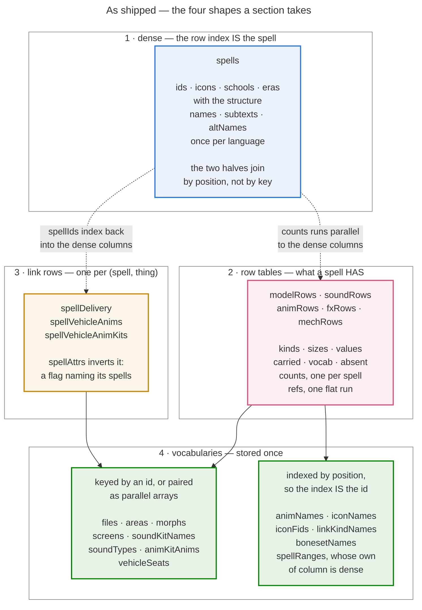

| shape          | why                                                                                             |
|----------------|-------------------------------------------------------------------------------------------------|
| **dense**      | One entry per spell, so the row index *is* the spell. No key to look up while rendering a table |
| **row tables** | What a spell HAS, as rows of a named kind: the distinct rows pooled once, referenced per spell  |
| **link rows**  | The many-to-many the graph walk flattened, with the target mask on the row that earned it       |
| **vocabulary** | A name, path or colour stored once and referenced, instead of repeated on every row that has it |

Nothing but `spells` is dense, and that is the point: a column every spell has is rare, and everything else is a count,
a reference or a value somebody else's row also uses.

**Every column a spell carries more than one of is a row table.** Five of them, one per query column, and they replaced
thirty per-spell sections: a row arrives already being the kind it is, and a reader walks it instead of joining the
half-dozen tables the same facts used to arrive in. A row property stores the id its vocabulary is keyed by —`rowVocabs`
says where each vocabulary lives — so a path, an attachment word and a packed colour each stay in the one place they
were already written. `carried` is the exception that proves the rule: columns no property of the kind declares, shipped
apart from the values so an evaluator reads exactly what the catalogue says a kind has.

Columns are parallel arrays rather than a list of objects, because the app wants a whole column at a time and repeated
keys cost more than they explain. What each column costs to store is decided in one place, and [Emit](#emit) is where
that decision and its measurement live.

**The inversion is the point.** At the source, "which spells show a sheep" is unanswerable without walking every spell.
As shipped, it is one lookup in `files`, one scan of `modelRows`, and the answer is a list of spell ids.

## Provide

Every reader reads through one interface — is this table available, what are its columns, give me these columns of every
row — so a reader never learns whether a row came from a file, a query or a feed. That is what makes the source
swappable, and it is enforced rather than promised: nothing in the reading layers may name a file path or a URL.

The contract has four points, each one a semantic some reader depends on:

- **Text in, text out.** Values are the source's own spelling, unparsed.
- **Rows arrive in source order.** Readers resolve collisions by last-write-wins and first-candidate-wins, so a provider
  that reordered rows would change which value survives.
- **An empty field is the empty string,** never null and never absent.
- **A declared-absent table yields nothing** and its section comes out empty; an undeclared absence is fatal.

**The hotfix overlay is a composition, not a feature of a reader.** It is one source read over another, so it is written
once and every reader inherits it — a reader cannot forget what it never has to ask for. Three rules govern the merge,
each earned rather than symmetric:

- **Per column, not per row.** A wholesale row replace blanks every column the overlay does not carry. Merging per
  column also lets a column whose overlay copy is *worse* than the client's simply go unmapped — a float that has been
  through a text format printing fewer digits than it holds is a degradation, not a correction.
- **Rows are unioned.** A few revision rows name ids the client's table never carried. They are genuine server-side
  additions, and dropping them loses data nothing else can reach.
- **A row applies only where it is at least as current as the client.** Every hotfix row is stamped with the client
  build it was verified against; one stamped below the build being packed describes an older client, whose changes that
  client already shipped.

**An array field's width is read, not declared.** The client exports an array column as `X_0, X_1, …` and sometimes
narrows it to a bare `X` between builds. The header states the answer, so a declaration would only be a second place for
it to be wrong.

## Read

This is the interpretive half: rows in, typed meaning out. It is where a number becomes a creature, a colour or a sound
depending entirely on the column beside it, and it is the half a relational engine is worst at.

### The spine: spell to visual to kit

Almost everything visible hangs off this, and the shape is a composition rather than a chain of single hops. Every edge
is one-to-many, so a spell fans out into a tree:

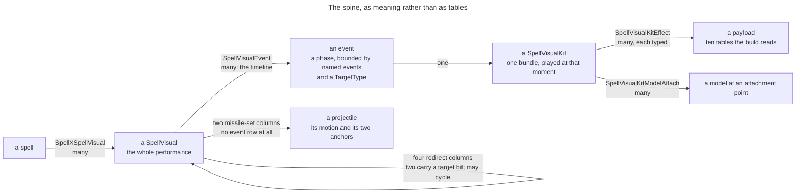

**A visual is a performance, and its events are its timeline.** An event does not merely say "this kit belongs to this
visual". It names a start event and an end event, so it schedules a kit *within a window*. A fireball's visual is not
one kit — it is the caster's precast glow, the cast animation, the missile, and the impact burst, each its own event on
the same visual.

**The window is bounded by named events, not by a clock.** The published enum names thirteen of them, and they run in
the order a spell lives:

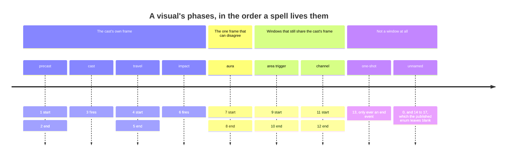

The middle section is the whole reason the phase is read: **only the aura pair is treated apart.** An area trigger and a
channel each open a window with a life of its own, and the build still believes the cast's frame for both, because
neither can play on a unit the cast was not aimed at.

The pairs are almost all matched brackets, and the populations say which shapes are ordinary — on 9.2.7, five pairs
carry 90.5% of the 207,241 rows: impact-then-done 54,957, cast-then-done 49,810, the aura window 47,470, precast 26,514,
the channel window 8,857. The tail is 45 further pairs, and eleven rows use a value the enum does not name.

**The four millisecond-offset columns are a rare nudge, not the mechanism.** They shift a bound away from its event, and
on 9.2.7 exactly **1,037 of 207,241 event rows — 0.50% — carry a non-zero offset in any of the four**. Every one of
Fireball's three events has four zeros. So a diagram of this with a time axis would be inventing the thing it drew; the
ordering above is what the data actually says.

It also carries `TargetType`, so the same visual can play different content to different people, which is where the
target mask comes from. The events are enumerated by `SpellVisualEventEvent` in WoWDBDefs' `meta/enums`, but the app
needs only which of them mean the aura phase, and that is declared.

**The pack keeps none of the timing, and the read says so.** Four of the row's ten columns are read — the visual, the
kit, `StartEvent` and `TargetType` — so `EndEvent` and all four offsets are untouched. The walk uses the phase to
separate aura events and then flattens the event away, and a payload reaches the pack attached to its spell rather than
to the moment it fires. That is a deliberate simplification rather than an oversight: the pack's shape is spell to
payload, and a moment would be a grouping level between them.

**A kit is a bundle, and it used to be a record with fixed slots.** In the original client a kit was one row with a
column per attachment — head, chest, base, left hand, right hand, breath, three special slots — plus a sound, a camera
shake and up to four character procedures. Modern builds normalised those fixed columns into rows:
`SpellVisualKitEffect` is a variable-length list of `(EffectType, Effect)` pairs, and `SpellVisualKitModelAttach`
holds the models with their attachment points.

**That normalisation is the whole reason the type dispatch exists.** When the slots were columns, the column name told
you what the value meant. Once they became rows, the meaning moved into `EffectType`, and reading `Effect`
without it reads a colour as a model. Everything in [Routes that start at a visual](#routes-that-start-at-a-visual) is a
consequence of that one change.

**A visual can redirect to another visual** that the client substitutes under some condition: what the caster sees, what
a hostile target sees, a low-violence variant, a reduced-camera-movement variant. Only the first two say anything about
who is watching; the others are client settings nobody casts at anyone.

Following redirects is what makes that content visible at all, because the redirected-to visual is usually reachable no
other way. **The redirect graph contains cycles** — a visual can name itself, and two can name each other — so the
expansion is a worklist over a mask that only ever gains bits, which terminates whatever shape the data takes.

**A kit is reached through an event, and the event's phase matters.** Every phase but one shares the cast's frame; the
*aura* phase belongs to the aura and plays on whoever carries it. The two are carried apart until the spell's own
effects are known, because folding them together loses the distinction that rescues a spell whose self-aura rides
alongside effects aimed at someone else.

**The kit is the fan-out point,** and it is the single most important thing to picture. One row says "this kit plays
effect E of type T", and the *type* decides which table E is an id in. Reading the effect without first reading its type
reads a colour as a model.

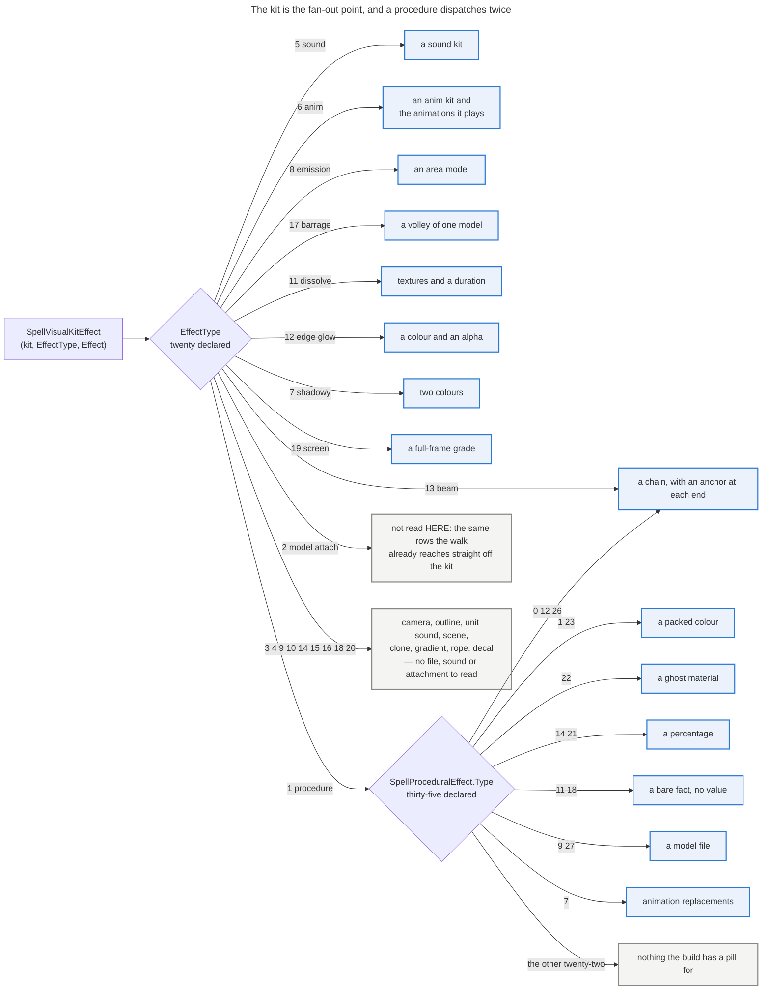

**A procedure is dispatched twice.** Its effect type says only "this is a procedure"; which *kind* it is was decided
when the procedure table was read, because that table's four generic value columns mean something different for every
type. So the second dispatch is a membership test against buckets already filled, never a second reading of the row:
the route that knows what a type means is the one that decided, and the walk does not re-decide.

### Routes that start at a visual

| route          | ends at                                             | ships as                                                                                       |
|----------------|-----------------------------------------------------|------------------------------------------------------------------------------------------------|
| **models**     | A model file plus the category naming its kind      | `modelRows`, `files`                                                                           |
| **missiles**   | A projectile, its flight path and its two anchors   | `modelRows`, `missileMotions` (each path's name and its projectile count)                      |
| **sounds**     | A sound kit, what it is for, and its audio files    | `soundRows`, `soundKitNames`, `soundTypes`                                                     |
| **animations** | An animation, an anim kit, or a body region         | `animRows`, `animKitAnims`, `animNames`, `bonesetNames`, `animEmoteOneshots`, `animEmoteLoops` |
| **chains**     | A beam: colour, textures, a sound, nested chains    | `fxRows`, `fxChains`, `fxTextures`                                                             |
| **dissolves**  | A duration, textures and an anchor                  | `fxRows`, `dissolves`                                                                          |
| **glows**      | A packed colour and an alpha                        | `fxRows`, `glows`                                                                              |
| **ghosts**     | Two packed colours and an anchor                    | `fxRows`, `shadowies`                                                                          |
| **screens**    | A full-frame colour grade, vignette and textures    | `fxRows`, `screens`                                                                            |
| **procedures** | Whatever its type says: thirteen different meanings | `fxRows`, and the tables it points into                                                        |

**Nine kinds end in a model and share almost nothing upstream.** What they share is the ending, so the kind is what
tells them apart, and it is not decoration: it says which id space the row's reference is in and which properties the
row has, so a creature display and an item can share one field instead of each adding their own.

| kind       | reached by                                           | what the row carries beside its file                  |
|------------|------------------------------------------------------|-------------------------------------------------------|
| `attached` | A kit attaching a model to a unit                    | an attachment point                                   |
| `missile`  | A visual's missile set                               | a motion, its projectile count, an anchor at each end |
| `ground`   | A kit's emitter, or a procedure naming an area model | nothing                                               |
| `trail`    | A procedure naming a weapon trail                    | nothing                                               |
| `barrage`  | A kit effect naming a volley                         | an attachment point                                   |
| `display`  | An effect name typed as a creature display           | the display id, and an attachment                     |
| `item`     | An effect name typed as an item                      | the item id and its name                              |
| `equipped` | An effect name typed as a weapon slot                | the slot, and no file at all                          |
| `mount`    | `Mount.SourceSpellID`, so not a targeted row at all  | the mount's name, and no target mask                  |

A **weapon slot is a model with no file**: eight of the effect-name types name the caster's own main hand, off hand,
ranged or ammo rather than an asset. Those carry a negative sentinel and a stand-in name, so nothing downstream needs a
special case — the sentinels and their words are one small shipped vocabulary.

**A model ships the id that places it in the world.** Epsilon exposes a gameobject display for nearly every model file,
and its spawn command reads the SIGN of the number it is given: positive means a server-side object template, negative
means a display. The pack therefore stores the negated display beside each file's path, so the value is the one a player
pastes and cannot be mistaken for the other id space. Zero means the private server has no display for that model. Like
the emote map it is a vendored cross-build source rather than drift, and the same maintenance follows: **coverage thins
for late-expansion content**, because the display table was generated once and newer models were never added to it, so
refreshing means re-reading that table.

⚠ **The name is not a substitute for the id.** The objects are named after their model files, so a name search looks
like an equivalent route — but the matching is substring, and asking for one model returns others whose names merely
contain it. The id is exact.

**An animation also ships the emote that performs it**, in two columns indexed by animation id exactly as the names are:
Epsilon's one-shot emote plays the animation once, its loop runs it until reset, and zero means there is no emote of
that kind. This is the only payload in the pack that does not describe the game build being packed. Epsilon exposes the
client's animation set as emotes, so an animation any build indexes is one a player can perform there, which is why
every pack carries the columns rather than an Epsilon-only pack. **An emote id is what every route in takes** — the
commands that play an animation are keyed by emote and none of them accepts an animation id, which is exactly the gap
these columns close. Like the sound-kit names it is a pinned cross-build source rather than drift, and it goes further:
it is vendored, because no build can regenerate it.

Three caveats belong with it, and the last two bound what a surface may claim. The pairing is **measured rather than
computed**, and the reason is *when* the private server generated it: the arithmetic covers that server's own animation
table exactly, and every animation with an emote beyond it is one downported from a later expansion, added afterwards
and placed wherever there was room. Computing the pair would therefore name an emote that plays a different animation,
and would invent one for the two the generator skipped. **What the loop looks like is a property of the animation, not
of the kind**:
running an action animation forever reads as repetition, running one that settles reads as a held pose, so the column
records which emote sustains the animation and not what sustaining it looks like. And **an emote existing does not mean
every model can perform it**, so the columns are a click-path, not a promise.

### Routes that start at an effect

A spell's effects carry its gameplay, and five visual categories start here rather than in the visual graph. The shape
is uniform — an effect or aura value selects the meaning, and a misc value on the same row is an id into whatever table
that meaning implies. The same column is a creature, a channel number or a sound kit depending only on what sits beside
it:

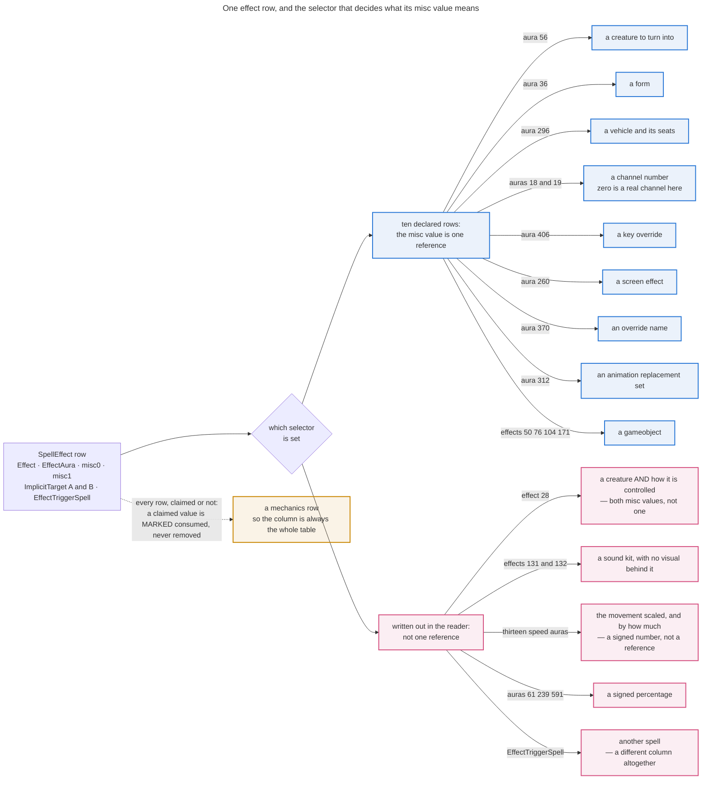

The last edge is the point: **a parsed value is marked consumed on its row rather than removed from it,** so every
effect and aura remains searchable and the mechanics column is always the whole table.

| selector               | misc value is     | ships as                                                                    |
|------------------------|-------------------|-----------------------------------------------------------------------------|
| transform aura         | a creature        | `fxRows`, `morphs`, `creatureDisplays`, `displaySkins`                      |
| shapeshift aura        | a form            | `fxRows`, `shapeshifts`                                                     |
| set-vehicle aura       | a vehicle         | `mechRows`, `vehicles`, `vehicleSeats`, and the three ridden animation sets |
| screen-effect aura     | a screen effect   | `fxRows`, `screens`                                                         |
| invisibility auras     | a channel number  | `mechRows` (`invis` and `detect` kinds)                                     |
| keybound-override aura | a key override    | `mechRows`, `keybinds`                                                      |
| anim-replacement aura  | a replacement set | `animRows` (`replace`)                                                      |
| override-name aura     | an override name  | folded into the search corpus                                               |
| summon effect          | a creature        | `fxRows`, `summons`, `creatureDisplays`, `displaySkins`                     |
| gameobject effects     | a gameobject      | `fxRows`, `objects`                                                         |
| play-sound effects     | a sound kit       | folded into `soundRows`                                                     |

Four do not fit that shape:

**A seat is reached through its vehicle, and a rider's animation carries the role it plays in.** The seat spells each
act as a start, a loop and sometimes an end — nine columns for three acts — so the pack ships the act rather than the
column: a `passenger` row in `animRows` sets one property per role (`enter`, `sit`, `exit`). One animation serving two
acts is two rows, because which act it belongs to is the question being asked; that is why the section counts more rows
than it has distinct animations. The vehicle's own animations and the seat's anim kits stay separate sets: folding them
together would file a mount's movement under what its passenger is doing.

**Speed and scale carry a number, not a reference.** The aura says which movement is scaled and the amount says by how
much. The amount is a signed percentage and the sign is stored rather than derived, because the aura's name does not
carry it: a decrease aura may hold a positive value. An amount of zero is dropped — the pill is made of nothing but the
number.

**Spell links are the one route whose payload is another spell.** A link to a spell the pack cannot name is dropped,
because the chip is an icon and a name; so is a self-link. The two directions are the same edges read from either end,
so they ship as `mechRows`' `triggers` and `origin` kinds and nowhere else — what a row stores is the word the edge
prints, whose pool is `linkKindNames`.

**Mechanics rows are what is left.** Every effect and aura a spell has, paired with the implicit targets of the row that
carried it and with both of its raw misc values. The granularity is per effect and that is a correctness property: a
search scope binds its axes to one row, so asking for an effect that is a jump *and* aims at a unit must mean a single
effect that is both.

**The misc values ship raw, because their meaning is the reader's to apply.** What a misc value refers to is a function
of the effect or aura beside it, and that pairing is already in the pack — so shipping the number turns a future axis
over one into a declaration rather than another format bump. It is not a skeleton key: a misc value that indexes a table
the pack does not carry is an id nobody can search by name, and giving it a name still means shipping its vocabulary.
Carrying them also makes the row identity finer, since two effects alike in everything the pack shows but summoning
different creatures are two rows rather than one.

**A value that reached a parsed payload is marked consumed.** It stays on its row and stays searchable; the flag only
tells the renderer that a dedicated pill already shows it, so the raw one is not drawn a second time. That makes the
mechanics column an inventory of the features not built yet — most effect and aura values are unparsed rather than
missing, and promoting one takes it out of that column on its own.

### Routes that start at the spell row

| route           | ships as                    | notes                                                        |
|-----------------|-----------------------------|--------------------------------------------------------------|
| **name**        | `spells`                    | Membership is the spell list; every route filters against it |
| **icon**        | `iconFids`, `iconNames`     | Zero means no icon, so it never displaces one already found  |
| **school**      | `spells`                    | A mask; zero is a real value meaning schoolless              |
| **attributes**  | `spellAttrs`                | Which flags ship is a declaration, not code                  |
| **delivery**    | `spellDelivery`             | Cast and channel are not a partition; many spells do both    |
| **reach**       | `spellRanges`               | A band the spell names, not a distance it carries            |
| **description** | `spellText`                 | A template, cooked to prose. See below                       |
| **area gate**   | `mechRows`, `areas`         | Where a spell may be cast at all                             |
| **expansion**   | `spells.eras`, `expansions` | The only route with no column in any shipped build           |

**Which table carries the name is the oldest drift in the project.** The name table was split out of the spell table
partway through the game's history, so older builds keep the name on the spell row. Both spellings are an id plus a
localised name column, so only the source differs — declared as an ordered list, first candidate the build has.

**Delivery is not a partition, and the counts say so.** A spell may have a cast time, may channel, may do both, or may
do neither and be instant. Drawing it as two exclusive columns would misfile every spell in the overlap, which is why
the pack ships `delivery.both` as its own count rather than leaving it to be inferred.

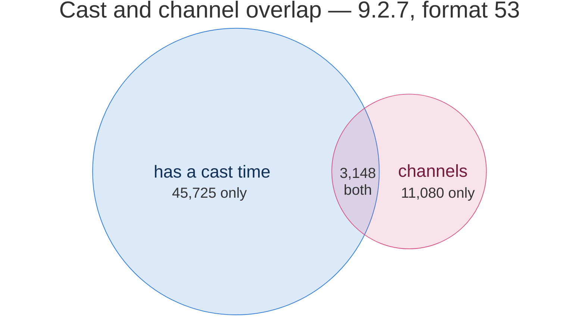

The three numbers are `delivery.casttime`, `delivery.channelled` and `delivery.both` straight from `meta.counts`, and
they reconcile: 48,873 + 14,228 − 3,148 is `spellDelivery`, 59,953. Everything else is `delivery.instant`, which is the
complement rather than a flag of its own.

**A spell names a distance band, and the band is what ships.** `SpellMisc.RangeIndex` points into `SpellRange`,
whose row is a pair of edges rather than one distance: a minimum the target must be beyond and a maximum it must be
within. A build draws on a couple of hundred distinct bands for a quarter of a million spells, so `spellRanges` ships
the bands it uses as three short columns and one band per spell in `spells.ids` order — `of`, counted from one, so
nought is a spell reaching no further than its own caster. Self is therefore the complement worked out at load, exactly
as instant is for delivery, and it is over half the game.

Two of the row's columns are deliberately dropped and two are kept as flags:

| the row says                              | what ships                                                                    |
|-------------------------------------------|-------------------------------------------------------------------------------|
| `RangeMax_0` / `RangeMin_0`, at a hostile | `maxYards` / `minYards`, rounded to a tenth — the source is float32           |
| `RangeMax_1` / `RangeMin_1`, at a friend  | nothing. They differ on a few hundred spells a build; the hostile pair ships   |
| `Flags` bit 0                             | `melee` — the distance is a placeholder for the caster's own combat reach     |
| `Flags` bit 1                             | `weapon` — the distance is a placeholder for the equipped ranged weapon's     |
| `DisplayName`                             | nothing. Mostly the distance restated in words (`Fourty-One Yards`)            |

The hostile pair is the one that ships because it is also the pair a cooked description reads for `$r`, which keeps the
printed sentence and the searchable number the same distance. `RangeMax` at 50,000 is the client's marker for a band
with no far edge; it ships verbatim and the catalogue names it `unlimited`, which is also what keeps it out of the
measured domain — left in, the far bound of every control would be fifty thousand yards.

**A description is a template, and what ships is the cooked prose.** The client resolves it at tooltip time against the
caster's own state; a template is not searchable and a rendered tooltip is not obtainable in bulk. The governing rule is
never to print a number this data cannot justify and never to leave a placeholder: a code whose value is in a table
already read is substituted, and one depending on the caster or the interface is elided, leaving the sentence around it
intact. These templates are written as English sentences with a number slotted in, so removing the number leaves prose
that reads.

**The area gate resolves to the area's own name, never its parent zone.** Rolling a multi-area group up to its
containing zone collapses most groups to one pretty word and is wrong: most cover part of a zone rather than all of it,
so the rolled-up name would be false on almost every pill it was printed on.

## Derive

Anything more than one section needs is computed once here rather than by each reader. That is what keeps the section
declarations flat, with no ordering between them and no section depending on another.

- **The graph walk.** One pass over every spell, following the spine to its kits and unioning each payload it reaches.
  Every payload bucket is the same shape — content item to target mask — so adding a kit's contribution is one operation
  rather than one per payload kind, and the walk stays a loop over kits rather than a switch over payloads. Target masks
  are resolved here; see below.
- **Display resolution.** A creature or a form to the model file behind it, which is two hops for a creature and is what
  several routes would otherwise each walk.
- **Reference collection.** Every file id anything reached, gathered into the one set worth asking the listfile about.
- **Path resolution.** That set, looked up in the listfile once.
- **The row build.** The distinct rows of all five row columns, pooled and referenced per spell.
- **The icon index,** and the other cross-route indexes a pill needs.

**They are not a list, they are a graph, and the order is only written in the code.** Nothing declares that references
needs the walk, so a build asked for one module rather than all of them cannot yet work out what it may skip — which is
the whole of what stands between this stage and a per-module build:

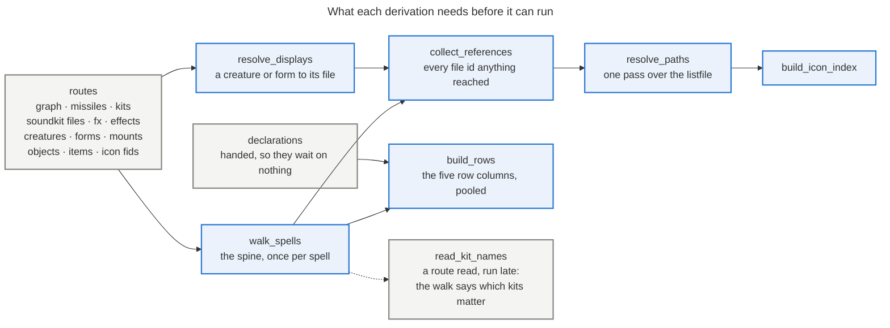

### The target mask

A row of the graph carries the audience it plays for: the caster, the target, an area, or a combination. The same
vocabulary is used by an effect's implicit target and by a visual event, because it is the same question asked of
different tables, and sharing it is what lets the two be compared at all.

The comparison matters because **the client writes "target" whenever a spell is cast at a unit, including when that unit
is the caster.** A self-buff would otherwise show a target icon for content that plays on you. So a target bit becomes a
caster bit wherever the matching test says the spell aims only at its caster: for the aura phase, believe the spell's
apply-aura effects; for every other phase, believe all of them.

**Every row the game aims somewhere ships the mask.** Several families used to carry one and drop it on the way out — a
tint, a fade, a colour drain, an animation replacement — because the pill they render did not need it. A row that cannot
say who it plays on is a row a reader cannot ask about, so the question is answerable on all of them now rather than on
the ones whose renderer happened to want it.

**Eight of the forty-three kinds declare no mask, and each has a reason that is not "nobody got round to it."** A
declared-and-empty axis reads to a user as broken rather than as empty, so a kind with no honest answer declares
nothing:

| kind                                       | why there is no mask                                                     |
|--------------------------------------------|--------------------------------------------------------------------------|
| `mount`                                    | It comes from `Mount.SourceSpellID` — a property of the mount, not a row |
| `passenger`                                | A seat's animation belongs to a role, and the role is the question       |
| `location`                                 | An area gate is where a spell may be cast, not who it plays on           |
| `freeze` `camo` `tracking` `pose` `debuff` | Valueless: the kind IS the fact, so there is no row to aim               |

## Declare

Every section is one record: its name, what fills it, which columns it has, how each column is laid out, which counts
and measured domains it contributes, whether its values are locale text, which source tables it needs, and whether it
ships per build or once across builds.

From that one record come the assembly, the counts, the domains, the module the section lands in, the locale overlay and
the generated documentation — so a new axis is a declaration rather than an edit in six places.

**A numeric axis declares what its numbers ARE.** A measured domain carries the storage unit beside the bounds — `ms`
for a cast or a channel, `%` for a size change, a speed change, a fade or a colour drain — because every consumer that
printed one used to carry its own divisor, which is one fact written three times and three chances to disagree. An axis
with nothing to convert declares no unit: a count, an id and an index are already what they look like.

**Naming a section's source tables is what makes drift computable.** A section whose tables are absent switches itself
off and says so, rather than a reader branching on the build.

### Drift between builds

Building an older version is mostly a story of things that do not exist yet. Every difference is declared, and the kinds
are distinct because they fail differently:

| the difference                | declared as                           | what happens                                        |
|-------------------------------|---------------------------------------|-----------------------------------------------------|
| The table postdates the build | An optional table, naming its feature | The reader yields nothing; the feature switches off |
| A column postdates the build  | An optional column, naming a default  | The declared default stands in                      |
| The data moved between tables | An ordered list of candidates         | The first candidate this build has wins             |
| An enum value's name differs  | Per-build guards on the enum file     | The name resolves per build                         |
| A whole source is absent      | A release map                         | Routes needing it degrade, declared                 |
| The array shape changed       | Nothing — the header is read          | Handled by reading                                  |
| The values differ             | Nothing — measured per pack           | Bounds taken from one build are wrong on the others |
| **Anything undeclared**       | —                                     | **The build fails loudly**                          |

Two shapes are not drift and must not be filed as it. A **pinned cross-build source** deliberately reads a different
build, which is a property of the route rather than of this build. And a version that cannot be expressed at all is a
roster decision: the game renormalised its spell-visual schema once, and a build predating that has no definition for
several required tables, which no declaration can paper over.

## Emit

The pack is column-oriented: a section is parallel arrays rather than a list of objects, because the app wants a column
at a time and repeated keys cost more than they explain. Text that repeats is deduplicated into a value table plus an
index — descriptions collapse to roughly two-thirds of their distinct count that way.

A column declares what KIND of mapping it carries — total, partial, or shared between many rows — and one policy turns
that into a layout for the whole build at once. **A partial column is padded rather than skipped, and that is a
measurement rather than a default**: gzip crushes a run of repeated fillers to almost nothing while the row indexes that
would replace them are incompressible, so skipping the padding costs just under a megabyte to save a reader walking
entries nobody is waiting on. Both policies are declared; the smaller one ships.

### Modules

A pack is a `manifest.json` naming the module files it is made of. Which module a column lands in follows from what the
column is:

| module      | holds                                                          |
|-------------|----------------------------------------------------------------|
| `core`      | structure, ids, and every searchable column                    |
| `names`     | the game's own language — spell, item, area and creature names |
| `text`      | cooked prose, the one body with a deferral story               |
| `universal` | the vocabularies that come out identical on every build        |

A section is not necessarily one module's worth: the columns it declares localizable leave for the locale module while
its ids stay with the structure, so a reader wanting another language fetches one file rather than a second copy of
every id. The section keeps its name in both, and joining them is reading two objects under the same key.

**A module is named by its own content hash**, which is what makes sharing fall out instead of being arranged: two
builds whose sections serialise alike name one file and both manifests point at it, and a build that diverges gets its
own name with no special case. That is why `universal` is a module like any other rather than a second mechanism, and
why nothing here is a union — a union would force every reader to fetch what all builds reference.

The manifest names each module by file and size, states the pack's format and build date so a reader learns both before
committing to a download, and lists the sections this build ships without — so "this build never had it" is
distinguishable from "this pack is broken". Every module file lives in one shared directory, because a module is named
by its own content and two packs land on one file exactly when their bytes agree.

### Languages

**The language is an axis of the build beside the game version, and English is one value of it rather than the base.**
The manifest names the structure modules apart from the ones holding a language, and keys the second group by language
code, so choosing a language is choosing one entry of `locales` and changes nothing about `modules`:

```json
{
  "modules": {
    "core": {
      "file": "…"
    },
    "universal": {
      "file": "…"
    }
  },
  "locales": {
    "enUS": {
      "names": {
        "file": "…"
      },
      "text": {
        "file": "…"
      }
    },
    "ruRU": {
      "names": {
        "file": "…"
      },
      "text": {
        "file": "…"
      }
    }
  }
}
```

Nine tables have a route reading a translated column from them, and a language costs a second pass over eight — the
ninth is the declared exception below. Everything else in the roster says the same thing in every language, so a
language is those eight downloads rather than sixty-four. The ids, the graph walk and the listfile resolution are the
build's own, read once, which is what lets the two halves of a split section be joined by position. The build checks
that outright: a language pass produces every column of every section that ships language, and a column the language
does not touch coming out different fails the build rather than shipping names that belong to other ids.

Three things in the pipeline follow from that and are worth knowing before adding a language or a route:

- **A table is fetched per language because a route reads a `_lang` column from it**, not because the pack ships that
  column. The area's map button is the map *named the same* as the area, so reading one of those two names in a
  different language than the other matches nothing at all. `check_localized_tables` holds the roster and the routes
  together.
- **A derived id must not be re-derived per language.** The same map join is the case: two maps of one place tie, and
  the tie breaks on the spelling. The build's own answer is handed to every language.
- **The server's own names are a keyed overlay, not a substitution.** Its `*_locale` tables hold every language at once,
  so reading one is refusing the rest — the same merge that applies a hotfix, with the admission rule reading a language
  code instead of a build stamp. A row that carries no translation leaves the untranslated name standing, because a
  translation table has a row per entry per language whether or not anyone got to it.

**Not every client publishes every language.** Blizzard's do, and say nothing; a private client need not — one that
ships English alone names that on its roster row, and asking its tables for another would fetch nothing and leave the
pack claiming a language it has not got. So which languages a pack ships is a declaration beside its build id rather
than something the builder probes for, and the default language is built whether or not the row names it — every pack
has it, which is what lets a reader fall back to it without checking.

**What a language is CALLED is the interface's business, not the pack's.** The artifact carries codes and string values;
naming a language in the reader's own language is the interface saying something about itself, and it has its own string
catalogue for that.

⚠ **One thing that looks like the interface's job and is not: the unit word inside a cooked description.** A duration on
an axis ships as a number with a declared unit and is formatted by whoever draws it. A duration inside a description was
resolved at build time, because descriptions are cooked to prose so they can be searched as text — so the word sits in
the middle of a sentence the game wrote, and it has to be in that sentence's language. Which word each client uses is
read from how its own templates word a duration beside a number; the same measurement over the English templates returns
what the English cooker already supplied, which is what makes it evidence rather than a guess.

Adding a language is one row in the build's locale roster, plus a grammar for the cooker where its plural rules or its
duration words are not already covered.

Beside the sections, `meta` ships the facts nothing downstream should have to re-derive:

| key                | is                                                                     |
|--------------------|------------------------------------------------------------------------|
| `format`           | The pack format; a bump means every consumer is re-read                |
| `version`          | The game build packed, and `label` its human name                      |
| `built`            | When, so a rebuild is visible                                          |
| `listfileTag`      | Which listfile release named the files                                 |
| `tdbTag`           | Which server release supplied names and hotfixes, if any               |
| `absentTables`     | What this build did not have, so absence is reportable                 |
| `degradedSections` | Per shipped section, the absent tables thinning it below its full self |
| `counts`           | Every population, so nothing counts a column at load                   |
| `domains`          | The measured range of each numeric axis, so no control re-derives it   |

A section may also be absent outright rather than thin: one whose declared `needs` a build predates ships absent, and
the manifest's `absentSections` names it — so "this build never had it" and "this pack is broken" stay two different
claims, and a section that merely matched nothing keeps shipping as the empty answer it is.

`versions.json` names every shipped build and points each at its manifest, with a content hash over that manifest —
which is what busts a cache without a version string to bump. The modules underneath need no busting at all, since their
names already change exactly when their bytes do; the manifest is the one file whose name is fixed, and because it names
every module its hash moves whenever any of them does.

Two roster lines sitting on one build — a test line level with live — each get their own manifest, and both name the
same module files. Nothing declares that: their sections encode to the same bytes, so they resolve to the same
content-addressed names. The day the builds diverge, so do the modules.

## Index, query, render

The browser fetches one pack and builds **inverted indexes over the whole vocabulary at load**. That is the reason
almost nothing is deferred: a column that has not arrived does not make a search slower, it makes it answer *wrong* —
fewer hits than exist — which is worse than a slower load.

A query is text, which becomes chips, which become a matcher. Rendering turns a matched row into cells and pills, where
a pill is a small record — a word, a tone, sometimes an icon and a target marker — rather than markup, so the same
record can also become an export line or a copied command.

## Runtime hotlinks

The only things fetched after load, and only when a reader asks:

| on                      | fetches                                  |
|-------------------------|------------------------------------------|
| A row appearing         | The spell's icon                         |
| Hovering a texture pill | A `.blp` preview, decoded in the browser |
| Clicking a sound        | The audio file                           |
| Clicking a model        | An external 3D viewer, in a new tab      |
| Hovering a spell link   | The external spell page's own tooltip    |

The house rule is that these are fetched on an explicit hover or click, never preloaded and never in bulk. There is no
affirmative licence for any of them; the footing is tolerated hotlinking, and behaving like a bulk downloader is what
would end it.

## One datum, end to end

A polymorph turns its target into a sheep, and the app shows the sheep's model. Every stage above is involved.

| stage       | what happens to it                                                                                                                   |
|-------------|--------------------------------------------------------------------------------------------------------------------------------------|
| **acquire** | `SpellEffect`, `CreatureDisplayInfo` and `CreatureModelData` are downloaded; the server release is distilled; the listfile is cached |
| **provide** | Those tables are served as rows, with any hotfix rows merged in per column                                                           |
| **read**    | The effect row's aura says *transform*, so its misc value is read as a creature rather than as a number                              |
| **read**    | The creature's *name* comes from the server world table; without a release it stays a raw id, declared                               |
| **read**    | The creature's displays resolve through display to model data to a file id — two hops, because several displays share one model      |
| **read**    | Each display's own texture slots name the skins it paints over that model, read off the header because their number varies by build  |
| **derive**  | The walk records the pair against the spell, unioning the target mask from the effect's implicit targets                             |
| **derive**  | The file id is resolved to an asset path through the listfile                                                                        |
| **declare** | It belongs to the `morph` kind of `fxRows`; `morphs` carries the name, `creatureDisplays` the displays and models, `displaySkins` the skins |
| **emit**    | Those become parallel columns, gzipped, hashed into `versions.json`                                                                  |
| **index**   | The browser indexes the path and the creature name alongside every other model's                                                     |
| **query**   | `model:sheep` matches the *path*, because category searches match filenames as well as the category word                             |
| **render**  | A model pill, carrying the target icon the mask decided                                                                              |
| **hotlink** | Hovering it fetches the texture preview; clicking opens the external viewer                                                          |

## Adding a route

This document is meant to grow by rows, not by paragraphs. A new axis touches exactly four places here, and if it needs
a fifth the document has drifted and should be reshaped rather than appended to.

| when you add                               | edit                                                                      |
|--------------------------------------------|---------------------------------------------------------------------------|
| A route from a visual, effect or spell row | One row in that family's table under [Read](#read)                        |
| A new source table it joins through        | One row in the joins table under [At the source](#at-the-source)          |
| A new pack section                         | One row in the shipped-shape table, naming which of the four shapes it is |
| Something a reader can see                 | One row in [Quick reference](#quick-reference)                            |

Three rules keep that true:

- **A route appears once per table, never twice in prose.** If a route needs explaining beyond its row, the explanation
  goes under the family heading it belongs to, not into a new section of its own.
- **The diagrams are grouped, not exhaustive.** They show every *kind* of hop, not every table. A new route that is the
  tenth of an existing kind changes no diagram; one that introduces a genuinely new kind of hop changes exactly one.
- **Numbers stay out.** Populations and measurements belong in `DECISIONS.md` and the exploration database, because a
  count written here is stale at the next pack rebuild and nothing checks it. What belongs here is the *shape*, which
  changes only when the data model does.

The declaration side of this is enforced rather than remembered: a section that ships without being read, or a selector
that stops being covered, fails `tools/check.py` rather than silently disagreeing with this page.

## Quick reference

Where a shown thing comes from, by what the reader sees:

| the reader sees   | it came from                                                          |
|-------------------|-----------------------------------------------------------------------|
| The spell's name  | The client's spell-name table, hotfixes applied                       |
| The icon          | The spell's misc row, base difficulty winning                         |
| A model pill      | One of nine model kinds; the kind says which id space it is in        |
| A missile pill    | The visual's missile set, with the row's anchors beating the visual's |
| A sound pill      | A kit, reached five ways, resolved to its audio files                 |
| An animation pill | An index into the community name list, not a table key                |
| A morph's name    | The server world tables; absent without a release, and declared so    |
| A colour          | A packed value from a chain, glow, ghost or procedure row             |
| A percentage      | An effect's amount, signed, with zero dropped                         |
| The description   | A template cooked to prose at build time                              |
| An area name      | The area's own name, never its parent zone                            |
| A target icon     | The mask on the row, with self-cast resolved                          |
