# Route reference

<!-- Generated by tools/routes.py and by every build of the default pack. Edit the declaration, not this. -->

Every field the build derives and every section it ships, written from the declarations themselves: nothing here is
typed by hand, and the repository check fails when this file and the code disagree. A field's note is the docstring
under its line in `build/pack/routes/flows.py`, or its function's docstring; a section's is its `doc`; a family's is
its module's docstring. Change the note there and the next build rewrites it here. Why the routes are shaped the way
they are is [DATA_ROUTES.md](../DATA_ROUTES.md).

132 fields, 112 of them flows and 20 functions; 87 sections in 19 families; 82 tables. The numbers are the manifest
counts of `9.2.7-epsilon.45745`.

Every field has an entry under [Fields](#fields), headed by its own name, so `#name` links to it. Every section is a row
in its family's table, and every table a line under [Tables](#tables). `python tools/routes.py --upstream <name>` and
`--downstream <name>` walk the same graph from any table, field or section, as text.

## How to read a diagram

A family draws its sections, the fields they read, and what those fields read in turn, as far as the fields that
belong to it. A field reaching the sections of several families is shared: a family draws it as a grey stub, and it is
drawn in full under [Shared fields](#shared-fields), with the shared field it feeds. A table's rows are the build's own
client tables unless its outline is dashed, which marks the server dump: stock TrinityCore, not any private server.

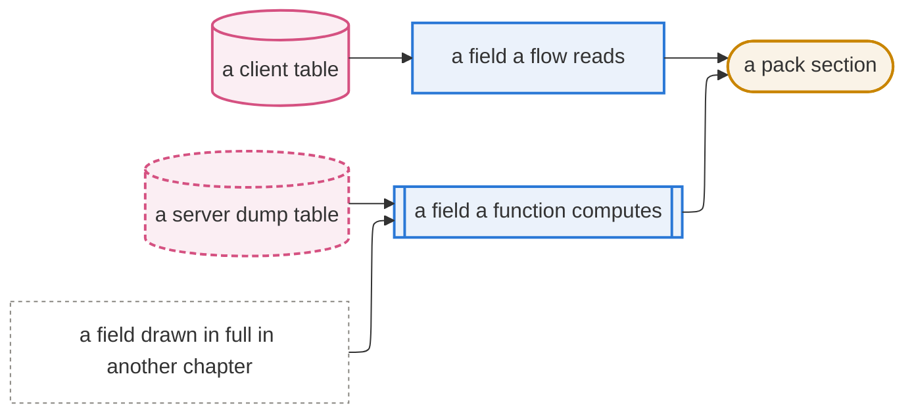
```mermaid
---
config:
  layout: elk
---
flowchart LR
    t_client[(a client table)] --> f_flow[a field a flow reads]
    t_server[(a server dump table)] --> f_computed[[a field a function computes]]
    f_elsewhere[a field drawn in full in another chapter] --> f_computed
    f_flow --> s_section([a pack section])
    f_computed --> s_section
    classDef table fill:#d5518118,stroke:#d55181,stroke-width:2px
    classDef server fill:#d5518118,stroke:#d55181,stroke-width:2px,stroke-dasharray:5 3
    classDef field fill:#2a78d618,stroke:#2a78d6,stroke-width:2px
    classDef elsewhere fill:none,stroke:#898781,stroke-width:1px,stroke-dasharray:3 3
    classDef section fill:#c9850018,stroke:#c98500,stroke-width:2px
    class t_client table
    class t_server server
    class f_flow,f_computed field
    class f_elsewhere elsewhere
    class s_section section
```

## Families

### anims family

Animations: the kits, what they segment, what they swap, and how to perform one.

Four routes reach an animation and they are kept apart because they read differently on a pill: a kit groups its
segments, a replacement is a pair, a visual animation is loose, and the emote columns are not about the build at all but
about what a player can ask for.

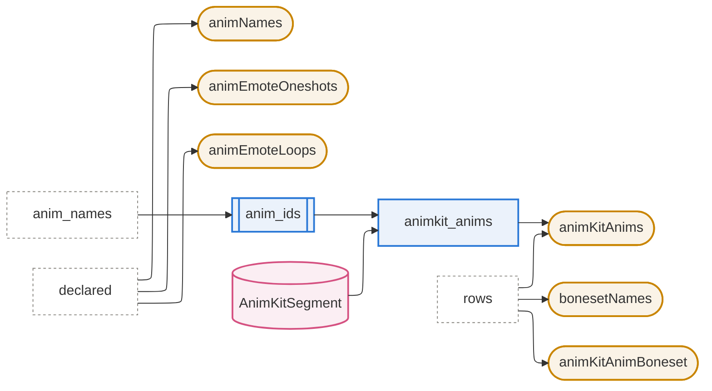
```mermaid
---
config:
  layout: elk
---
flowchart LR
    s_animKitAnims([animKitAnims])
    s_bonesetNames([bonesetNames])
    s_animKitAnimBoneset([animKitAnimBoneset])
    s_animNames([animNames])
    s_animEmoteOneshots([animEmoteOneshots])
    s_animEmoteLoops([animEmoteLoops])
    f_animkit_anims[animkit_anims]
    f_anim_ids[[anim_ids]]
    f_rows[rows]
    t_AnimKitSegment[(AnimKitSegment)]
    f_anim_names[anim_names]
    f_declared[declared]
    f_rows --> s_animKitAnims
    f_animkit_anims --> s_animKitAnims
    t_AnimKitSegment --> f_animkit_anims
    f_anim_ids --> f_animkit_anims
    f_anim_names --> f_anim_ids
    f_rows --> s_bonesetNames
    f_rows --> s_animKitAnimBoneset
    f_declared --> s_animNames
    f_declared --> s_animEmoteOneshots
    f_declared --> s_animEmoteLoops
    classDef table fill:#d5518118,stroke:#d55181,stroke-width:2px
    classDef server fill:#d5518118,stroke:#d55181,stroke-width:2px,stroke-dasharray:5 3
    classDef field fill:#2a78d618,stroke:#2a78d6,stroke-width:2px
    classDef elsewhere fill:none,stroke:#898781,stroke-width:1px,stroke-dasharray:3 3
    classDef section fill:#c9850018,stroke:#c98500,stroke-width:2px
    class s_animKitAnims,s_bonesetNames,s_animKitAnimBoneset,s_animNames,s_animEmoteOneshots,s_animEmoteLoops section
    class f_animkit_anims,f_anim_ids field
    class f_rows,f_anim_names,f_declared elsewhere
    class t_AnimKitSegment table
```

| section              | module    |      on the pack | reads                                                 | what it is                                                            |
|----------------------|-----------|-----------------:|-------------------------------------------------------|-----------------------------------------------------------------------|
| `animKitAnims`       | core      |           17,529 | [`rows`](#rows) and [`animkit_anims`](#animkit_anims) | Which animations each anim kit a spell reaches is made of.            |
| `bonesetNames`       | core      |                  | [`rows`](#rows)                                       | The body regions an animation can be confined to, pooled.             |
| `animKitAnimBoneset` | core      |            4,353 | [`rows`](#rows)                                       | Which body region each of a kit's animations moves.                   |
| `animNames`          | universal |                  | [`declared`](#declared)                               | Every animation's name, indexed by animation id.                      |
| `animEmoteOneshots`  | universal | 1,730 animEmotes | [`declared`](#declared)                               | The Epsilon emote that performs each animation once, by animation id. |
| `animEmoteLoops`     | universal |                  | [`declared`](#declared)                               | The Epsilon emote that holds each animation, by animation id.         |

### assets family

The asset tables: which files the pack names, and how to place them.

Two sections and one shape: an id column and whatever the pack can say about the id. `files` is every asset a spell
reaches; the icon tables are the same idea for a picture, kept apart because an icon is reduced to a name rather than
shipped as a path.

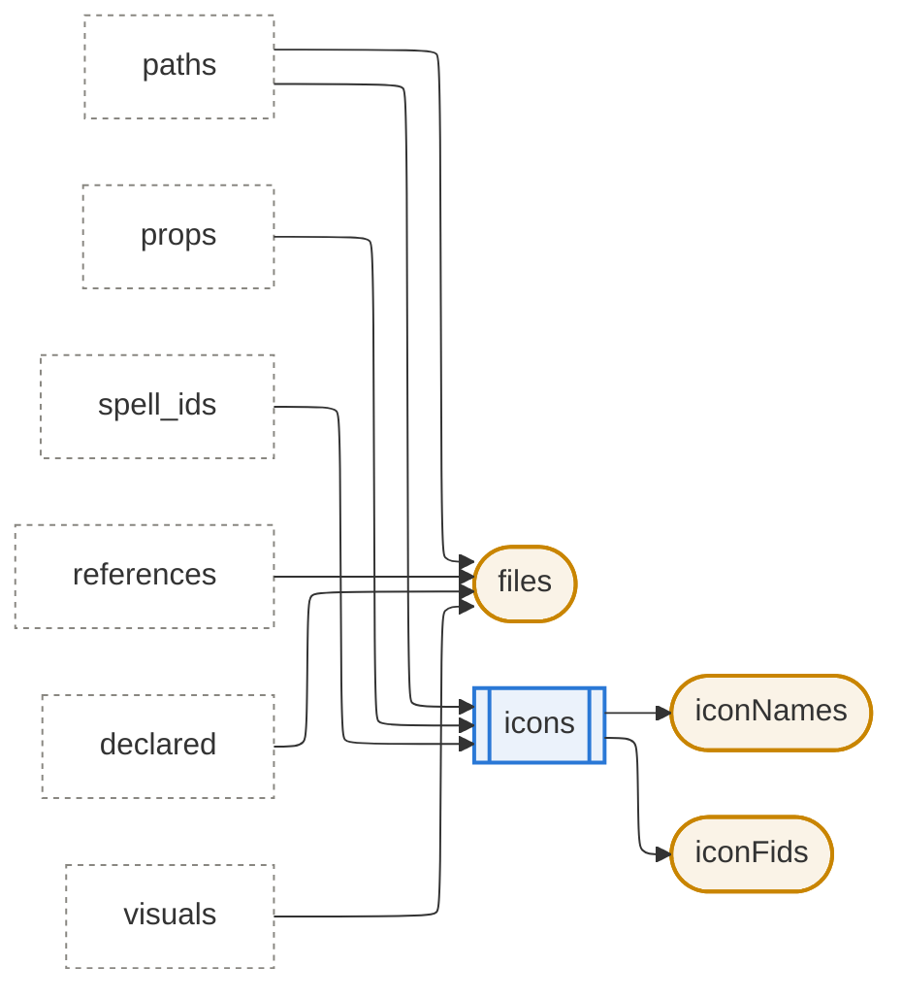
```mermaid
---
config:
  layout: elk
---
flowchart LR
    s_iconNames([iconNames])
    s_iconFids([iconFids])
    s_files([files])
    f_icons[[icons]]
    f_paths[paths]
    f_props[props]
    f_spell_ids[spell_ids]
    f_references[references]
    f_declared[declared]
    f_visuals[visuals]
    f_icons --> s_iconNames
    f_paths --> f_icons
    f_props --> f_icons
    f_spell_ids --> f_icons
    f_icons --> s_iconFids
    f_references --> s_files
    f_paths --> s_files
    f_declared --> s_files
    f_visuals --> s_files
    classDef table fill:#d5518118,stroke:#d55181,stroke-width:2px
    classDef server fill:#d5518118,stroke:#d55181,stroke-width:2px,stroke-dasharray:5 3
    classDef field fill:#2a78d618,stroke:#2a78d6,stroke-width:2px
    classDef elsewhere fill:none,stroke:#898781,stroke-width:1px,stroke-dasharray:3 3
    classDef section fill:#c9850018,stroke:#c98500,stroke-width:2px
    class s_iconNames,s_iconFids,s_files section
    class f_icons field
    class f_paths,f_props,f_spell_ids,f_references,f_declared,f_visuals elsewhere
```

| section     | module | on the pack | reads                                                                                              | what it is                                                                 |
|-------------|--------|------------:|----------------------------------------------------------------------------------------------------|----------------------------------------------------------------------------|
| `iconNames` | core   | 9,847 icons | [`icons`](#icons)                                                                                  | Each distinct icon name, the key the icon CDN serves it under.             |
| `iconFids`  | core   |             | [`icons`](#icons)                                                                                  | The file id behind each icon name, parallel to iconNames.                  |
| `files`     | core   |      40,786 | [`references`](#references), [`paths`](#paths), [`declared`](#declared), and [`visuals`](#visuals) | Every asset the build references, its path, and the object that places it. |

### entities family

The things a spell turns into, rides, summons or places in the world.

Five routes with one shape between them: a link from the spell to an entity, and a payload naming that entity. They are
separate sections because the id spaces are separate — a creature, a mount display, a form, an object entry -- and a
pill has to say which one it is holding.

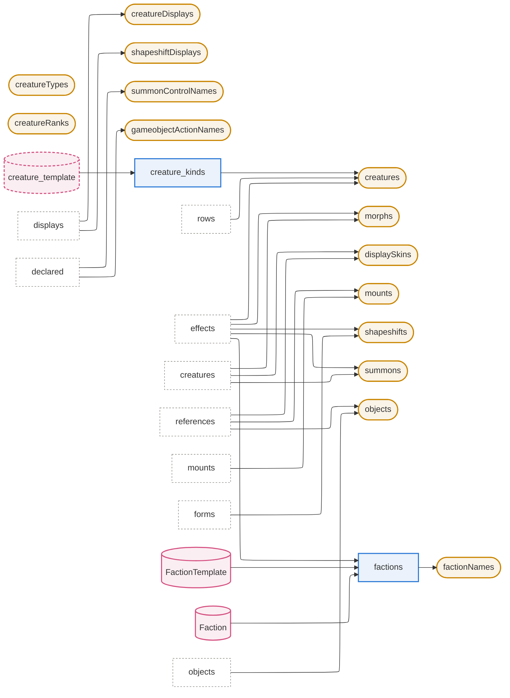
```mermaid
---
config:
  layout: elk
---
flowchart LR
    s_creatures([creatures])
    s_creatureTypes([creatureTypes])
    s_creatureRanks([creatureRanks])
    s_morphs([morphs])
    s_creatureDisplays([creatureDisplays])
    s_displaySkins([displaySkins])
    s_mounts([mounts])
    s_shapeshifts([shapeshifts])
    s_shapeshiftDisplays([shapeshiftDisplays])
    s_summons([summons])
    s_summonControlNames([summonControlNames])
    s_gameobjectActionNames([gameobjectActionNames])
    s_factionNames([factionNames])
    s_objects([objects])
    f_creature_kinds[creature_kinds]
    f_factions[factions]
    f_rows[rows]
    f_effects[effects]
    t_creature_template[(creature_template)]
    f_creatures[creatures]
    f_displays[displays]
    f_references[references]
    f_mounts[mounts]
    f_forms[forms]
    f_declared[declared]
    t_FactionTemplate[(FactionTemplate)]
    t_Faction[(Faction)]
    f_objects[objects]
    f_rows --> s_creatures
    f_effects --> s_creatures
    f_creature_kinds --> s_creatures
    t_creature_template --> f_creature_kinds
    f_effects --> s_morphs
    f_creatures --> s_morphs
    f_displays --> s_creatureDisplays
    f_references --> s_displaySkins
    f_creatures --> s_displaySkins
    f_mounts --> s_mounts
    f_references --> s_mounts
    f_effects --> s_shapeshifts
    f_forms --> s_shapeshifts
    f_displays --> s_shapeshiftDisplays
    f_effects --> s_summons
    f_creatures --> s_summons
    f_declared --> s_summonControlNames
    f_declared --> s_gameobjectActionNames
    f_factions --> s_factionNames
    t_FactionTemplate --> f_factions
    t_Faction --> f_factions
    f_effects --> f_factions
    f_references --> s_objects
    f_objects --> s_objects
    classDef table fill:#d5518118,stroke:#d55181,stroke-width:2px
    classDef server fill:#d5518118,stroke:#d55181,stroke-width:2px,stroke-dasharray:5 3
    classDef field fill:#2a78d618,stroke:#2a78d6,stroke-width:2px
    classDef elsewhere fill:none,stroke:#898781,stroke-width:1px,stroke-dasharray:3 3
    classDef section fill:#c9850018,stroke:#c98500,stroke-width:2px
    class s_creatures,s_creatureTypes,s_creatureRanks,s_morphs,s_creatureDisplays,s_displaySkins,s_mounts,s_shapeshifts,s_shapeshiftDisplays,s_summons,s_summonControlNames,s_gameobjectActionNames,s_factionNames,s_objects section
    class f_creature_kinds,f_factions field
    class f_rows,f_effects,f_creatures,f_displays,f_references,f_mounts,f_forms,f_declared,f_objects elsewhere
    class t_creature_template server
    class t_FactionTemplate,t_Faction table
```

| section                 | module             | on the pack | reads                                                                           | what it is                                                                                      |
|-------------------------|--------------------|------------:|---------------------------------------------------------------------------------|-------------------------------------------------------------------------------------------------|
| `creatures`             | core               |      27,230 | [`rows`](#rows), [`effects`](#effects), and [`creature_kinds`](#creature_kinds) | What the server bills each named creature as: its type, its rank and the faction it belongs to. |
| `creatureTypes`         | universal          |             | nothing derived                                                                 | The word for each creature type, keyed by the value a creature carries.                         |
| `creatureRanks`         | universal          |             | nothing derived                                                                 | The word for each creature rank, from normal up to world boss.                                  |
| `morphs`                | core, per language |       2,419 | [`effects`](#effects) and [`creatures`](#creatures)                             | The name of each creature a spell morphs into.                                                  |
| `creatureDisplays`      | core               |      27,545 | [`displays`](#displays)                                                         | The displays each morphed or summoned creature can wear, and their models.                      |
| `displaySkins`          | core               |      13,752 | [`references`](#references) and [`creatures`](#creatures)                       | The textures each named creature display paints over its model.                                 |
| `mounts`                | core, per language |         994 | [`mounts`](#mounts) and [`references`](#references)                             | Each reached mount display's name and model file.                                               |
| `shapeshifts`           | core, per language |             | [`effects`](#effects) and [`forms`](#forms)                                     | The name of each shapeshift form a spell reaches.                                               |
| `shapeshiftDisplays`    | core               |          18 | [`displays`](#displays)                                                         | The models each shapeshift form can wear.                                                       |
| `summons`               | core, per language |      17,453 | [`effects`](#effects) and [`creatures`](#creatures)                             | The name of each summoned creature.                                                             |
| `summonControlNames`    | universal          |             | [`declared`](#declared)                                                         | The word each summon control value renders as.                                                  |
| `gameobjectActionNames` | universal          |             | [`declared`](#declared)                                                         | The word each gameobject action value renders as.                                               |
| `factionNames`          | core, per language |          82 | [`factions`](#factions)                                                         | Each faction template a spell sets, named through its faction, with its group.                  |
| `objects`               | core, per language |       1,186 | [`references`](#references) and [`objects`](#objects)                           | Each placed object's name, model file and type.                                                 |

- `creatures` ships absent from a build without `creature_template`.
- `morphs` ships thinner from a build without `creature_template`.
- `mounts` ships absent from a build without `Mount`.
- `mounts` ships thinner from a build without `MountXDisplay`.
- `shapeshifts` ships absent from a build without `SpellShapeshiftForm`.
- `shapeshiftDisplays` ships absent from a build without `SpellShapeshiftForm`.
- `summons` ships thinner from a build without `creature_template`.
- `objects` ships thinner from a build without `gameobject_template` and `GameObjectDisplayInfo`.

### expansions family

The expansion ladder, oldest first: what `spells.eras` indexes into.

Everything the app needs to render and search an expansion travels here rather than being restated in the frontend — the
display short, the words the search accepts, the site that era's links go to, and any caveat about its data. Adding an
expansion is a row in the tool that writes the ladder and nothing here.

`UNIVERSAL` because the ladder is a fact about the game's history rather than about the build being packed: every pack
that ships it ships the same bytes, so they name one file and fetch it once.

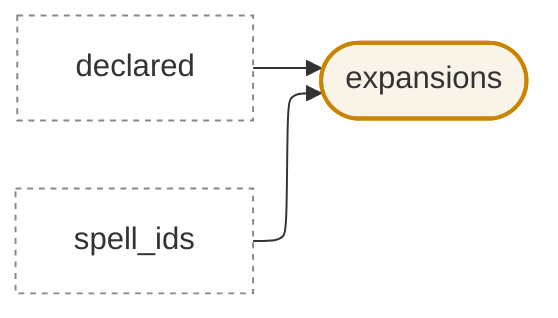
```mermaid
---
config:
  layout: elk
---
flowchart LR
    s_expansions([expansions])
    f_declared[declared]
    f_spell_ids[spell_ids]
    f_declared --> s_expansions
    f_spell_ids --> s_expansions
    classDef table fill:#d5518118,stroke:#d55181,stroke-width:2px
    classDef server fill:#d5518118,stroke:#d55181,stroke-width:2px,stroke-dasharray:5 3
    classDef field fill:#2a78d618,stroke:#2a78d6,stroke-width:2px
    classDef elsewhere fill:none,stroke:#898781,stroke-width:1px,stroke-dasharray:3 3
    classDef section fill:#c9850018,stroke:#c98500,stroke-width:2px
    class s_expansions section
    class f_declared,f_spell_ids elsewhere
```

| section      | module    | on the pack | reads                                                 | what it is                                                         |
|--------------|-----------|------------:|-------------------------------------------------------|--------------------------------------------------------------------|
| `expansions` | universal |             | [`declared`](#declared) and [`spell_ids`](#spell_ids) | The expansion ladder oldest first, which spells.eras indexes into. |

### fx family

The visual effects a spell wears: chains, dissolves, and the colour families.

Several of these are one shape repeated — a spell-to-row link, the distinct rows, and what each row looks like — because
that is genuinely what the game has: unrelated effect tables that all amount to a colour. They stay declared apart
rather than merged, since each names its rows in its own id space and a reader that merged them could not say which
table a row came from.

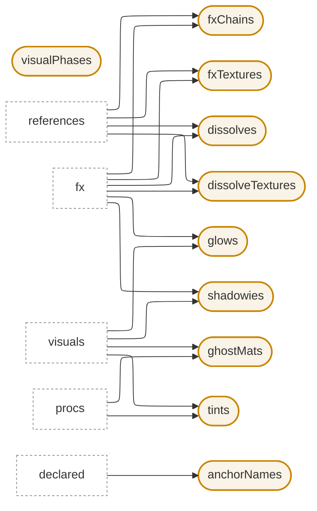
```mermaid
---
config:
  layout: elk
---
flowchart LR
    s_fxChains([fxChains])
    s_fxTextures([fxTextures])
    s_dissolves([dissolves])
    s_dissolveTextures([dissolveTextures])
    s_glows([glows])
    s_shadowies([shadowies])
    s_ghostMats([ghostMats])
    s_tints([tints])
    s_anchorNames([anchorNames])
    s_visualPhases([visualPhases])
    f_references[references]
    f_fx[fx]
    f_visuals[visuals]
    f_procs[procs]
    f_declared[declared]
    f_references --> s_fxChains
    f_fx --> s_fxChains
    f_references --> s_fxTextures
    f_fx --> s_fxTextures
    f_references --> s_dissolves
    f_fx --> s_dissolves
    f_references --> s_dissolveTextures
    f_fx --> s_dissolveTextures
    f_visuals --> s_glows
    f_fx --> s_glows
    f_visuals --> s_shadowies
    f_fx --> s_shadowies
    f_visuals --> s_ghostMats
    f_procs --> s_ghostMats
    f_visuals --> s_tints
    f_procs --> s_tints
    f_declared --> s_anchorNames
    classDef table fill:#d5518118,stroke:#d55181,stroke-width:2px
    classDef server fill:#d5518118,stroke:#d55181,stroke-width:2px,stroke-dasharray:5 3
    classDef field fill:#2a78d618,stroke:#2a78d6,stroke-width:2px
    classDef elsewhere fill:none,stroke:#898781,stroke-width:1px,stroke-dasharray:3 3
    classDef section fill:#c9850018,stroke:#c98500,stroke-width:2px
    class s_fxChains,s_fxTextures,s_dissolves,s_dissolveTextures,s_glows,s_shadowies,s_ghostMats,s_tints,s_anchorNames,s_visualPhases section
    class f_references,f_fx,f_visuals,f_procs,f_declared elsewhere
```

| section            | module    | on the pack | reads                                       | what it is                                                                  |
|--------------------|-----------|------------:|---------------------------------------------|-----------------------------------------------------------------------------|
| `fxChains`         | core      |       4,485 | [`references`](#references) and [`fx`](#fx) | Each drawn chain's tint, and the hue word it is searched by.                |
| `fxTextures`       | core      |             | [`references`](#references) and [`fx`](#fx) | The textures each drawn chain paints with.                                  |
| `dissolves`        | core      |         724 | [`references`](#references) and [`fx`](#fx) | Each dissolve row's duration and where on the model it is anchored.         |
| `dissolveTextures` | core      |             | [`references`](#references) and [`fx`](#fx) | The textures each dissolve blends through.                                  |
| `glows`            | core      |       1,716 | [`visuals`](#visuals) and [`fx`](#fx)       | Each edge glow's colour and opacity.                                        |
| `shadowies`        | core      |         384 | [`visuals`](#visuals) and [`fx`](#fx)       | Each shadowy effect's two colours and where it is anchored.                 |
| `ghostMats`        | core      |         470 | [`visuals`](#visuals) and [`procs`](#procs) | Each ghost material's colour.                                               |
| `tints`            | core      |       2,263 | [`visuals`](#visuals) and [`procs`](#procs) | Each model tint's colour.                                                   |
| `anchorNames`      | universal |             | [`declared`](#declared)                     | Where an overlay is anchored: a point on the model, or the whole of it.     |
| `visualPhases`     | universal |             | nothing derived                             | The word for each phase of a spell, by the event id every timed row stores. |

- `dissolves` ships absent from a build without `DissolveEffect`.
- `dissolveTextures` ships absent from a build without `DissolveEffect`.
- `dissolveTextures` ships thinner from a build without `TextureBlendSet`.
- `glows` ships absent from a build without `EdgeGlowEffect`.
- `shadowies` ships absent from a build without `ShadowyEffect`.

### gates family

What stops a spell, times it, reaches with it, or places it.

Four routes that answer "can I cast this, and what happens when I do" rather than "what does it look like".

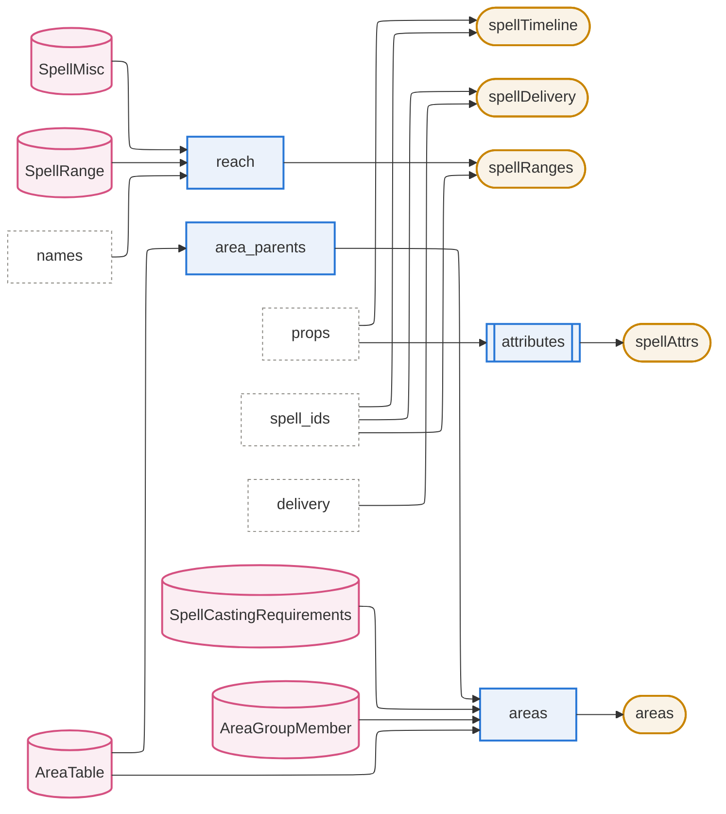
```mermaid
---
config:
  layout: elk
---
flowchart LR
    s_spellAttrs([spellAttrs])
    s_spellTimeline([spellTimeline])
    s_spellDelivery([spellDelivery])
    s_spellRanges([spellRanges])
    s_areas([areas])
    f_attributes[[attributes]]
    f_reach[reach]
    f_areas[areas]
    f_area_parents[area_parents]
    f_props[props]
    f_spell_ids[spell_ids]
    f_delivery[delivery]
    t_SpellMisc[(SpellMisc)]
    t_SpellRange[(SpellRange)]
    f_names[names]
    t_SpellCastingRequirements[(SpellCastingRequirements)]
    t_AreaGroupMember[(AreaGroupMember)]
    t_AreaTable[(AreaTable)]
    f_attributes --> s_spellAttrs
    f_props --> f_attributes
    f_props --> s_spellTimeline
    f_spell_ids --> s_spellTimeline
    f_delivery --> s_spellDelivery
    f_spell_ids --> s_spellDelivery
    f_reach --> s_spellRanges
    t_SpellMisc --> f_reach
    t_SpellRange --> f_reach
    f_names --> f_reach
    f_spell_ids --> s_spellRanges
    f_areas --> s_areas
    t_SpellCastingRequirements --> f_areas
    t_AreaGroupMember --> f_areas
    t_AreaTable --> f_areas
    f_area_parents --> f_areas
    t_AreaTable --> f_area_parents
    classDef table fill:#d5518118,stroke:#d55181,stroke-width:2px
    classDef server fill:#d5518118,stroke:#d55181,stroke-width:2px,stroke-dasharray:5 3
    classDef field fill:#2a78d618,stroke:#2a78d6,stroke-width:2px
    classDef elsewhere fill:none,stroke:#898781,stroke-width:1px,stroke-dasharray:3 3
    classDef section fill:#c9850018,stroke:#c98500,stroke-width:2px
    class s_spellAttrs,s_spellTimeline,s_spellDelivery,s_spellRanges,s_areas section
    class f_attributes,f_reach,f_areas,f_area_parents field
    class f_props,f_spell_ids,f_delivery,f_names elsewhere
    class t_SpellMisc,t_SpellRange,t_SpellCastingRequirements,t_AreaGroupMember,t_AreaTable table
```

| section         | module             | on the pack | reads                                                 | what it is                                                                                        |
|-----------------|--------------------|------------:|-------------------------------------------------------|---------------------------------------------------------------------------------------------------|
| `spellAttrs`    | core               |             | [`attributes`](#attributes)                           | The spells carrying each declared attribute flag.                                                 |
| `spellTimeline` | core               |      24,460 | [`props`](#props) and [`spell_ids`](#spell_ids)       | The launch delay, the projectile velocity and the fixed impact delay of every spell that has any. |
| `spellDelivery` | core               |      59,962 | [`delivery`](#delivery) and [`spell_ids`](#spell_ids) | The cast time and channel of every spell that has either.                                         |
| `spellRanges`   | core               |     133,428 | [`reach`](#reach) and [`spell_ids`](#spell_ids)       | Each distinct distance band, and the one every spell reaches with.                                |
| `areas`         | core, per language |       3,142 | [`areas`](#areas)                                     | Each gated area's own name, its root zone, and the map that shows it.                             |

- `spellDelivery` ships thinner from a build without `SpellDuration` and `SpellInterrupts`.
- `areas` ships thinner from a build without `UiMap` and `UiMapAssignment`.

### keybinds family

The keys an aura stops working while it holds.

What each suppressed override actually is. Which spell suppresses it is a thing the spell does, so those rows are in the
mech column; this is what the number one of them stores resolves to.

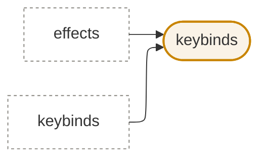
```mermaid
---
config:
  layout: elk
---
flowchart LR
    s_keybinds([keybinds])
    f_effects[effects]
    f_keybinds[keybinds]
    f_effects --> s_keybinds
    f_keybinds --> s_keybinds
    classDef table fill:#d5518118,stroke:#d55181,stroke-width:2px
    classDef server fill:#d5518118,stroke:#d55181,stroke-width:2px,stroke-dasharray:5 3
    classDef field fill:#2a78d618,stroke:#2a78d6,stroke-width:2px
    classDef elsewhere fill:none,stroke:#898781,stroke-width:1px,stroke-dasharray:3 3
    classDef section fill:#c9850018,stroke:#c98500,stroke-width:2px
    class s_keybinds section
    class f_effects,f_keybinds elsewhere
```

| section    | module | on the pack | reads                                             | what it is                                                        |
|------------|--------|------------:|---------------------------------------------------|-------------------------------------------------------------------|
| `keybinds` | core   |          64 | [`effects`](#effects) and [`keybinds`](#keybinds) | Each suppressed key, when it is suppressed, and what replaces it. |

- `keybinds` ships absent from a build without `SpellKeyboundOverride`.

### links family

The words the graph of spells that reach other spells is read through.

An edge exists because some effect row on the source triggers the target, and what the edge SAYS is the word that row's
effect or aura prints. The edges themselves are mech rows now, one kind per direction — they are the same edges read
from either end, so shipping them again here would be a third copy of one fact. What stays is the pool those rows store
a number into.

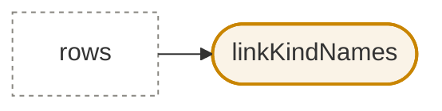
```mermaid
---
config:
  layout: elk
---
flowchart LR
    s_linkKindNames([linkKindNames])
    f_rows[rows]
    f_rows --> s_linkKindNames
    classDef table fill:#d5518118,stroke:#d55181,stroke-width:2px
    classDef server fill:#d5518118,stroke:#d55181,stroke-width:2px,stroke-dasharray:5 3
    classDef field fill:#2a78d618,stroke:#2a78d6,stroke-width:2px
    classDef elsewhere fill:none,stroke:#898781,stroke-width:1px,stroke-dasharray:3 3
    classDef section fill:#c9850018,stroke:#c98500,stroke-width:2px
    class s_linkKindNames section
    class f_rows elsewhere
```

| section         | module |   on the pack | reads           | what it is                                                            |
|-----------------|--------|--------------:|-----------------|-----------------------------------------------------------------------|
| `linkKindNames` | core   | 174 linkKinds | [`rows`](#rows) | The word each spell-to-spell edge prints, by the number a row stores. |

### mechanics family

The words an effect row is read through, and the targets it names.

The rows themselves are in the mech column, one per effect: a search scope binds its axes to one row, so a query for an
effect that is also aimed a certain way must mean a single effect that is both, not two effects that are one each.

What stays here is their codomain — the enum names a row's stored number resolves to, and the two implicit-target
tables. Reading one without the others tells you nothing, which is why they are declared together rather than in a
vocabulary module of their own.

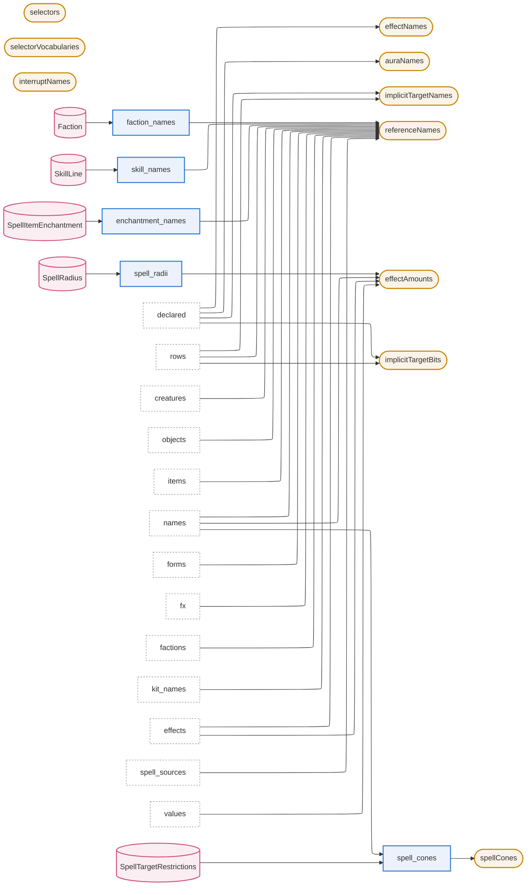
```mermaid
---
config:
  layout: elk
---
flowchart LR
    s_effectNames([effectNames])
    s_auraNames([auraNames])
    s_implicitTargetNames([implicitTargetNames])
    s_selectors([selectors])
    s_selectorVocabularies([selectorVocabularies])
    s_referenceNames([referenceNames])
    s_effectAmounts([effectAmounts])
    s_spellCones([spellCones])
    s_interruptNames([interruptNames])
    s_implicitTargetBits([implicitTargetBits])
    f_faction_names[faction_names]
    f_skill_names[skill_names]
    f_enchantment_names[enchantment_names]
    f_spell_radii[spell_radii]
    f_spell_cones[spell_cones]
    f_declared[declared]
    f_rows[rows]
    f_creatures[creatures]
    f_objects[objects]
    f_items[items]
    f_names[names]
    f_forms[forms]
    f_fx[fx]
    f_factions[factions]
    f_kit_names[kit_names]
    t_Faction[(Faction)]
    t_SkillLine[(SkillLine)]
    t_SpellItemEnchantment[(SpellItemEnchantment)]
    f_effects[effects]
    f_spell_sources[spell_sources]
    f_values[values]
    t_SpellRadius[(SpellRadius)]
    t_SpellTargetRestrictions[(SpellTargetRestrictions)]
    f_declared --> s_effectNames
    f_declared --> s_auraNames
    f_rows --> s_implicitTargetNames
    f_declared --> s_implicitTargetNames
    f_rows --> s_referenceNames
    f_creatures --> s_referenceNames
    f_objects --> s_referenceNames
    f_items --> s_referenceNames
    f_names --> s_referenceNames
    f_forms --> s_referenceNames
    f_fx --> s_referenceNames
    f_factions --> s_referenceNames
    f_kit_names --> s_referenceNames
    f_faction_names --> s_referenceNames
    t_Faction --> f_faction_names
    f_skill_names --> s_referenceNames
    t_SkillLine --> f_skill_names
    f_enchantment_names --> s_referenceNames
    t_SpellItemEnchantment --> f_enchantment_names
    f_effects --> s_referenceNames
    f_spell_sources --> s_referenceNames
    f_values --> s_effectAmounts
    f_effects --> s_effectAmounts
    f_spell_radii --> s_effectAmounts
    t_SpellRadius --> f_spell_radii
    f_names --> s_effectAmounts
    f_spell_cones --> s_spellCones
    t_SpellTargetRestrictions --> f_spell_cones
    f_names --> f_spell_cones
    f_rows --> s_implicitTargetBits
    f_declared --> s_implicitTargetBits
    classDef table fill:#d5518118,stroke:#d55181,stroke-width:2px
    classDef server fill:#d5518118,stroke:#d55181,stroke-width:2px,stroke-dasharray:5 3
    classDef field fill:#2a78d618,stroke:#2a78d6,stroke-width:2px
    classDef elsewhere fill:none,stroke:#898781,stroke-width:1px,stroke-dasharray:3 3
    classDef section fill:#c9850018,stroke:#c98500,stroke-width:2px
    class s_effectNames,s_auraNames,s_implicitTargetNames,s_selectors,s_selectorVocabularies,s_referenceNames,s_effectAmounts,s_spellCones,s_interruptNames,s_implicitTargetBits section
    class f_faction_names,f_skill_names,f_enchantment_names,f_spell_radii,f_spell_cones field
    class f_declared,f_rows,f_creatures,f_objects,f_items,f_names,f_forms,f_fx,f_factions,f_kit_names,f_effects,f_spell_sources,f_values elsewhere
    class t_Faction,t_SkillLine,t_SpellItemEnchantment,t_SpellRadius,t_SpellTargetRestrictions table
```

| section                | module             |         on the pack | reads                                                                                                                                                                                                                                                                                                                                                                  | what it is                                                                                          |
|------------------------|--------------------|--------------------:|------------------------------------------------------------------------------------------------------------------------------------------------------------------------------------------------------------------------------------------------------------------------------------------------------------------------------------------------------------------------|-----------------------------------------------------------------------------------------------------|
| `effectNames`          | universal          |                     | [`declared`](#declared)                                                                                                                                                                                                                                                                                                                                                | Every effect id's enum name, for the word a mechanics pill prints.                                  |
| `auraNames`            | universal          |                     | [`declared`](#declared)                                                                                                                                                                                                                                                                                                                                                | Every aura id's enum name, for the word a mechanics pill prints.                                    |
| `implicitTargetNames`  | core               | 133 implicitTargets | [`rows`](#rows) and [`declared`](#declared)                                                                                                                                                                                                                                                                                                                            | The name of each implicit target this build's rows name.                                            |
| `selectors`            | universal          |               1,028 | nothing derived                                                                                                                                                                                                                                                                                                                                                        | What each column of a discriminated row is an id into, per selector value.                          |
| `selectorVocabularies` | universal          |               1,214 | nothing derived                                                                                                                                                                                                                                                                                                                                                        | The word each value of a vocabulary a selector's slot names stands for.                             |
| `referenceNames`       | core, per language |              55,514 | [`rows`](#rows), [`creatures`](#creatures), [`objects`](#objects), [`items`](#items), [`names`](#names), [`forms`](#forms), [`fx`](#fx), [`factions`](#factions), [`kit_names`](#kit_names), [`faction_names`](#faction_names), [`skill_names`](#skill_names), [`enchantment_names`](#enchantment_names), [`effects`](#effects), and [`spell_sources`](#spell_sources) | The name of each id an effect or aura's reference slot points at.                                   |
| `effectAmounts`        | core               |             197,620 | [`values`](#values), [`effects`](#effects), [`spell_radii`](#spell_radii), and [`names`](#names)                                                                                                                                                                                                                                                                       | Each effect's resolved amount, radii, facing, multipliers, coefficients, mechanic and created item. |
| `spellCones`           | core               |               5,148 | [`spell_cones`](#spell_cones)                                                                                                                                                                                                                                                                                                                                          | The angle of the cone or the width of the line a spell's area takes.                                |
| `interruptNames`       | universal          |                     | nothing derived                                                                                                                                                                                                                                                                                                                                                        | The word for each event that removes an aura, by the bit that says so.                              |
| `implicitTargetBits`   | core               |                     | [`rows`](#rows) and [`declared`](#declared)                                                                                                                                                                                                                                                                                                                            | The caster, target or area bit each implicit target contributes.                                    |

- `referenceNames` ships thinner from a build without `creature_template` and `gameobject_template`.

### models family

Every route that puts geometry on screen, and the vocabularies naming it.

One row per way a spell shows a model. The category says which id space the row's reference is in, so a creature display
and an item share one field rather than each getting a column that is empty for the other six categories.

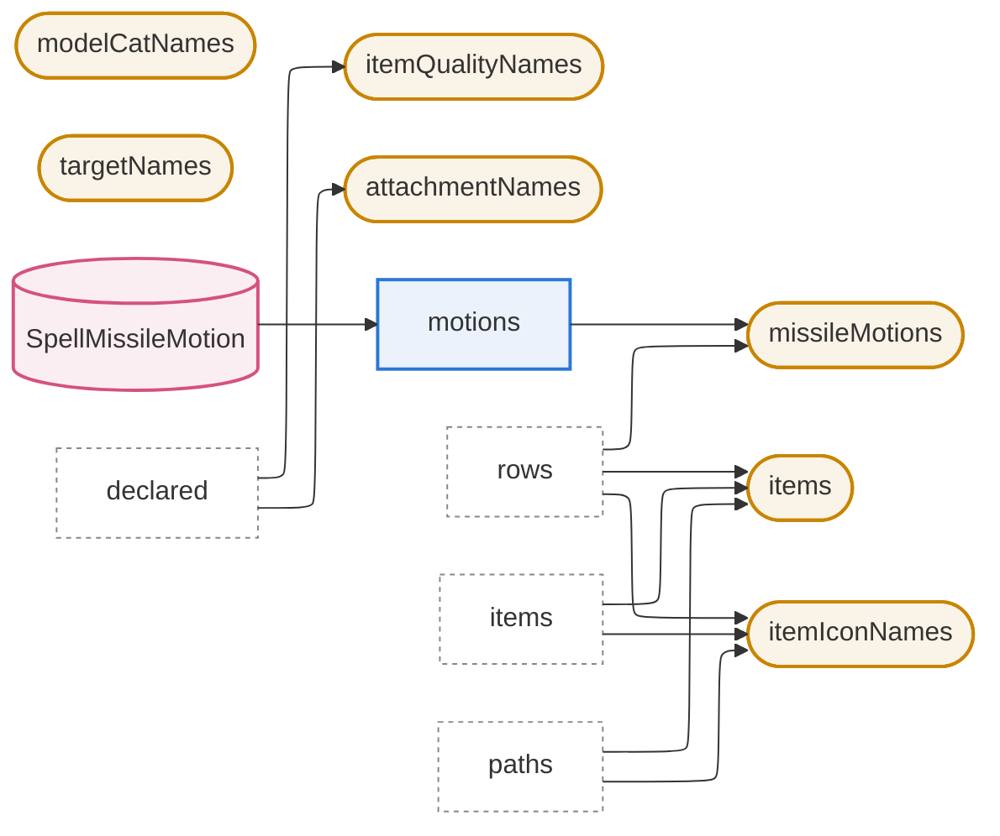
```mermaid
---
config:
  layout: elk
---
flowchart LR
    s_missileMotions([missileMotions])
    s_items([items])
    s_itemIconNames([itemIconNames])
    s_itemQualityNames([itemQualityNames])
    s_attachmentNames([attachmentNames])
    s_modelCatNames([modelCatNames])
    s_targetNames([targetNames])
    f_motions[motions]
    f_rows[rows]
    t_SpellMissileMotion[(SpellMissileMotion)]
    f_items[items]
    f_paths[paths]
    f_declared[declared]
    f_rows --> s_missileMotions
    f_motions --> s_missileMotions
    t_SpellMissileMotion --> f_motions
    f_rows --> s_items
    f_items --> s_items
    f_paths --> s_items
    f_rows --> s_itemIconNames
    f_items --> s_itemIconNames
    f_paths --> s_itemIconNames
    f_declared --> s_itemQualityNames
    f_declared --> s_attachmentNames
    classDef table fill:#d5518118,stroke:#d55181,stroke-width:2px
    classDef server fill:#d5518118,stroke:#d55181,stroke-width:2px,stroke-dasharray:5 3
    classDef field fill:#2a78d618,stroke:#2a78d6,stroke-width:2px
    classDef elsewhere fill:none,stroke:#898781,stroke-width:1px,stroke-dasharray:3 3
    classDef section fill:#c9850018,stroke:#c98500,stroke-width:2px
    class s_missileMotions,s_items,s_itemIconNames,s_itemQualityNames,s_attachmentNames,s_modelCatNames,s_targetNames section
    class f_motions field
    class f_rows,f_items,f_paths,f_declared elsewhere
    class t_SpellMissileMotion table
```

| section            | module             | on the pack | reads                                                     | what it is                                                                                                         |
|--------------------|--------------------|------------:|-----------------------------------------------------------|--------------------------------------------------------------------------------------------------------------------|
| `missileMotions`   | core               |       1,199 | [`rows`](#rows) and [`motions`](#motions)                 | The flight paths missile rows name, by motion id: what each is called, and how many projectiles it is written for. |
| `items`            | core, per language |         651 | [`rows`](#rows), [`items`](#items), and [`paths`](#paths) | The items a model row points at, with the name, quality and icon a pill shows.                                     |
| `itemIconNames`    | core               |             | [`rows`](#rows), [`items`](#items), and [`paths`](#paths) | Each distinct item icon name, which items index into.                                                              |
| `itemQualityNames` | universal          |             | [`declared`](#declared)                                   | The quality words an item's quality indexes, from the checked-in enum.                                             |
| `attachmentNames`  | universal          |             | [`declared`](#declared)                                   | Where on a model an attachment id points, by id.                                                                   |
| `modelCatNames`    | universal          |             | nothing derived                                           | The word each model category answers to in search and renders under.                                               |
| `targetNames`      | universal          |             | nothing derived                                           | The word each target bit renders as.                                                                               |

### modifiers family

The values a spell sets on its subject: how fast, how big, how hidden.

The rows themselves live in the mech column now, because each is a thing the spell DOES and a query binds its axes to
one row. What stays here is the one thing those rows cannot carry: the word each movement is named by, which a row
stores a number into.

```mermaid
---
config:
  layout: elk
---
flowchart LR
    s_speedModeNames([speedModeNames])
    classDef table fill:#d5518118,stroke:#d55181,stroke-width:2px
    classDef server fill:#d5518118,stroke:#d55181,stroke-width:2px,stroke-dasharray:5 3
    classDef field fill:#2a78d618,stroke:#2a78d6,stroke-width:2px
    classDef elsewhere fill:none,stroke:#898781,stroke-width:1px,stroke-dasharray:3 3
    classDef section fill:#c9850018,stroke:#c98500,stroke-width:2px
    class s_speedModeNames section
```

| section          | module    | on the pack | reads           | what it is                                                        |
|------------------|-----------|------------:|-----------------|-------------------------------------------------------------------|
| `speedModeNames` | universal |             | nothing derived | The movement each speed row scales, by the number the row stores. |

### rows family

The row tables: what a spell HAS, shipped as rows rather than as columns.

One section per query column. Each holds every kind that column can carry, the distinct rows of each kind pooled, and —
per spell — how many rows it has and which pooled rows they are. That is the whole per-spell payload for the column, so
a reader walks it instead of joining the half-dozen tables the same facts used to arrive in.

The counts are the ones the retired per-spell sections carried, recomputed from the rows that replaced them and kept to
the letter of what they meant. `spellAnimKits` is still the number of (spell, kit) pairs even though a kit now ships
expanded into one row per animation it plays, because a count that quietly changed meaning is worse than one that
disappeared. They are computed as a family: one walk answers all of a section's counts, where one walk each would
re-read every reference six times over.

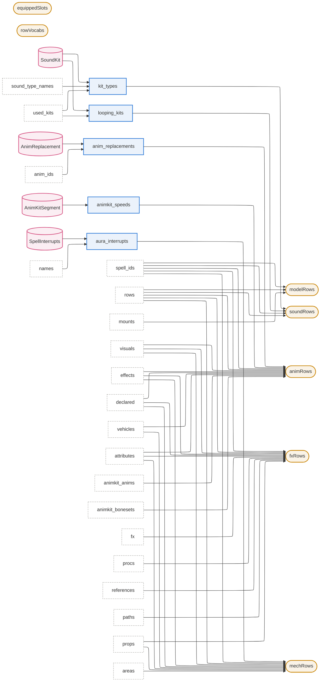
```mermaid
---
config:
  layout: elk
---
flowchart LR
    s_modelRows([modelRows])
    s_soundRows([soundRows])
    s_animRows([animRows])
    s_fxRows([fxRows])
    s_mechRows([mechRows])
    s_equippedSlots([equippedSlots])
    s_rowVocabs([rowVocabs])
    f_kit_types[kit_types]
    f_looping_kits[looping_kits]
    f_anim_replacements[anim_replacements]
    f_animkit_speeds[animkit_speeds]
    f_aura_interrupts[aura_interrupts]
    f_spell_ids[spell_ids]
    f_rows[rows]
    f_mounts[mounts]
    t_SoundKit[(SoundKit)]
    f_sound_type_names[sound_type_names]
    f_used_kits[used_kits]
    f_visuals[visuals]
    f_effects[effects]
    f_declared[declared]
    f_vehicles[vehicles]
    f_attributes[attributes]
    t_AnimReplacement[(AnimReplacement)]
    f_anim_ids[anim_ids]
    f_animkit_anims[animkit_anims]
    f_animkit_bonesets[animkit_bonesets]
    t_AnimKitSegment[(AnimKitSegment)]
    f_fx[fx]
    f_procs[procs]
    f_references[references]
    f_paths[paths]
    f_props[props]
    f_areas[areas]
    t_SpellInterrupts[(SpellInterrupts)]
    f_names[names]
    f_spell_ids --> s_modelRows
    f_rows --> s_modelRows
    f_mounts --> s_modelRows
    f_spell_ids --> s_soundRows
    f_rows --> s_soundRows
    f_kit_types --> s_soundRows
    t_SoundKit --> f_kit_types
    f_sound_type_names --> f_kit_types
    f_used_kits --> f_kit_types
    f_looping_kits --> s_soundRows
    t_SoundKit --> f_looping_kits
    f_used_kits --> f_looping_kits
    f_spell_ids --> s_animRows
    f_rows --> s_animRows
    f_visuals --> s_animRows
    f_effects --> s_animRows
    f_declared --> s_animRows
    f_vehicles --> s_animRows
    f_attributes --> s_animRows
    f_anim_replacements --> s_animRows
    t_AnimReplacement --> f_anim_replacements
    f_anim_ids --> f_anim_replacements
    f_animkit_anims --> s_animRows
    f_animkit_bonesets --> s_animRows
    f_animkit_speeds --> s_animRows
    t_AnimKitSegment --> f_animkit_speeds
    f_spell_ids --> s_fxRows
    f_rows --> s_fxRows
    f_visuals --> s_fxRows
    f_effects --> s_fxRows
    f_declared --> s_fxRows
    f_attributes --> s_fxRows
    f_fx --> s_fxRows
    f_procs --> s_fxRows
    f_references --> s_fxRows
    f_paths --> s_fxRows
    f_props --> s_fxRows
    f_spell_ids --> s_mechRows
    f_rows --> s_mechRows
    f_visuals --> s_mechRows
    f_effects --> s_mechRows
    f_declared --> s_mechRows
    f_vehicles --> s_mechRows
    f_attributes --> s_mechRows
    f_props --> s_mechRows
    f_areas --> s_mechRows
    f_aura_interrupts --> s_mechRows
    t_SpellInterrupts --> f_aura_interrupts
    f_names --> f_aura_interrupts
    classDef table fill:#d5518118,stroke:#d55181,stroke-width:2px
    classDef server fill:#d5518118,stroke:#d55181,stroke-width:2px,stroke-dasharray:5 3
    classDef field fill:#2a78d618,stroke:#2a78d6,stroke-width:2px
    classDef elsewhere fill:none,stroke:#898781,stroke-width:1px,stroke-dasharray:3 3
    classDef section fill:#c9850018,stroke:#c98500,stroke-width:2px
    class s_modelRows,s_soundRows,s_animRows,s_fxRows,s_mechRows,s_equippedSlots,s_rowVocabs section
    class f_kit_types,f_looping_kits,f_anim_replacements,f_animkit_speeds,f_aura_interrupts field
    class f_spell_ids,f_rows,f_mounts,f_sound_type_names,f_used_kits,f_visuals,f_effects,f_declared,f_vehicles,f_attributes,f_anim_ids,f_animkit_anims,f_animkit_bonesets,f_fx,f_procs,f_references,f_paths,f_props,f_areas,f_names elsewhere
    class t_SoundKit,t_AnimReplacement,t_AnimKitSegment,t_SpellInterrupts table
```

| section         | module    | on the pack | reads                                                                                                                                                                                                                                                                                                                                   | what it is                                                            |
|-----------------|-----------|------------:|-----------------------------------------------------------------------------------------------------------------------------------------------------------------------------------------------------------------------------------------------------------------------------------------------------------------------------------------|-----------------------------------------------------------------------|
| `modelRows`     | core      |             | [`spell_ids`](#spell_ids), [`rows`](#rows), and [`mounts`](#mounts)                                                                                                                                                                                                                                                                     | Every model a spell shows, as rows of the kind each one is.           |
| `soundRows`     | core      |             | [`spell_ids`](#spell_ids), [`rows`](#rows), [`kit_types`](#kit_types), and [`looping_kits`](#looping_kits)                                                                                                                                                                                                                              | Every sound a spell plays, as rows carrying the kit that plays it.    |
| `animRows`      | core      |             | [`spell_ids`](#spell_ids), [`rows`](#rows), [`visuals`](#visuals), [`effects`](#effects), [`declared`](#declared), [`vehicles`](#vehicles), [`attributes`](#attributes), [`anim_replacements`](#anim_replacements), [`animkit_anims`](#animkit_anims), [`animkit_bonesets`](#animkit_bonesets), and [`animkit_speeds`](#animkit_speeds) | Every animation a spell reaches, as rows of the kind that reaches it. |
| `fxRows`        | core      |             | [`spell_ids`](#spell_ids), [`rows`](#rows), [`visuals`](#visuals), [`effects`](#effects), [`declared`](#declared), [`attributes`](#attributes), [`fx`](#fx), [`procs`](#procs), [`references`](#references), [`paths`](#paths), and [`props`](#props)                                                                                   | Every visual effect a spell wears, as rows of the kind each one is.   |
| `mechRows`      | core      |             | [`spell_ids`](#spell_ids), [`rows`](#rows), [`visuals`](#visuals), [`effects`](#effects), [`declared`](#declared), [`vehicles`](#vehicles), [`attributes`](#attributes), [`props`](#props), [`areas`](#areas), and [`aura_interrupts`](#aura_interrupts)                                                                                | Everything a spell DOES, as rows of the kind that does it.            |
| `equippedSlots` | universal |             | nothing derived                                                                                                                                                                                                                                                                                                                         | The weapon slot each fileless model marker stands for.                |
| `rowVocabs`     | universal |             | nothing derived                                                                                                                                                                                                                                                                                                                         | Where each row property's vocabulary lives, and how it is keyed.      |

### screens family

What a spell does to the frame itself, rather than to anything in it.

A screen effect is a bundle of independent payloads under one id: the paint it puts on the frame — a fog tint, a colour
multiplied over everything, a vignette shaping how far it reaches — and beside it a light preset that swaps the sky, a
music set and an ambience that swap the sound, and an hour it pins the day to. Most rows carry only some of them, and a
row carrying a preset and no paint is a sky change wearing a screen effect's id.

The paint ships here as the screen's own columns. The preset is an edge into the sky roster, which ships it as
`skySpells`. The two sound halves resolve to kits, which join the spell's sound rows, and ship here as the two small
vocabularies below so a reader can say which set a screen names.

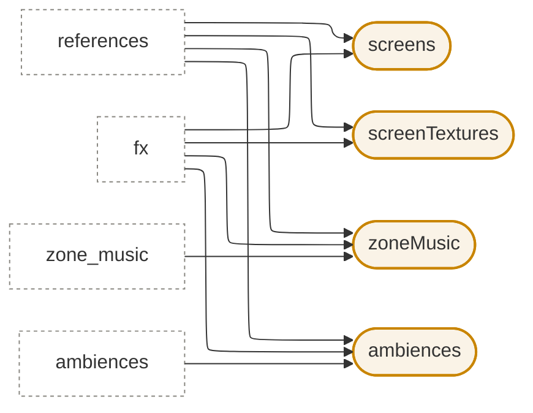
```mermaid
---
config:
  layout: elk
---
flowchart LR
    s_screens([screens])
    s_screenTextures([screenTextures])
    s_zoneMusic([zoneMusic])
    s_ambiences([ambiences])
    f_references[references]
    f_fx[fx]
    f_zone_music[zone_music]
    f_ambiences[ambiences]
    f_references --> s_screens
    f_fx --> s_screens
    f_references --> s_screenTextures
    f_fx --> s_screenTextures
    f_references --> s_zoneMusic
    f_fx --> s_zoneMusic
    f_zone_music --> s_zoneMusic
    f_references --> s_ambiences
    f_fx --> s_ambiences
    f_ambiences --> s_ambiences
    classDef table fill:#d5518118,stroke:#d55181,stroke-width:2px
    classDef server fill:#d5518118,stroke:#d55181,stroke-width:2px,stroke-dasharray:5 3
    classDef field fill:#2a78d618,stroke:#2a78d6,stroke-width:2px
    classDef elsewhere fill:none,stroke:#898781,stroke-width:1px,stroke-dasharray:3 3
    classDef section fill:#c9850018,stroke:#c98500,stroke-width:2px
    class s_screens,s_screenTextures,s_zoneMusic,s_ambiences section
    class f_references,f_fx,f_zone_music,f_ambiences elsewhere
```

| section          | module | on the pack | reads                                                                     | what it is                                                                            |
|------------------|--------|------------:|---------------------------------------------------------------------------|---------------------------------------------------------------------------------------|
| `screens`        | core   |       3,837 | [`references`](#references) and [`fx`](#fx)                               | What each screen effect paints, the sky preset, music, ambience and hour it swaps in. |
| `screenTextures` | core   |             | [`references`](#references) and [`fx`](#fx)                               | The textures each screen effect draws, finished art before flat mask.                 |
| `zoneMusic`      | core   |          48 | [`references`](#references), [`fx`](#fx), and [`zone_music`](#zone_music) | The music sets the screen effects name: a name and a day and a night kit each.        |
| `ambiences`      | core   |          64 | [`references`](#references), [`fx`](#fx), and [`ambiences`](#ambiences)   | The ambiences the screen effects name: a day and a night kit each.                    |

- `screens` ships absent from a build without `ScreenEffect`.
- `screens` ships thinner from a build without `FullScreenEffect` and `SpellVisualScreenEffect`.
- `screenTextures` ships absent from a build without `ScreenEffect`.
- `screenTextures` ships thinner from a build without `FullScreenEffect` and `TextureBlendSet`.
- `zoneMusic` ships absent from a build without `ScreenEffect`.
- `ambiences` ships absent from a build without `ScreenEffect`.

### skies family

The sky a place draws, as one row per dome.

A skybox is not a spell's payload, which is what every other visual family here is. It is a property of a PLACE, and it
reaches a player through a spell whose aura names a screen effect carrying a light preset — a retail spell that darkens
the sky, or a private server's spell that exists only to set one. So the roster is the domes, and the spell is an edge
into it rather than the other way round.

One row per dome rather than per preset: 2,884 presets share 414 domes, most of them differing only in a colour a reader
would not name. The preset a row stands for is the one the most `Light` rows draw, which is the sky most people have
actually seen.

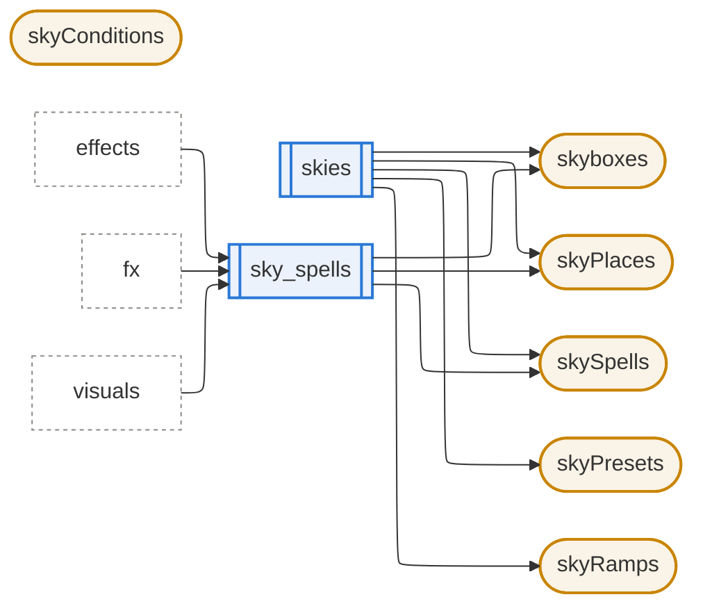
```mermaid
---
config:
  layout: elk
---
flowchart LR
    s_skyboxes([skyboxes])
    s_skyPlaces([skyPlaces])
    s_skySpells([skySpells])
    s_skyPresets([skyPresets])
    s_skyRamps([skyRamps])
    s_skyConditions([skyConditions])
    f_skies[[skies]]
    f_sky_spells[[sky_spells]]
    f_effects[effects]
    f_fx[fx]
    f_visuals[visuals]
    f_skies --> s_skyboxes
    f_sky_spells --> s_skyboxes
    f_effects --> f_sky_spells
    f_fx --> f_sky_spells
    f_visuals --> f_sky_spells
    f_skies --> s_skyPlaces
    f_sky_spells --> s_skyPlaces
    f_skies --> s_skySpells
    f_sky_spells --> s_skySpells
    f_skies --> s_skyPresets
    f_skies --> s_skyRamps
    classDef table fill:#d5518118,stroke:#d55181,stroke-width:2px
    classDef server fill:#d5518118,stroke:#d55181,stroke-width:2px,stroke-dasharray:5 3
    classDef field fill:#2a78d618,stroke:#2a78d6,stroke-width:2px
    classDef elsewhere fill:none,stroke:#898781,stroke-width:1px,stroke-dasharray:3 3
    classDef section fill:#c9850018,stroke:#c98500,stroke-width:2px
    class s_skyboxes,s_skyPlaces,s_skySpells,s_skyPresets,s_skyRamps,s_skyConditions section
    class f_skies,f_sky_spells field
    class f_effects,f_fx,f_visuals elsewhere
```

| section         | module | on the pack | reads                                             | what it is                                                                        |
|-----------------|--------|------------:|---------------------------------------------------|-----------------------------------------------------------------------------------|
| `skyboxes`      | sky    |         365 | [`skies`](#skies) and [`sky_spells`](#sky_spells) | Every sky dome, the preset it is drawn by, and the conditions it is drawn under.  |
| `skyPlaces`     | sky    |             | [`skies`](#skies) and [`sky_spells`](#sky_spells) | Where each dome is seen: the zones that name it, then the maps it stands on.      |
| `skySpells`     | sky    |       2,050 | [`skies`](#skies) and [`sky_spells`](#sky_spells) | The spells that set each dome, which is how a player reaches one.                 |
| `skyPresets`    | sky    |       2,884 | [`skies`](#skies)                                 | Every light preset, and the dome it draws; what a spell or a screen effect names. |
| `skyRamps`      | sky    |      15,191 | [`skies`](#skies)                                 | The colour of the day for every preset, one row per stop.                         |
| `skyConditions` | sky    |             | nothing derived                                   | What each bit of a dome's condition mask means.                                   |

- `skyboxes` ships absent from a build without `LightSkybox` and `LightParams`.
- `skyboxes` ships thinner from a build without `LightData` and `Light`.
- `skyPlaces` ships absent from a build without `LightSkybox` and `LightParams`.
- `skyPlaces` ships thinner from a build without `Light`, `ZoneLight`, and `Map`.
- `skySpells` ships absent from a build without `LightSkybox`, `LightParams`, and `ScreenEffect`.
- `skyPresets` ships absent from a build without `LightSkybox` and `LightParams`.
- `skyRamps` ships absent from a build without `LightSkybox`, `LightParams`, and `LightData`.
- `skyConditions` ships absent from a build without `LightSkybox` and `Light`.

### sounds family

Every sound a spell plays, and the names of the kits that play them.

A sound reaches a spell four ways — through a kit, through a missile, through a chain, or from an effect row outright —
and by the time it gets here they are one fact: this spell plays this file, from this kit, at this audience.

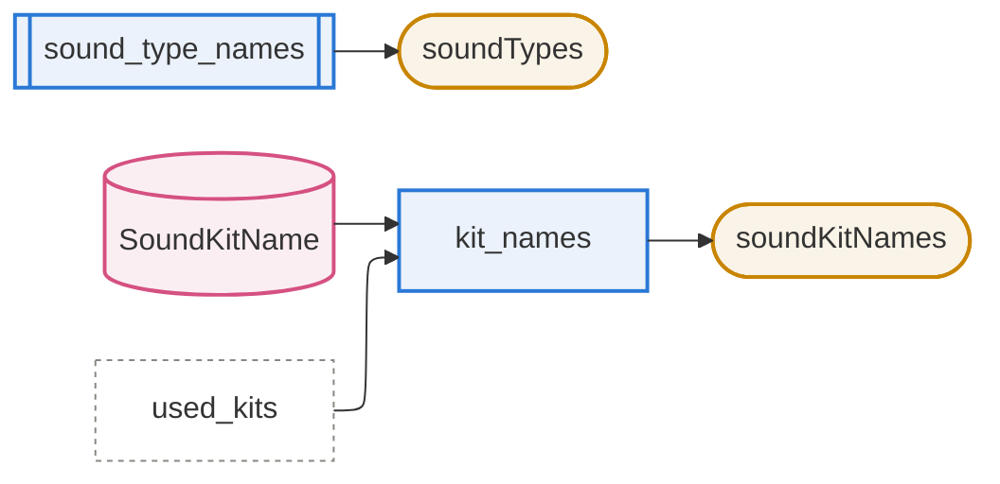
```mermaid
---
config:
  layout: elk
---
flowchart LR
    s_soundKitNames([soundKitNames])
    s_soundTypes([soundTypes])
    f_kit_names[kit_names]
    f_sound_type_names[[sound_type_names]]
    t_SoundKitName[(SoundKitName)]
    f_used_kits[used_kits]
    f_kit_names --> s_soundKitNames
    t_SoundKitName --> f_kit_names
    f_used_kits --> f_kit_names
    f_sound_type_names --> s_soundTypes
    classDef table fill:#d5518118,stroke:#d55181,stroke-width:2px
    classDef server fill:#d5518118,stroke:#d55181,stroke-width:2px,stroke-dasharray:5 3
    classDef field fill:#2a78d618,stroke:#2a78d6,stroke-width:2px
    classDef elsewhere fill:none,stroke:#898781,stroke-width:1px,stroke-dasharray:3 3
    classDef section fill:#c9850018,stroke:#c98500,stroke-width:2px
    class s_soundKitNames,s_soundTypes section
    class f_kit_names,f_sound_type_names field
    class t_SoundKitName table
    class f_used_kits elsewhere
```

| section         | module | on the pack | reads                                   | what it is                                                                       |
|-----------------|--------|------------:|-----------------------------------------|----------------------------------------------------------------------------------|
| `soundKitNames` | core   |      27,702 | [`kit_names`](#kit_names)               | Human names for the sound kits this pack reaches, from a pinned build.           |
| `soundTypes`    | core   |          32 | [`sound_type_names`](#sound_type_names) | What each sound type is called, the vocabulary a sound row's type reads through. |

### sources family

Where a spell comes from, as rows a reader can walk.

The assembly lives in `derive/sources.py`, because two sections read it: the rows themselves, and the names of what they
point at. Here they only become columns.

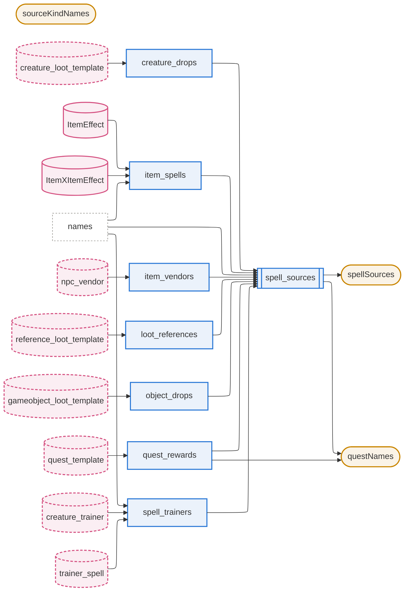
```mermaid
---
config:
  layout: elk
---
flowchart LR
    s_spellSources([spellSources])
    s_questNames([questNames])
    s_sourceKindNames([sourceKindNames])
    f_spell_sources[[spell_sources]]
    f_creature_drops[creature_drops]
    f_item_spells[item_spells]
    f_item_vendors[item_vendors]
    f_loot_references[loot_references]
    f_object_drops[object_drops]
    f_quest_rewards[quest_rewards]
    f_spell_trainers[spell_trainers]
    t_creature_loot_template[(creature_loot_template)]
    t_ItemEffect[(ItemEffect)]
    t_ItemXItemEffect[(ItemXItemEffect)]
    f_names[names]
    t_npc_vendor[(npc_vendor)]
    t_reference_loot_template[(reference_loot_template)]
    t_gameobject_loot_template[(gameobject_loot_template)]
    t_quest_template[(quest_template)]
    t_creature_trainer[(creature_trainer)]
    t_trainer_spell[(trainer_spell)]
    f_spell_sources --> s_spellSources
    f_creature_drops --> f_spell_sources
    t_creature_loot_template --> f_creature_drops
    f_item_spells --> f_spell_sources
    t_ItemEffect --> f_item_spells
    t_ItemXItemEffect --> f_item_spells
    f_names --> f_item_spells
    f_item_vendors --> f_spell_sources
    t_npc_vendor --> f_item_vendors
    f_loot_references --> f_spell_sources
    t_reference_loot_template --> f_loot_references
    f_names --> f_spell_sources
    f_object_drops --> f_spell_sources
    t_gameobject_loot_template --> f_object_drops
    f_quest_rewards --> f_spell_sources
    t_quest_template --> f_quest_rewards
    f_spell_trainers --> f_spell_sources
    t_creature_trainer --> f_spell_trainers
    t_trainer_spell --> f_spell_trainers
    f_names --> f_spell_trainers
    f_spell_sources --> s_questNames
    f_quest_rewards --> s_questNames
    classDef table fill:#d5518118,stroke:#d55181,stroke-width:2px
    classDef server fill:#d5518118,stroke:#d55181,stroke-width:2px,stroke-dasharray:5 3
    classDef field fill:#2a78d618,stroke:#2a78d6,stroke-width:2px
    classDef elsewhere fill:none,stroke:#898781,stroke-width:1px,stroke-dasharray:3 3
    classDef section fill:#c9850018,stroke:#c98500,stroke-width:2px
    class s_spellSources,s_questNames,s_sourceKindNames section
    class f_spell_sources,f_creature_drops,f_item_spells,f_item_vendors,f_loot_references,f_object_drops,f_quest_rewards,f_spell_trainers field
    class t_creature_loot_template,t_npc_vendor,t_reference_loot_template,t_gameobject_loot_template,t_quest_template,t_creature_trainer,t_trainer_spell server
    class t_ItemEffect,t_ItemXItemEffect table
    class f_names elsewhere
```

| section           | module    | on the pack | reads                                                                   | what it is                                                                               |
|-------------------|-----------|------------:|-------------------------------------------------------------------------|------------------------------------------------------------------------------------------|
| `spellSources`    | core      |      38,435 | [`spell_sources`](#spell_sources)                                       | Where each spell is come by: taught, granted, or carried by an item somebody hands over. |
| `questNames`      | core      |       5,952 | [`spell_sources`](#spell_sources) and [`quest_rewards`](#quest_rewards) | The title of every quest a spell is come by through.                                     |
| `sourceKindNames` | universal |             | nothing derived                                                         | The word for each way a spell is come by, and the table that names its source.           |

- `spellSources` ships absent from a build without `trainer_spell`.
- `questNames` ships absent from a build without `quest_template`.

### spells family

The spell list itself, and everything carried one value per spell.

The row order of the whole pack: every other per-spell column is parallel to `spells.ids`, so a reader joins by position
and never by lookup.

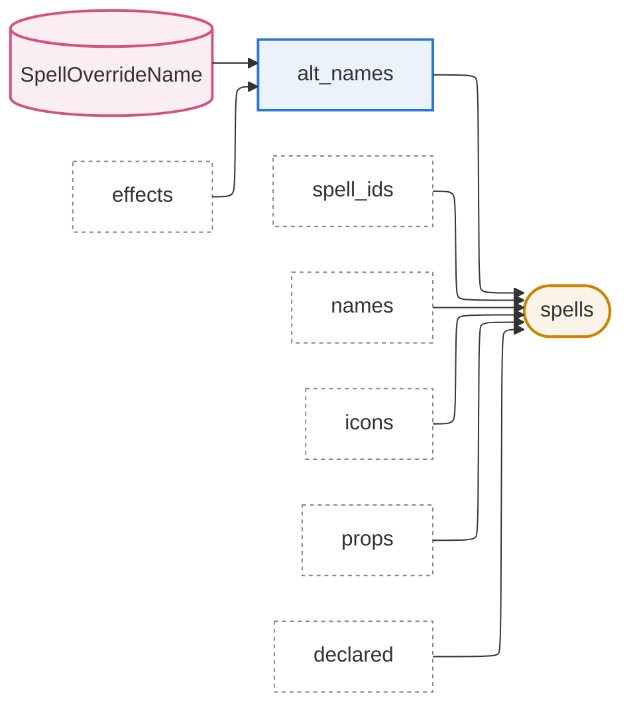
```mermaid
---
config:
  layout: elk
---
flowchart LR
    s_spells([spells])
    f_alt_names[alt_names]
    f_spell_ids[spell_ids]
    f_names[names]
    t_SpellOverrideName[(SpellOverrideName)]
    f_effects[effects]
    f_icons[icons]
    f_props[props]
    f_declared[declared]
    f_spell_ids --> s_spells
    f_names --> s_spells
    f_alt_names --> s_spells
    t_SpellOverrideName --> f_alt_names
    f_effects --> f_alt_names
    f_icons --> s_spells
    f_props --> s_spells
    f_declared --> s_spells
    classDef table fill:#d5518118,stroke:#d55181,stroke-width:2px
    classDef server fill:#d5518118,stroke:#d55181,stroke-width:2px,stroke-dasharray:5 3
    classDef field fill:#2a78d618,stroke:#2a78d6,stroke-width:2px
    classDef elsewhere fill:none,stroke:#898781,stroke-width:1px,stroke-dasharray:3 3
    classDef section fill:#c9850018,stroke:#c98500,stroke-width:2px
    class s_spells section
    class f_alt_names field
    class f_spell_ids,f_names,f_effects,f_icons,f_props,f_declared elsewhere
    class t_SpellOverrideName table
```

| section  | module             | on the pack | reads                                                                                                                                      | what it is                                                     |
|----------|--------------------|------------:|--------------------------------------------------------------------------------------------------------------------------------------------|----------------------------------------------------------------|
| `spells` | core, per language |     280,180 | [`spell_ids`](#spell_ids), [`names`](#names), [`alt_names`](#alt_names), [`icons`](#icons), [`props`](#props), and [`declared`](#declared) | Every spell the build lists, and the values it carries one of. |

### text family

What a spell says it does, cooked to placeholder-free prose.

Four bodies of text under one section because they answer one question — what does this spell say — from four places:
the cast's own tooltip, the buff's line while it is on you, the dungeon journal's note on a boss ability, and the
flavour text of the mount a spell grants, which is prose about the mount and the only real text most mount spells have.

Every column is deduped. Nineteen thousand descriptions on the product's build are a bare redirect, so cooking them
yields the same string as their target; storing one copy per spell would ship the same prose over and over and, more to
the point, make the browser hold it that way too.

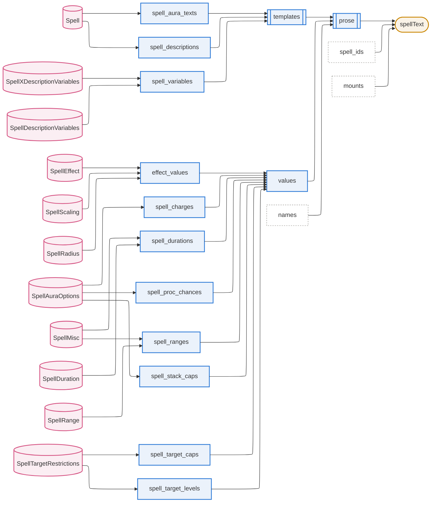
```mermaid
---
config:
  layout: elk
---
flowchart LR
    s_spellText([spellText])
    f_prose[[prose]]
    f_templates[[templates]]
    f_spell_aura_texts[spell_aura_texts]
    f_spell_descriptions[spell_descriptions]
    f_spell_variables[spell_variables]
    f_values[values]
    f_effect_values[effect_values]
    f_spell_charges[spell_charges]
    f_spell_durations[spell_durations]
    f_spell_proc_chances[spell_proc_chances]
    f_spell_ranges[spell_ranges]
    f_spell_stack_caps[spell_stack_caps]
    f_spell_target_caps[spell_target_caps]
    f_spell_target_levels[spell_target_levels]
    f_spell_ids[spell_ids]
    f_names[names]
    t_Spell[(Spell)]
    t_SpellXDescriptionVariables[(SpellXDescriptionVariables)]
    t_SpellDescriptionVariables[(SpellDescriptionVariables)]
    t_SpellEffect[(SpellEffect)]
    t_SpellScaling[(SpellScaling)]
    t_SpellRadius[(SpellRadius)]
    t_SpellAuraOptions[(SpellAuraOptions)]
    t_SpellMisc[(SpellMisc)]
    t_SpellDuration[(SpellDuration)]
    t_SpellRange[(SpellRange)]
    t_SpellTargetRestrictions[(SpellTargetRestrictions)]
    f_mounts[mounts]
    f_spell_ids --> s_spellText
    f_prose --> s_spellText
    f_names --> f_prose
    f_templates --> f_prose
    f_spell_aura_texts --> f_templates
    t_Spell --> f_spell_aura_texts
    f_spell_descriptions --> f_templates
    t_Spell --> f_spell_descriptions
    f_spell_variables --> f_templates
    t_SpellXDescriptionVariables --> f_spell_variables
    t_SpellDescriptionVariables --> f_spell_variables
    f_values --> f_prose
    f_effect_values --> f_values
    t_SpellEffect --> f_effect_values
    t_SpellScaling --> f_effect_values
    t_SpellRadius --> f_effect_values
    f_spell_charges --> f_values
    t_SpellAuraOptions --> f_spell_charges
    f_spell_durations --> f_values
    t_SpellMisc --> f_spell_durations
    t_SpellDuration --> f_spell_durations
    f_spell_proc_chances --> f_values
    t_SpellAuraOptions --> f_spell_proc_chances
    f_spell_ranges --> f_values
    t_SpellMisc --> f_spell_ranges
    t_SpellRange --> f_spell_ranges
    f_spell_stack_caps --> f_values
    t_SpellAuraOptions --> f_spell_stack_caps
    f_spell_target_caps --> f_values
    t_SpellTargetRestrictions --> f_spell_target_caps
    f_spell_target_levels --> f_values
    t_SpellTargetRestrictions --> f_spell_target_levels
    f_mounts --> s_spellText
    classDef table fill:#d5518118,stroke:#d55181,stroke-width:2px
    classDef server fill:#d5518118,stroke:#d55181,stroke-width:2px,stroke-dasharray:5 3
    classDef field fill:#2a78d618,stroke:#2a78d6,stroke-width:2px
    classDef elsewhere fill:none,stroke:#898781,stroke-width:1px,stroke-dasharray:3 3
    classDef section fill:#c9850018,stroke:#c98500,stroke-width:2px
    class s_spellText section
    class f_prose,f_templates,f_spell_aura_texts,f_spell_descriptions,f_spell_variables,f_values,f_effect_values,f_spell_charges,f_spell_durations,f_spell_proc_chances,f_spell_ranges,f_spell_stack_caps,f_spell_target_caps,f_spell_target_levels field
    class f_spell_ids,f_names,f_mounts elsewhere
    class t_Spell,t_SpellXDescriptionVariables,t_SpellDescriptionVariables,t_SpellEffect,t_SpellScaling,t_SpellRadius,t_SpellAuraOptions,t_SpellMisc,t_SpellDuration,t_SpellRange,t_SpellTargetRestrictions table
```

| section     | module             |       on the pack | reads                                                                 | what it is                                                      |
|-------------|--------------------|------------------:|-----------------------------------------------------------------------|-----------------------------------------------------------------|
| `spellText` | text, per language | 988 spellFlavours | [`spell_ids`](#spell_ids), [`prose`](#prose), and [`mounts`](#mounts) | Every spell's cooked description, aura line and encounter note. |

- `spellText` ships thinner from a build without `SpellDescriptionVariables`, `SpellRadius`, `SpellRange`,
  `SpellTargetRestrictions`, `SpellAuraOptions`, `SpellScaling`, and `JournalEncounterSection`.

### vehicles family

Vehicles, their seats, and the animations riding one puts on both parties.

A spell reaches a vehicle's seats and animations through the vehicle, so the hop is taken once here rather than by every
reader. A vehicle with no seat carries no pill and is dropped upstream, which is why nothing below tests for one.

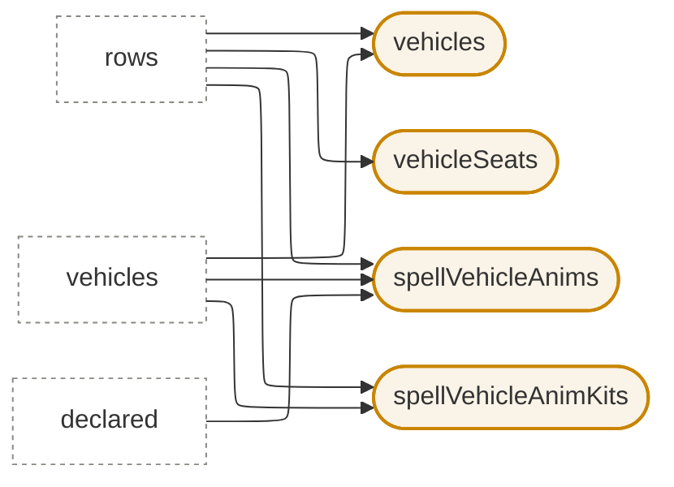
```mermaid
---
config:
  layout: elk
---
flowchart LR
    s_vehicles([vehicles])
    s_vehicleSeats([vehicleSeats])
    s_spellVehicleAnims([spellVehicleAnims])
    s_spellVehicleAnimKits([spellVehicleAnimKits])
    f_rows[rows]
    f_vehicles[vehicles]
    f_declared[declared]
    f_rows --> s_vehicles
    f_vehicles --> s_vehicles
    f_rows --> s_vehicleSeats
    f_rows --> s_spellVehicleAnims
    f_vehicles --> s_spellVehicleAnims
    f_declared --> s_spellVehicleAnims
    f_rows --> s_spellVehicleAnimKits
    f_vehicles --> s_spellVehicleAnimKits
    classDef table fill:#d5518118,stroke:#d55181,stroke-width:2px
    classDef server fill:#d5518118,stroke:#d55181,stroke-width:2px,stroke-dasharray:5 3
    classDef field fill:#2a78d618,stroke:#2a78d6,stroke-width:2px
    classDef elsewhere fill:none,stroke:#898781,stroke-width:1px,stroke-dasharray:3 3
    classDef section fill:#c9850018,stroke:#c98500,stroke-width:2px
    class s_vehicles,s_vehicleSeats,s_spellVehicleAnims,s_spellVehicleAnimKits section
    class f_rows,f_vehicles,f_declared elsewhere
```

| section                | module | on the pack | reads                                                                 | what it is                                                    |
|------------------------|--------|------------:|-----------------------------------------------------------------------|---------------------------------------------------------------|
| `vehicles`             | core   |         208 | [`rows`](#rows) and [`vehicles`](#vehicles)                           | How many seats each reached vehicle has.                      |
| `vehicleSeats`         | core   |         384 | [`rows`](#rows)                                                       | One row per seat, naming where on the model it sits.          |
| `spellVehicleAnims`    | core   |          76 | [`rows`](#rows), [`vehicles`](#vehicles), and [`declared`](#declared) | The vehicle's own animations, which are not the rider's.      |
| `spellVehicleAnimKits` | core   |          44 | [`rows`](#rows) and [`vehicles`](#vehicles)                           | The anim kits a seat names, which resolve like any other kit. |

- `vehicles` ships absent from a build without `Vehicle` and `VehicleSeat`.
- `vehicleSeats` ships absent from a build without `Vehicle` and `VehicleSeat`.
- `spellVehicleAnims` ships absent from a build without `Vehicle` and `VehicleSeat`.
- `spellVehicleAnimKits` ships absent from a build without `Vehicle` and `VehicleSeat`.

## Shared fields

### creatures group

`creatures`: Composed of `creature_displays`, `creature_model_files`, `creature_names`, `display_models`,
`display_skins`, and `totem_displays`.

```mermaid
---
config:
  layout: elk
---
flowchart LR
    f_creatures[creatures]
    f_creature_displays[creature_displays]
    f_creature_model_files[creature_model_files]
    f_creature_names[creature_names]
    f_display_models[display_models]
    f_display_skins[display_skins]
    f_totem_displays[totem_displays]
    t_creature_template_model[(creature_template_model)]
    t_creature_template[(creature_template)]
    t_CreatureModelData[(CreatureModelData)]
    t_CreatureDisplayInfo[(CreatureDisplayInfo)]
    t_spell_totem_model[(spell_totem_model)]
    f_creature_displays --> f_creatures
    t_creature_template_model --> f_creature_displays
    t_creature_template --> f_creature_displays
    f_creature_model_files --> f_creatures
    t_CreatureModelData --> f_creature_model_files
    f_creature_names --> f_creatures
    t_creature_template --> f_creature_names
    f_display_models --> f_creatures
    t_CreatureDisplayInfo --> f_display_models
    f_display_skins --> f_creatures
    t_CreatureDisplayInfo --> f_display_skins
    f_totem_displays --> f_creatures
    t_spell_totem_model --> f_totem_displays
    classDef table fill:#d5518118,stroke:#d55181,stroke-width:2px
    classDef server fill:#d5518118,stroke:#d55181,stroke-width:2px,stroke-dasharray:5 3
    classDef field fill:#2a78d618,stroke:#2a78d6,stroke-width:2px
    classDef elsewhere fill:none,stroke:#898781,stroke-width:1px,stroke-dasharray:3 3
    classDef section fill:#c9850018,stroke:#c98500,stroke-width:2px
    class f_creatures,f_creature_displays,f_creature_model_files,f_creature_names,f_display_models,f_display_skins,f_totem_displays field
    class t_creature_template_model,t_creature_template,t_spell_totem_model server
    class t_CreatureModelData,t_CreatureDisplayInfo table
```

Drawn here: [`creature_displays`](#creature_displays), [`creature_model_files`](#creature_model_files),
[`creature_names`](#creature_names), [`creatures`](#creatures), [`display_models`](#display_models),
[`display_skins`](#display_skins), and [`totem_displays`](#totem_displays).

### declared group

`declared`: What the build is told rather than reads, gathered from the checked-in files and the published enum lists.

```mermaid
---
config:
  layout: elk
---
flowchart LR
    f_declared[[declared]]
    f_emotes[[emotes]]
    f_anim_names[anim_names]
    f_anim_names --> f_declared
    f_emotes --> f_declared
    f_anim_names --> f_emotes
    classDef table fill:#d5518118,stroke:#d55181,stroke-width:2px
    classDef server fill:#d5518118,stroke:#d55181,stroke-width:2px,stroke-dasharray:5 3
    classDef field fill:#2a78d618,stroke:#2a78d6,stroke-width:2px
    classDef elsewhere fill:none,stroke:#898781,stroke-width:1px,stroke-dasharray:3 3
    classDef section fill:#c9850018,stroke:#c98500,stroke-width:2px
    class f_declared,f_emotes field
    class f_anim_names elsewhere
```

Drawn here: [`declared`](#declared) and [`emotes`](#emotes).

### delivery group

`delivery`: How a spell is delivered: a cast time, a channel, or both.

```mermaid
---
config:
  layout: elk
---
flowchart LR
    f_delivery[delivery]
    f_channel_breaks[channel_breaks]
    t_SpellMisc[(SpellMisc)]
    t_SpellCastTimes[(SpellCastTimes)]
    t_SpellDuration[(SpellDuration)]
    t_SpellInterrupts[(SpellInterrupts)]
    f_names[names]
    t_SpellMisc --> f_delivery
    t_SpellCastTimes --> f_delivery
    t_SpellDuration --> f_delivery
    f_channel_breaks --> f_delivery
    t_SpellInterrupts --> f_channel_breaks
    f_names --> f_channel_breaks
    f_names --> f_delivery
    classDef table fill:#d5518118,stroke:#d55181,stroke-width:2px
    classDef server fill:#d5518118,stroke:#d55181,stroke-width:2px,stroke-dasharray:5 3
    classDef field fill:#2a78d618,stroke:#2a78d6,stroke-width:2px
    classDef elsewhere fill:none,stroke:#898781,stroke-width:1px,stroke-dasharray:3 3
    classDef section fill:#c9850018,stroke:#c98500,stroke-width:2px
    class f_delivery,f_channel_breaks field
    class t_SpellMisc,t_SpellCastTimes,t_SpellDuration,t_SpellInterrupts table
    class f_names elsewhere
```

Drawn here: [`channel_breaks`](#channel_breaks) and [`delivery`](#delivery).

### effects group

`effects`: A spell's effects, and who each is aimed at.

```mermaid
---
config:
  layout: elk
---
flowchart LR
    f_effects[effects]
    f_summon_controls[summon_controls]
    f_target_bits[[target_bits]]
    t_SpellEffect[(SpellEffect)]
    f_keybinds[keybinds]
    f_names[names]
    f_screens[screens]
    t_SummonProperties[(SummonProperties)]
    t_SpellEffect --> f_effects
    f_keybinds --> f_effects
    f_names --> f_effects
    f_screens --> f_effects
    f_summon_controls --> f_effects
    t_SummonProperties --> f_summon_controls
    f_target_bits --> f_effects
    classDef table fill:#d5518118,stroke:#d55181,stroke-width:2px
    classDef server fill:#d5518118,stroke:#d55181,stroke-width:2px,stroke-dasharray:5 3
    classDef field fill:#2a78d618,stroke:#2a78d6,stroke-width:2px
    classDef elsewhere fill:none,stroke:#898781,stroke-width:1px,stroke-dasharray:3 3
    classDef section fill:#c9850018,stroke:#c98500,stroke-width:2px
    class f_effects,f_summon_controls,f_target_bits field
    class t_SpellEffect,t_SummonProperties table
    class f_keybinds,f_names,f_screens elsewhere
```

Drawn here: [`effects`](#effects), [`summon_controls`](#summon_controls), and [`target_bits`](#target_bits).

### fx group

`fx`: Composed of `beams`, `chains`, `dissolves`, `glow_alphas`, `glows`, `screens`, `shadowies`, and `visual_screens`.

```mermaid
---
config:
  layout: elk
---
flowchart LR
    f_fx[fx]
    f_beams[beams]
    f_glow_alphas[glow_alphas]
    f_visual_screens[visual_screens]
    t_BeamEffect[(BeamEffect)]
    f_chains[chains]
    f_dissolves[dissolves]
    t_EdgeGlowEffect[(EdgeGlowEffect)]
    f_glows[glows]
    f_screens[screens]
    f_shadowies[shadowies]
    t_SpellVisualScreenEffect[(SpellVisualScreenEffect)]
    f_beams --> f_fx
    t_BeamEffect --> f_beams
    f_chains --> f_fx
    f_dissolves --> f_fx
    f_glow_alphas --> f_fx
    t_EdgeGlowEffect --> f_glow_alphas
    f_glows --> f_fx
    f_screens --> f_fx
    f_shadowies --> f_fx
    f_visual_screens --> f_fx
    t_SpellVisualScreenEffect --> f_visual_screens
    classDef table fill:#d5518118,stroke:#d55181,stroke-width:2px
    classDef server fill:#d5518118,stroke:#d55181,stroke-width:2px,stroke-dasharray:5 3
    classDef field fill:#2a78d618,stroke:#2a78d6,stroke-width:2px
    classDef elsewhere fill:none,stroke:#898781,stroke-width:1px,stroke-dasharray:3 3
    classDef section fill:#c9850018,stroke:#c98500,stroke-width:2px
    class f_fx,f_beams,f_glow_alphas,f_visual_screens field
    class t_BeamEffect,t_EdgeGlowEffect,t_SpellVisualScreenEffect table
    class f_chains,f_dissolves,f_glows,f_screens,f_shadowies elsewhere
```

Drawn here: [`beams`](#beams), [`fx`](#fx), [`glow_alphas`](#glow_alphas), and [`visual_screens`](#visual_screens).

### items group

`items`: Composed of `item_icons`, `item_models`, and `item_names`.

```mermaid
---
config:
  layout: elk
---
flowchart LR
    f_items[items]
    f_item_icons[item_icons]
    f_item_models[item_models]
    f_model_files[model_files]
    f_item_names[item_names]
    t_ItemModifiedAppearance[(ItemModifiedAppearance)]
    t_ItemAppearance[(ItemAppearance)]
    t_ItemDisplayInfo[(ItemDisplayInfo)]
    t_ModelFileData[(ModelFileData)]
    t_ItemSearchName[(ItemSearchName)]
    f_item_icons --> f_items
    t_ItemModifiedAppearance --> f_item_icons
    t_ItemAppearance --> f_item_icons
    f_item_models --> f_items
    t_ItemModifiedAppearance --> f_item_models
    t_ItemAppearance --> f_item_models
    t_ItemDisplayInfo --> f_item_models
    f_model_files --> f_item_models
    t_ModelFileData --> f_model_files
    f_item_names --> f_items
    t_ItemSearchName --> f_item_names
    classDef table fill:#d5518118,stroke:#d55181,stroke-width:2px
    classDef server fill:#d5518118,stroke:#d55181,stroke-width:2px,stroke-dasharray:5 3
    classDef field fill:#2a78d618,stroke:#2a78d6,stroke-width:2px
    classDef elsewhere fill:none,stroke:#898781,stroke-width:1px,stroke-dasharray:3 3
    classDef section fill:#c9850018,stroke:#c98500,stroke-width:2px
    class f_items,f_item_icons,f_item_models,f_model_files,f_item_names field
    class t_ItemModifiedAppearance,t_ItemAppearance,t_ItemDisplayInfo,t_ModelFileData,t_ItemSearchName table
```

Drawn here: [`item_icons`](#item_icons), [`item_models`](#item_models), [`item_names`](#item_names), [`items`](#items),
and [`model_files`](#model_files).

### names group

`names`: The spell list.

```mermaid
---
config:
  layout: elk
---
flowchart LR
    f_names[names]
    f_spell_subtexts[spell_subtexts]
    t_SpellName[(SpellName)]
    t_Spell[(Spell)]
    t_SpellName --> f_names
    t_Spell --> f_names
    f_spell_subtexts --> f_names
    t_Spell --> f_spell_subtexts
    classDef table fill:#d5518118,stroke:#d55181,stroke-width:2px
    classDef server fill:#d5518118,stroke:#d55181,stroke-width:2px,stroke-dasharray:5 3
    classDef field fill:#2a78d618,stroke:#2a78d6,stroke-width:2px
    classDef elsewhere fill:none,stroke:#898781,stroke-width:1px,stroke-dasharray:3 3
    classDef section fill:#c9850018,stroke:#c98500,stroke-width:2px
    class f_names,f_spell_subtexts field
    class t_SpellName,t_Spell table
```

Drawn here: [`names`](#names) and [`spell_subtexts`](#spell_subtexts).

### procs group

`procs`: Composed of `proc_anims`, `proc_camos`, `proc_chains`, `proc_desats`, `proc_freezes`, `proc_ghosts`,
`proc_ground`, `proc_tints`, `proc_trails`, and `proc_transps`.

```mermaid
---
config:
  layout: elk
---
flowchart LR
    f_procs[procs]
    f_proc_anims[proc_anims]
    f_proc_camos[proc_camos]
    f_proc_desats[proc_desats]
    f_proc_freezes[proc_freezes]
    f_proc_ghosts[proc_ghosts]
    f_proc_ground[proc_ground]
    f_proc_tints[proc_tints]
    f_proc_trails[proc_trails]
    f_proc_transps[proc_transps]
    t_SpellProceduralEffect[(SpellProceduralEffect)]
    f_proc_chains[proc_chains]
    t_SpellVisualKitAreaModel[(SpellVisualKitAreaModel)]
    t_WeaponTrail[(WeaponTrail)]
    f_proc_anims --> f_procs
    t_SpellProceduralEffect --> f_proc_anims
    f_proc_camos --> f_procs
    t_SpellProceduralEffect --> f_proc_camos
    f_proc_chains --> f_procs
    f_proc_desats --> f_procs
    t_SpellProceduralEffect --> f_proc_desats
    f_proc_freezes --> f_procs
    t_SpellProceduralEffect --> f_proc_freezes
    f_proc_ghosts --> f_procs
    t_SpellProceduralEffect --> f_proc_ghosts
    f_proc_ground --> f_procs
    t_SpellProceduralEffect --> f_proc_ground
    t_SpellVisualKitAreaModel --> f_proc_ground
    f_proc_tints --> f_procs
    t_SpellProceduralEffect --> f_proc_tints
    f_proc_trails --> f_procs
    t_SpellProceduralEffect --> f_proc_trails
    t_WeaponTrail --> f_proc_trails
    f_proc_transps --> f_procs
    t_SpellProceduralEffect --> f_proc_transps
    classDef table fill:#d5518118,stroke:#d55181,stroke-width:2px
    classDef server fill:#d5518118,stroke:#d55181,stroke-width:2px,stroke-dasharray:5 3
    classDef field fill:#2a78d618,stroke:#2a78d6,stroke-width:2px
    classDef elsewhere fill:none,stroke:#898781,stroke-width:1px,stroke-dasharray:3 3
    classDef section fill:#c9850018,stroke:#c98500,stroke-width:2px
    class f_procs,f_proc_anims,f_proc_camos,f_proc_desats,f_proc_freezes,f_proc_ghosts,f_proc_ground,f_proc_tints,f_proc_trails,f_proc_transps field
    class t_SpellProceduralEffect,t_SpellVisualKitAreaModel,t_WeaponTrail table
    class f_proc_chains elsewhere
```

Drawn here: [`proc_anims`](#proc_anims), [`proc_camos`](#proc_camos), [`proc_desats`](#proc_desats),
[`proc_freezes`](#proc_freezes), [`proc_ghosts`](#proc_ghosts), [`proc_ground`](#proc_ground),
[`proc_tints`](#proc_tints), [`proc_trails`](#proc_trails), [`proc_transps`](#proc_transps), and [`procs`](#procs).

### props group

`props`: What SpellMisc says about a spell.

```mermaid
---
config:
  layout: elk
---
flowchart LR
    f_props[props]
    f_spell_icons[spell_icons]
    t_SpellMisc[(SpellMisc)]
    f_names[names]
    t_SpellMisc --> f_props
    f_names --> f_props
    f_spell_icons --> f_props
    t_SpellMisc --> f_spell_icons
    f_names --> f_spell_icons
    classDef table fill:#d5518118,stroke:#d55181,stroke-width:2px
    classDef server fill:#d5518118,stroke:#d55181,stroke-width:2px,stroke-dasharray:5 3
    classDef field fill:#2a78d618,stroke:#2a78d6,stroke-width:2px
    classDef elsewhere fill:none,stroke:#898781,stroke-width:1px,stroke-dasharray:3 3
    classDef section fill:#c9850018,stroke:#c98500,stroke-width:2px
    class f_props,f_spell_icons field
    class t_SpellMisc table
    class f_names elsewhere
```

Drawn here: [`props`](#props) and [`spell_icons`](#spell_icons).

### vehicles group

`vehicles`: Each vehicle's seats, by slot.

```mermaid
---
config:
  layout: elk
---
flowchart LR
    f_vehicles[vehicles]
    f_seats[seats]
    t_Vehicle[(Vehicle)]
    t_VehicleSeat[(VehicleSeat)]
    t_Vehicle --> f_vehicles
    f_seats --> f_vehicles
    t_VehicleSeat --> f_seats
    classDef table fill:#d5518118,stroke:#d55181,stroke-width:2px
    classDef server fill:#d5518118,stroke:#d55181,stroke-width:2px,stroke-dasharray:5 3
    classDef field fill:#2a78d618,stroke:#2a78d6,stroke-width:2px
    classDef elsewhere fill:none,stroke:#898781,stroke-width:1px,stroke-dasharray:3 3
    classDef section fill:#c9850018,stroke:#c98500,stroke-width:2px
    class f_vehicles,f_seats field
    class t_Vehicle,t_VehicleSeat table
```

Drawn here: [`seats`](#seats) and [`vehicles`](#vehicles).

### visuals group

`visuals`: Walk every spell's visuals once, unioning what each one reaches.

```mermaid
---
config:
  layout: elk
---
flowchart LR
    f_visuals[[visuals]]
    f_graph[graph]
    f_spell_visuals[spell_visuals]
    f_visual_events[visual_events]
    f_visual_sounds[visual_sounds]
    f_kits[kits]
    f_attachments[attachments]
    f_kit_animkits[kit_animkits]
    f_kit_barrages[kit_barrages]
    f_kit_beams[kit_beams]
    f_kit_dissolves[kit_dissolves]
    f_kit_emissions[kit_emissions]
    f_kit_glows[kit_glows]
    f_kit_proc_chains[kit_proc_chains]
    f_kit_procedures[kit_procedures]
    f_kit_screens[kit_screens]
    f_kit_shadowies[kit_shadowies]
    f_kit_sounds[kit_sounds]
    f_kit_visual_anims[kit_visual_anims]
    f_missiles[missiles]
    f_soundkit_files[soundkit_files]
    f_ambiences[ambiences]
    f_delivery[delivery]
    f_effects[effects]
    f_fx[fx]
    t_SpellXSpellVisual[(SpellXSpellVisual)]
    t_SpellVisual[(SpellVisual)]
    t_SpellVisualEvent[(SpellVisualEvent)]
    t_SpellVisualKitModelAttach[(SpellVisualKitModelAttach)]
    f_creatures[creatures]
    f_effect_names[effect_names]
    f_items[items]
    f_barrages[barrages]
    f_emissions[emissions]
    t_SpellVisualKitEffect[(SpellVisualKitEffect)]
    t_SpellVisualAnim[(SpellVisualAnim)]
    t_BeamEffect[(BeamEffect)]
    t_SpellChainEffects[(SpellChainEffects)]
    f_chains[chains]
    f_dissolves[dissolves]
    f_glows[glows]
    f_proc_chains[proc_chains]
    t_SpellVisualScreenEffect[(SpellVisualScreenEffect)]
    f_screens[screens]
    f_shadowies[shadowies]
    f_procs[procs]
    t_SpellVisualMissile[(SpellVisualMissile)]
    f_names[names]
    f_props[props]
    t_SoundKitEntry[(SoundKitEntry)]
    f_zone_music[zone_music]
    f_ambiences --> f_visuals
    f_delivery --> f_visuals
    f_effects --> f_visuals
    f_fx --> f_visuals
    f_graph --> f_visuals
    f_spell_visuals --> f_graph
    t_SpellXSpellVisual --> f_spell_visuals
    t_SpellVisual --> f_spell_visuals
    f_visual_events --> f_graph
    t_SpellVisualEvent --> f_visual_events
    f_visual_sounds --> f_graph
    t_SpellVisual --> f_visual_sounds
    f_kits --> f_visuals
    f_attachments --> f_kits
    t_SpellVisualKitModelAttach --> f_attachments
    f_creatures --> f_attachments
    f_effect_names --> f_attachments
    f_items --> f_attachments
    f_barrages --> f_kits
    f_emissions --> f_kits
    f_kit_animkits --> f_kits
    t_SpellVisualKitEffect --> f_kit_animkits
    t_SpellVisualAnim --> f_kit_animkits
    f_kit_barrages --> f_kits
    t_SpellVisualKitEffect --> f_kit_barrages
    f_barrages --> f_kit_barrages
    f_kit_beams --> f_kits
    t_SpellVisualKitEffect --> f_kit_beams
    t_BeamEffect --> f_kit_beams
    t_SpellChainEffects --> f_kit_beams
    f_chains --> f_kit_beams
    f_kit_dissolves --> f_kits
    t_SpellVisualKitEffect --> f_kit_dissolves
    f_dissolves --> f_kit_dissolves
    f_kit_emissions --> f_kits
    t_SpellVisualKitEffect --> f_kit_emissions
    f_emissions --> f_kit_emissions
    f_kit_glows --> f_kits
    t_SpellVisualKitEffect --> f_kit_glows
    f_glows --> f_kit_glows
    f_kit_proc_chains --> f_kits
    t_SpellVisualKitEffect --> f_kit_proc_chains
    t_SpellChainEffects --> f_kit_proc_chains
    f_chains --> f_kit_proc_chains
    f_proc_chains --> f_kit_proc_chains
    f_kit_procedures --> f_kits
    t_SpellVisualKitEffect --> f_kit_procedures
    f_kit_screens --> f_kits
    t_SpellVisualKitEffect --> f_kit_screens
    t_SpellVisualScreenEffect --> f_kit_screens
    f_screens --> f_kit_screens
    f_kit_shadowies --> f_kits
    t_SpellVisualKitEffect --> f_kit_shadowies
    f_shadowies --> f_kit_shadowies
    f_kit_sounds --> f_kits
    t_SpellVisualKitEffect --> f_kit_sounds
    f_kit_visual_anims --> f_kits
    t_SpellVisualKitEffect --> f_kit_visual_anims
    t_SpellVisualAnim --> f_kit_visual_anims
    f_procs --> f_kits
    f_missiles --> f_visuals
    t_SpellVisual --> f_missiles
    t_SpellVisualMissile --> f_missiles
    f_effect_names --> f_missiles
    f_names --> f_visuals
    f_props --> f_visuals
    f_soundkit_files --> f_visuals
    t_SoundKitEntry --> f_soundkit_files
    f_zone_music --> f_visuals
    classDef table fill:#d5518118,stroke:#d55181,stroke-width:2px
    classDef server fill:#d5518118,stroke:#d55181,stroke-width:2px,stroke-dasharray:5 3
    classDef field fill:#2a78d618,stroke:#2a78d6,stroke-width:2px
    classDef elsewhere fill:none,stroke:#898781,stroke-width:1px,stroke-dasharray:3 3
    classDef section fill:#c9850018,stroke:#c98500,stroke-width:2px
    class f_visuals,f_graph,f_spell_visuals,f_visual_events,f_visual_sounds,f_kits,f_attachments,f_kit_animkits,f_kit_barrages,f_kit_beams,f_kit_dissolves,f_kit_emissions,f_kit_glows,f_kit_proc_chains,f_kit_procedures,f_kit_screens,f_kit_shadowies,f_kit_sounds,f_kit_visual_anims,f_missiles,f_soundkit_files field
    class f_ambiences,f_delivery,f_effects,f_fx,f_creatures,f_effect_names,f_items,f_barrages,f_emissions,f_chains,f_dissolves,f_glows,f_proc_chains,f_screens,f_shadowies,f_procs,f_names,f_props,f_zone_music elsewhere
    class t_SpellXSpellVisual,t_SpellVisual,t_SpellVisualEvent,t_SpellVisualKitModelAttach,t_SpellVisualKitEffect,t_SpellVisualAnim,t_BeamEffect,t_SpellChainEffects,t_SpellVisualScreenEffect,t_SpellVisualMissile,t_SoundKitEntry table
```

Drawn here: [`attachments`](#attachments), [`graph`](#graph), [`kit_animkits`](#kit_animkits),
[`kit_barrages`](#kit_barrages), [`kit_beams`](#kit_beams), [`kit_dissolves`](#kit_dissolves),
[`kit_emissions`](#kit_emissions), [`kit_glows`](#kit_glows), [`kit_proc_chains`](#kit_proc_chains),
[`kit_procedures`](#kit_procedures), [`kit_screens`](#kit_screens), [`kit_shadowies`](#kit_shadowies),
[`kit_sounds`](#kit_sounds), [`kit_visual_anims`](#kit_visual_anims), [`kits`](#kits), [`missiles`](#missiles),
[`soundkit_files`](#soundkit_files), [`spell_visuals`](#spell_visuals), [`visual_events`](#visual_events),
[`visual_sounds`](#visual_sounds), and [`visuals`](#visuals).

### other shared fields

Shared fields that feed no other shared field on their own.

```mermaid
---
config:
  layout: elk
---
flowchart LR
    f_ambiences[ambiences]
    f_anim_names[[anim_names]]
    f_animkit_bonesets[animkit_bonesets]
    f_barrages[barrages]
    f_chains[chains]
    f_displays[[displays]]
    f_forms[forms]
    f_dissolves[dissolves]
    f_effect_names[effect_names]
    f_emissions[emissions]
    f_glows[glows]
    f_keybinds[keybinds]
    f_mounts[mounts]
    f_objects[objects]
    f_paths[[paths]]
    f_references[[references]]
    f_proc_chains[proc_chains]
    f_rows[[rows]]
    f_screens[screens]
    f_shadowies[shadowies]
    f_spell_ids[[spell_ids]]
    f_used_kits[[used_kits]]
    f_zone_music[zone_music]
    t_SoundAmbience[(SoundAmbience)]
    t_AnimKitSegment[(AnimKitSegment)]
    t_AnimKitConfigBoneSet[(AnimKitConfigBoneSet)]
    t_AnimKitBoneSet[(AnimKitBoneSet)]
    t_BarrageEffect[(BarrageEffect)]
    t_SpellVisualEffectName[(SpellVisualEffectName)]
    t_SpellChainEffects[(SpellChainEffects)]
    f_creatures[creatures]
    f_effects[effects]
    t_SpellShapeshiftForm[(SpellShapeshiftForm)]
    t_DissolveEffect[(DissolveEffect)]
    t_TextureBlendSet[(TextureBlendSet)]
    t_SpellEffectEmission[(SpellEffectEmission)]
    t_SpellVisualKitAreaModel[(SpellVisualKitAreaModel)]
    t_EdgeGlowEffect[(EdgeGlowEffect)]
    t_SpellKeyboundOverride[(SpellKeyboundOverride)]
    t_Mount[(Mount)]
    t_MountXDisplay[(MountXDisplay)]
    f_names[names]
    t_gameobject_template[(gameobject_template)]
    t_GameObjectDisplayInfo[(GameObjectDisplayInfo)]
    f_fx[fx]
    f_items[items]
    f_props[props]
    f_visuals[visuals]
    t_SpellProceduralEffect[(SpellProceduralEffect)]
    f_declared[declared]
    f_delivery[delivery]
    f_vehicles[vehicles]
    t_ScreenEffect[(ScreenEffect)]
    t_FullScreenEffect[(FullScreenEffect)]
    t_ShadowyEffect[(ShadowyEffect)]
    t_ZoneMusic[(ZoneMusic)]
    t_SoundAmbience --> f_ambiences
    t_AnimKitSegment --> f_animkit_bonesets
    t_AnimKitConfigBoneSet --> f_animkit_bonesets
    t_AnimKitBoneSet --> f_animkit_bonesets
    t_BarrageEffect --> f_barrages
    t_SpellVisualEffectName --> f_barrages
    t_SpellChainEffects --> f_chains
    f_creatures --> f_displays
    f_effects --> f_displays
    f_forms --> f_displays
    t_SpellShapeshiftForm --> f_forms
    t_DissolveEffect --> f_dissolves
    t_TextureBlendSet --> f_dissolves
    t_SpellVisualEffectName --> f_effect_names
    t_SpellEffectEmission --> f_emissions
    t_SpellVisualKitAreaModel --> f_emissions
    t_EdgeGlowEffect --> f_glows
    t_SpellKeyboundOverride --> f_keybinds
    t_Mount --> f_mounts
    t_MountXDisplay --> f_mounts
    f_creatures --> f_mounts
    f_names --> f_mounts
    t_gameobject_template --> f_objects
    t_GameObjectDisplayInfo --> f_objects
    f_references --> f_paths
    f_creatures --> f_references
    f_displays --> f_references
    f_effects --> f_references
    f_fx --> f_references
    f_items --> f_references
    f_mounts --> f_references
    f_objects --> f_references
    f_props --> f_references
    f_visuals --> f_references
    t_SpellProceduralEffect --> f_proc_chains
    f_animkit_bonesets --> f_rows
    f_declared --> f_rows
    f_delivery --> f_rows
    f_effects --> f_rows
    f_props --> f_rows
    f_vehicles --> f_rows
    f_visuals --> f_rows
    t_ScreenEffect --> f_screens
    t_FullScreenEffect --> f_screens
    t_TextureBlendSet --> f_screens
    t_ShadowyEffect --> f_shadowies
    f_names --> f_spell_ids
    f_visuals --> f_used_kits
    t_ZoneMusic --> f_zone_music
    classDef table fill:#d5518118,stroke:#d55181,stroke-width:2px
    classDef server fill:#d5518118,stroke:#d55181,stroke-width:2px,stroke-dasharray:5 3
    classDef field fill:#2a78d618,stroke:#2a78d6,stroke-width:2px
    classDef elsewhere fill:none,stroke:#898781,stroke-width:1px,stroke-dasharray:3 3
    classDef section fill:#c9850018,stroke:#c98500,stroke-width:2px
    class f_ambiences,f_anim_names,f_animkit_bonesets,f_barrages,f_chains,f_displays,f_forms,f_dissolves,f_effect_names,f_emissions,f_glows,f_keybinds,f_mounts,f_objects,f_paths,f_references,f_proc_chains,f_rows,f_screens,f_shadowies,f_spell_ids,f_used_kits,f_zone_music field
    class t_SoundAmbience,t_AnimKitSegment,t_AnimKitConfigBoneSet,t_AnimKitBoneSet,t_BarrageEffect,t_SpellVisualEffectName,t_SpellChainEffects,t_SpellShapeshiftForm,t_DissolveEffect,t_TextureBlendSet,t_SpellEffectEmission,t_SpellVisualKitAreaModel,t_EdgeGlowEffect,t_SpellKeyboundOverride,t_Mount,t_MountXDisplay,t_GameObjectDisplayInfo,t_SpellProceduralEffect,t_ScreenEffect,t_FullScreenEffect,t_ShadowyEffect,t_ZoneMusic table
    class f_creatures,f_effects,f_names,f_fx,f_items,f_props,f_visuals,f_declared,f_delivery,f_vehicles elsewhere
    class t_gameobject_template server
```

Drawn here: [`ambiences`](#ambiences), [`anim_names`](#anim_names), [`animkit_bonesets`](#animkit_bonesets),
[`barrages`](#barrages), [`chains`](#chains), [`displays`](#displays), [`dissolves`](#dissolves),
[`effect_names`](#effect_names), [`emissions`](#emissions), [`forms`](#forms), [`glows`](#glows),
[`keybinds`](#keybinds), [`mounts`](#mounts), [`objects`](#objects), [`paths`](#paths), [`proc_chains`](#proc_chains),
[`references`](#references), [`rows`](#rows), [`screens`](#screens), [`shadowies`](#shadowies),
[`spell_ids`](#spell_ids), [`used_kits`](#used_kits), and [`zone_music`](#zone_music).

## Fields

#### `alt_names`

The names a spell can rename its target to.

A flow in `routes/flows.py`, landing as `map, then override_names`. Reads `SpellOverrideName`. Needs
[`effects.altnames`](#effects). Read by the section `spells`. Reaches 1 section in 1 family, and is drawn in full under
[spells family](#spells-family).

#### `ambiences`

The ambience a screen effect swaps in.

A flow in `routes/flows.py`, landing as `records`. Reads `SoundAmbience`. Needed by [`visuals`](#visuals). Read by the
section `ambiences`. Reaches 43 sections in 13 families, and is drawn in full under [other shared
fields](#other-shared-fields).

#### `anim_ids`

The animation ids this build names: an id past the list is dropped by every animation route, and this is the roster that
says so.

A function in `routes/registry.py`, landing as `range`. Needs [`anim_names`](#anim_names). Needed by
[`anim_replacements`](#anim_replacements) and [`animkit_anims`](#animkit_anims). Reaches 2 sections in 2 families, and
is drawn in full under [anims family](#anims-family).

#### `anim_names`

The checked-in animation names.

A function in `routes/registry.py`, landing as `list[str]`. Needed by [`anim_ids`](#anim_ids), [`declared`](#declared),
and [`emotes`](#emotes). Reaches 33 sections in 11 families, and is drawn in full under [other shared
fields](#other-shared-fields).

Not a context field: the three animation routes and the declarations all resolve ids through it.

#### `anim_replacements`

The animation swaps a replacement set makes.

A flow in `routes/flows.py`, landing as `sets`. Reads `AnimReplacement`. Needs [`anim_ids`](#anim_ids). Read by the
section `animRows`. Reaches 1 section in 1 family, and is drawn in full under [rows family](#rows-family).

#### `animkit_anims`

The animations a kit segments.

A flow in `routes/flows.py`, landing as `sets`. Reads `AnimKitSegment`. Needs [`anim_ids`](#anim_ids). Read by the
sections `animKitAnims` and `animRows`. Reaches 2 sections in 2 families, and is drawn in full under [anims
family](#anims-family).

#### `animkit_bonesets`

The body regions a kit's animation moves.

A flow in `routes/flows.py`, landing as `tree`. Reads `AnimKitSegment`, `AnimKitConfigBoneSet`, and `AnimKitBoneSet`.
Needed by [`rows`](#rows). Read by the section `animRows`. Reaches 20 sections in 7 families, and is drawn in full under
[other shared fields](#other-shared-fields).

The default region, the whole body, is never shown because it distinguishes nothing.

#### `animkit_speeds`

The pace a kit plays each animation at.

A flow in `routes/flows.py`, landing as `map`. Reads `AnimKitSegment`. Read by the section `animRows`. Reaches 1 section
in 1 family, and is drawn in full under [rows family](#rows-family).

In thousandths; negative plays backwards and nought holds the first frame. A kit segmenting one animation twice keeps
the first segment's pace.

#### `area_models`

The ground models.

A flow in `routes/flows.py`, landing as `map`. Reads `SpellVisualKitAreaModel`. Reaches no section, so no diagram draws
it.

#### `area_parents`

Each area's parent.

A flow in `routes/flows.py`, landing as `map`. Reads `AreaTable`. Needed by [`areas`](#areas). Reaches 2 sections in 2
families, and is drawn in full under [gates family](#gates-family).

#### `areas`

Where a spell may be cast.

A flow in `routes/flows.py`, landing as `rows, then assemble`. Reads `SpellCastingRequirements`, `AreaGroupMember`, and
`AreaTable`. Needs [`area_parents`](#area_parents). Handed `zone_maps` by the wiring. Read by the sections `areas` and
`mechRows`. Reaches 2 sections in 2 families, and is drawn in full under [gates family](#gates-family).

A group naming an area the build has no row for is skipped rather than shipped nameless.

#### `attachments`

The models a kit hangs on a unit, and where.

A flow in `routes/flows.py`, landing as `rows, then assemble`. Reads `SpellVisualKitModelAttach`. Needs
[`creatures`](#creatures), [`effect_names`](#effect_names), and [`items`](#items). Needed by [`kits`](#kits). Reaches 43
sections in 13 families, and is drawn in full under [visuals group](#visuals-group).

#### `attributes`

Group spells by the declared attribute flags they carry.

A function in `routes/attributes.py`, landing as `dict[str, list[int]]`. Needs [`props.attribute_words`](#props). Read
by the sections `animRows`, `fxRows`, `mechRows`, and `spellAttrs`. Reaches 4 sections in 2 families, and is drawn in
full under [gates family](#gates-family).

Counts spells rather than `SpellMisc` rows, since the words arrive already resolved to one array per spell.

#### `aura_interrupts`

What removes a spell's aura.

A flow in `routes/flows.py`, landing as `map, then nonzero`. Reads `SpellInterrupts`. Needs [`names.names`](#names).
Read by the section `mechRows`. Reaches 1 section in 1 family, and is drawn in full under [rows family](#rows-family).

A spell carrying only housekeeping bits is absent rather than empty.

#### `barrages`

The model a volley is made of, and where on the caster it spawns.

A flow in `routes/flows.py`, landing as `records`. Reads `BarrageEffect` and `SpellVisualEffectName`. Needed by
[`kit_barrages`](#kit_barrages) and [`kits`](#kits). Reaches 43 sections in 13 families, and is drawn in full under
[other shared fields](#other-shared-fields).

#### `beams`

The chain a beam draws, and its two ends.

A flow in `routes/flows.py`, landing as `records`. Reads `BeamEffect`. Needed by [`fx`](#fx). Reaches 43 sections in 13
families, and is drawn in full under [fx group](#fx-group).

#### `chains`

What a beam segment draws with.

A flow in `routes/flows.py`, landing as `records`. Reads `SpellChainEffects`. Needed by [`fx`](#fx),
[`kit_beams`](#kit_beams), and [`kit_proc_chains`](#kit_proc_chains). Reaches 43 sections in 13 families, and is drawn
in full under [other shared fields](#other-shared-fields).

Chains nest: a composite chain names up to eleven others. The flicker and wave columns are tuning read as traits, and
the geometry is dropped.

#### `channel_breaks`

The channels that movement cancels.

A flow in `routes/flows.py`, landing as `ids`. Reads `SpellInterrupts`. Needs [`names.names`](#names). Needed by
[`delivery`](#delivery). Reaches 44 sections in 14 families, and is drawn in full under [delivery
group](#delivery-group).

The channel column, so the channel enum rather than the cast one.

#### `creature_displays`

The displays a creature wears, by slot.

A flow in `routes/flows.py`, landing as `sets, then ordered`. Reads `creature_template_model` and `creature_template`.
Needed by [`creatures`](#creatures). Reaches 48 sections in 14 families, and is drawn in full under [creatures
group](#creatures-group).

Whichever shape the release has wins; a display named in two slots is two rows, since the first slot is the one the pill
shows.

#### `creature_drops`

The creatures that drop each item.

A flow in `routes/flows.py`, landing as `rows`. Reads `creature_loot_template`. Needed by
[`spell_sources`](#spell_sources). Reaches 3 sections in 2 families, and is drawn in full under [sources
family](#sources-family).

#### `creature_kinds`

What the server bills each creature as.

A flow in `routes/flows.py`, landing as `rows`. Reads `creature_template`. Read by the section `creatures`. Reaches 1
section in 1 family, and is drawn in full under [entities family](#entities-family).

Every creature the server dump describes rather than only the ones a spell reaches: which of them the pack lists is the
section's question.

#### `creature_model_files`

Each creature model's file.

A flow in `routes/flows.py`, landing as `map`. Reads `CreatureModelData`. Needed by [`creatures`](#creatures). Reaches
48 sections in 14 families, and is drawn in full under [creatures group](#creatures-group).

#### `creature_names`

What the server calls each creature.

A flow in `routes/flows.py`, landing as `map`. Reads `creature_template`. Needed by [`creatures`](#creatures). Reaches
48 sections in 14 families, and is drawn in full under [creatures group](#creatures-group).

#### `creatures`

Composed of `creature_displays`, `creature_model_files`, `creature_names`, `display_models`, `display_skins`, and
`totem_displays`.

A flow in `routes/flows.py`, landing as `CreatureModels`. Needs [`creature_displays`](#creature_displays),
[`creature_model_files`](#creature_model_files), [`creature_names`](#creature_names),
[`display_models`](#display_models), [`display_skins`](#display_skins), and [`totem_displays`](#totem_displays). Needed
by [`attachments`](#attachments), [`displays`](#displays), [`mounts`](#mounts), and [`references`](#references). Read by
the sections `displaySkins`, `morphs`, `referenceNames`, and `summons`. Reaches 48 sections in 14 families, and is drawn
in full under [creatures group](#creatures-group).

#### `declared`

What the build is told rather than reads, gathered from the checked-in files and the published enum lists.

A function in `pipeline.py`, landing as `Declarations`. Needs [`anim_names`](#anim_names) and [`emotes`](#emotes).
Handed `ladder` by the wiring. Needed by [`rows`](#rows). Read by the sections `anchorNames`, `animEmoteLoops`,
`animEmoteOneshots`, `animNames`, `animRows`, `attachmentNames`, `auraNames`, `effectNames`, `expansions`, `files`,
`fxRows`, `gameobjectActionNames`, `implicitTargetBits`, `implicitTargetNames`, `itemQualityNames`, `mechRows`,
`spellVehicleAnims`, `spells`, and `summonControlNames`. Reaches 33 sections in 11 families, and is drawn in full under
[declared group](#declared-group).

The one route the wiring fills itself, because it reaches the sources directly.

#### `delivery`

How a spell is delivered: a cast time, a channel, or both.

A flow in `routes/flows.py`, landing as `rows, then assemble_delivery`. Reads `SpellMisc`, `SpellCastTimes`, and
`SpellDuration`. Needs [`channel_breaks`](#channel_breaks) and [`names.names`](#names). Needed by [`rows`](#rows) and
[`visuals`](#visuals). Read by the section `spellDelivery`. Reaches 44 sections in 14 families, and is drawn in full
under [delivery group](#delivery-group).

#### `display_models`

The model each creature display wears.

A flow in `routes/flows.py`, landing as `map`. Reads `CreatureDisplayInfo`. Needed by [`creatures`](#creatures). Reaches
48 sections in 14 families, and is drawn in full under [creatures group](#creatures-group).

#### `display_skins`

The textures a display paints its model with.

A flow in `routes/flows.py`, landing as `map, then nonzero`. Reads `CreatureDisplayInfo`. Needed by
[`creatures`](#creatures). Reaches 48 sections in 14 families, and is drawn in full under [creatures
group](#creatures-group).

As many slots as the build has, in slot order; a display painting nothing is absent rather than empty.

#### `displays`

Flatten both display routes to rows, dropping what cannot be named.

A function in `derive/displays.py`, landing as `ResolvedDisplays`. Needs [`creatures`](#creatures),
[`effects`](#effects), and [`forms`](#forms). Needed by [`references`](#references). Read by the sections
`creatureDisplays` and `shapeshiftDisplays`. Reaches 20 sections in 7 families, and is drawn in full under [other shared
fields](#other-shared-fields).

#### `dissolves`

The dissolve materials.

A flow in `routes/flows.py`, landing as `records`. Reads `DissolveEffect` and `TextureBlendSet`. Needed by [`fx`](#fx)
and [`kit_dissolves`](#kit_dissolves). Reaches 43 sections in 13 families, and is drawn in full under [other shared
fields](#other-shared-fields).

#### `effect_names`

What each effect name reaches: a file, an item, a display or a weapon slot.

A flow in `routes/flows.py`, landing as `records, then without_placeholders`. Reads `SpellVisualEffectName`. Handed
`named` by the wiring. Needed by [`attachments`](#attachments) and [`missiles`](#missiles). Reaches 43 sections in 13
families, and is drawn in full under [other shared fields](#other-shared-fields).

#### `effect_values`

The numbers a template asks of each effect.

A flow in `routes/flows.py`, landing as `EffectValues`. Reads `SpellEffect`, `SpellScaling`, and `SpellRadius`,
`SpellEffect`, `SpellScaling`, and `SpellRadius` without the hotfix revision. Handed `base`, `level`, and `scaling` by
the wiring. Lands `points`, `variance`, `period`, `radius`, `chain_targets`, and `misc_value`. Needed by
[`values`](#values). Reaches 2 sections in 2 families, and is drawn in full under [text family](#text-family).

Base difficulty only, and a zero is left out rather than recorded, so the cooker elides the code instead of substituting
nothing.

#### `effects`

A spell's effects, and who each is aimed at.

A flow in `routes/flows.py`, landing as `SpellEffectRows`. Reads `SpellEffect`. Needs [`keybinds`](#keybinds),
[`names.names`](#names), [`screens`](#screens), [`summon_controls`](#summon_controls), and
[`target_bits`](#target_bits). Lands `morphs`, `forms`, `vehicles`, `invis`, `detect`, `screens`, `keybinds`,
`altnames`, `anim_sets`, `factions`, `objects`, `summons`, `summon_targets`, `activations`, `activation_targets`,
`sounds`, `speeds`, `speed_targets`, `scales`, `scale_targets`, `numbers`, `multipliers`, `links`, `link_targets`,
`cast_target_bits`, and `aura_target_bits`. Needed by [`alt_names`](#alt_names), [`displays`](#displays),
[`factions`](#factions), [`references`](#references), [`rows`](#rows), [`sky_spells`](#sky_spells), and
[`visuals`](#visuals). Read by the sections `animRows`, `creatures`, `effectAmounts`, `fxRows`, `keybinds`, `mechRows`,
`morphs`, `referenceNames`, `shapeshifts`, and `summons`. Reaches 51 sections in 14 families, and is drawn in full under
[effects group](#effects-group).

A zero amount is dropped: a pill made of nothing but the number would promise a change and deliver none. A payload
naming a roster drops a value the build has nothing to show for. The mechanics rows are every distinct effect, each half
flagged where a branch landed it, so a value whose payload was dropped stays raw and unflagged. The link through the
trigger column selects nothing: every row carries it.

#### `emissions`

The ground model an emitter spawns copies of.

A flow in `routes/flows.py`, landing as `map`. Reads `SpellEffectEmission` and `SpellVisualKitAreaModel`. Needed by
[`kit_emissions`](#kit_emissions) and [`kits`](#kits). Reaches 43 sections in 13 families, and is drawn in full under
[other shared fields](#other-shared-fields).

#### `emotes`

The Epsilon emote that performs each animation, one-shot and looping.

A function in `routes/anims.py`, landing as `tuple[list[int], list[int]]`. Needs [`anim_names`](#anim_names). Needed by
[`declared`](#declared). Reaches 33 sections in 11 families, and is drawn in full under [declared
group](#declared-group).

Two columns parallel to `anim_names` and indexed the same way, `NO_EMOTE` where Epsilon exposes no emote of that kind.
Epsilon presents the client's animation set as emotes, so an animation any build indexes is one a player can perform —
which is why this reads a checked-in declaration rather than a table of the build being packed, and why every pack
carries it.

An emote id is what every route into an animation takes: `.mod anim` plays it on the current animation and `.mod
standstate` sets it as the standing pose. Neither accepts an `AnimationData` id, which is what makes this mapping the
click-path and not a restatement of one the pack already has.

#### `enchantment_names`

What every enchantment is called.

A flow in `routes/flows.py`, landing as `map`. Reads `SpellItemEnchantment`. Read by the section `referenceNames`.
Reaches 1 section in 1 family, and is drawn in full under [mechanics family](#mechanics-family).

#### `faction_names`

What every faction is called.

A flow in `routes/flows.py`, landing as `map`. Reads `Faction`. Read by the section `referenceNames`. Reaches 1 section
in 1 family, and is drawn in full under [mechanics family](#mechanics-family).

#### `factions`

The faction a spell sets.

A flow in `routes/flows.py`, landing as `rows`. Reads `FactionTemplate` and `Faction`. Needs
[`effects.factions.named`](#effects). Read by the sections `factionNames` and `referenceNames`. Reaches 2 sections in 2
families, and is drawn in full under [entities family](#entities-family).

The template each aura sets, resolved to the faction's name and group.

#### `forms`

The shapeshift forms and the creatures they wear.

A flow in `routes/flows.py`, landing as `rows, then assemble`. Reads `SpellShapeshiftForm`. Needed by
[`displays`](#displays). Read by the sections `referenceNames` and `shapeshifts`. Reaches 22 sections in 8 families, and
is drawn in full under [other shared fields](#other-shared-fields).

#### `fx`

Composed of `beams`, `chains`, `dissolves`, `glow_alphas`, `glows`, `screens`, `shadowies`, and `visual_screens`.

A flow in `routes/flows.py`, landing as `FxPayloads`. Needs [`beams`](#beams), [`chains`](#chains),
[`dissolves`](#dissolves), [`glow_alphas`](#glow_alphas), [`glows`](#glows), [`screens`](#screens),
[`shadowies`](#shadowies), and [`visual_screens`](#visual_screens). Needed by [`references`](#references),
[`sky_spells`](#sky_spells), and [`visuals`](#visuals). Read by the sections `ambiences`, `dissolveTextures`,
`dissolves`, `fxChains`, `fxRows`, `fxTextures`, `glows`, `referenceNames`, `screenTextures`, `screens`, `shadowies`,
and `zoneMusic`. Reaches 43 sections in 13 families, and is drawn in full under [fx group](#fx-group).

#### `glow_alphas`

How opaque an edge glow is.

A flow in `routes/flows.py`, landing as `map`. Reads `EdgeGlowEffect`. Needed by [`fx`](#fx). Reaches 43 sections in 13
families, and is drawn in full under [fx group](#fx-group).

#### `glows`

The colour an edge glow paints.

A flow in `routes/flows.py`, landing as `records`. Reads `EdgeGlowEffect`. Needed by [`fx`](#fx) and
[`kit_glows`](#kit_glows). Reaches 43 sections in 13 families, and is drawn in full under [other shared
fields](#other-shared-fields).

The colour is the whole visible payload; the multiplier, fade and fresnel columns are tuning.

#### `graph`

Composed of `spell_visuals`, `visual_events`, and `visual_sounds`.

A flow in `routes/flows.py`, landing as `VisualGraph`. Needs [`spell_visuals`](#spell_visuals),
[`visual_events`](#visual_events), and [`visual_sounds`](#visual_sounds). Needed by [`visuals`](#visuals). Reaches 43
sections in 13 families, and is drawn in full under [visuals group](#visuals-group).

#### `icons`

Reduce every spell's icon to an index into one deduped name table.

A function in `derive/icons.py`, landing as `IconIndex`. Needs [`paths`](#paths), [`props.icon_fid`](#props), and
[`spell_ids`](#spell_ids). Read by the sections `iconFids`, `iconNames`, and `spells`. Reaches 3 sections in 2 families,
and is drawn in full under [assets family](#assets-family).

A name can outlive a file id: the same name resolves through several ids across builds, and within one build two ids can
carry the same base name from different folders. The first id to claim a name keeps it, which matches how the table is
deduped — the picture shown is the same either way.

#### `item_icons`

Each item's appearances, the base look first.

A flow in `routes/flows.py`, landing as `map`. Reads `ItemModifiedAppearance` and `ItemAppearance`. Needed by
[`items`](#items). Reaches 43 sections in 13 families, and is drawn in full under [items group](#items-group).

#### `item_models`

Each item's appearances, the base look first.

A flow in `routes/flows.py`, landing as `map, then <lambda>`. Reads `ItemModifiedAppearance`, `ItemAppearance`, and
`ItemDisplayInfo`. Needs [`model_files`](#model_files). Needed by [`items`](#items). Reaches 43 sections in 13 families,
and is drawn in full under [items group](#items-group).

The first appearance whose display reaches a file, and its first slot that does: a paired item carries its second
component in the second slot.

#### `item_names`

The items a visual holds up, by name and quality.

A flow in `routes/flows.py`, landing as `records`. Reads `ItemSearchName`. Needed by [`items`](#items). Reaches 43
sections in 13 families, and is drawn in full under [items group](#items-group).

#### `item_spells`

The spell each item casts or teaches.

A flow in `routes/flows.py`, landing as `sets`. Reads `ItemEffect` and `ItemXItemEffect`. Needs [`names.names`](#names).
Needed by [`spell_sources`](#spell_sources). Reaches 3 sections in 2 families, and is drawn in full under [sources
family](#sources-family).

Shadowlands split the item off the effect row into a bridge table, so a build carries one spelling or the other and the
row reads whichever.

#### `item_vendors`

The creatures that sell each item.

A flow in `routes/flows.py`, landing as `sets`. Reads `npc_vendor`. Needed by [`spell_sources`](#spell_sources). Reaches
3 sections in 2 families, and is drawn in full under [sources family](#sources-family).

#### `items`

Composed of `item_icons`, `item_models`, and `item_names`.

A flow in `routes/flows.py`, landing as `ItemModels`. Needs [`item_icons`](#item_icons), [`item_models`](#item_models),
and [`item_names`](#item_names). Needed by [`attachments`](#attachments) and [`references`](#references). Read by the
sections `itemIconNames`, `items`, and `referenceNames`. Reaches 43 sections in 13 families, and is drawn in full under
[items group](#items-group).

#### `keybinds`

The game functions a key override casts a spell from.

A flow in `routes/flows.py`, landing as `records`. Reads `SpellKeyboundOverride`. Needed by [`effects`](#effects). Read
by the section `keybinds`. Reaches 51 sections in 14 families, and is drawn in full under [other shared
fields](#other-shared-fields).

#### `kit_animkits`

What a kit's effect rows reach, by type.

A flow in `routes/flows.py`, landing as `sets`. Reads `SpellVisualKitEffect` and `SpellVisualAnim`. Needed by
[`kits`](#kits). Reaches 43 sections in 13 families, and is drawn in full under [visuals group](#visuals-group).

#### `kit_barrages`

What a kit's effect rows reach, by type.

A flow in `routes/flows.py`, landing as `sets`. Reads `SpellVisualKitEffect`. Needs [`barrages`](#barrages). Needed by
[`kits`](#kits). Reaches 43 sections in 13 families, and is drawn in full under [visuals group](#visuals-group).

#### `kit_beams`

What a kit's effect rows reach, by type.

A flow in `routes/flows.py`, landing as `sets`. Reads `SpellVisualKitEffect`, `BeamEffect`, and `SpellChainEffects`.
Needs [`chains`](#chains). Needed by [`kits`](#kits). Reaches 43 sections in 13 families, and is drawn in full under
[visuals group](#visuals-group).

A beam's chains and every chain those nest, each tagged with the beam's two ends: nested chains are segments of the same
beam. The graph may cycle.

#### `kit_dissolves`

What a kit's effect rows reach, by type.

A flow in `routes/flows.py`, landing as `sets`. Reads `SpellVisualKitEffect`. Needs [`dissolves`](#dissolves). Needed by
[`kits`](#kits). Reaches 43 sections in 13 families, and is drawn in full under [visuals group](#visuals-group).

#### `kit_emissions`

What a kit's effect rows reach, by type.

A flow in `routes/flows.py`, landing as `sets`. Reads `SpellVisualKitEffect`. Needs [`emissions`](#emissions). Needed by
[`kits`](#kits). Reaches 43 sections in 13 families, and is drawn in full under [visuals group](#visuals-group).

#### `kit_glows`

What a kit's effect rows reach, by type.

A flow in `routes/flows.py`, landing as `sets`. Reads `SpellVisualKitEffect`. Needs [`glows`](#glows). Needed by
[`kits`](#kits). Reaches 43 sections in 13 families, and is drawn in full under [visuals group](#visuals-group).

#### `kit_names`

The names the pinned build gives the sound kits this pack reaches.

A flow in `routes/flows.py`, landing as `rows`. Reads `SoundKitName`. Needs [`used_kits`](#used_kits). Read by the
sections `referenceNames` and `soundKitNames`. Reaches 2 sections in 2 families, and is drawn in full under [sounds
family](#sounds-family).

Kits added after the pinned build have no name anywhere and stay unnamed.

#### `kit_proc_chains`

What a kit's effect rows reach, by type.

A flow in `routes/flows.py`, landing as `sets`. Reads `SpellVisualKitEffect` and `SpellChainEffects`. Needs
[`chains`](#chains) and [`proc_chains`](#proc_chains). Needed by [`kits`](#kits). Reaches 43 sections in 13 families,
and is drawn in full under [visuals group](#visuals-group).

A procedure-route chain has no beam row, so it carries no attachment pair.

#### `kit_procedures`

What a kit's effect rows reach, by type.

A flow in `routes/flows.py`, landing as `sets`. Reads `SpellVisualKitEffect`. Needed by [`kits`](#kits). Reaches 43
sections in 13 families, and is drawn in full under [visuals group](#visuals-group).

Dispatched a second time, by membership in the procedure route's buckets.

#### `kit_screens`

What a kit's effect rows reach, by type.

A flow in `routes/flows.py`, landing as `sets`. Reads `SpellVisualKitEffect` and `SpellVisualScreenEffect`. Needs
[`screens`](#screens). Needed by [`kits`](#kits). Reaches 43 sections in 13 families, and is drawn in full under
[visuals group](#visuals-group).

#### `kit_shadowies`

What a kit's effect rows reach, by type.

A flow in `routes/flows.py`, landing as `sets`. Reads `SpellVisualKitEffect`. Needs [`shadowies`](#shadowies). Needed by
[`kits`](#kits). Reaches 43 sections in 13 families, and is drawn in full under [visuals group](#visuals-group).

A row pointing at a payload this build lacks is dropped rather than an error.

#### `kit_sounds`

What a kit's effect rows reach, by type.

A flow in `routes/flows.py`, landing as `sets`. Reads `SpellVisualKitEffect`. Needed by [`kits`](#kits). Reaches 43
sections in 13 families, and is drawn in full under [visuals group](#visuals-group).

#### `kit_types`

What each reached sound kit is for.

A flow in `routes/flows.py`, landing as `map`. Reads `SoundKit`. Needs [`sound_type_names`](#sound_type_names) and
[`used_kits`](#used_kits). Read by the section `soundRows`. Reaches 1 section in 1 family, and is drawn in full under
[rows family](#rows-family).

#### `kit_visual_anims`

What a kit's effect rows reach, by type.

A flow in `routes/flows.py`, landing as `sets`. Reads `SpellVisualKitEffect` and `SpellVisualAnim`. Needed by
[`kits`](#kits). Reaches 43 sections in 13 families, and is drawn in full under [visuals group](#visuals-group).

Nought would be Stand and minus one is unset, so neither is played.

#### `kits`

Composed of `attachments`, `barrages`, `emissions`, `kit_animkits`, `kit_barrages`, `kit_beams`, `kit_dissolves`,
`kit_emissions`, `kit_glows`, `kit_proc_chains`, `kit_procedures`, `kit_screens`, `kit_shadowies`, `kit_sounds`,
`kit_visual_anims`, and `procs`.

A flow in `routes/flows.py`, landing as `assemble`. Needs [`attachments`](#attachments), [`barrages`](#barrages),
[`emissions`](#emissions), [`kit_animkits`](#kit_animkits), [`kit_barrages`](#kit_barrages), [`kit_beams`](#kit_beams),
[`kit_dissolves`](#kit_dissolves), [`kit_emissions`](#kit_emissions), [`kit_glows`](#kit_glows),
[`kit_proc_chains`](#kit_proc_chains), [`kit_procedures`](#kit_procedures), [`kit_screens`](#kit_screens),
[`kit_shadowies`](#kit_shadowies), [`kit_sounds`](#kit_sounds), [`kit_visual_anims`](#kit_visual_anims), and
[`procs`](#procs). Needed by [`visuals`](#visuals). Reaches 43 sections in 13 families, and is drawn in full under
[visuals group](#visuals-group).

#### `looping_kits`

The reached sound kits that loop until stopped.

A flow in `routes/flows.py`, landing as `ids`. Reads `SoundKit`. Needs [`used_kits`](#used_kits). Read by the section
`soundRows`. Reaches 1 section in 1 family, and is drawn in full under [rows family](#rows-family).

Bit 9 of the kit's flags is the loop; the other bits vary the pitch and volume or forbid a repeat, which are not a fact
a row needs.

#### `loot_references`

The items each pooled loot list holds.

A flow in `routes/flows.py`, landing as `rows`. Reads `reference_loot_template`. Needed by
[`spell_sources`](#spell_sources). Reaches 3 sections in 2 families, and is drawn in full under [sources
family](#sources-family).

A loot row naming a reference draws from this pool rather than carrying an item, so a drop is reachable only by
following it.

#### `missiles`

The projectiles a visual launches, from its base set and its raid set.

A flow in `routes/flows.py`, landing as `rows, then assemble_missiles`. Reads `SpellVisual` and `SpellVisualMissile`.
Needs [`effect_names`](#effect_names). Needed by [`visuals`](#visuals). Reaches 43 sections in 13 families, and is drawn
in full under [visuals group](#visuals-group).

#### `model_files`

The base file of each model resource.

A flow in `routes/flows.py`, landing as `map`. Reads `ModelFileData`. Needed by [`item_models`](#item_models). Reaches
43 sections in 13 families, and is drawn in full under [items group](#items-group).

A model shipping with levels of detail names several files, and the lowest is the base model.

#### `motions`

The flight paths a missile can fly.

A flow in `routes/flows.py`, landing as `records`. Reads `SpellMissileMotion`. Read by the section `missileMotions`.
Reaches 1 section in 1 family, and is drawn in full under [models family](#models-family).

#### `mounts`

The displays a mount-granting spell puts you on.

A flow in `routes/flows.py`, landing as `rows, then assemble`. Reads `Mount` and `MountXDisplay`. Needs
[`creatures`](#creatures) and [`names.names`](#names). Needed by [`references`](#references). Read by the sections
`modelRows`, `mounts`, and `spellText`. Reaches 20 sections in 8 families, and is drawn in full under [other shared
fields](#other-shared-fields).

#### `names`

The spell list.

A flow in `routes/flows.py`, landing as `map, then assemble`. Reads `SpellName` and `Spell`. Needs
[`spell_subtexts`](#spell_subtexts). Needed by [`aura_interrupts`](#aura_interrupts),
[`channel_breaks`](#channel_breaks), [`delivery`](#delivery), [`effects`](#effects), [`item_spells`](#item_spells),
[`mounts`](#mounts), [`props`](#props), [`prose`](#prose), [`reach`](#reach), [`spell_cones`](#spell_cones),
[`spell_icons`](#spell_icons), [`spell_ids`](#spell_ids), [`spell_sources`](#spell_sources),
[`spell_trainers`](#spell_trainers), and [`visuals`](#visuals). Read by the sections `effectAmounts`, `referenceNames`,
and `spells`. Reaches 60 sections in 18 families, and is drawn in full under [names group](#names-group).

Membership is the spell list: every route downstream filters against it.

#### `object_drops`

The gameobjects that hold each item.

A flow in `routes/flows.py`, landing as `rows`. Reads `gameobject_loot_template`. Needed by
[`spell_sources`](#spell_sources). Reaches 3 sections in 2 families, and is drawn in full under [sources
family](#sources-family).

#### `objects`

The gameobjects a spell spawns, named and modelled.

A flow in `routes/flows.py`, landing as `rows, then assemble`. Reads `gameobject_template` and `GameObjectDisplayInfo`.
Needed by [`references`](#references). Read by the sections `objects` and `referenceNames`. Reaches 19 sections in 8
families, and is drawn in full under [other shared fields](#other-shared-fields).

#### `paths`

The asset paths of the file ids asked for.

A function in `routes/assets.py`, landing as `dict[int, str]`. Needs [`references.wanted`](#references). Handed
`listfile` by the wiring. Needed by [`icons`](#icons). Read by the sections `files`, `fxRows`, `itemIconNames`, and
`items`. Reaches 7 sections in 4 families, and is drawn in full under [other shared fields](#other-shared-fields).

Streamed and filtered rather than collected: the listfile runs to a few million rows and one build references a fraction
of them.

#### `proc_anims`

The character procedures.

A flow in `routes/flows.py`, landing as `records, then nonzero`. Reads `SpellProceduralEffect`. Needed by
[`procs`](#procs). Reaches 43 sections in 13 families, and is drawn in full under [procs group](#procs-group).

#### `proc_camos`

The character procedures.

A flow in `routes/flows.py`, landing as `ids`. Reads `SpellProceduralEffect`. Needed by [`procs`](#procs). Reaches 43
sections in 13 families, and is drawn in full under [procs group](#procs-group).

#### `proc_chains`

The character procedures.

A flow in `routes/flows.py`, landing as `map`. Reads `SpellProceduralEffect`. Needed by
[`kit_proc_chains`](#kit_proc_chains) and [`procs`](#procs). Reaches 43 sections in 13 families, and is drawn in full
under [other shared fields](#other-shared-fields).

#### `proc_desats`

The character procedures.

A flow in `routes/flows.py`, landing as `map, then nonzero`. Reads `SpellProceduralEffect`. Needed by [`procs`](#procs).
Reaches 43 sections in 13 families, and is drawn in full under [procs group](#procs-group).

#### `proc_freezes`

The character procedures.

A flow in `routes/flows.py`, landing as `ids`. Reads `SpellProceduralEffect`. Needed by [`procs`](#procs). Reaches 43
sections in 13 families, and is drawn in full under [procs group](#procs-group).

#### `proc_ghosts`

The character procedures.

A flow in `routes/flows.py`, landing as `map`. Reads `SpellProceduralEffect`. Needed by [`procs`](#procs). Reaches 43
sections in 13 families, and is drawn in full under [procs group](#procs-group).

A colourless ghost has nothing to show and is dropped.

#### `proc_ground`

The character procedures.

A flow in `routes/flows.py`, landing as `map`. Reads `SpellProceduralEffect` and `SpellVisualKitAreaModel`. Needed by
[`procs`](#procs). Reaches 43 sections in 13 families, and is drawn in full under [procs group](#procs-group).

#### `proc_tints`

The character procedures.

A flow in `routes/flows.py`, landing as `records`. Reads `SpellProceduralEffect`. Needed by [`procs`](#procs). Reaches
43 sections in 13 families, and is drawn in full under [procs group](#procs-group).

The payload column differs per Type, and a colourless tint folds in as black.

#### `proc_trails`

The character procedures.

A flow in `routes/flows.py`, landing as `map`. Reads `SpellProceduralEffect` and `WeaponTrail`. Needed by
[`procs`](#procs). Reaches 43 sections in 13 families, and is drawn in full under [procs group](#procs-group).

#### `proc_transps`

The character procedures.

A flow in `routes/flows.py`, landing as `map, then nonzero`. Reads `SpellProceduralEffect`. Needed by [`procs`](#procs).
Reaches 43 sections in 13 families, and is drawn in full under [procs group](#procs-group).

A percentage of zero would render as a claim that something happened.

#### `procs`

Composed of `proc_anims`, `proc_camos`, `proc_chains`, `proc_desats`, `proc_freezes`, `proc_ghosts`, `proc_ground`,
`proc_tints`, `proc_trails`, and `proc_transps`.

A flow in `routes/flows.py`, landing as `ProcEffects`. Needs [`proc_anims`](#proc_anims), [`proc_camos`](#proc_camos),
[`proc_chains`](#proc_chains), [`proc_desats`](#proc_desats), [`proc_freezes`](#proc_freezes),
[`proc_ghosts`](#proc_ghosts), [`proc_ground`](#proc_ground), [`proc_tints`](#proc_tints),
[`proc_trails`](#proc_trails), and [`proc_transps`](#proc_transps). Needed by [`kits`](#kits). Read by the sections
`fxRows`, `ghostMats`, and `tints`. Reaches 43 sections in 13 families, and is drawn in full under [procs
group](#procs-group).

#### `props`

What SpellMisc says about a spell.

A flow in `routes/flows.py`, landing as `rows, then assemble`. Reads `SpellMisc`. Needs [`names.names`](#names) and
[`spell_icons`](#spell_icons). Needed by [`attributes`](#attributes), [`icons`](#icons), [`references`](#references),
[`rows`](#rows), and [`visuals`](#visuals). Read by the sections `fxRows`, `mechRows`, `spellTimeline`, and `spells`.
Reaches 45 sections in 14 families, and is drawn in full under [props group](#props-group).

#### `prose`

Cook every template belonging to a spell the pack lists.

A function in `derive/prose.py`, landing as `CookedText`. Needs [`names`](#names), [`templates`](#templates), and
[`values`](#values). Read by the section `spellText`. Reaches 1 section in 1 family, and is drawn in full under [text
family](#text-family).

#### `quest_rewards`

What each quest grants.

A flow in `routes/flows.py`, landing as `records`. Reads `quest_template`. Needed by [`spell_sources`](#spell_sources).
Read by the section `questNames`. Reaches 3 sections in 2 families, and is drawn in full under [sources
family](#sources-family).

A quest's rewards as one record, since its spells and its items sit in columns rather than in rows of their own.

#### `reach`

How far a spell reaches.

A flow in `routes/flows.py`, landing as `rows, then <lambda>`. Reads `SpellMisc` and `SpellRange`. Needs
[`names.names`](#names). Read by the section `spellRanges`. Reaches 1 section in 1 family, and is drawn in full under
[gates family](#gates-family).

A spell reaching no further than its caster is left out, which makes self the complement worked out at load.

#### `references`

Gather every file id the build must resolve, split by what names it.

A function in `derive/references.py`, landing as `References`. Needs [`creatures`](#creatures), [`displays`](#displays),
[`effects`](#effects), [`fx`](#fx), [`items`](#items), [`mounts`](#mounts), [`objects`](#objects),
[`props.icon_fid`](#props), and [`visuals`](#visuals). Needed by [`paths`](#paths). Read by the sections `ambiences`,
`displaySkins`, `dissolveTextures`, `dissolves`, `files`, `fxChains`, `fxRows`, `fxTextures`, `mounts`, `objects`,
`screenTextures`, `screens`, and `zoneMusic`. Reaches 18 sections in 7 families, and is drawn in full under [other
shared fields](#other-shared-fields).

#### `rows`

Flatten everything at least two sections read, once.

A function in `derive/rows.py`, landing as `PackRows`. Needs [`animkit_bonesets`](#animkit_bonesets),
[`declared.aura_names`](#declared), [`declared.effect_names`](#declared), [`delivery`](#delivery),
[`effects`](#effects), [`props.delayed`](#props), [`vehicles`](#vehicles), and [`visuals`](#visuals). Read by the
sections `animKitAnimBoneset`, `animKitAnims`, `animRows`, `bonesetNames`, `creatures`, `fxRows`, `implicitTargetBits`,
`implicitTargetNames`, `itemIconNames`, `items`, `linkKindNames`, `mechRows`, `missileMotions`, `modelRows`,
`referenceNames`, `soundRows`, `spellVehicleAnimKits`, `spellVehicleAnims`, `vehicleSeats`, and `vehicles`. Reaches 20
sections in 7 families, and is drawn in full under [other shared fields](#other-shared-fields).

#### `screens`

What a screen effect does to the frame, the sky, the sound and the hour.

A flow in `routes/flows.py`, landing as `records`. Reads `ScreenEffect`, `FullScreenEffect`, and `TextureBlendSet`.
Needed by [`effects`](#effects), [`fx`](#fx), and [`kit_screens`](#kit_screens). Reaches 51 sections in 14 families, and
is drawn in full under [other shared fields](#other-shared-fields).

#### `seats`

Each seat's attachment and what the rider and the vehicle animate.

A flow in `routes/flows.py`, landing as `records`. Reads `VehicleSeat`. Needed by [`vehicles`](#vehicles). Reaches 20
sections in 7 families, and is drawn in full under [vehicles group](#vehicles-group).

#### `shadowies`

The two colours of a ghost effect, and where it anchors.

A flow in `routes/flows.py`, landing as `records`. Reads `ShadowyEffect`. Needed by [`fx`](#fx) and
[`kit_shadowies`](#kit_shadowies). Reaches 43 sections in 13 families, and is drawn in full under [other shared
fields](#other-shared-fields).

#### `skies`

Read the whole sky: the domes, the presets that pick them, and the places.

A function in `routes/skies.py`, landing as `SkyRoster`. Read by the sections `skyPlaces`, `skyPresets`, `skyRamps`,
`skySpells`, and `skyboxes`. Reaches 5 sections in 1 family, and is drawn in full under [skies family](#skies-family).

Which spells set a preset is not read here. A spell reaches a preset through the screen effect its aura names, and that
edge is derived from the effect rows and the screen payloads rather than from any sky table.

#### `skill_names`

What every skill line is called.

A flow in `routes/flows.py`, landing as `map`. Reads `SkillLine`. Read by the section `referenceNames`. Reaches 1
section in 1 family, and is drawn in full under [mechanics family](#mechanics-family).

#### `sky_spells`

Which spells set each preset, through the screen effects they reach.

A function in `derive/registry.py`, landing as `dict[int, list[int]]`. Needs [`effects.screens`](#effects),
[`fx.screens`](#fx), and [`visuals.screens`](#visuals). Read by the sections `skyPlaces`, `skySpells`, and `skyboxes`.
Reaches 3 sections in 1 family, and is drawn in full under [skies family](#skies-family).

#### `sound_type_names`

What each `SoundKit.SoundType` value is called.

A function in `routes/sounds.py`, landing as `dict[int, str]`. Needed by [`kit_types`](#kit_types). Read by the section
`soundTypes`. Reaches 2 sections in 2 families, and is drawn in full under [sounds family](#sounds-family).

The names are published in the WoWDBDefs definition's column comment rather than in a `.dbde`, so they are checked in
rather than fetched.

#### `soundkit_files`

The files a sound kit plays.

A flow in `routes/flows.py`, landing as `sets`. Reads `SoundKitEntry`. Needed by [`visuals`](#visuals). Reaches 43
sections in 13 families, and is drawn in full under [visuals group](#visuals-group).

#### `spell_aura_texts`

What the buff says while it is on you.

A flow in `routes/flows.py`, landing as `map`. Reads `Spell`. Needed by [`templates`](#templates). Reaches 1 section in
1 family, and is drawn in full under [text family](#text-family).

#### `spell_charges`

What an aura's options cap.

A flow in `routes/flows.py`, landing as `map`. Reads `SpellAuraOptions`, `SpellAuraOptions` without the hotfix revision.
Handed `base` by the wiring. Needed by [`values`](#values). Reaches 2 sections in 2 families, and is drawn in full under
[text family](#text-family).

#### `spell_cones`

The cone or line a spell's area takes.

A flow in `routes/flows.py`, landing as `rows`. Reads `SpellTargetRestrictions`. Needs [`names.names`](#names). Read by
the section `spellCones`. Reaches 1 section in 1 family, and is drawn in full under [mechanics
family](#mechanics-family).

#### `spell_descriptions`

What the tooltip says the cast does.

A flow in `routes/flows.py`, landing as `map`. Reads `Spell`. Needed by [`templates`](#templates). Reaches 1 section in
1 family, and is drawn in full under [text family](#text-family).

Unfiltered against the spell list: a template routinely redirects to a spell that has no name row of its own.

#### `spell_durations`

How long a spell lasts.

A flow in `routes/flows.py`, landing as `map`. Reads `SpellMisc` and `SpellDuration`, `SpellMisc` and `SpellDuration`
without the hotfix revision. Handed `base` by the wiring. Needed by [`values`](#values). Reaches 2 sections in 2
families, and is drawn in full under [text family](#text-family).

#### `spell_icons`

Each spell's icon, from the row that has one.

A flow in `routes/flows.py`, landing as `map`. Reads `SpellMisc`. Needs [`names.names`](#names). Needed by
[`props`](#props). Reaches 45 sections in 14 families, and is drawn in full under [props group](#props-group).

An icon of zero never displaces one, so the icon is read apart from the rest of the row, base row first among the rows
that have one.

#### `spell_ids`

Every spell the pack lists, sorted: the row order of every per-spell column.

A function in `routes/registry.py`, landing as `list[int]`. Needs [`names.names`](#names). Needed by [`icons`](#icons).
Read by the sections `animRows`, `expansions`, `fxRows`, `mechRows`, `modelRows`, `soundRows`, `spellDelivery`,
`spellRanges`, `spellText`, `spellTimeline`, and `spells`. Reaches 13 sections in 6 families, and is drawn in full under
[other shared fields](#other-shared-fields).

#### `spell_proc_chances`

What an aura's options cap.

A flow in `routes/flows.py`, landing as `map`. Reads `SpellAuraOptions`, `SpellAuraOptions` without the hotfix revision.
Handed `base` by the wiring. Needed by [`values`](#values). Reaches 2 sections in 2 families, and is drawn in full under
[text family](#text-family).

#### `spell_radii`

How far each radius reaches.

A flow in `routes/flows.py`, landing as `map`. Reads `SpellRadius`. Read by the section `effectAmounts`. Reaches 1
section in 1 family, and is drawn in full under [mechanics family](#mechanics-family).

#### `spell_ranges`

How far a spell's description says it reaches.

A flow in `routes/flows.py`, landing as `map`. Reads `SpellMisc` and `SpellRange`, `SpellMisc` and `SpellRange` without
the hotfix revision. Handed `base` by the wiring. Needed by [`values`](#values). Reaches 2 sections in 2 families, and
is drawn in full under [text family](#text-family).

#### `spell_sources`

Every way the world tables say a spell is come by, capped per kind.

A function in `derive/sources.py`, landing as `list[SpellSource]`. Needs [`creature_drops`](#creature_drops),
[`item_spells`](#item_spells), [`item_vendors`](#item_vendors), [`loot_references`](#loot_references),
[`names`](#names), [`object_drops`](#object_drops), [`quest_rewards`](#quest_rewards), and
[`spell_trainers`](#spell_trainers). Read by the sections `questNames`, `referenceNames`, and `spellSources`. Reaches 3
sections in 2 families, and is drawn in full under [sources family](#sources-family).

#### `spell_stack_caps`

What an aura's options cap.

A flow in `routes/flows.py`, landing as `map`. Reads `SpellAuraOptions`, `SpellAuraOptions` without the hotfix revision.
Handed `base` by the wiring. Needed by [`values`](#values). Reaches 2 sections in 2 families, and is drawn in full under
[text family](#text-family).

#### `spell_subtexts`

The parenthetical rank or variant under a spell's name.

A flow in `routes/flows.py`, landing as `map`. Reads `Spell`. Needed by [`names`](#names). Reaches 60 sections in 18
families, and is drawn in full under [names group](#names-group).

#### `spell_target_caps`

What a spell's targeting caps.

A flow in `routes/flows.py`, landing as `map`. Reads `SpellTargetRestrictions`, `SpellTargetRestrictions` without the
hotfix revision. Handed `base` by the wiring. Needed by [`values`](#values). Reaches 2 sections in 2 families, and is
drawn in full under [text family](#text-family).

#### `spell_target_levels`

What a spell's targeting caps.

A flow in `routes/flows.py`, landing as `map`. Reads `SpellTargetRestrictions`, `SpellTargetRestrictions` without the
hotfix revision. Handed `base` by the wiring. Needed by [`values`](#values). Reaches 2 sections in 2 families, and is
drawn in full under [text family](#text-family).

#### `spell_trainers`

The creatures that teach each spell.

A flow in `routes/flows.py`, landing as `sets`. Reads `creature_trainer` and `trainer_spell`. Needs
[`names.names`](#names). Needed by [`spell_sources`](#spell_sources). Reaches 3 sections in 2 families, and is drawn in
full under [sources family](#sources-family).

Read from the creature rather than from the spell, because a trainer's list is often shared and the join then takes
every creature standing behind one.

#### `spell_variables`

The named variable bodies a description may interpolate.

A flow in `routes/flows.py`, landing as `map, then nonzero`. Reads `SpellXDescriptionVariables` and
`SpellDescriptionVariables`. Needed by [`templates`](#templates). Reaches 1 section in 1 family, and is drawn in full
under [text family](#text-family).

#### `spell_visuals`

The visuals a spell reaches, its redirects followed.

A flow in `routes/flows.py`, landing as `nested`. Reads `SpellXSpellVisual` and `SpellVisual`. Needed by
[`graph`](#graph). Reaches 43 sections in 13 families, and is drawn in full under [visuals group](#visuals-group).

A visual reached straight from the spell carries no extra bits; one reached through a redirect carries the bits of the
columns the path went through, and a visual reached two ways carries both. The graph may cycle.

#### `summon_controls`

How a summoned creature is controlled.

A flow in `routes/flows.py`, landing as `map`. Reads `SummonProperties`. Needed by [`effects`](#effects). Reaches 51
sections in 14 families, and is drawn in full under [effects group](#effects-group).

#### `target_bits`

This build's implicit-target ids resolved to target bits, which the effect rows look their two target columns up
through.

A function in `routes/registry.py`, landing as `Mapping[int, int]`. Needed by [`effects`](#effects). Reaches 51 sections
in 14 families, and is drawn in full under [effects group](#effects-group).

#### `templates`

Every raw template in one bundle, which is how the cooker takes them.

A function in `routes/text.py`, landing as `SpellText`. Needs [`spell_aura_texts`](#spell_aura_texts),
[`spell_descriptions`](#spell_descriptions), and [`spell_variables`](#spell_variables). Needed by [`prose`](#prose).
Reaches 1 section in 1 family, and is drawn in full under [text family](#text-family).

The three template reads are declarations; the journal fold, which recurses, is the one read here that is a computation.

#### `totem_displays`

The displays a totem wears, one per caster race.

A flow in `routes/flows.py`, landing as `sets, then ordered`. Reads `spell_totem_model`. Needed by
[`creatures`](#creatures). Reaches 48 sections in 14 families, and is drawn in full under [creatures
group](#creatures-group).

Two races sharing a model is one display, in display order, since no race travels with it.

#### `used_kits`

The sound kits some spell reaches, which both kit reads are scoped to.

A function in `routes/registry.py`, landing as `set[int]`. Needs [`visuals.sounds`](#visuals). Needed by
[`kit_names`](#kit_names), [`kit_types`](#kit_types), and [`looping_kits`](#looping_kits). Reaches 3 sections in 3
families, and is drawn in full under [other shared fields](#other-shared-fields).

#### `values`

Composed of `effect_values.chain_targets`, `effect_values.misc_value`, `effect_values.period`, `effect_values.points`,
`effect_values.radius`, `effect_values.variance`, `level`, `spell_charges`, `spell_durations`, `spell_proc_chances`,
`spell_ranges`, `spell_stack_caps`, `spell_target_caps`, and `spell_target_levels`.

A flow in `routes/flows.py`, landing as `DescriptionValues`. Needs [`effect_values.chain_targets`](#effect_values),
[`effect_values.misc_value`](#effect_values), [`effect_values.period`](#effect_values),
[`effect_values.points`](#effect_values), [`effect_values.radius`](#effect_values),
[`effect_values.variance`](#effect_values), [`spell_charges`](#spell_charges), [`spell_durations`](#spell_durations),
[`spell_proc_chances`](#spell_proc_chances), [`spell_ranges`](#spell_ranges), [`spell_stack_caps`](#spell_stack_caps),
[`spell_target_caps`](#spell_target_caps), and [`spell_target_levels`](#spell_target_levels). Handed `level` by the
wiring. Needed by [`prose`](#prose). Read by the section `effectAmounts`. Reaches 2 sections in 2 families, and is drawn
in full under [text family](#text-family).

None of it reaches the pack; only the substituted text does.

#### `vehicles`

Each vehicle's seats, by slot.

A flow in `routes/flows.py`, landing as `map, then assemble`. Reads `Vehicle`. Needs [`seats`](#seats). Needed by
[`rows`](#rows). Read by the sections `animRows`, `mechRows`, `spellVehicleAnimKits`, `spellVehicleAnims`, and
`vehicles`. Reaches 20 sections in 7 families, and is drawn in full under [vehicles group](#vehicles-group).

Empty slots are dropped, so the list length is the seat count, and a seat the build has no row for keeps its slot and
loses its name.

#### `visual_events`

What a visual plays, when, and for whom.

A flow in `routes/flows.py`, landing as `lists`. Reads `SpellVisualEvent`. Needed by [`graph`](#graph). Reaches 43
sections in 13 families, and is drawn in full under [visuals group](#visuals-group).

Distinct, in table order, and kept per event rather than folded per kit: the phase is what the pack ships.

#### `visual_screens`

The kit's route into a screen effect.

A flow in `routes/flows.py`, landing as `map`. Reads `SpellVisualScreenEffect`. Needed by [`fx`](#fx). Reaches 43
sections in 13 families, and is drawn in full under [fx group](#fx-group).

#### `visual_sounds`

The sound a visual's own animation events play.

A flow in `routes/flows.py`, landing as `map`. Reads `SpellVisual`. Needed by [`graph`](#graph). Reaches 43 sections in
13 families, and is drawn in full under [visuals group](#visuals-group).

#### `visuals`

Walk every spell's visuals once, unioning what each one reaches.

A function in `derive/walk.py`, landing as `SpellVisuals`. Needs [`ambiences`](#ambiences), [`delivery`](#delivery),
[`effects`](#effects), [`fx`](#fx), [`graph`](#graph), [`kits`](#kits), [`missiles`](#missiles),
[`names.names`](#names), [`props.delayed`](#props), [`soundkit_files`](#soundkit_files), and
[`zone_music`](#zone_music). Needed by [`references`](#references), [`rows`](#rows), [`sky_spells`](#sky_spells), and
[`used_kits`](#used_kits). Read by the sections `animRows`, `files`, `fxRows`, `ghostMats`, `glows`, `mechRows`,
`shadowies`, and `tints`. Reaches 43 sections in 13 families, and is drawn in full under [visuals
group](#visuals-group).

#### `weapon_trails`

The trail models.

A flow in `routes/flows.py`, landing as `map`. Reads `WeaponTrail`. Reaches no section, so no diagram draws it.

#### `zone_music`

The music set a screen effect swaps in.

A flow in `routes/flows.py`, landing as `records`. Reads `ZoneMusic`. Needed by [`visuals`](#visuals). Read by the
section `zoneMusic`. Reaches 43 sections in 13 families, and is drawn in full under [other shared
fields](#other-shared-fields).

## Tables

- `AnimKitBoneSet`, the client's: read by [`animkit_bonesets`](#animkit_bonesets).
- `AnimKitConfigBoneSet`, the client's: read by [`animkit_bonesets`](#animkit_bonesets).
- `AnimKitSegment`, the client's: read by [`animkit_anims`](#animkit_anims), [`animkit_bonesets`](#animkit_bonesets),
  and [`animkit_speeds`](#animkit_speeds).
- `AnimReplacement`, the client's: read by [`anim_replacements`](#anim_replacements).
- `AreaGroupMember`, the client's: read by [`areas`](#areas).
- `AreaTable`, the client's: read by [`area_parents`](#area_parents) and [`areas`](#areas).
- `BarrageEffect`, the client's: read by [`barrages`](#barrages).
- `BeamEffect`, the client's: read by [`beams`](#beams) and [`kit_beams`](#kit_beams).
- `CreatureDisplayInfo`, the client's: read by [`display_models`](#display_models) and
  [`display_skins`](#display_skins).
- `CreatureModelData`, the client's: read by [`creature_model_files`](#creature_model_files).
- `DissolveEffect`, the client's: read by [`dissolves`](#dissolves).
- `EdgeGlowEffect`, the client's: read by [`glow_alphas`](#glow_alphas) and [`glows`](#glows).
- `Faction`, the client's: read by [`faction_names`](#faction_names) and [`factions`](#factions).
- `FactionTemplate`, the client's: read by [`factions`](#factions).
- `FullScreenEffect`, the client's: read by [`screens`](#screens).
- `GameObjectDisplayInfo`, the client's: read by [`objects`](#objects).
- `ItemAppearance`, the client's: read by [`item_icons`](#item_icons) and [`item_models`](#item_models).
- `ItemDisplayInfo`, the client's: read by [`item_models`](#item_models).
- `ItemEffect`, the client's: read by [`item_spells`](#item_spells).
- `ItemModifiedAppearance`, the client's: read by [`item_icons`](#item_icons) and [`item_models`](#item_models).
- `ItemSearchName`, the client's: read by [`item_names`](#item_names).
- `ItemXItemEffect`, the client's: read by [`item_spells`](#item_spells).
- `ModelFileData`, the client's: read by [`model_files`](#model_files).
- `Mount`, the client's: read by [`mounts`](#mounts).
- `MountXDisplay`, the client's: read by [`mounts`](#mounts).
- `ScreenEffect`, the client's: read by [`screens`](#screens).
- `ShadowyEffect`, the client's: read by [`shadowies`](#shadowies).
- `SkillLine`, the client's: read by [`skill_names`](#skill_names).
- `SoundAmbience`, the client's: read by [`ambiences`](#ambiences).
- `SoundKit`, the client's: read by [`kit_types`](#kit_types) and [`looping_kits`](#looping_kits).
- `SoundKitEntry`, the client's: read by [`soundkit_files`](#soundkit_files).
- `SoundKitName`, a pinned build's: read by [`kit_names`](#kit_names).
- `Spell`, the client's: read by [`names`](#names), [`spell_aura_texts`](#spell_aura_texts),
  [`spell_descriptions`](#spell_descriptions), and [`spell_subtexts`](#spell_subtexts).
- `SpellAuraOptions`, the client's: read by [`spell_charges`](#spell_charges),
  [`spell_proc_chances`](#spell_proc_chances), and [`spell_stack_caps`](#spell_stack_caps).
- `SpellCastTimes`, the client's: read by [`delivery`](#delivery).
- `SpellCastingRequirements`, the client's: read by [`areas`](#areas).
- `SpellChainEffects`, the client's: read by [`chains`](#chains), [`kit_beams`](#kit_beams), and
  [`kit_proc_chains`](#kit_proc_chains).
- `SpellDescriptionVariables`, the client's: read by [`spell_variables`](#spell_variables).
- `SpellDuration`, the client's: read by [`delivery`](#delivery) and [`spell_durations`](#spell_durations).
- `SpellEffect`, the client's: read by [`effect_values`](#effect_values) and [`effects`](#effects).
- `SpellEffectEmission`, the client's: read by [`emissions`](#emissions).
- `SpellInterrupts`, the client's: read by [`aura_interrupts`](#aura_interrupts) and
  [`channel_breaks`](#channel_breaks).
- `SpellItemEnchantment`, the client's: read by [`enchantment_names`](#enchantment_names).
- `SpellKeyboundOverride`, the client's: read by [`keybinds`](#keybinds).
- `SpellMisc`, the client's: read by [`delivery`](#delivery), [`props`](#props), [`reach`](#reach),
  [`spell_durations`](#spell_durations), [`spell_icons`](#spell_icons), and [`spell_ranges`](#spell_ranges).
- `SpellMissileMotion`, the client's: read by [`motions`](#motions).
- `SpellName`, the client's: read by [`names`](#names).
- `SpellOverrideName`, the client's: read by [`alt_names`](#alt_names).
- `SpellProceduralEffect`, the client's: read by [`proc_anims`](#proc_anims), [`proc_camos`](#proc_camos),
  [`proc_chains`](#proc_chains), [`proc_desats`](#proc_desats), [`proc_freezes`](#proc_freezes),
  [`proc_ghosts`](#proc_ghosts), [`proc_ground`](#proc_ground), [`proc_tints`](#proc_tints),
  [`proc_trails`](#proc_trails), and [`proc_transps`](#proc_transps).
- `SpellRadius`, the client's: read by [`effect_values`](#effect_values) and [`spell_radii`](#spell_radii).
- `SpellRange`, the client's: read by [`reach`](#reach) and [`spell_ranges`](#spell_ranges).
- `SpellScaling`, the client's: read by [`effect_values`](#effect_values).
- `SpellShapeshiftForm`, the client's: read by [`forms`](#forms).
- `SpellTargetRestrictions`, the client's: read by [`spell_cones`](#spell_cones),
  [`spell_target_caps`](#spell_target_caps), and [`spell_target_levels`](#spell_target_levels).
- `SpellVisual`, the client's: read by [`missiles`](#missiles), [`spell_visuals`](#spell_visuals), and
  [`visual_sounds`](#visual_sounds).
- `SpellVisualAnim`, the client's: read by [`kit_animkits`](#kit_animkits) and [`kit_visual_anims`](#kit_visual_anims).
- `SpellVisualEffectName`, the client's: read by [`barrages`](#barrages) and [`effect_names`](#effect_names).
- `SpellVisualEvent`, the client's: read by [`visual_events`](#visual_events).
- `SpellVisualKitAreaModel`, the client's: read by [`area_models`](#area_models), [`emissions`](#emissions), and
  [`proc_ground`](#proc_ground).
- `SpellVisualKitEffect`, the client's: read by [`kit_animkits`](#kit_animkits), [`kit_barrages`](#kit_barrages),
  [`kit_beams`](#kit_beams), [`kit_dissolves`](#kit_dissolves), [`kit_emissions`](#kit_emissions),
  [`kit_glows`](#kit_glows), [`kit_proc_chains`](#kit_proc_chains), [`kit_procedures`](#kit_procedures),
  [`kit_screens`](#kit_screens), [`kit_shadowies`](#kit_shadowies), [`kit_sounds`](#kit_sounds), and
  [`kit_visual_anims`](#kit_visual_anims).
- `SpellVisualKitModelAttach`, the client's: read by [`attachments`](#attachments).
- `SpellVisualMissile`, the client's: read by [`missiles`](#missiles).
- `SpellVisualScreenEffect`, the client's: read by [`kit_screens`](#kit_screens) and
  [`visual_screens`](#visual_screens).
- `SpellXDescriptionVariables`, the client's: read by [`spell_variables`](#spell_variables).
- `SpellXSpellVisual`, the client's: read by [`spell_visuals`](#spell_visuals).
- `SummonProperties`, the client's: read by [`summon_controls`](#summon_controls).
- `TextureBlendSet`, the client's: read by [`dissolves`](#dissolves) and [`screens`](#screens).
- `Vehicle`, the client's: read by [`vehicles`](#vehicles).
- `VehicleSeat`, the client's: read by [`seats`](#seats).
- `WeaponTrail`, the client's: read by [`proc_trails`](#proc_trails) and [`weapon_trails`](#weapon_trails).
- `ZoneMusic`, the client's: read by [`zone_music`](#zone_music).
- `creature_loot_template`, the server dump's: read by [`creature_drops`](#creature_drops).
- `creature_template`, the server dump's: read by [`creature_displays`](#creature_displays),
  [`creature_kinds`](#creature_kinds), and [`creature_names`](#creature_names).
- `creature_template_model`, the server dump's: read by [`creature_displays`](#creature_displays).
- `creature_trainer`, the server dump's: read by [`spell_trainers`](#spell_trainers).
- `gameobject_loot_template`, the server dump's: read by [`object_drops`](#object_drops).
- `gameobject_template`, the server dump's: read by [`objects`](#objects).
- `npc_vendor`, the server dump's: read by [`item_vendors`](#item_vendors).
- `quest_template`, the server dump's: read by [`quest_rewards`](#quest_rewards).
- `reference_loot_template`, the server dump's: read by [`loot_references`](#loot_references).
- `spell_totem_model`, the server dump's: read by [`totem_displays`](#totem_displays).
- `trainer_spell`, the server dump's: read by [`spell_trainers`](#spell_trainers).
